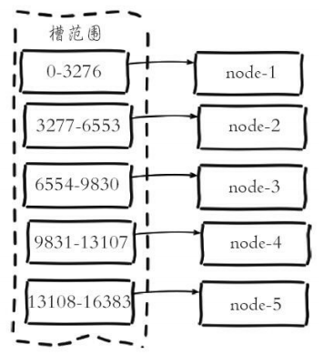

**架构——集群**

# 1、简介

- redis的哨兵模式基本已经可以实现高可用，读写分离 ，但是在这种模式下每台redis服务器都存储

相同的数据，很 浪费内存，所以在redis3.0上加入了cluster模式，实现的redis的分布式存储，也

就是说每台redis节点上存储不同的内容。

- 优点

- 将Redis的写操作分摊到了多个节点上，提高写的并发能力，扩容简单

- 缺点

- 每个Node承担着互相监听、高并发数据写入、高并发数据读出，工作任务繁重

# 2、工作原理

- 对象保存到Redis之前先经过CRC16哈希到一个指定的Node上。

- 每个Node被平均分配了一个Slot段，对应着0-16384，Slot不能重复也不能缺失，否则会导致对象

重复存储或无法 存储。

- Node之间也互相监听，一旦有Node退出或者加入，会按照Slot为单位做数据的迁移。例如Node1

如果掉线了，0- 5640这些Slot将会平均分摊到Node2和Node3上,由于Node2和Node3本身维护的

Slot还会在自己身上不会被重新 分配，所以迁移过程中不会影响到5641-16384Slot段的使用。



# 3、实验部署

## 1）环境准备

```
#!/bin/bash
yum install gcc-c++ -y
wget http://download.redis.io/releases/redis-5.0.4.tar.gz
tar xzf redis-5.0.4.tar.gz
cd redis-5.0.4
make install PREFIX=/usr/local/redis
PATH=$PATH:/usr/local/redis/bin
```

## 2）部署

```
[root@node2 ~]# mkdir /usr/local/redis-cluster
[root@node2 ~]# cd /usr/local/redis-cluster/
[root@node2 redis-cluster]# bash -x redis-cluster.sh
#!/bin/bash
mkdir /usr/local/redis-cluster/redis{7000..7005} -pv
touch /usr/local/redis-cluster/redis{7000..7005}/redis.conf
#!/bin/bash
for i in {7000..7005};
do
cat << EOF > /usr/local/redis-cluster/redis$i/redis.conf
daemonize yes
port $i
cluster-enabled yes
cluster-config-file /usr/local/redis-cluster/redis$i/nodes-$i.conf
cluster-node-timeout 5000
appendonly yes
EOF
redis-server /usr/local/redis-cluster/redis$i/redis.conf
done
#检查各进程是否ok
[root@node2 local]# ps -ef | grep redis
root 5761 1 0 03:46 ? 00:00:00 redis-server *:7000 [cluster]
root 5767 1 0 03:46 ? 00:00:00 redis-server *:7001 [cluster]
root 5773 1 0 03:46 ? 00:00:00 redis-server *:7002 [cluster]
root 5779 1 0 03:46 ? 00:00:00 redis-server *:7003 [cluster]
root 5785 1 0 03:46 ? 00:00:00 redis-server *:7004 [cluster]
root 5791 1 0 03:46 ? 00:00:00 redis-server *:7005 [cluster]
[root@node2 local]# redis-cli --cluster create 127.0.0.1:7000 127.0.0.1:7001
\
> 127.0.0.1:7002 127.0.0.1:7003 127.0.0.1:7004 127.0.0.1:7005 \
> --cluster-replicas 1
#输入yes，即按照此方式分配master和slave
M: 511ba9acbff21c59de7654342dc3847a9c9309d7 127.0.0.1:7000
slots:[0-5460] (5461 slots) master
M: fb3ee7237c0a1e164469f312b8fd65379139e6f0 127.0.0.1:7001
slots:[5461-10922] (5462 slots) master
M: 970f5bbc15256edbdd4587dda6dd4050dc6c651a 127.0.0.1:7002
slots:[10923-16383] (5461 slots) master
S: 37bef4ed48428e9c530b5c963c3afc3975a7049b 127.0.0.1:7003
replicates fb3ee7237c0a1e164469f312b8fd65379139e6f0
S: fd4c06655852c01b5c850d438cf4eca71a101a70 127.0.0.1:7004
replicates 970f5bbc15256edbdd4587dda6dd4050dc6c651a
S: 86ef91e58e5736bcda38582d824242bbf74d2d25 127.0.0.1:7005
replicates 511ba9acbff21c59de7654342dc3847a9c9309d7
```

## 3）验证测试

```
[root@node2 local]# redis-cli -c -p 7000
#查询集群信息
127.0.0.1:7000> cluster info
cluster_state:ok
cluster_slots_assigned:16384
cluster_slots_ok:16384
cluster_slots_pfail:0
cluster_slots_fail:0
cluster_known_nodes:6
cluster_size:3
cluster_current_epoch:6
cluster_my_epoch:1
cluster_stats_messages_ping_sent:353
cluster_stats_messages_pong_sent:357
cluster_stats_messages_sent:710
cluster_stats_messages_ping_received:352
cluster_stats_messages_pong_received:353
cluster_stats_messages_meet_received:5
cluster_stats_messages_received:710
#查询集群各节点
127.0.0.1:7000> cluster nodes
86ef91e58e5736bcda38582d824242bbf74d2d25 127.0.0.1:7005@17005 slave
511ba9acbff21c59de7654342dc3847a9c9309d7 0 1554278064038 6 connected
fd4c06655852c01b5c850d438cf4eca71a101a70 127.0.0.1:7004@17004 slave
970f5bbc15256edbdd4587dda6dd4050dc6c651a 0 1554278062005 5 connected
970f5bbc15256edbdd4587dda6dd4050dc6c651a 127.0.0.1:7002@17002 master - 0
1554278063031 3
connected 10923-16383
37bef4ed48428e9c530b5c963c3afc3975a7049b 127.0.0.1:7003@17003 slave
fb3ee7237c0a1e164469f312b8fd65379139e6f0 0 1554278062000 4 connected
fb3ee7237c0a1e164469f312b8fd65379139e6f0 127.0.0.1:7001@17001 master - 0
1554278062529 2
connected 5461-10922
511ba9acbff21c59de7654342dc3847a9c9309d7 127.0.0.1:7000@17000 myself,master
- 0
1554278063000 1 connected 0-5460
[root@node2 local]# redis-cli -c -p 7000
127.0.0.1:7000> set name eagles
-> Redirected to slot [5798] located at 127.0.0.1:7001
OK # 数据分配特性
```