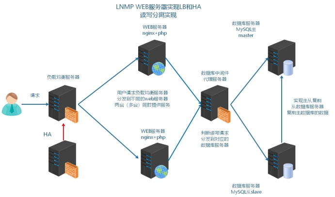
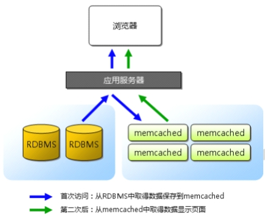

**企业架构缓存中间件分布式memcached**

学习目标和内容

```
1、能够理解描述网站业务访问流程
2、能够理解网站业务的优化方向
3、能够描述内存缓存软件Memcached的作用
4、能够通过命令行操作Memcached
5、能够操作安装php的memcached扩展extension
6、能够实现session存储到memcached的案例
7、能够实现启动memcached多实例
```

# 1、大型网站优化

## 1.1 网站访问流程

随着网站迭代开发，访问会变慢

LNMP架构中网站应用访问流程

> **浏览器(app)=>web服务器=>后端服务(php)=>数据库(mysql)**


访问流程越多，访问速度和出现问题的几率也越大

优化访问速度，就需要减少访问步骤或者提高单步骤的速度

## 1.2 如何优化

根据网页的访问流程，可以进行以下优化：

①提高web服务器并发负载均衡（多台服务器架构）nginx

②页面静态化把经常访问，但是数据不经常发生变动的动态页面，制作为静态页面

③内存缓存优化把经常访问的数据，加载到内存中使用

④数据库优化很多时候，还需要取数据库信息，所以优化数据库本身

# 2、背景描述及其方案设计

## 2.1 业务背景描述

```
时间：2016.6.-2016.9
发布产品类型：互联网动态站点商城
用户数量：10000-12000（用户量猛增）
PV:100000-500000(24小时访问次数总和】
QPS:50-100*(每秒访问次数】
DAU:2000
、(每日活跃用户数)
```

随着业务量增加，访问量越来越大，用户在访问某些页面数据时，通过慢查询日志发现慢查询SQL,，经过优化之后效果还是不够明显。而此类数据发生变动的频率又较小，故提出使用缓存中间件（一股会将数据存储到内存中）的方式，降低MySQL的读压力，提高整个业务架构集群的稳定和快速响应能力。

## 2.2 模拟运维设计方案

根据以上业务需求，准备加入缓存中间件服务器



根据以上业务需求和方案，服务器架构升级为如下示意图


在本次业务架构中，使用缓存中间件解决以下两个问题：

①session共享

②缓存热点数据，首页面的分类信息

# 3、memcached 介绍和安装启动

## 3.1 介绍

memory cache cache in memory 缓存放入内存中

Memcached是国外社区网站LiveJournal的开发团队开发的高性能的分布式内存缓存服务器。一般的使用目的是，通过缓存数据库查询结果，减少数据库访问次数，以提高动态Wb应用的速度、提高可扩展性。



关于缓存的过期，有效期问题，由业务代码实现。

## 3.2 安装启动软件

官方网址：[http://memcached.org/](http://memcached.org/)

**①上传软件到服务器**

软件包名称memcached-1.5.8.tar.gz

**②解压并编译安装**

```
#memcache依赖libevent安装libevent-devel解决
shell yum -y install libevent-devel
#编泽译安装nemcached
shell tar xvf memcached-1.5.8.tar.gz
shell cd memcached-1.5.8
shell >./configure --prefix=/usr/local/memcached
shell make &make install
```

**③查看软件启动参数，并启动**

```
shell cd /usr/local/memcached/bin
shell >./memcached -h
-p    是设置Memcache监听的端口，，最好是1024以上的端口；
-d    是启动一个守护进程：
-m    是分配给Memcachet使用的内存数量，单位是MB
-u    是运行Memcachel的用户；
-l    是监听的服务器P地址，可以有多个地址
-c    是最大运行的并发连接数，默认是1024：
-P    是设置保存Memcache的pid文件
```

启动memcached

```
shell> ./bin/memcached -uroot -d  #后台启动
shell> ps aux|grep memcached #进程吉看是否启动成功
```

# 4、memcached 使用

## 4.1 命令行连接和操作

### 4.1.1 telnet连接使用

memcached默认使用启动服务占用tcp11211端口。可以通过telneti进行连接使用.

```
shell> yum -y install telnet      #安装telnet客户端
she11> te1net 127.0.0.1 11211     #通过telnet连接11211端口
#连接之后敲击多次，如果看到error,即为连接成功
#显示errorl的原因是，没有输入命令，所以nemcached服务器回复error
```

### 4.1.2 存储命令

#### **语法：set**

set命令用于将value(数据值)存储在指定的key(键）中

如果set的key已经存在，该命令可以更新该key所对应的原来的数据，也，就是实现更新的作用

devops

```
set key flag exptime bytes
value
```

flag服务端提供的一个标识，默认没什么意义，默认可以传个0，这个标识是为了编程语言一个状态，例

如：flg(0,1)代表是否采用压缩机制0代表环压缩，1代表压缩.

bytes字节计算机存储的最小单位KB MB GB TB BB YB ZB


#### 语法：add 

add命令用于将value数据值)存储在指定的key(键)中

如果add的key已经存在，则不会更新数据（过期的key会更新），之前的值将仍然保持相同，并且您将获得响应NOT_STORED

```
add key flag exptime bytes
value
```


#### 语法：replace 

replace命令用于替换已存在的key(键)的value(数据值)

如果key不存在，则替换失败，并且您将获得响应NOT_STORED

```
replace key flag exptime bytes
value
```


#### 语法：append

append命令用于向已存在key(键)的value(数据值)后面追加数据

```
append key flag exptime bytes
value
```


#### 语法：prepend

prepend命令用于向已存在key(键)的value数据值旬)前面追加数据

```
prepend key flag exptime bytes
value
```


### 4.1.3 删除命令

#### 语法：delete

delete命令用于删除已存在的key(键)

```
delete key
```


#### 语法：flush_all

> **此命令在业务线上环境禁止执行。如果执行，可能会造成所有的缓存清空，所有的数据请求都直接分发到数据库上，造成数据库压力瞬间变大。数据库宕机。**


flush_all命令用于清理缓存中的所有key=>value(键=>值)对

该命令提供了一个可选参数time,用于在制定的时间后执行清理缓存操作

```
flush_all [time]
```


### 4.1.4 查找和计算命令

#### 语法：get

get命令获取存储在key(键)中的value(数据值)，如果key不存在，则返回空。

```
get key1 key2
```

#### 语法：incr(相加)/decr(相减)

计数器 每操作一次+1

incr与decr命令用于对已经存在的key(键)的数字值进行自增或者自减操作

incr与decr命令操作的数据必须是十进制的32位无符号整数

```
incr key vlaue
decr key vlaue
```

.jpg)

### 4.1.5 统计状态命令

#### 语法：stats

stats命令用于返回统计信息例如PID进程号)、版本号、连接数等

```
stats
```


stats的参数参考

```
pid:       memcache服务器进程ID
uptime:    服务器已运行秒数
time:      服务器当前Unix时间戳
time-uptime：     启动时间
version:          memcache版本
pointer_.size:    操作系统指针大小
rusage._user:     进程累计用户时间
rusage_system:    进程累计系统时间
curr_connections:         当前连接数量
total_connections:        Memcached运行以来连接总数
connection._structures:    Memcached分配的连接结构数量
cmd_get:      get命令请求次数
cmd_set:      set命令请求次数
cmd_flush:    flush命令请求次数
get_hits:     get命令命中次数
get_misses:    get命令未命中次数
delete_.misses:    delete命令未命中次数
delete_hits:    delete命令命中次数
incr_misses:    incr命令未命中次数
incr_hits:      incr命令命中次数
decr_misses:    decr命令未命中次数
decr_hits:      decr命令命中次数
Cas-misses:     cas命令未命中次数
cas_hits:       cas命令命中次数
cas badval:     使用擦拭次数
auth_cmds:      认证命令处理的次数
auth_errors:    认证失败数目
bytes_read:    读取总字节数
bytes_written:    发送总字节数
imit_maxbytes:    分配的内存总大小，（字节）
accepting_conns:    服务器是否达到过最大连接(o/1)
listen_disabled_num:    失效的监听数
threads:    当前线程数
conn_yields:    连接操作主动放弃数目
bytes:    当前存储占用的字节数
curr_items:    当前存储的数据总数
total_items:    启动以来存储的数据总数
evictions:    LRU释放的对象数目
reclaimed:    已过期的数据条目来存储新数据的数日
```

**缓存命中率：**

**get_hits/,cmd_get**

- **缓存穿透**

- 访问数据库不存在的数据，每次都不能够生成缓存，每次请求都直接访问数据库，穿透了缓存，缓存没有起到作用。数据库压力没有得到缓解。

- 解决方案，数据库查不到的，也做一个空缓存。

- **缓存雪崩**

- 缓存具有失效时间，如果缓存失效时间都是一样，本来应该请求缓存的，但是因为缓存失效了，全部请求到了数据库，数据库压力剧增，可能会造成数据库宕机，进而造成系统崩溃。

- 解决方案，设置缓存的失效时间均匀分布。

# 6、失效机制（了解）

①如果key过期了，value会及时删除么，空间会及时清空么？

②如果分配的存储空间，写满了，还允许写么？

## 6.1 Lazy Expiration

memcached内部不会监视记录是杏过期，而是在get时查看记录的时间戳，检查记录是否过期。这种技术被称为lay(惰性)expiration.。因此，memcached不会在过期监视上耗费CcPU时间比如php的里session机制懒惰机制php垃圾回收机制gc回收python变量垃圾回收机制

memcached.1.4.25之后就不是懒惰机制了。

## 6.2 LRU

memcached会优先使用已超时的记录的空间，但即使如此，也会发生追加新记录时空间不足的情况，此时就要使用名为Least Recently Used(LRU)机制来分配空间。顾名思义，这是删除“最近最少使用"的记录的机制。因此，当memcached的内存空间不足时，就从最近未被使用的记录中搜索，并将其空间分配给新的记录。从缓存的实用角度来看，该模型十分理想不过，有些情况下LRU机制反倒会造成麻烦。memcached启动时通过“M”参数可以禁止LRU。