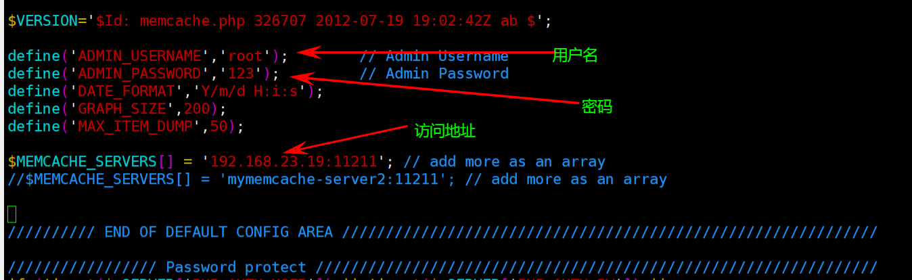
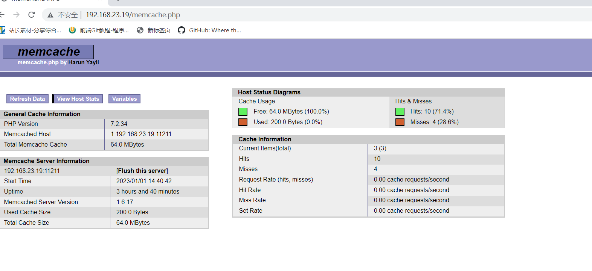
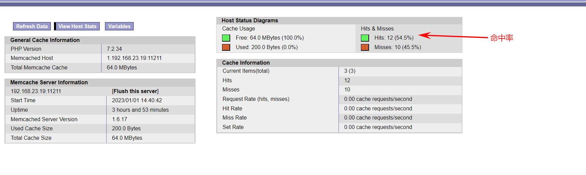

## 1、配置LNMP 运行环境：

配置参考：[5、rpm包安装LNMP环境](note://WEB1f5f275aacd1933f7af2afcd2a8b23e6)

## 1、memcache.php监控软件

memcache.php监控软件，可以查看memcached运行状态、key(item)的数量了、内存使用量等

软件下载：[2.01memcache](note://WEBb45af477418dbba701df0bc2f5040ce7)

**①上传memcache.php到web服务器**

上传到虚拟机主机可以访问的目录即可。

本次上传到了servero1服务器的/usr/local/nginx/html/tp5shop/public下

**②修改连接参数**

```
shell vim /var/www/html/memcache.php
```

**示例配置：**



**浏览器访问:**



