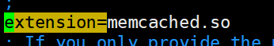
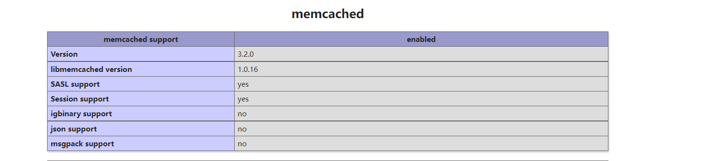
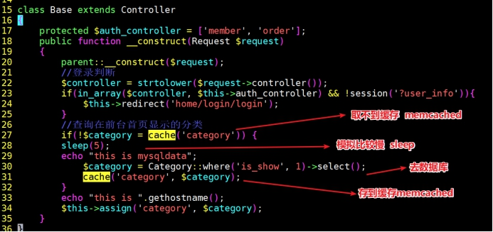
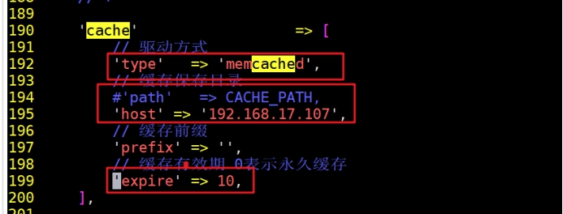

# 1、PHP扩展安装

在LNMP架构中，如果需要使用到memcached。首先需要安装对应的扩展，php7以上需要安装memcached:扩展。

官方扩展地址：[http://pecl.php.net/](http://pecl.php.net/)

下载地址：[http://pecl.php.net/get/memcached-3.2.0.tgz](http://pecl.php.net/get/memcached-3.2.0.tgz)

**①上传PHP扩展源码包**

需要在web服务器的上安装

memcached-3.2.0.tgz php的扩展

**②解压编译安装**

```
yum install -y libmemcached zlib-devel  #安装需要的依赖
shell tar xvf memcached-3.1.3.tgz
shell cd memcached-3.1.3
#扩展源码包和php关联生成configure文件
#如果执行找不到ohpize,说明之前没有给php安装目录bin目录配置环境变量，重新配置即可
shell> phpize
#执行看依赖
shell> ./configure
#编译安装依赖
shell> echo $?
0
shell> make j4 && make install 
sehll> echo $?
0
#源码安装libmemcached，如果可以yum 安装则不需要执行这一步。
shell tar xvf libmemcached-1.0.18.tar.gz
shell cd libmemcached-1.0.18
shell >./configure --prefix=/usr/local/libmemcached &make &make install
#编译安装php的nemcached扩展
shell cd /root/memcached-3.1.3
shell ./configure --with-libmemcached-dir=/usr/local/libmemcached --disable-memcached-
```

**③编辑配置文件**

```
**vim  /etc/php.ini**
extension=memcached.so
```



```
[root@server5 ~]# php -m|grep memcached    #检查是否有该模块
memcached
[root@server5 ~]# systemctl restart php-fpm    #重启php服务
```

或者也可以通过浏览器去查看到安装的模块：



# 2、php测试连接

php代码测试使用memcached

**示例代码：**

```
vim /var/www/html/test.php
<?php
//实例化类
$mem = new memcached();
//调用连接memcached,方法注意连接地址和端口号
$mem->addServer('192.168.23.19',11211);
//存数据
var_dump($mem->set('name','Inmp'));
//取数据
var_dump($mem->get('name'));
?>
```


测试成功！！

# 3、缓存热点数据

把经常访问到的数据，发生变动较小，可以存储到内存缓存中，提供使用速度


注意修改web服务器的文件时，一定要都修改web1和web2

**①修改缓存数据**

**修改代码文件**

```
shell /usr/local/nginx/html/tp5shop/application/home/controller/Base.php
```



**②修改项目缓存配置**

```
shell vim /usr/local/nginx/html/tp5shop/application
```

