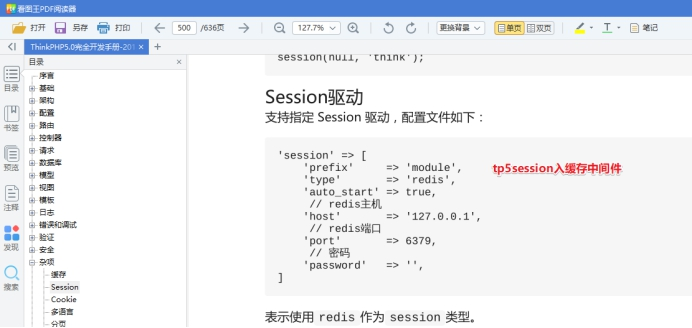
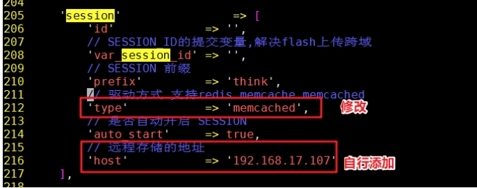

# 1、session存入memcached共享

**session共享.**

分布式负载均衡架构中，web服务器间的session是不共享（默认session存储在本地的文件的），会造成session校验不一致。校验验证码不通过，登录之后session.不一致，造成无法判断是否登录。

**解决方案：**

①session生成校验在同一台服务器nginxi调度算法ip_hash

②session共享多台web服务器可以调用到session

文档参考：



**①修改配置文件**

servert01和server03都需要修改，并且web服务器都要安装好memcached扩展

```
shell vim /usr/local/nginx/html/tp5shop/application/config.php
```



修改完成之后，之后的请求所生成的session,就被写入到memcached中了。

②访问测试

> **在memcached中，session_id作为key,session的内容作为value进行存储。**
> **都是在业务代码中实现，服务架构中，只要按需配置即可。**
