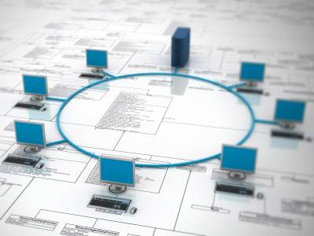
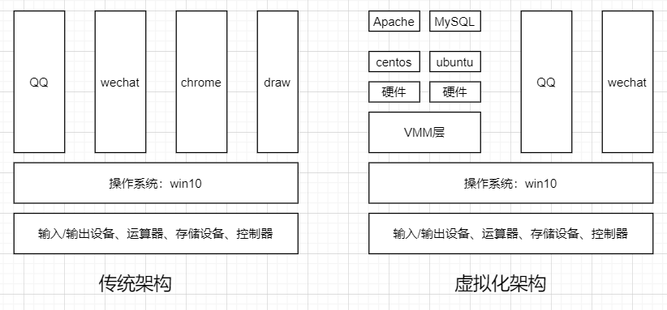
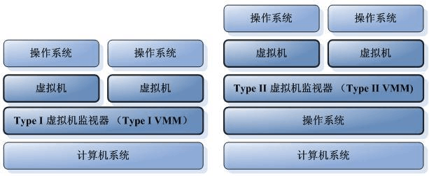

**虚拟化技术概述**

# **1、什么是虚拟化**

# **
**

虚拟化（Virtualization）技术最早出现在 20 世纪 60 年代的 IBM 大型机系统，在70年代的 System

370 系列中逐渐流行起来，这些机器通过一种叫虚拟机监控器（Virtual Machine Monitor，VMM）

的程序在物理硬件之上生成许多可以运行独立操作系统软件的虚拟机（Virtual Machine）实例。随着近

年多核系统、集群、网格甚至云计算的广泛部署，虚拟化技术在商业应用上的优势日益体现，不仅降低

了 IT 成本，而且还增强了系统安全性和可靠性，虚拟化的概念也逐渐深入到人们日常的工作与生活中。

虚拟化是一个广义的术语，对于不同的人来说可能意味着不同的东西，这要取决他们所处的环境。在

计算机科学领域中，虚拟化代表着对计算资源的抽象，而不仅仅局限于虚拟机的概念。例如对物理内存

的抽象，产生了虚拟内存技术，使得应用程序认为其自身拥有连续可用的地址空间（Address

Space），而实际上，应用程序的代码和数据可能是被分隔成多个碎片页或段），甚至被交换到磁盘、

闪存等外部存储器上，即使物理内存不足，应用程序也能顺利执行。

维基百科关于虚拟化的定义是： 在计算机领域，虚拟化指创建某事物的虚拟版本，包括虚拟的计算机

硬件平台、存储设备、以及计算机网络资源，虚拟化是一种资源管理技术，它将计算机的各种实体资源

（cpu、内存、存储、网络等）予以抽象转化出来，并提供分割、重新组合，以达到最大化利用物理资
源的目的。

VMM虚拟机监控器也成为Hypervisor，就是为了虚拟化而引入的一个软件层。它向下掌控实际的物理

资源，向上呈现出N份逻辑资源。虚拟机监控器运行的实际物理环境，称为宿主机；其上虚拟出来的逻

辑主机，称为客户机。

# 2、虚拟化方案

## 1）软件虚拟化和硬件虚拟化

**软件虚拟化，**

最纯粹的软件虚拟化实现当属QEMU。在没有启用硬件虚拟化辅助的时候，它通过软件的二进制翻译仿

真出目标平台呈现给客户机，客户机里的每一条目标平台指令都会被QEMU截取，并翻译成宿主机平台

的指令，然后交给实际的物理平台执行。由于每一条都需要这么操作一下，其虚拟化性能是比较差的，

同时期团建复杂的也大大增加。但好处是可以呈现给各种平台给客户机。

**硬件虚拟化**

Intel从2005年开始在其x86cpu中加入硬件虚拟化的支持，简称Intel VT技术

## 2）半虚拟化和全虚拟化

**部分虚拟化（Partial Virtualization）**

法在虚拟机中运行的，其它程序可能也需要进行修改。在历史上，部分虚拟化是通往全虚拟化道路上的

重要里程碑,最早出现在第一代的分时系统 CTSS 和 IBM M44/44X 实验性的分页系统中。

**全虚拟化（Full Virtualization）**

存、时钟、外设等，使得为原始硬件设计的操作系统或其它系统软件完全不做任何修改就可以在虚拟机中运行。

**超虚拟化（Paravirtualization）**

交互的技术。在超虚拟化虚拟机中，部分硬件接口以软件的形式提供给客户机操作系统，这可以通过

Hypercall（VMM 提供给 Guest OS 的直接调用，与系统调用类似）的方式来提供。

这种分类并不是绝对的，一个优秀的虚拟化软件往往融合了多项技术。例如 VMware Workstation 是一

个著名的全虚拟化的 VMM，但是它使用了一种被称为动态二进制翻译的技术把对特权状态的访问转换

成对影子状态的操作，从而避免了低效的 Trap-And-Emulate 的处理方式，这与超虚拟化相似，只不过

超虚拟化是静态地修改程序代码。对于超虚拟化而言，如果能利用硬件特性，那么虚拟机的管理将会大

大简化，同时还能保持较高的性能。

## 3）Type1虚拟化和Type2虚拟化

Type1类型也叫

接控制硬件资源以及客户机。典型地如xen和

Type2类型也叫

一样受宿主机操作系统的管理，通常抽象为进程。例如

