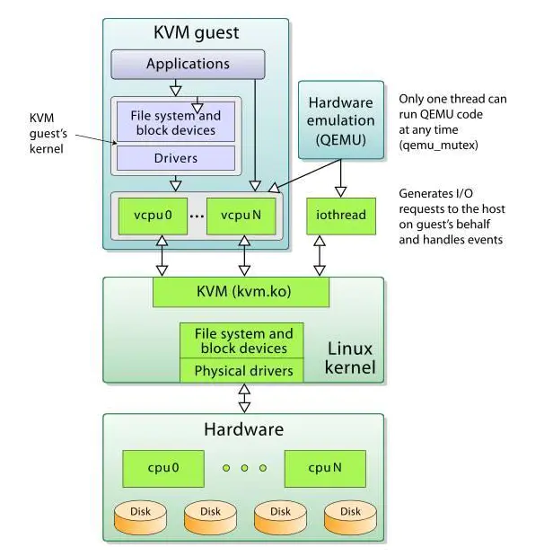

**KVM虚拟化技术简介**

# 1、KVM架构

KVM虚拟化的核心主要由以下两个模块组成

- KVM内核模块，它属于**标准Linux内核的一部分**，是一个专门提供虚拟化功能的模块，主要负责

**CPU和内存的虚拟化**

器的访问、vCPU的执行。KVM模块是KVM虚拟化的核心模块，它在内核中有两部分组成，一个是

处理器架构无关的部分，可以用lsmod命令看到，叫做kvm模块；另一个是处理器架构相关的部

分，在intel平台上就是kvm_intel这个内核模块。KVM主要功能是初始化CPU硬件，打开虚拟化模

式，然后将虚拟客户机运行在虚拟机模式下，并对虚拟客户机的运行提供一定的支持。

- QEMU**用户态工具**，它是一个普通的Linux进程，为客户机提供设备模拟的功能，包括模拟BIOS、

数据总线、磁盘、网卡、显卡、声卡、键盘、鼠标等。同时它通过系统调用与内核态的KVM模块进

行交互。作为一个存在已久的虚拟机监控器软件，QEMU的代码中有完整的虚拟机实现，包括处理

器虚拟化、内存虚拟化，以及KVM也会用到的设备模拟功能。总之，

**拟机监控器，也在QEMU/KVM软件栈中承担设备模拟的功能。**

- 在KVM虚拟化架构下，每一个客户机就是一个QEMU进程，在一个宿主机上有多少个虚拟机就会有

多少个QEMU进程；客户机中的每一个虚拟CPU对应QEMU进程中的一个执行线程；一个宿主机只

有一个KVM内核模块，所有客户机都与这个内核模块进行交互。

- 从rhel6开始使用 直接把kvm的模块做成了内核的一部分。

- xen用在rhel6之前的企业版中 默认内核不支持，需要重新安装带xen功能的内核。

- KVM 针对运行在 x86 硬件上的、驻留在内核中的虚拟化基础结构。KVM 是第一个成为原生 Linux 内核

（2.6.20）的一部分的 hypervisor，它是由 Avi Kivity 开发和维护的，现在归 Red Hat 所有。

- 这个 hypervisor 提供 x86 虚拟化，同时拥有到 PowerPC® 和 IA64 的通道。另外，KVM 最近还添加了

对对称多处理（SMP）主机（和来宾）的支持，并且支持企业级特性，比如活动迁移（允许来宾操作系

统在物理服务器之间迁移）。

- KVM 是作为内核模块实现的，因此 Linux 只要加载该模块就会成为一个hypervisor。KVM 为支持

hypervisor 指令的硬件平台提供完整的虚拟化（比如 Intel® Virtualization Technology [Intel VT] 或

AMD Virtualization [AMD-V] 产品）。KVM 还支持准虚拟化来宾操作系统，包括 Linux 和Windows®。

- 这种技术由两个组件实现。第一个是可加载的 KVM 模块，当在 Linux 内核安装该模块之后，它就可以

管理虚拟化硬件，并通过 /proc 文件系统公开其功能。第二个组件用于 PC 平台模拟，它是由修改版

QEMU 提供的。QEMU 作为用户空间进程执行，并且在来宾操作系统请求方面与内核协调。

- 当新的操作系统在 KVM 上启动时（通过一个称为 kvm 的实用程序），它就成为宿主操作系统的一个进

程，因此就可以像其他进程一样调度它。但与传统的 Linux 进程不一样，来宾操作系统被 hypervisor 标

识为处于 "来宾" 模式（独立于内核和用户模式）。

- 每个来宾操作系统都是通过 /dev/kvm 设备映射的，它们拥有自己的虚拟地址空间，该空间映射到主机

内核的物理地址空间。如前所述，KVM 使用底层硬件的虚拟化支持来提供完整的（原生）虚拟化。I/O

请求通过主机内核映射到在主机上（hypervisor）执行的 QEMU 进程。

- KVM 在 Linux 环境中以主机的方式运行，不过只要底层**硬件虚拟化支持**，它就能够支持大量的来宾操作系统。

# 2、KVM上层管理工具

1. **libvirt**

libvirt是使用最广泛的对KVM虚拟化进行管理的

标准，后部分介绍的许多工具都是基于libvirt的API来实现的。作为

管理KVM，还能管理VMware、Hyper-v等其他虚拟化方案

1. **virsh**

virsh是一个常用的管理KVM虚拟化的命令行工具，对于系统管理员在单个宿主机上进行运维操

作，virsh命令行可能是最佳选择。virsh是用c语言编写的一个使用libvirt API的虚拟化管理工具，

其源代码也是在libvirt这个开源项目中的。

1. **virt-manager**

virt-manager是专门针对虚拟机的图形化管理软件，底层与虚拟化交互的部分仍然是调用libvirt

API来操作的。virt-manager除了提供虚拟机生命周期（包括：创建、启动、停止、打快照、动态迁移等）

管理的基本功能，还提供了性能和资源使用率的监控。