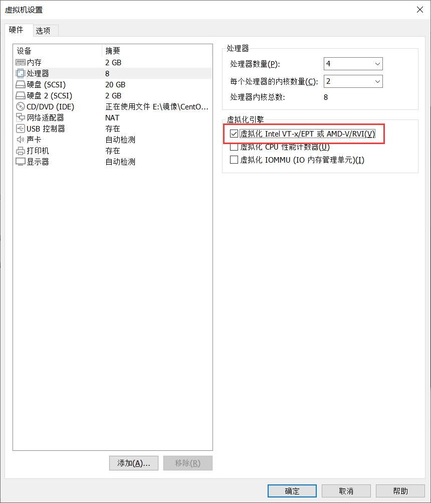

**KVM软件安装**

# 1、环境准备

- Linux主机需要安装图形化桌面程序

```
[root@localhost ~]# yum groupinstall -y "GNOME 桌面" 
```

- 如果出现报错尝试更新一下软件包

```
[root@localhost ~]# yum upgrade -y
```

# 2、开启硬件辅助虚拟化



- 查看CPU支持的功能中是否存在

- vmx:INTEL的虚拟化功能

- svm:AMD的虚拟化功能

```
[root@localhost ~]# cat /proc/cpuinfo |grep -E 'vmx|svm'
```

# 3、卸载KVM

- 清理干净KVM相关的预装环境

```
[root@localhost ~]# yum remove $(rpm -qa | grep -E 'qemu|virt|kvm') -y  #若需要grep支持正则表达式，需要加 -E选项
[root@localhost ~]# rm -rf  /var/lib/libvirt  /etc/libvirt/
```

# 4、安装kvm

```
[root@localhost ~]# uname -r
3.10.0-957.el7.x86_64
[root@localhost ~]# cat /etc/centos-release
CentOS Linux release 7.6.1810 (Core)
[root@localhost ~]# yum install *qemu* *virt* librbd1-devel -y
(在安装虚拟机出错的情况下，一般是操作系统的版本问题)
[root@localhost ~]# yum upgrade -y
```

- 主要程序

- **qemu-KVM:主包**

- **libvirt:API接口**

- **virt-manager:图形管理程序**

# 5、启动服务

```
[root@localhost ~]# systemctl start libvirtd
[root@localhost ~]# systemctl enable libvirtd
[root@localhost ~]# lsmod |grep kvm # 查看kvm模块加载
kvm_intel       183621  0
kvm          586948  1 kvm_intel
irqbypass        13503  1 kvm
```