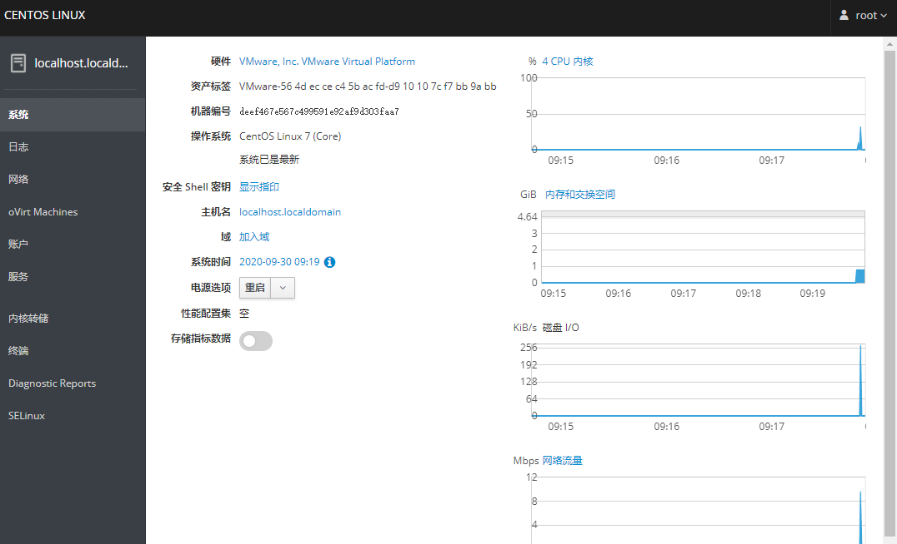
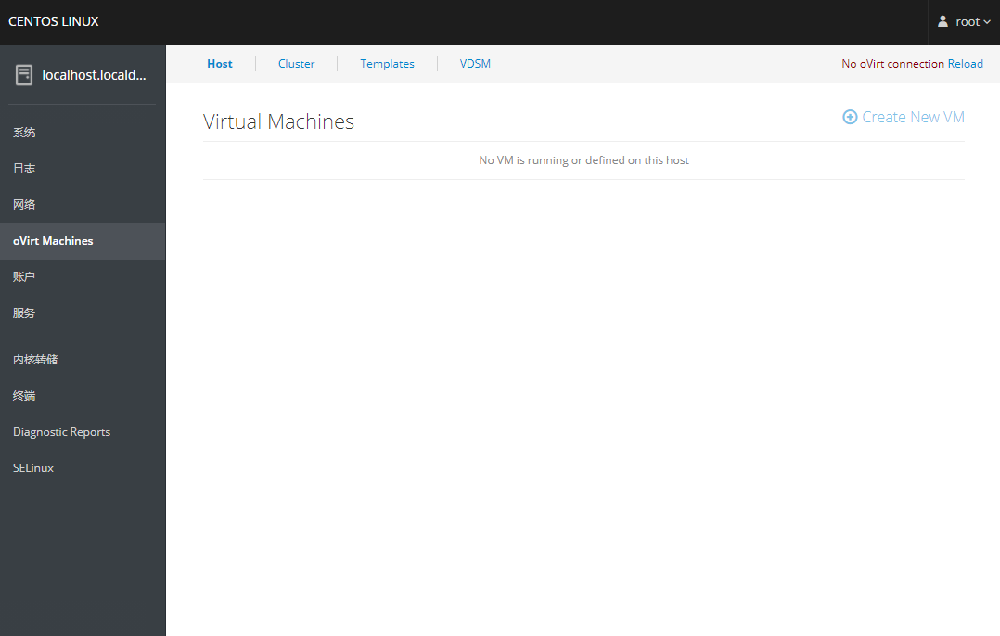
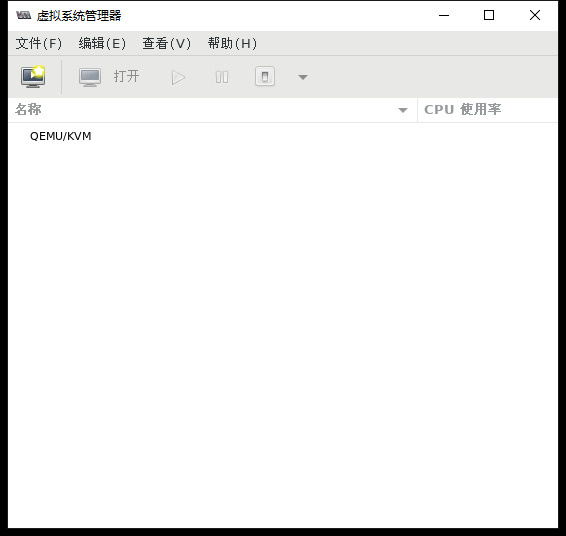
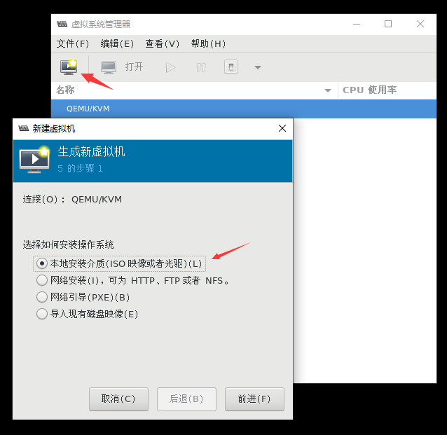
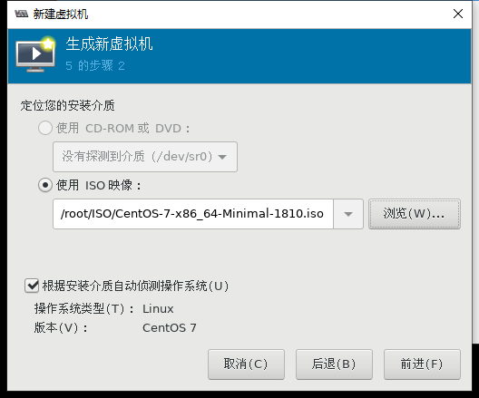
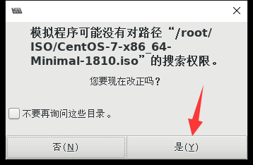
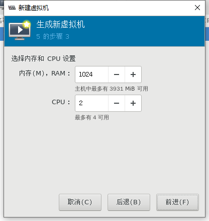
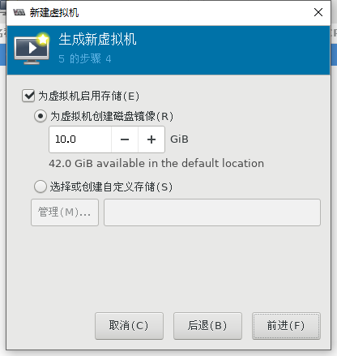
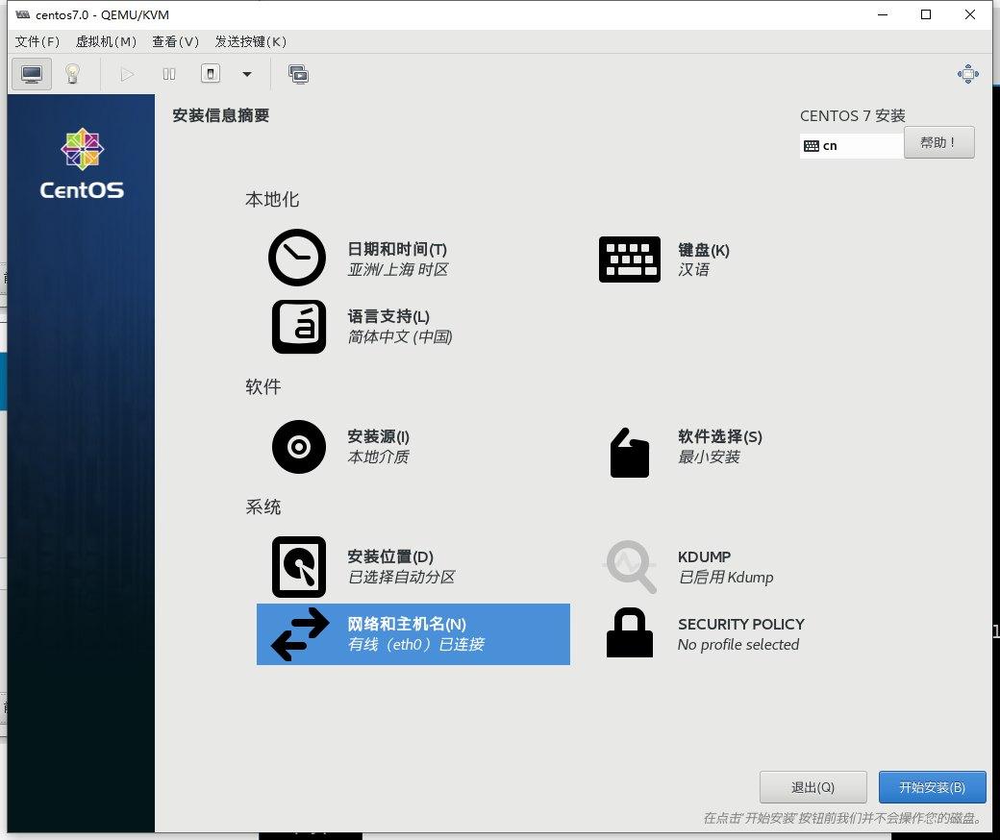
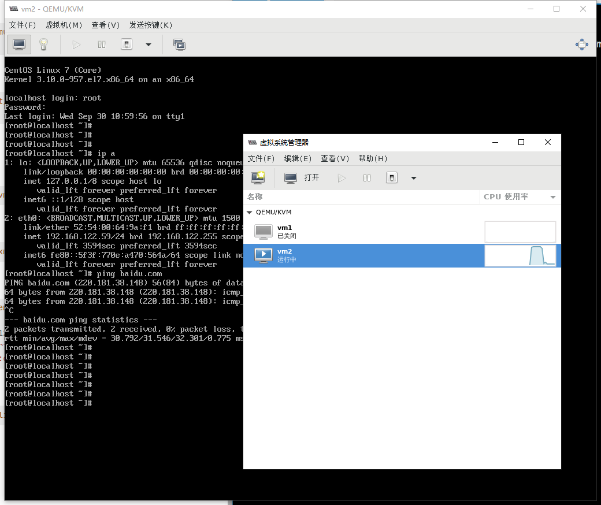

**GuestOS安装**

- 通过飞机驾驶舱安装和管理虚拟机（了解）

- 图形方式

- 完全命令模式

- 借助已有虚拟机模式

# 1、飞机驾驶舱（web）

```
[root@localhost ~]# yum install8 cockpit -y
[root@localhost ~]# systemctl start cockpit
```

- 浏览器访问IP地址的9090端口





# 2、图形模式安装Guest OS

```
[root@localhost ~]# virt-manager 
```



- 上传系统镜像文件到Linux系统中

```
[root@localhost ISO]# ls -lh
总用量 1021M
-rw-r--r--. 1 root root 918M 6月  19 15:31 CentOS-7-x86_64-Minimal-1810.iso
```













最后进入到正常安装的步骤

# 3、完全命令方式安装

- 在极端情况下，服务器没有图形，客户端也没有图形

```
因为用到了ftp服务，所以需要先把ftp服务装好
[root@localhost ~]# systemctl stop firewalld && setenforce 0 #关闭防火墙和
selinux
[root@localhost ~]# yum -y install vsftpd   #安装服务
[root@localhost ~]# systemctl restart vsftpd  #启动服务
[root@localhost ~]# cd /var/ftp/
[root@localhost ftp]# mkdir centos7u3    #创建挂载点
[root@localhost ftp]# mount /root/Public/CentOS-7-x86_64-Minimal-1708.iso
/var/ftp/centos7u3/  #将我们的镜像文件挂载在上面
mount: /dev/loop0 is write-protected, mounting read-only
```

- 下面开始安装

```
[root@localhost ftp]# yum -y install virt-install
[root@localhost ftp]# virt-install --connect qemu:///system -n vm1 -r 2048 --
disk path=/var/lib/libvirt/images/vm1.img,size=7 --os-type=linux --os-
variant=centos7.0 --vcpus=2 --location=ftp://192.168.80.140/centos7u3 -x
console=ttyS0 --nographics
# 如果本地有镜像可以直接使用本地镜像进行安装
[root@localhost ~]# virt-install -name=vm2 --ram 512 --vcpus=1 --disk
path=/var/lib/libvirt/images/vm2.qcow2,size=5,bus=virtio --accelerate --cdrom
/root/CentOS-7-x86_64-Minimal-1708.iso --vnc --vncport=-1 --vnclisten=0.0.0.0
--network bridge=virbr0,model=virtio --noautoconsole
```

参数说明：

```
-n name
-r     以M为单位指定分配给虚拟机的内存大小
--disk     指定作为客户机存储的媒介 size以G为单位的存储
--os-type     针对一类操作系统优化虚拟机配置
--os-variant     针对特定操作系统变体进一步优化虚拟机配置
--vcpus
--location     客户虚拟机kernel+initrd 安装源，必须为镜像挂载在ftp目录下
-x     当执行从”–location”选项指定位置的客户机安装时，附加内核命令行参数到安装程序
--nographics 指定没有控制台被分配给客户机。
```

**缺点：**

内存必须大于2048（-r后面）

**易错:**

安装过程中：

手动配置IP地址

到url位置找不到路径，要返回去手动选择url，重新配置url为[ftp://192.168.100.230/rhel6u4,](ftp://192.168.100.230/rhel6u4,)这里的ip不要写127.0.0.1而是br0的ip

```
1) Start VNC
2) Use text mode
Please make your choice from above ['q' to quit | 'c' to continue |
 'r' to refresh]:
# 此处如果客户机电脑有图形化，可以选择启动vnc连接，然后正常安装，如果没有图形化，可以选择2
进入命令行安装
```

# 4、借助虚拟机安装

## 1）虚拟机的组成部分

1. 虚拟机配置文件

```
[root@localhost ~]# ls /etc/libvirt/qemu
networks vm1.xml
```

1. 存储虚拟机的介质

```
[root@localhost ~]# ls /var/lib/libvirt/images/
vm1.qcow2
```

## 2)根据配置文件创建虚拟机 （kvm要开启路由转发）

1. 需要有磁盘镜像文件

```
[root@localhost images]# cp vm1.qcow2 vm2.qcow2 
```

1. 需要有配置文件

```
[root@localhost qemu]# cp vm1.xml vm2.xml 
```

1. 修改配置文件的必须修改的地方，name、uuid、磁盘、mac地址**(mac地址只能修改后三段**）

```
[root@localhost ~]# vim /etc/libvirt/qemu/vm2.xml
 9  <name>vm2</name>
10  <uuid>b0c26bcd-ca6b-43ef-96c8-eb12ea52e5e0</uuid>
44    <source file='/var/lib/libvirt/images/vm2.qcow2'/>
77    <mac address='52:54:00:63:99:c1'/>
```

1. 创建虚拟机

```
[root@localhost ~]# virsh define /etc/libvirt/qemu/vm2.xml 
```

1. 看与启动这个虚拟机查

```
[root@localhost ~]# virsh list --all
Id  名称             状态
----------------------------------------------------
-   vm1              关闭
-   vm2              关闭
[root@localhost ~]# virsh start vm2
域 vm2 已开始
[root@localhost ~]# virsh list --all
Id  名称             状态
----------------------------------------------------
8   vm2              running
-   vm1              关闭
```

1. 连接控制台（console)

```
在虚机里运行
[root@localhost ~]# grubby --update-kernel=ALL --args="console=ttyS0"
[root@localhost ~]# reboot
```

```
root@localhost ~]# virsh console vm2
连接到域 vm2
换码符为 ^]
CentOS Linux 7 (Core)
Kernel 3.10.0-957.el7.x86_64 on an x86_64
localhost login:
```

- 图形化界面已经可以正常看到vm2启动了

