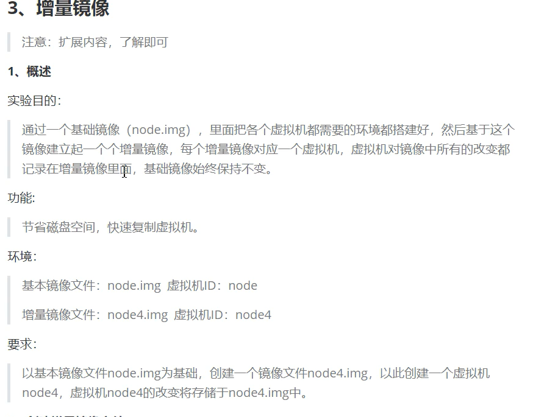
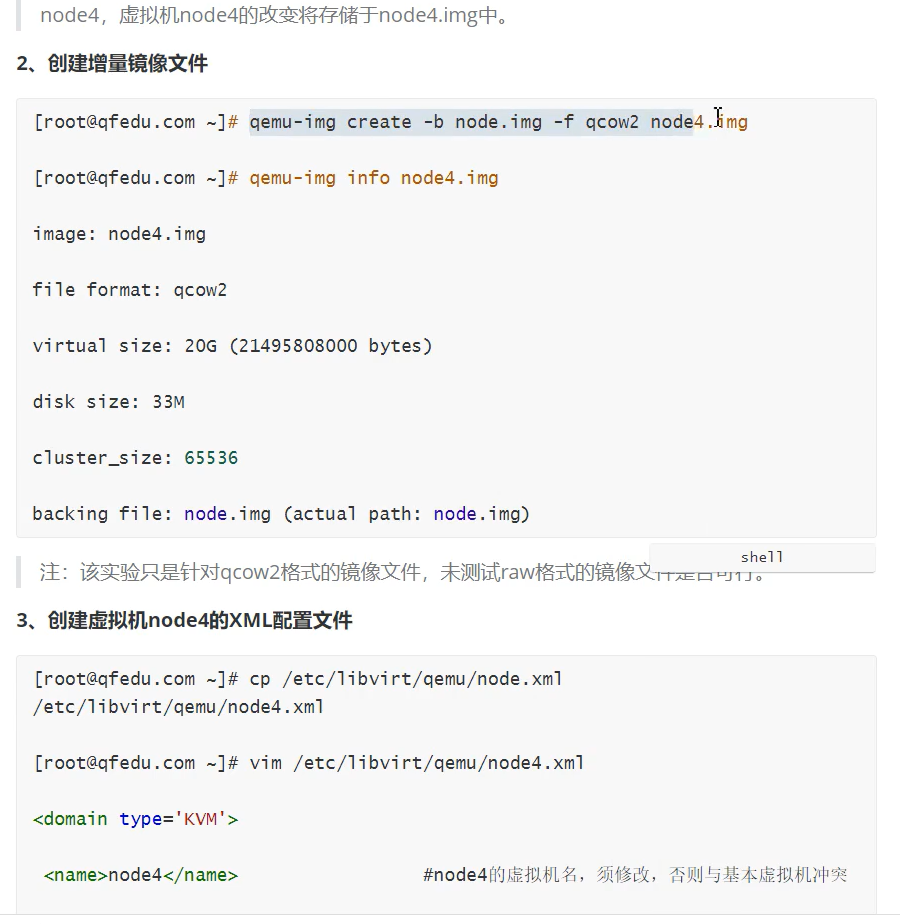
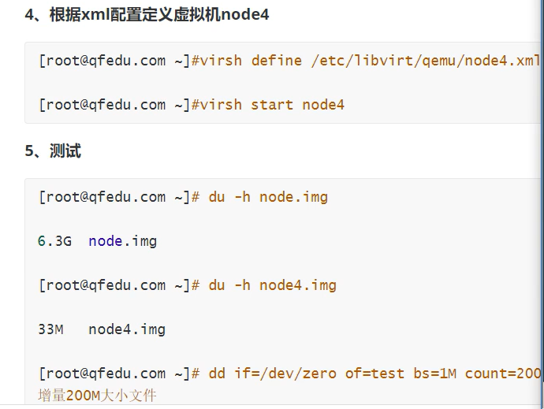
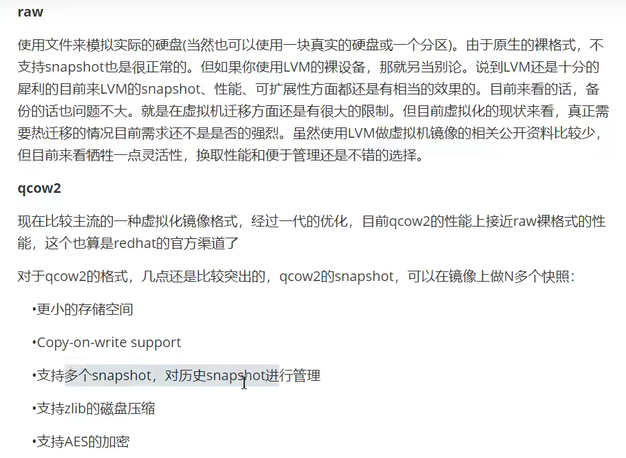

**KVM基础管理**

# 1、常用管理命令

```
[root@localhost ~]# virsh list --all             #如果不加--all ,只会列出正在运行状态下的虚拟机
[root@localhost ~]# virsh dumpxml vm1             # dump,转储；查看虚拟机的配置
[root@localhost ~]# virsh dumpxml vm1 > vm1.xml.old
[root@localhost ~]# virsh edit vm1        #修改配置文件，用这个方法修改，无需从新define xxx.xml就可生效
[root@localhost ~]# virsh start vm1
[root@localhost ~]# virsh suspend vm1            # 暂停虚拟机suspend,暂停
[root@localhost ~]# virsh resume vm1             # 恢复虚拟机
[root@localhost ~]# virsh shutdown vm1           # 关闭虚拟机
[root@localhost ~]# virsh reboot vm1              # 重启虚拟机
[root@localhost ~]# virsh reset vm1                # 重置虚拟机，reset比reboot快一点
[root@localhost ~]# virsh undefine vm1             # 删除虚拟机；在开机状态下，undefine是无法删除的，但是如果在destroy会直接删除
[root@localhost ~]# virsh autostart vm1             # 开机自启动虚拟机
[root@localhost ~]# virsh autostart --disable vm1     # 取消开机自动启动虚拟机
[root@localhost ~]# virsh list --all --autostart     # 查看所有开机自启动虚拟机
[root@localhost ~]# ls /etc/libvirt/qemu/autostart     # 有开机自动的虚拟机时自动创
建
[root@localhost ~]# virsh destroy vm1                 # 强行删除虚拟机，即使虚拟机是开启状态
```

# 2、虚拟机克隆

**（-o,original_guest,原本的客户机；-f,file :新的磁盘文件）**

```
[root@localhost ~]# virt-clone -o vm1 --auto-clone
正在分配 'vm1-clone.qcow2'              |  10 GB  00:19  
正在分配 'vm1-1-clone.qcow2'             |  10 GB  00:00  
成功克隆 'vm1-clone'。
```

- 可以指定克隆之后的名字

```
[root@localhost ~]# virt-clone -o vm1 -n vm3 --auto-clone
正在分配 'vm3.qcow2'                 |  10 GB  00:03  
正在分配 'vm1-1-clone-1.qcow2'            |  10 GB  00:00  
成功克隆 'vm3'。
```

- 指定克隆之后虚拟机的磁盘镜像文件

```
[root@localhost ~]# virt-clone -o vm1 -n vm4 --auto-clone -f
/var/lib/libvirt/images/vm4.qcow2
正在分配 'vm4.qcow2'                 |  10 GB  00:02  
正在分配 'vm1-1-clone-2.qcow2'            |  10 GB  00:00  
成功克隆 'vm4'
```

# 3、增量镜像







# 4、虚拟机快照



- 快照就相当于一个还原点，可以看到qcow2的磁盘中有快照的存在

```
[root@localhost ~]# virsh snapshot-create-as vm1 vm1.snap
已生成域快照 vm1.snap
[root@localhost ~]# qemu-img info /var/lib/libvirt/images/vm1.qcow2
image: /var/lib/libvirt/images/vm1.qcow2
file format: qcow2
virtual size: 10G (10737418240 bytes)
disk size: 10G
cluster_size: 65536
Snapshot list:
ID    TAG         VM SIZE        DATE    VM CLOCK
1     vm1.snap          0 2020-10-02 15:10:06  00:00:00.000
Format specific information:
 compat: 1.1
 lazy refcounts: true
```

- 也可以单独查看虚拟机的快照

```
[root@localhost ~]# virsh snapshot-list vm1
名称        生成时间       状态
------------------------------------------------------------
vm1.snap       2020-10-02 15:10:06 +0800 shutoff
```

- 还原快照

```
[root@localhost ~]# virsh snapshot-revert vm1 vm1.snap 
```

- 删除快照

```
root@localhost ~]# virsh snapshot-delete --snapshotname vm1.snap vm1
已删除域快照 vm1.snap
[root@localhost ~]# virsh snapshot-list vm1
名称        生成时间       状态
------------------------------------------------------------
```