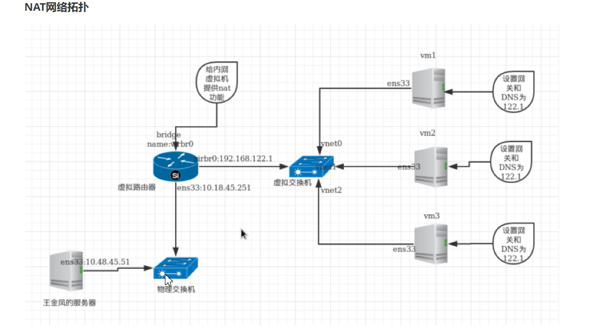
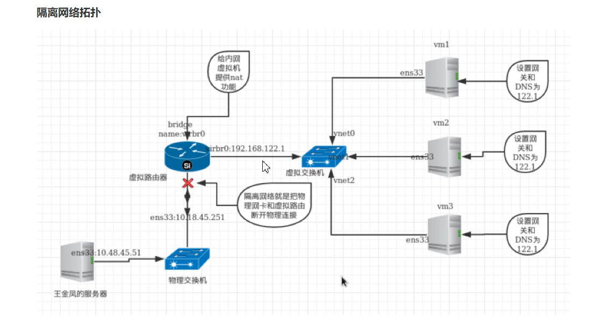
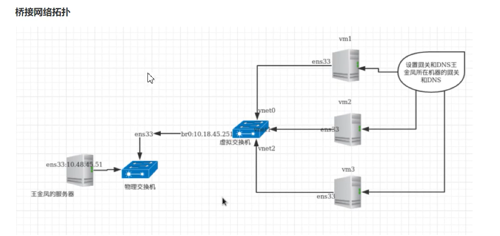

**网络管理**

- KVM有如下三种网络连接方式

- nat

- isolated

- bridge(桥接）

- 虚拟交换机

- linux-bridge(linux自带)

- ovs(open-vswitch)

- 

## **1）NAT网络拓扑**

- 查看Linux网卡桥接

- NAT网络下

- 宿主机和虚拟机可以互相访问

- 虚拟机可以访问宿主机所在的物理网络

- 宿主机所在的物理网络无法主动访问虚拟机

```
[root@localhost ~]# brctl show
bridge name bridge id STP enabled interfaces
virbr0 8000.5254008f1e8c yes virbr0-nic
vnet0
vnet1
vnet2
```



## **2）隔离网络拓扑**

- 在隔离网络下

- 虚拟机和宿主机可以互相访问

- 宿主机不提供NAT功能，所以虚拟机与宿主机所在的物理网络无法互相访问



## **3）桥接网络拓扑**

- 在桥接网络下

- 虚拟机和宿主机可以互相访问

- 虚拟机和宿主机同处于一个物理网络下

- 物理网络可以直接访问虚拟机，虚拟机也可以直接访问物理网络



- 可以尝试删除和添加虚拟网卡

```
[root@localhost ~]# brctl show
[root@localhost ~]# brctl delif virbr0 vnet0
[root@localhost ~]# brctl addif virbr0 vnet0
```

# 1、配置桥接网络

在宿主机上

- 新建桥接网卡配置文件

```
[root@localhost ~]# vim /etc/sysconfig/network-scripts/ifcfg-br0
TYPE=Bridge
NAME=br0
DEVICE=br0
ONBOOT="yes"
BOOTPROTO=dhcp
```

- 修改宿主机网卡配置文件

```
[root@localhost ~]# cp /etc/sysconfig/network-scripts/ifcfg-ens33{,.old}
[root@localhost ~]# vim /etc/sysconfig/network-scripts/ifcfg-ens33
DEVICE="ens33"
ONBOOT="yes"
BRIDGE=br0
```

- 重启 libvirtd 和 network 服务

```
[root@localhost ~]# systemctl restart network libvirtd
```

- 修改虚拟机配置，然后启动虚拟机检查网络是否生效

```
[root@localhost ~]# virsh edit vm1
<interface type='bridge'>
<mac address='52:54:00:63:99:c1'/>
<source bridge='br0'/>
<model type='virtio'/>
<address type='pci' domain='0x0000' bus='0x00' slot='0x03'
function='0x0'/>
</interface>
```

- 删除桥接网卡步骤

- 删除br0的配置文件

- 修改正常网卡的配置文件

- 重启系统

# 2、配置NAT网络(提前手动添加一个硬件网卡）

- 复制默认的NAT网络配置

```
[root@localhost ~]# cd /etc/libvirt/qemu/networks/
[root@localhost networks]# cp default.xml nat1.xml
```

- 修改配置文件

需要修改<name>、<uuid>、<bridge name>(网络接口）、<mac>、<ip>、<range>

```
[root@localhost networks]# vim nat1.xml
<network>
<name>nat1</name>
<uuid>64fa0e8c-b799-4e27-8b23-7c4d512b50e7</uuid>
<forward mode='nat'/>
<bridge name='virbr1' stp='on' delay='0'/>
<mac address='52:54:00:8a:1e:8c'/>
<ip address='192.168.66.1' netmask='255.255.255.0'>
 <dhcp>
  <range start='192.168.66.2' end='192.168.66.254'/>
 </dhcp>
</ip>
</network>
```

- 重启 libvirtd 服务，然后激活新的nat网络

```
[root@localhost networks]# systemctl restart libvirtd
[root@localhost ~]# virsh net-autostart nat1
网络nat1标记为自动启动
[root@localhost ~]# virsh net-start nat1
网络 nat1 已开始
[root@localhost ~]# virsh net-list
名称        状态   自动开始 持久
----------------------------------------------------------
default       活动   是      是
nat1         活动   是      是
```

- 修改虚拟机配置，然后启动虚拟机检查网络是否生效

```
[root@localhost ~]# virsh edit vm1
<interface type='network'>
<mac address='52:54:00:63:99:c1'/>
<source network='nat1'/>
<model type='virtio'/>
<address type='pci' domain='0x0000' bus='0x00' slot='0x03' function='0x0'/>
</interface>
```

# 3、配置隔离网络

和创建NAT网络一样，不过需要在配置文件中删除如下一行

```
<forward mode='nat'/> 
```

# 4、virbr0网卡

- virbr0是kvm默认创建的一个Bridge，其作用是为连接其上的虚拟机网卡提供DHCP功能

- virbr0默认分配一个IP 192.168.122.1 ，并为连接其上的其他虚拟机网卡提供网关和DHCP功能

- virbr0使用dnsmasq提供DHCP服务

```
[root@localhost ~]# ps -elf |grep dnsmasq
5 S nobody   1325    1  0  80  0 - 13475 poll_s 16:02 ?     00:00:00
/usr/sbin/dnsmasq --conf-file=/var/lib/libvirt/dnsmasq/default.conf --
leasefile-ro --dhcp-script=/usr/libexec/libvirt_leaseshelper
```

- 在 /var/lib/libvirt/dnsmasq/ 目录下有一个virbr0.status文件，里面记录了所有获得IP的记录

```
[root@localhost ~]# cat /var/lib/libvirt/dnsmasq/virbr0.status
[
{
  "ip-address": "192.168.122.232",
  "mac-address": "52:54:00:37:68:dc",
  "hostname": "vm1",
  "expiry-time": 1601891907
}
]
```