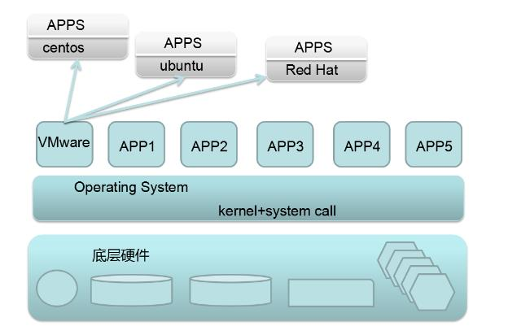
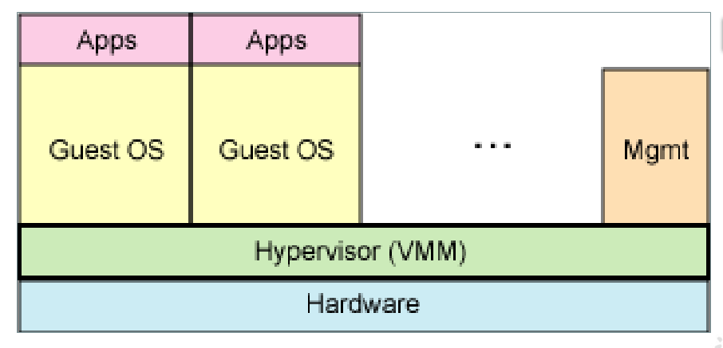
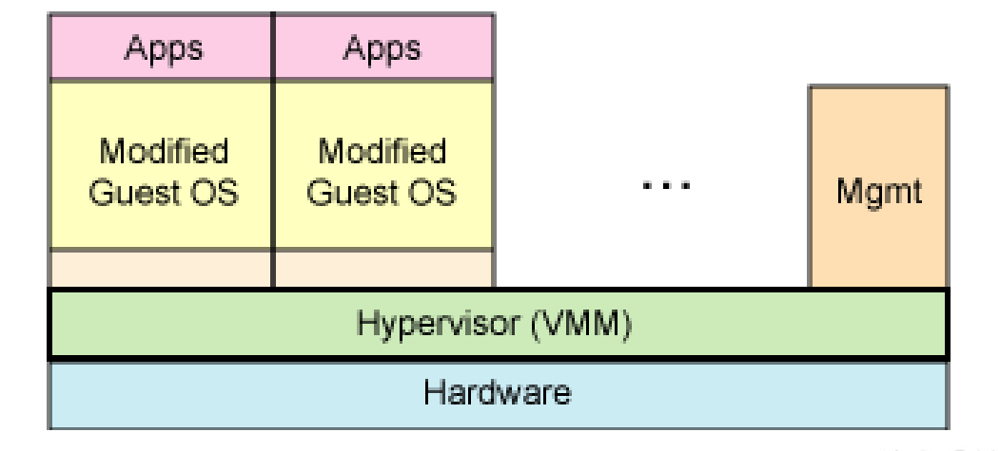
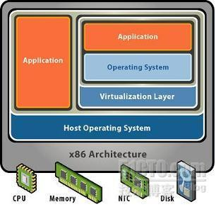
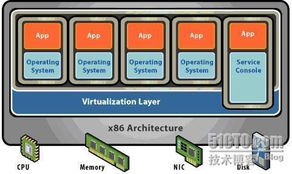

# 1、引言

美国环境保护署（EPA）报告的一组有趣的统计数据就证明了其好处。PA 研究服务器和数据中心的能源效率时发现，实际上服务器只有 5% 的时间是在工作的。在其他时间，服务器都处于 “休眠” 状态。

## **1）虚拟化前**

• 每台主机一个操作系统

• 软件硬件紧密地结合

• 在同一主机上运行多个应用程序通常会遭遇沖突

• 系统的资源利用率低

• 硬件成本高昂而且不够灵活

## 2）虚拟化后

• 打破了操作系统和硬件的互相倚賴

• 通过封装到到虚拟机的技术, 管理操作系统和应用程序为单一的个体

• 強大的安全和故障隔离

• 虚拟机是独立于硬件的, 它们能在任何硬件上运行

# 2、定义

# 3、虚拟化的分类

## 1）从技术上分类

### 1-全虚拟化技术

**（Hypervisor:虚拟机管理程序）（VMM：Virtual-Mache-Monitor,虚拟机监视器）**

-  完全虚拟化技术又叫硬件辅助虚拟化技术，最初所使用的虚拟化技术就是全虚拟化（Full Virtualization)技

术，它在虚拟机（VM）和硬件之间加了一个软件层--Hypervisor，或者叫做虚拟机监控器（VMM）

•hypervisor 直接运行在物理硬件之上 

•hypervisor 运行在另一个操作系统中 -

### 2-超虚拟化技术

超虚拟化技术，它就是在全虚拟化的基础上，把客户操作系统进行了修改，增加了一个

专门的API，这个API可以将客户操作系统发出的指令进行最优化，即不需要Hypervisor耗费一定的资源进行翻

译操作，因此Hypervisor的工作负担变得非常的小，因此整体的性能也有很大的提高。

## 2)从架构上分类

### **1-寄居架构**：

就是在操作系统之上安装和运行虚拟化程序，依赖于主机操作系统对设备的支持和物理资源的管理;

**优点：**

**缺点：**

**举例**

### 2-裸金属架构：

就是直接在硬件上面安装虚拟化软件，再在其上安装操作系统和应用，依赖虚拟层内核和服务器控制台进行管理。

**优点：**

**缺点：**

**举例：**