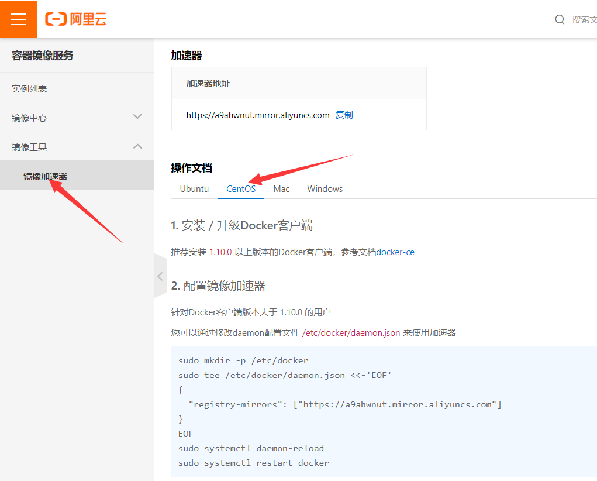

# 1、Docker是什么？

- Docker是一个在2013年开源的应用程序，并且是一个基于go语言编写的PAAS服务。

- Docker最早采用LXC技术，之后改为自己研发并开源的runc技术运行容器。

- Docker相比虚拟机的交付速度更快，资源消耗更低，Docker采用客户端、服务端架构，使用远程api来管理和创建Docker容器。

- Docker的三大理念是build（构建）、ship（运输）、run（运行）。

- Docker遵从apache2.0协议，并通过namespace、cgroup等技术来提供容器的资源隔离与安全保障。

# 2、Docker与虚拟机之间的对比	


- 资源利用率更高：一台物理机可以运行数百个容器，但一般只能运行数十个虚拟机

- 开销更小：不需要启动单独的虚拟机占用硬件资源

- 启动速度更快：可以在数秒内完成启动

# 3、Docker的组成

官网：[https://docs.docker.com/get-started/overview/](https://docs.docker.com/get-started/overview/)

Docker主机 host：一个物理机或者虚拟机，用于运行docker服务进程和容器

Docker服务端 Server：Docker守护进程，运行docker容器

Docker客户端 client：客户端使用docker命令或其他工具调用docker api

Docker仓库 registry：保存镜像的仓库，类似于git或svn这样的版本控制器

Docker镜像 images：镜像可以理解为创建实例使用的模板

Docker容器 container：容器是从镜像生成对外提供服务的一个或一组服务


# 4、Docker安装及基础命令

## 1）安装docker-ce以及客户端

```shell
[root@docker-server ~]# yum install wget.x86_64 -y
[root@docker-server ~]# rm -rf /etc/yum.repos.d/*
[root@docker-server ~]# wget -O /etc/yum.repos.d/Centos-7.repo http://mirrors.aliyun.com/repo/Centos-7.repo

[root@docker-server ~]# wget -O /etc/yum.repos.d/docker-ce.repo https://mirrors.aliyun.com/docker-ce/linux/centos/docker-ce.repo
[root@docker-server ~]# yum install docker-ce -y
```

## 2）启动docker

```shell
[root@docker-server ~]# systemctl enable docker.service
Created symlink from /etc/systemd/system/multi-
user.target.wants/docker.service to /usr/lib/systemd/system/docker.service.
[root@docker-server ~]# systemctl start docker.service
[root@docker-server ~]# docker info #查看docker的详细信息
```

## 3）快速开始

```shell
[root@docker-server ~]# docker pull nginx   #拉取镜像
[root@docker-server ~]# docker images     #查看已经拉取的镜像
REPOSITORY  TAG    IMAGE ID    CREATED   SIZE
nginx    latest  d1a364dc548d  5 days ago  133MB
[root@docker-server ~]# docker run -d -p 80:80 nginx
e617ca1db9a5d242e6b4145b9cd3dff9f7955c6ab1bf160f13fb6bec081a29e4
[root@docker-server ~]# docker ps       #查看正在运行的容器 --all可以查看所有的容器
CONTAINER ID  IMAGE   COMMAND         CREATED     STATUS      
  PORTS                NAMES
e617ca1db9a5  nginx   "/docker-entrypoint.…"  6 seconds ago  Up 5
seconds  0.0.0.0:80->80/tcp, :::80->80/tcp  intelligent_turing
[root@docker-server ~]# docker exec -it e617ca1db9a5 bash
root@e617ca1db9a5:/# cat /etc/os-release  #查看这个容器的版本
root@e617ca1db9a5:/# cd /usr/share/nginx/html/
root@e617ca1db9a5:/usr/share/nginx/html# ls
50x.html index.html
root@e617ca1db9a5:/usr/share/nginx/html# echo 'docker nginx test' >
index.html  #编辑首页内容
[root@docker-server ~]# curl 192.168.80.10
docker nginx test
```

# 5、Linux namespace技术

如果一个宿主机运行了N个容器，多个容器带来的以下问题怎么解决：

1. 怎么样保证每个容器都有不同的文件系统并且能互不影响？

1. 一个docker主进程内的各个容器都是其子进程，那么如何实现同一个主进程下不同类型的子进程？各个子进程间通信能相互访问吗？

1. 每个容器怎么解决IP以及端口分配的问题？

1. 多个容器的主机名能一样吗？

1. 每个容器都要不要有root用户？怎么解决账户重名问题呢？

以上问题怎么解决？

namespace是Linux系统的底层概念，在内核层实现，即有一些不同类型的命名空间都部署在核内，各

个docker容器运行在同一个docker主进程并且共用同一个宿主机系统内核，各个docker容器运行在宿主

机的用户空间，每个容器都要有类似于虚拟机一样的相互隔离的运行空间，但是容器技术是在一个进程

内实现运行指定服务的运行环境，并且还可以保护宿主机内核不受其他进程的干扰和影响，如文件系

统、网络空间、进程空间等，目前主要通过以下技术实现容器运行空间的相互隔离：


## 1）MNT Namespace

每个容器都要有独立的根文件系统有独立的用户空间，以实现容器里面启动服务并且使用容器的运行环境。

### 启动三个容器

```shell
[root@docker-server ~]# docker run -d --name nginx-1 -p 80:80 nginx
0e72f06bba417073d1d4b2cb53e62c45b75edc699b737e46a157a3249f3a803e
[root@docker-server ~]# docker run -d --name nginx-2 -p 81:80 nginx
c8ce6a0630b66e260eef16d8ecf48049eed7b893b87459888b634bf0e9e40f23
[root@docker-server ~]# docker run -d --name nginx-3 -p 82:80 nginx
1cddbd412b5997f8935815c2f588431e100b752595ceaa92b95758ca45179096
```

### 连接进入某一个容器中，并创建一个文件

```shell
[root@docker-server ~]# docker exec -it nginx-1 bash
root@0e72f06bba41:/# echo 'hello world test!' > /opt/test1
root@0e72f06bba41:/# exit
```

### 宿主机是使用了chroot技术把容器锁定到一个指定的运行目录里

```shell
[root@docker-server diff]# find / -name test1
/var/lib/docker/overlay2/f9cc560395b5e3b11d2b1293922c4d31e6a6a32ca59af3d9274e
abdfc6832424/diff/opt/test1
/var/lib/docker/overlay2/f9cc560395b5e3b11d2b1293922c4d31e6a6a32ca59af3d9274e
abdfc6832424/merged/opt/test1
[root@docker-server diff]#
```

## 2）IPC Namespace

一个容器内的进程间通信，允许一个容器内的不同进程数据互相访问，但是不能跨容器访问其他容器的数据

UTS Namespace包含了运行内核的名称、版本、底层体系结构类型等信息用于系统表示，其中包含了

hostname和域名，它使得一个容器拥有属于自己hostname标识，这个主机名标识独立于宿主机系统和

其上的其他容器。

## 3）PID Namespace

Linux系统中，有一个pid为1的进程（init/systemd）是其他所有进程的父进程，那么在每个容器内也要

有一个父进程来管理其下属的进程，那么多个容器的进程通PID namespace进程隔离

### 安装软件包

```
root@0e72f06bba41:/# apt update
# ifconfig
root@0e72f06bba41:/# apt install net-tools
# top
root@0e72f06bba41:/# apt install procps
# ping
root@0e72f06bba41:/# apt install iputils-ping
root@0e72f06bba41:/# ps -ef
UID     PID  PPID C STIME TTY     TIME CMD
root      10  0 03:20 ?     00:00:00 nginx: master process nginx -g d
nginx     32    1  0 03:20 ?     00:00:00 nginx: worker process
nginx     33    1  0 03:20 ?     00:00:00 nginx: worker process
nginx     34    1  0 03:20 ?     00:00:00 nginx: worker process
nginx     35    1  0 03:20 ?     00:00:00 nginx: worker process
nginx     36    1  0 03:20 ?     00:00:00 nginx: worker process
nginx     37    1  0 03:20 ?     00:00:00 nginx: worker process
nginx     38    1  0 03:20 ?     00:00:00 nginx: worker process
nginx     39    1  0 03:20 ?     00:00:00 nginx: worker process
root     59    0  0 03:35 pts/0   00:00:00 bash
root     503   59  0 03:42 pts/0   00:00:00 ps -ef
```

### 那么宿主机的PID与容器内的PID是什么关系？

```
[root@docker-server ~]# yum install psmisc
[root@docker-server ~]# pstree -p
systemd(1)─┬─NetworkManager(638)─┬─{NetworkManager}(665)
     │           └─{NetworkManager}(667)
     ├─agetty(651)
     ├─auditd(607)───{auditd}(608)
     ├─chronyd(637)
     ├─containerd(880)─┬─{containerd}(1024)
     │         ├─{containerd}(1025)
     │         ├─{containerd}(1026)
     │         ├─{containerd}(1047)
     │         ├─{containerd}(1048)
     │         ├─{containerd}(1049)
     │         ├─{containerd}(1078)
     │         └─{containerd}(1105)
     ├─containerd-shim(1472)─┬─nginx(1492)───nginx(1545)
     │            ├─{containerd-shim}(1473)
     │            ├─{containerd-shim}(1474)
     │            ├─{containerd-shim}(1475)
     │            ├─{containerd-shim}(1476)
     │            ├─{containerd-shim}(1477)
     │            ├─{containerd-shim}(1478)
     │            ├─{containerd-shim}(1479)
     │            ├─{containerd-shim}(1480)
     │            ├─{containerd-shim}(1482)
     │            ├─{containerd-shim}(1512)
     │            ├─{containerd-shim}(1519)
     │            └─{containerd-shim}(1520)
     ├─crond(647)
     ├─dbus-daemon(634)
     ├─dockerd(1069)─┬─docker-proxy(1456)─┬─{docker-proxy}(1457)
     │        │          ├─{docker-proxy}(1458)
     │        │          ├─{docker-proxy}(1459)
     │        │          └─{docker-proxy}(1461)
     │        ├─docker-proxy(1460)─┬─{docker-proxy}(1462)
     │        │          ├─{docker-proxy}(1463)
     │        │          ├─{docker-proxy}(1464)
     │        │          └─{docker-proxy}(1465)
     │        ├─{dockerd}(1144)
     │        ├─{dockerd}(1145)
     │        ├─{dockerd}(1146)
     │        ├─{dockerd}(1147)
     │        ├─{dockerd}(1148)
     │        ├─{dockerd}(1149)
     │        ├─{dockerd}(1150)
     │        ├─{dockerd}(1152)
     │        └─{dockerd}(1153)
```

## 4）Net Namespace

每一个容器都类似于虚拟机一样有自己的网卡、监听端口、TCP/IP协议栈等，Docker使用network

namespace启动一个vethX接口，这样容器将拥有它自己的桥接IP地址，通常是docker0，而docker0实

质就是linux的虚拟网桥。

```shell
[root@docker-server ~]# yum install bridge-utils.x86_64 -y
[root@docker-server ~]# brctl show
bridge name bridge id STP enabled interfaces
docker0 8000.0242c83ab23e no veth3ad3c5b
[root@docker-server ~]# ifconfig
docker0: flags=4163<UP,BROADCAST,RUNNING,MULTICAST> mtu 1500
   inet 172.17.0.1 netmask 255.255.0.0 broadcast 172.17.255.255
   inet6 fe80::42:c8ff:fe3a:b23e prefixlen 64 scopeid 0x20<link>
   ether 02:42:c8:3a:b2:3e txqueuelen 0 (Ethernet)
   RX packets 0 bytes 0 (0.0 B)
   RX errors 0 dropped 0 overruns 0 frame 0
   TX packets 5 bytes 438 (438.0 B)
   TX errors 0 dropped 0 overruns 0 carrier 0 collisions 0
ens33: flags=4163<UP,BROADCAST,RUNNING,MULTICAST> mtu 1500
   inet 192.168.80.10 netmask 255.255.255.0 broadcast 192.168.80.255
   inet6 fe80::eaf3:dc40:2bf:6da2 prefixlen 64 scopeid 0x20<link>
   ether 00:0c:29:f7:bf:0d txqueuelen 1000 (Ethernet)
   RX packets 20899 bytes 26611365 (25.3 MiB)
   RX errors 0 dropped 0 overruns 0 frame 0
   TX packets 9785 bytes 640866 (625.8 KiB)
   TX errors 0 dropped 0 overruns 0 carrier 0 collisions 0
lo: flags=73<UP,LOOPBACK,RUNNING> mtu 65536
   inet 127.0.0.1 netmask 255.0.0.0
   inet6 ::1 prefixlen 128 scopeid 0x10<host>
   loop txqueuelen 1 (Local Loopback)
   RX packets 72 bytes 5768 (5.6 KiB)
   RX errors 0 dropped 0 overruns 0 frame 0
   TX packets 72 bytes 5768 (5.6 KiB)
   TX errors 0 dropped 0 overruns 0 carrier 0 collisions 0
veth3ad3c5b: flags=4163<UP,BROADCAST,RUNNING,MULTICAST> mtu 1500
   inet6 fe80::28f5:d3ff:feda:4f03 prefixlen 64 scopeid 0x20<link>
   ether 2a:f5:d3:da:4f:03 txqueuelen 0 (Ethernet)
   RX packets 0 bytes 0 (0.0 B)
   RX errors 0 dropped 0 overruns 0 frame 0
   TX packets 13 bytes 1086 (1.0 KiB)
   TX errors 0 dropped 0 overruns 0 carrier 0 collisions 0
```

### 查看docker内部网卡

```shell
root@0d5d7069b9d9:/# ifconfig
eth0: flags=4163<UP,BROADCAST,RUNNING,MULTICAST> mtu 1500
   inet 172.17.0.2 netmask 255.255.0.0 broadcast 172.17.255.255
   ether 02:42:ac:11:00:02 txqueuelen 0 (Ethernet)
   RX packets 3708 bytes 8489188 (8.0 MiB)
   RX errors 0 dropped 0 overruns 0 frame 0
   TX packets 3340 bytes 182520 (178.2 KiB)
   TX errors 0 dropped 0 overruns 0 carrier 0 collisions 0
lo: flags=73<UP,LOOPBACK,RUNNING> mtu 65536
   inet 127.0.0.1 netmask 255.0.0.0
   loop txqueuelen 1 (Local Loopback)
   RX packets 0 bytes 0 (0.0 B)
   RX errors 0 dropped 0 overruns 0 frame 0
   TX packets 0 bytes 0 (0.0 B)
   TX errors 0 dropped 0 overruns 0 carrier 0 collisions 0
```

### 逻辑图


## 5）User Namespace

各个容器内可能会出现重名的用户和用户组名称，或重复的用户UID或者GID，那么怎么隔离各个容器内

的用户空间呢？

User Namespace允许在各个宿主机的各个容器空间内创建相同的用户名以及相同的uid和gid，只是此

用户的有效范围仅仅是当前的容器内，不能访问另外一个容器内的文件系统，即相互隔离、互不影响、永不相见

# 6、Linux control groups

在一个容器内部，如果不对其做任何资源限制，则宿主机会允许其占用无限大的内存空间，有时候会因

为代码bug程序会一直申请内存，直到把宿主机内存占完，为了避免此类的问题出现，宿主机有必要对

容器进行资源分配限制，比如cpu、内存等，Linux Cgroups的全称是Linux control Groups，它最重要

的作用就是限制一个进程组能够使用的资源上线，包括cpu、内存、磁盘、网络等等。

### 验证系统内核层已经默认开启cgroup功能

```
[root@docker-server ~]# cat /boot/config-3.10.0-693.el7.x86_64 | grep
cgroup -i
CONFIG_CGROUPS=y
# CONFIG_CGROUP_DEBUG is not set
CONFIG_CGROUP_FREEZER=y
CONFIG_CGROUP_PIDS=y
CONFIG_CGROUP_DEVICE=y
CONFIG_CGROUP_CPUACCT=y
CONFIG_CGROUP_HUGETLB=y
CONFIG_CGROUP_PERF=y
CONFIG_CGROUP_SCHED=y
CONFIG_BLK_CGROUP=y
# CONFIG_DEBUG_BLK_CGROUP is not set
CONFIG_NETFILTER_XT_MATCH_CGROUP=m
CONFIG_NET_CLS_CGROUP=y
CONFIG_NETPRIO_CGROUP=y
```

### 关于内存的模块

```
[root@docker-server ~]# cat /boot/config-3.10.0-693.el7.x86_64 | grep mem -i
| grep cg -i
CONFIG_MEMCG=y
CONFIG_MEMCG_SWAP=y
CONFIG_MEMCG_SWAP_ENABLED=y
CONFIG_MEMCG_KMEM=y
```

```
CPU:使用调度程序为cgroup任务提供 CPU 的访问。
cpuacct:产生cgroup任务的 CPU 资源报告。
cpuset：如果是多核心的CPU,这个子系统会为cgroup任务分配单的CPU和内存。
devices:允许或拒绝cgroup任务对设备的访问。
freezer:暂停和恢复cgroup任务。
memory:设置每个cgroup 的内存限制以及产生内存资源报告。
net_cls:标记每个网络包以供 cgroup方便使用。
ns:命名空间子系统。
perf event:增加了对每个group的监测跟踪的能力，可以监测属于某个特定的group 的所有线程以及
运行在特定CPU上的线程
```

扩展阅读：

[https://blog.csdn.net/qyf158236/article/details/110475457](https://blog.csdn.net/qyf158236/article/details/110475457)

# 7、容器规范

容器技术除了docker之外，还有coreOS的rkt，还有阿里的Pouch，还有红帽 的

- runtime是真正运行容器的地方，因此运行了不同的容器runtime需要和操作系统内核紧密合作相互在支

持，以便为容器提供相应的运行环境，目前主流的三种runtime：

- **lxc：**linux上早期的runtime，Docker早期就是采用lxc作为runtime

- **runc**：是目前docker默认的runtime，runc遵守oci规范，因此可以兼容lxc

- **rkt：**是coreOS开发的容器runtime，也负荷oci规范

# 8、docker info信息

```shell
[root@docker-server ~]# docker info
Client:
Context:  default
Debug Mode: false
Plugins:
app: Docker App (Docker Inc., v0.9.1-beta3)
buildx: Build with BuildKit (Docker Inc., v0.5.1-docker)
scan: Docker Scan (Docker Inc.)
Server:
Containers: 2 # 当前主机运行容器总数
Running: 1 # 有几个容器是正在运行的
Paused: 0 # 有几个容器是暂停的
Stopped: 1 # 有几个容器是停止的
Images: 1 # 当前服务器的镜像数
Server Version: 20.10.6 # 服务端版本
Storage Driver: overlay2 # 正在使用的存储引擎
Backing Filesystem: xfs # 后端文件系统，即服务器的磁盘文件系统
Supports d_type: true # 是否支持d_type
Native Overlay Diff: true # 是否支持差异数据存储
userxattr: false
Logging Driver: json-file # 日志文件类型
Cgroup Driver: cgroupfs # cgroups类型
Cgroup Version: 1
Plugins: # 插件
Volume: local # 卷
Network: bridge host ipvlan macvlan null overlay
Log: awslogs fluentd gcplogs gelf journald json-file local logentries
splunk syslog
Swarm: inactive # 是否支持swarm
Runtimes: io.containerd.runc.v2 io.containerd.runtime.v1.linux runc
Default Runtime: runc # 默认的runtime
Init Binary: docker-init # 初始化容器的守护进程
containerd version: d71fcd7d8303cbf684402823e425e9dd2e99285d
runc version: b9ee9c6314599f1b4a7f497e1f1f856fe433d3b7
init version: de40ad0
Security Options: # 安全选项
seccomp
 Profile: default
Kernel Version: 3.10.0-693.el7.x86_64 # 宿主机内核版本
Operating System: CentOS Linux 7 (Core) # 宿主机操作系统
OSType: linux # 宿主机操作系统类型
Architecture: x86_64 # 宿主机架构
CPUs: 1 # 宿主机cpu数量
Total Memory: 1.781GiB # 宿主机总内存
Name: docker-server # 宿主机主机名
ID: ARN5:ESPO:FEZ4:KDZ6:RWGG:WQ3X:SIXN:3FVG:ATXH:JAXA:ENGH:RAVE
Docker Root Dir: /var/lib/docker # 宿主机数据保存目录
Debug Mode: false
Registry: https://index.docker.io/v1/ # 镜像仓库
Labels:
Experimental: false # 是否是测试版
Insecure Registries:
 127.0.0.0/8
Live Restore Enabled: false # 是否开启活动容器（重启不关闭容器）
```

**docker 存储引擎**

目前docker的默认存储引擎为overlay2，不同的存储引擎需要相应的系统支持，如需要磁盘分区的时候

传递d-type文件分层功能，即需要传递内核参数开启格式化磁盘的时候指定功能。

官网关于存储引擎的信息：

[https://docs.docker.com/storage/storagedriver/select-storage-driver/](https://docs.docker.com/storage/storagedriver/select-storage-driver/)

由于存储引擎选择错误引起的血案（扩展阅读）

[https://www.cnblogs.com/youruncloud/p/5736718.html](https://www.cnblogs.com/youruncloud/p/5736718.html)

# 9、镜像加速配置

打开网址

[http://cr.console.aliyun.com/](http://cr.console.aliyun.com/)

登陆之后点击镜像加速器，按照指导说明即可

