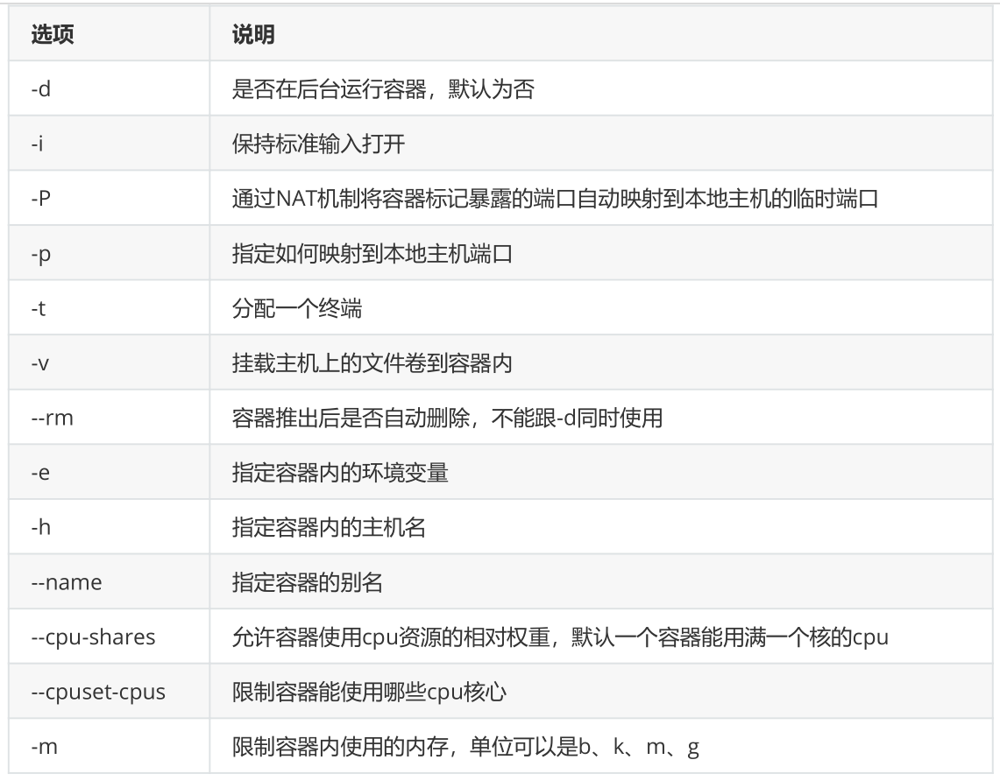
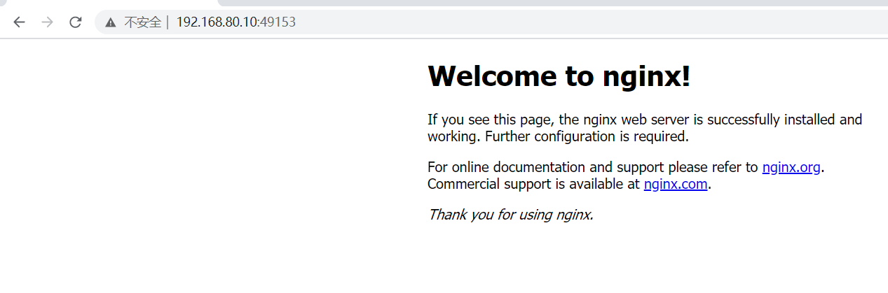
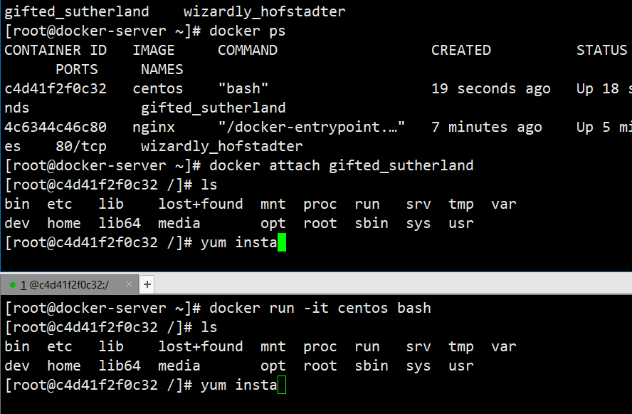

# 1、创建容器

## 1）docker create

docker create命令新建的工期处于停滞状态，可以使用docker start命令来启动它



## 2）docker run

除了创建容器后通过start命令来启动也可以通过docker run直接新建并启动容器。

### 启动一个容器

```
[root@docker-server ~]# docker run -it centos:latest bash
[root@4abaf8a399fe /]#
```

### 显示正在运行的容器

```
[root@docker-server ~]# docker ps
CONTAINER ID  IMAGE      COMMAND  CREATED     STATUS    
PORTS   NAMES
4abaf8a399fe  centos:latest  "bash"   47 seconds ago  Up 46 seconds   
   hardcore_perlman
```

### 显示所有容器，包括停止的所有容器

```
[root@docker-server ~]# docker ps
CONTAINER ID  IMAGE   COMMAND  CREATED  STATUS  PORTS   NAMES
[root@docker-server ~]# docker ps -a
CONTAINER ID  IMAGE      COMMAND  CREATED     STATUS       
   PORTS   NAMES
4abaf8a399fe  centos:latest  "bash"   2 minutes ago  Exited (0) 9 seconds
ago       hardcore_perlman
```

## 3）端口映射

### 前台启动随机映射端口

```
[root@docker-server ~]# docker pull nginx
[root@docker-server ~]# docker run -P nginx
# 随机映射端口，其实是从32768开始映射
[root@docker-server ~]# ss -tanl
State    Recv-Q Send-Q Local Address:Port        Peer Address:Port
      
LISTEN    0    128    *:22           *:*         
LISTEN    0    100   127.0.0.1:25           *:*       
 
LISTEN    0    128    *:49153         *:*         
LISTEN    0    128    :::22          :::*         
LISTEN    0    100   ::1:25          :::*         
LISTEN    0    128    :::49153         :::*  
```



### 指定端口映射

```
# 方式1，本地端口80映射到容器80端口
[root@docker-server ~]# docker run -p 80:80 --name nginx-1 nginx:latest
# 方式2，本地ip：本地端口：容器端口
[root@docker-server ~]# docker run -p 192.168.80.10:80:80 --name nginx-1
 nginx:latest
# 方式3，本地ip：本地随机端口：容器端口
[root@docker-server ~]# docker run -p 192.168.80.10::80 --name nginx-1
  nginx:latest
# 方式4，本地ip：本地端口：容器端口/协议默认为tcp协议
[root@docker-server ~]# docker run -p 192.168.80.10:80:80/tcp --name nginx-1
 nginx:latest
```

### 查看容器已经映射的端口

```
root@docker-server ~]# docker port nginx-1
80/tcp -> 0.0.0.0:80
80/tcp -> :::80
```

## 4）后台启动容器

### 当容器前台启动时，前台进程退出容器也就退出，更多时候需要容器在后台启动

```
[root@docker-server ~]# docker run -d -P --name nginx-2 nginx
c75333168c0dad9094d94828c33998294f2809ae8c5b60881707d9cc33ea4893
```

### 传递运行命令

容器需要由一个前台运行的进程才能保持容器的运行，通过传递运行参数是一种方式，另外也可以在构

建镜像的时候指定容器启动时运行的前台命令

```
[root@docker-server ~]# docker ps -a
CONTAINER ID  IMAGE   COMMAND  CREATED  STATUS  PORTS   NAMES
[root@docker-server ~]# docker run -d centos
9ef312d30f7a396ecb5c93b7b70e70a742f333bbe01e9112d6f22fc52aeb71b8
[root@docker-server ~]# docker ps
CONTAINER ID  IMAGE   COMMAND  CREATED  STATUS  PORTS   NAMES
[root@docker-server ~]# docker ps -a
CONTAINER ID  IMAGE   COMMAND    CREATED     STATUS       
PORTS   NAMES
9ef312d30f7a  centos   "/bin/bash"  12 seconds ago  Exited (0) 11
 seconds ago       upbeat_noether
[root@docker-server ~]# docker run -d centos tail -f /etc/hosts
7b0700c01f9516f49e70ad92e7256d965e0fe4eb8ccc7b30676a03c1d8046c64
[root@docker-server ~]# docker ps
CONTAINER ID  IMAGE   COMMAND        CREATED     STATUS    PORTS   NAMES
7b0700c01f95  centos   "tail -f /etc/hosts"  3 seconds ago  Up 2 seconds
  charming_brahmagupta
```

### 单次运行，容器退出后自动删除

```
[root@docker-server ~]# docker run --name hello_world_test --rm hello-world
Hello from Docker!
This message shows that your installation appears to be working correctly.
To generate this message, Docker took the following steps:
1. The Docker client contacted the Docker daemon.
2. The Docker daemon pulled the "hello-world" image from the Docker Hub.
 (amd64)
3. The Docker daemon created a new container from that image which runs the
 executable that produces the output you are currently reading.
4. The Docker daemon streamed that output to the Docker client, which sent
it
 to your terminal.
To try something more ambitious, you can run an Ubuntu container with:
$ docker run -it ubuntu bash
Share images, automate workflows, and more with a free Docker ID:
https://hub.docker.com/
For more examples and ideas, visit:
https://docs.docker.com/get-started/
[root@docker-server ~]# docker ps -a
CONTAINER ID  IMAGE   COMMAND  CREATED  STATUS  PORTS   NAMES
[root@docker-server ~]#
```

# 2、停止容器

## 1）暂停容器

### 挂起容器

```
[root@docker-server ~]# docker ps
CONTAINER ID  IMAGE   COMMAND         CREATED     STATUS  
  PORTS   NAMES
4c6344c46c80  nginx   "/docker-entrypoint.…"  8 seconds ago  Up 8
 seconds  80/tcp  wizardly_hofstadter
[root@docker-server ~]# docker pause wizardly_hofstadter
wizardly_hofstadter
[root@docker-server ~]# docker ps
CONTAINER ID  IMAGE   COMMAND         CREATED     STATUS  
 PORTS   NAMES
4c6344c46c80  nginx   "/docker-entrypoint.…"  17 seconds ago  Up 16
seconds (Paused)  80/tcp  wizardly_hofstadter
```

### 取消挂起容器

```
[root@docker-server ~]# docker unpause wizardly_hofstadter
wizardly_hofstadter
[root@docker-server ~]# docker ps
CONTAINER ID  IMAGE   COMMAND         CREATED     STATUS  
  PORTS   NAMES
4c6344c46c80  nginx   "/docker-entrypoint.…"  33 seconds ago  Up 33
seconds  80/tcp  wizardly_hofstadter
```

## 2）看终止容器

```
[root@docker-server ~]# docker ps
CONTAINER ID  IMAGE   COMMAND         CREATED      
STATUS       PORTS   NAMES
4c6344c46c80  nginx   "/docker-entrypoint.…"  About a minute ago  Up
About a minute  80/tcp  wizardly_hofstadter
[root@docker-server ~]# docker stop wizardly_hofstadter
wizardly_hofstadter
[root@docker-server ~]# docker ps -a
CONTAINER ID  IMAGE   COMMAND         CREATED     STATUS  
        PORTS   NAMES
4c6344c46c80  nginx   "/docker-entrypoint.…"  2 minutes ago  Exited (0)
5 seconds ago       wizardly_hofstadter
[root@docker-server ~]# docker start wizardly_hofstadter
wizardly_hofstadter
[root@docker-server ~]# docker ps -a
CONTAINER ID  IMAGE   COMMAND         CREATED     STATUS  
  PORTS   NAMES
4c6344c46c80  nginx   "/docker-entrypoi
```

# 3、删除容器

## 1）docker rm

### 删除正在运行的容器

```
[root@docker-server ~]# docker ps
CONTAINER ID  IMAGE      COMMAND  CREATED     STATUS     PORTS
  NAMES
dfd5ba20c3c6  centos:latest  "bash"   8 seconds ago  Up 6 seconds    
  frosty_elbakyan
[root@docker-server ~]# docker rm -f dfd5ba20c3c6
dfd5ba20c3c6
```

### 批量删除容器

```
[root@docker-server ~]# docker ps -a
CONTAINER ID  IMAGE   COMMAND         CREATED     STATUS  
  PORTS   NAMES
8e3cb314c9ad  nginx   "/docker-entrypoint.…"  4 seconds ago  Up 3
seconds  80/tcp  pedantic_lovelace
4ab46864c8a3  nginx   "/docker-entrypoint.…"  5 seconds ago  Up 4
seconds  80/tcp  beautiful_spence
26a154528469  nginx   "/docker-entrypoint.…"  5 seconds ago  Up 5
seconds  80/tcp  serene_booth
2ecbf60d817a  nginx   "/docker-entrypoint.…"  6 seconds ago  Up 6
seconds  80/tcp  dreamy_bassi
d73faf8c2f7d  nginx   "/docker-entrypoint.…"  8 seconds ago  Up 8
seconds  80/tcp  beautiful_solomon
[root@docker-server ~]# docker ps -a -q
8e3cb314c9ad
4ab46864c8a3
26a154528469
2ecbf60d817a
d73faf8c2f7d
[root@docker-server ~]# docker rm -f `docker ps -a -q`
8e3cb314c9ad
4ab46864c8a3
26a154528469
2ecbf60d817a
d73faf8c2f7d
[root@docker-server ~]# docker ps -a
CONTAINER ID  IMAGE   COMMAND  CREATED  STATUS  PORTS   NAMES
```

# 4、进入容器

## 1）atach

所有使用此方式进入容器的操作都是同步显示的且exit容器将被关闭，且使用exit退出后容器关闭，不推荐使用



当有一个容器执行exit退出后会导致容器退出

## 2）exec

执行单次命令与进入容器，退出容器后容器还在运行

```
[root@docker-server ~]# docker run -d -it centos
129d518869d550e579bcff38608bae38209923dcbfab49c823d5e1473d38214a
[root@docker-server ~]# docker ps
CONTAINER ID  IMAGE   COMMAND    CREATED     STATUS    PORTS 
 NAMES
129d518869d5  centos   "/bin/bash"  2 seconds ago  Up 1 second     
 jovial_haibt
[root@docker-server ~]# docker exec -it jovial_haibt /bin/bash
[root@129d518869d5 /]# echo hello
hello
[root@129d518869d5 /]# exit
exit
[root@docker-server ~]# docker ps
CONTAINER ID  IMAGE   COMMAND    CREATED     STATUS    
PORTS   NAMES
129d518869d5  centos   "/bin/bash"  46 seconds ago  Up 45 seconds      jovial_haibt
```

## 3）nsenter

nsenter命令需要通过pid进入到容器内部，不过可以使用docker inspect获取到容器的pid

### 可以通过docker inspect获取到某个容器的进程id

```
[root@docker-server ~]# docker inspect -f "{{.State.Pid}}" 129d518869d5
7949
```

### 通过nsenter进入到容器内部

```
[root@docker-server ~]# nsenter -t 7949 -m -u -i -n -p
[root@129d518869d5 /]#
```

### 使用脚本方式进入

```
[root@docker-server ~]# cat docker_in.sh
#!/bin/bash
docker_in(){
DOCKER_ID=$1
PID=`docker inspect -f "{{.State.Pid}}" ${DOCKER_ID}`
nsenter -t ${PID} -m -u -i -n -p
}
docker_in $1
[root@docker-server ~]# chmod +x docker_in.sh
[root@docker-server ~]# ./docker_in.sh 129d518869d5
[root@129d518869d5 /]# exit
logout
[root@docker-server ~]# docker ps
CONTAINER ID  IMAGE   COMMAND    CREATED     STATUS    
PORTS   NAMES
129d518869d5  centos   "/bin/bash"  14 minutes ago  Up 14 minutes   
jovial_haibt
[root@docker-server ~]#
```

# 5、指定容器DNS

dns服务，默认采用dns地址

一是通过将dns地址配置在宿主机上

二是将参数配置在docker启动脚本里面

```
[root@docker-server ~]# docker run -it --rm --dns 8.8.8.8 centos bash
[root@a6ce80126e75 /]# cat /etc/resolv.conf
nameserver 8.8.8.8
[root@a6ce80126e75 /]# ping www.baidu.com -c 1
PING www.a.shifen.com (180.101.49.11) 56(84) bytes of data.
64 bytes from 180.101.49.11 (180.101.49.11): icmp_seq=1 ttl=127 time=9.35 ms
--- www.a.shifen.com ping statistics ---
1 packets transmitted, 1 received, 0% packet loss, time 0ms
rtt min/avg/max/mdev = 9.346/9.346/9.346/0.000 ms
[root@a6ce80126e75 /]# exit
exit
```

# 6、导入导出容器

## 1）docker export

导出容器是指，导出一个已经创建的容器到一个文件，不管此时这个容器是否处于运行状态

```
[root@docker-server ~]# docker run -d -it centos
43f2397b9456d27a3b84dba0d79ae9a1dd8dddf40440d7d73fca71cddea0e10d
[root@docker-server ~]# docker ps
CONTAINER ID  IMAGE   COMMAND    CREATED     STATUS     PORTS 
 NAMES
43f2397b9456  centos   "/bin/bash"  2 seconds ago  Up 2 seconds     
 awesome_rubin
[root@docker-server ~]# docker export -o /opt/centos.tar 43f
[root@docker-server ~]# ll /opt/centos.tar
-rw------- 1 root root 216525312 6月  9 13:28 /opt/centos.tar
```

## 2）docker import

导出的文件可以使用docker import命令导入变成镜像

```
[root@docker-server ~]# docker import /opt/centos.tar mycentos:v1
sha256:acf250a6cabb56e0464102dabedb0a562f933facd3cd7b387e665459da46bf29
[root@docker-server ~]# docker images
REPOSITORY  TAG    IMAGE ID    CREATED     SIZE
mycentos   v1    acf250a6cabb  9 seconds ago  209MB
nginx     latest  d1a364dc548d  2 weeks ago   133MB
hello-world  latest  d1165f221234  3 months ago   13.3kB
centos    latest  300e315adb2f  6 months ago  209MB
```