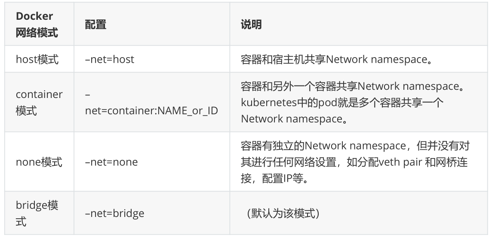
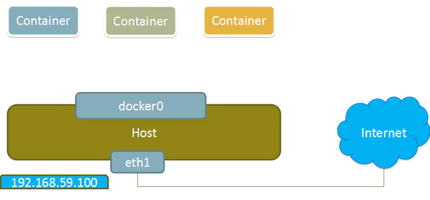
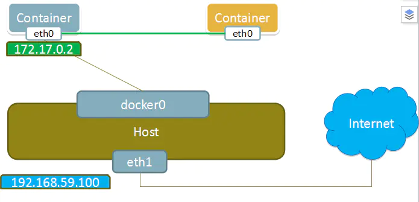
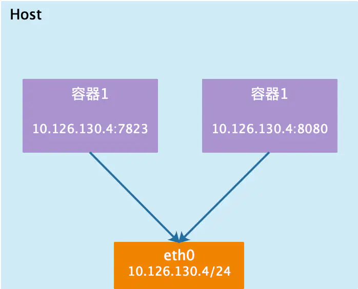
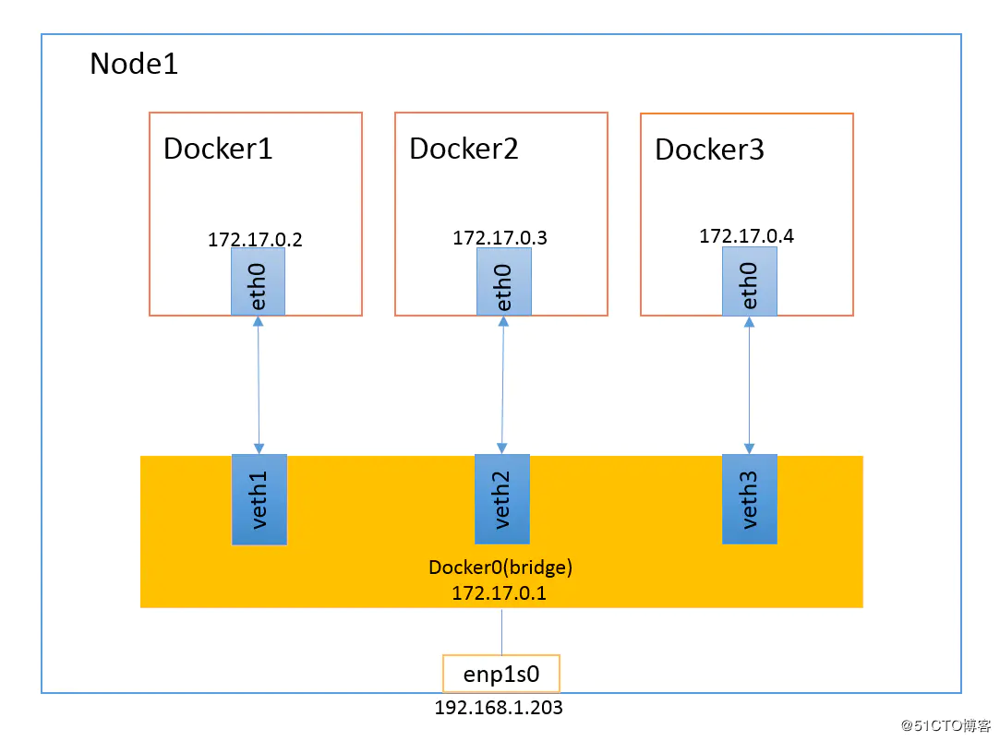

# 1、容器之间的互联

在同一个宿主机上的容器之间可以通过端口映射的方式，经过宿主机中转进行互相访问呢，也可以通过

docker0网桥互相访问

## 1）直接互联

- 启动两个容器

```
[root@docker-server1 ~]# docker run -d -it nginx
[root@docker-server1 ~]# docker run -d -it nginx
```

- 安装相关工具包

```
root@855ab8d0bd74:/# apt update
root@855ab8d0bd74:/# apt install net-tools -y
root@855ab8d0bd74:/# apt install iputils-ping -y
root@855ab8d0bd74:/# apt install procps -y
```

- 检测网络连通性

```
root@855ab8d0bd74:/# ping 172.17.0.3 -c 2
PING 172.17.0.3 (172.17.0.3) 56(84) bytes of data.
64 bytes from 172.17.0.3: icmp_seq=1 ttl=64 time=0.052 ms
64 bytes from 172.17.0.3: icmp_seq=2 ttl=64 time=0.081 ms
--- 172.17.0.3 ping statistics ---
2 packets transmitted, 2 received, 0% packet loss, time 1ms
rtt min/avg/max/mdev = 0.052/0.066/0.081/0.016 ms
```

## 2）使用名称互联

- 启动两个容器

```
[root@docker-server1 ~]# docker run -d -it --name web1 nginx
[root@docker-server1 ~]# docker run -d -it --name web2 --link web1 nginx
```

- 查看web2容器的hosts文件，发现已经实现名称解析

```
[root@docker-server1 ~]# docker exec -it web2 bash
root@8a3e9cee9e37:/# cat /etc/hosts
127.0.0.1 localhost
::1 localhost ip6-localhost ip6-loopback
fe00::0 ip6-localnet
ff00::0 ip6-mcastprefix
ff02::1 ip6-allnodes
ff02::2 ip6-allrouters
172.17.0.2 web1 622eff54876f
172.17.0.3 8a3e9cee9e37
```

- 连通性测试

```
root@8a3e9cee9e37:/# ping web1 -c 2
PING web1 (172.17.0.2) 56(84) bytes of data.
64 bytes from web1 (172.17.0.2): icmp_seq=1 ttl=64 time=0.068 ms
64 bytes from web1 (172.17.0.2): icmp_seq=2 ttl=64 time=0.045 ms
--- web1 ping statistics ---
2 packets transmitted, 2 received, 0% packet loss, time 1ms
rtt min/avg/max/mdev = 0.045/0.056/0.068/0.013 ms
```

## 3）使用别名互联

自定义的容器名称可能后期会发生变化，那么一旦发生变化也会带来一些影响，这个时候如果每次都更

改名称又比较麻烦，这个时候可以使用定义别名的方式解决，即容器名称可以随意更改，只要不更改别

名即可。

- 启动一个容器

```
[root@docker-server1 ~]# docker run -d -it --name web3 --link web1:nginx-web1
 nginx
```

- 查看容器web3的hosts文件

```
[root@docker-server1 ~]# docker exec -it web3 bash
root@c85c73ebf00b:/# cat /etc/hosts
127.0.0.1 localhost
::1 localhost ip6-localhost ip6-loopback
fe00::0 ip6-localnet
ff00::0 ip6-mcastprefix
ff02::1 ip6-allnodes
ff02::2 ip6-allrouters
172.17.0.2 nginx-web1 622eff54876f web1
172.17.0.4 c85c73ebf00b
```

- 连通性测试

```
root@c85c73ebf00b:/# ping nginx-web1 -c2
PING nginx-web1 (172.17.0.2) 56(84) bytes of data.
64 bytes from nginx-web1 (172.17.0.2): icmp_seq=1 ttl=64 time=0.112 ms
64 bytes from nginx-web1 (172.17.0.2): icmp_seq=2 ttl=64 time=0.055 ms
--- nginx-web1 ping statistics ---
2 packets transmitted, 2 received, 0% packet loss, time 2ms
rtt min/avg/max/mdev = 0.055/0.083/0.112/0.029 ms
```

# 2、Docker网络

## 1）四类网络模式



Docker服务安装完成之后，默认在每个宿主机会生成一个名称为docker0的网卡，其ip地址都是

172.17.0.1/16，并且会生成三种不同类型的网络

```
[root@docker-server1 ~]# ifconfig
docker0: flags=4099<UP,BROADCAST,MULTICAST> mtu 1500
   inet 172.17.0.1 netmask 255.255.0.0 broadcast 172.17.255.255
   ether 02:42:14:75:bf:4c txqueuelen 0 (Ethernet)
   RX packets 0 bytes 0 (0.0 B)
   RX errors 0 dropped 0 overruns 0 frame 0
   TX packets 0 bytes 0 (0.0 B)
   TX errors 0 dropped 0 overruns 0 carrier 0 collisions 0
ens33: flags=4163<UP,BROADCAST,RUNNING,MULTICAST> mtu 1500
   inet 192.168.80.10 netmask 255.255.255.0 broadcast 192.168.80.255
   inet6 fe80::eaf3:dc40:2bf:6da2 prefixlen 64 scopeid 0x20<link>
   ether 00:0c:29:f4:79:06 txqueuelen 1000 (Ethernet)
   RX packets 13079 bytes 18637594 (17.7 MiB)
   RX errors 0 dropped 0 overruns 0 frame 0
   TX packets 1747 bytes 124995 (122.0 KiB)
   TX errors 0 dropped 0 overruns 0 carrier 0 collisions 0
lo: flags=73<UP,LOOPBACK,RUNNING> mtu 65536
   inet 127.0.0.1 netmask 255.0.0.0
   inet6 ::1 prefixlen 128 scopeid 0x10<host>
   loop txqueuelen 1 (Local Loopback)
   RX packets 72 bytes 5776 (5.6 KiB)
   RX errors 0 dropped 0 overruns 0 frame 0
   TX packets 72 bytes 5776 (5.6 KiB)
   TX errors 0 dropped 0 overruns 0 carrier 0 collisions 0
[root@docker-server1 ~]# docker network list
NETWORK ID   NAME   DRIVER  SCOPE
787342a0d883  bridge  bridge  local
9a6d7244e807  host   host   local
beace8354cca  none   null   local
```

在启动容器的时候可以使用--network参数去指定网络类型，默认使用的是bridge网络类型

## 2）none网络类型

在使用none模式后，docker容器不会进行任何网络配置，其没有网卡、没有ip也没有路由，因此默认无

法与外界进行通信，需要手动添加网卡配置ip等，所以极少使用



```
[root@docker-server1 ~]# docker run -d -it --name web4 --network none nginx
```

## 3）container网络类型

这个模式指定新创建的容器和已经存在的一个容器共享一个 Network Namespace，而不是和宿主机共

享。新创建的容器不会创建自己的网卡，配置自己的 IP，而是和一个指定的容器共享 IP、端口范围等。

同样，两个容器除了网络方面，其他的如文件系统、进程列表等还是隔离的。两个容器的进程可以通过

lo 网卡设备通信。



```
[root@docker-server1 ~]# docker run -d -it --name web5 --network
container:web1 nginx
83db4f9af6f3d9d42bbd57691fcf82ef06cbf1a5874750effa314a4ec242aaaa
```

## 4）host网络类型

如果启动容器的时候使用host模式，那么这个容器将不会获得一个独立的Network Namespace，而是

和宿主机共用一个Network Namespace。容器将不会虚拟出自己的网卡，配置自己的IP等，而是使用宿

主机的IP和端口。

使用host模式的容器可以直接使用宿主机的IP地址与外界通信，容器内部的服务端口也可以使用宿主机

的端口，不需要进行NAT，host最大的优势就是网络性能比较好，但是docker host上已经使用的端口就

不能再用了，网络的隔离性不好。



```
[root@docker-server1 ~]# docker run -d -it --name web7 --network host nginx
e90cb3bfc1a3fbd187319ac3b995b116feb37422534b03662d624680e35eb2bb
[root@docker-server1 ~]# docker exec -it web7 bash
root@docker-server1:/# ifconfig
docker0: flags=4163<UP,BROADCAST,RUNNING,MULTICAST> mtu 1500
   inet 172.17.0.1 netmask 255.255.0.0 broadcast 172.17.255.255
   inet6 fe80::42:14ff:fe75:bf4c prefixlen 64 scopeid 0x20<link>
   ether 02:42:14:75:bf:4c txqueuelen 0 (Ethernet)
   RX packets 9647 bytes 394222 (384.9 KiB)
   RX errors 0 dropped 0 overruns 0 frame 0
   TX packets 10932 bytes 43303360 (41.2 MiB)
   TX errors 0 dropped 0 overruns 0 carrier 0 collisions 0
ens33: flags=4163<UP,BROADCAST,RUNNING,MULTICAST> mtu 1500
   inet 192.168.80.10 netmask 255.255.255.0 broadcast 192.168.80.255
   inet6 fe80::eaf3:dc40:2bf:6da2 prefixlen 64 scopeid 0x20<link>
   ether 00:0c:29:f4:79:06 txqueuelen 1000 (Ethernet)
   RX packets 60855 bytes 81177548 (77.4 MiB)
   RX errors 0 dropped 0 overruns 0 frame 0
   TX packets 17770 bytes 1472014 (1.4 MiB)
   TX errors 0 dropped 0 overruns 0 carrier 0 collisions 0
   lo: flags=73<UP,LOOPBACK,RUNNING> mtu 65536
   inet 127.0.0.1 netmask 255.0.0.0
   inet6 ::1 prefixlen 128 scopeid 0x10<host>
   loop txqueuelen 1 (Local Loopback)
   RX packets 72 bytes 5776 (5.6 KiB)
   RX errors 0 dropped 0 overruns 0 frame 0
   TX packets 72 bytes 5776 (5.6 KiB)
   TX errors 0 dropped 0 overruns 0 carrier 0 collisions 0
```

## 5）bridge网络类型

当Docker进程启动时，会在主机上创建一个名为docker0的虚拟网桥，此主机上启动的Docker容器会连

接到这个虚拟网桥上。虚拟网桥的工作方式和物理交换机类似，这样主机上的所有容器就通过交换机连

在了一个二层网络中。

从docker0子网中分配一个IP给容器使用，并设置docker0的IP地址为容器的默认网关。在主机上创建一

对虚拟网卡veth pair设备，Docker将veth pair设备的一端放在新创建的容器中，并命名为eth0（容器

的网卡），另一端放在主机中，以vethxxx这样类似的名字命名，并将这个网络设备加入到docker0网桥

中。可以通过brctl show命令查看。

bridge模式是docker的默认网络模式，不写--net参数，就是bridge模式。使用docker run -p时，

docker实际是在iptables做了DNAT规则，实现端口转发功能。可以使用iptables -t nat -vnL查看。



# 3、创建自定义网络

可以基于docker命令创建自定义网络，自定义网络可以自定义ip地址范围和网关等信息。

- 创建一个网络

```
[root@docker-server1 ~]# docker network create -d bridge --subnet
10.10.0.0/16 --gateway 10.10.0.1 eagleslab-net
74ee6ecdfc0382ac0abb1b46a3c90e3c6a39f0b7388aa9ba99fddc6bac72e8ce
[root@docker-server1 ~]# docker network list
NETWORK ID   NAME      DRIVER  SCOPE
787342a0d883  bridge     bridge  local
74ee6ecdfc03  eagleslab-net  bridge  local
9a6d7244e807  host      host   local
beace8354cca  none      null   local
```

- 使用自定义网络创建容器

```
[root@docker-server1 ~]# docker run -d -it --name web8 --network eagleslab-
net nginx
```

- 检查网络

```
[root@docker-server1 ~]# docker exec -it web8 bash
root@a7edddb4114e:/# ifconfig
eth0: flags=4163<UP,BROADCAST,RUNNING,MULTICAST> mtu 1500
   inet 10.10.0.2 netmask 255.255.0.0 broadcast 10.10.255.255
   ether 02:42:0a:0a:00:02 txqueuelen 0 (Ethernet)
   RX packets 1064 bytes 8764484 (8.3 MiB)
   RX errors 0 dropped 0 overruns 0 frame 0
   TX packets 738 bytes 41361 (40.3 KiB)
   TX errors 0 dropped 0 overruns 0 carrier 0 collisions 0
root@a7edddb4114e:/# ping www.baidu.com -c2
PING www.a.shifen.com (112.34.112.83) 56(84) bytes of data.
64 bytes from 112.34.112.83 (112.34.112.83): icmp_seq=1 ttl=127 time=37.8 ms
64 bytes from 112.34.112.83 (112.34.112.83): icmp_seq=2 ttl=127 time=36.9 ms
--- www.a.shifen.com ping statistics ---
2 packets transmitted, 2 received, 0% packet loss, time 3ms
rtt min/avg/max/mdev = 36.865/37.320/37.776/0.494 ms
```

- iptables会生成nat的相应规则

```
[root@docker-server1 ~]# iptables -t nat -vnL
Chain PREROUTING (policy ACCEPT 12 packets, 759 bytes)
pkts bytes target   prot opt in   out   source       
destination    
  2  136 DOCKER   all  -- *   *    0.0.0.0/0     
 0.0.0.0/0      ADDRTYPE match dst-type LOCAL
Chain INPUT (policy ACCEPT 0 packets, 0 bytes)
pkts bytes target   prot opt in   out   source       
destination    
Chain OUTPUT (policy ACCEPT 1 packets, 76 bytes)
pkts bytes target   prot opt in   out   source       
destination  
 0   0 DOCKER   all  -- *   *    0.0.0.0/0     
!127.0.0.0/8     ADDRTYPE match dst-type LOCAL
Chain POSTROUTING (policy ACCEPT 1 packets, 76 bytes)
pkts bytes target   prot opt in   out   source       
destination    
 12  759 MASQUERADE all  -- *   !br-74ee6ecdfc03  10.10.0.0/16   
 0.0.0.0/0     
 32  1940 MASQUERADE all  -- *   !docker0  172.17.0.0/16   
 0.0.0.0/0     
Chain DOCKER (2 references)
pkts bytes target   prot opt in   out   source       
destination    
  0   0 RETURN   all  -- br-74ee6ecdfc03 *    0.0.0.0/0     
 0.0.0.0/0     
  1   84 RETURN   all  -- docker0 *    0.0.0.0/0     
 0.0.0.0/0
```