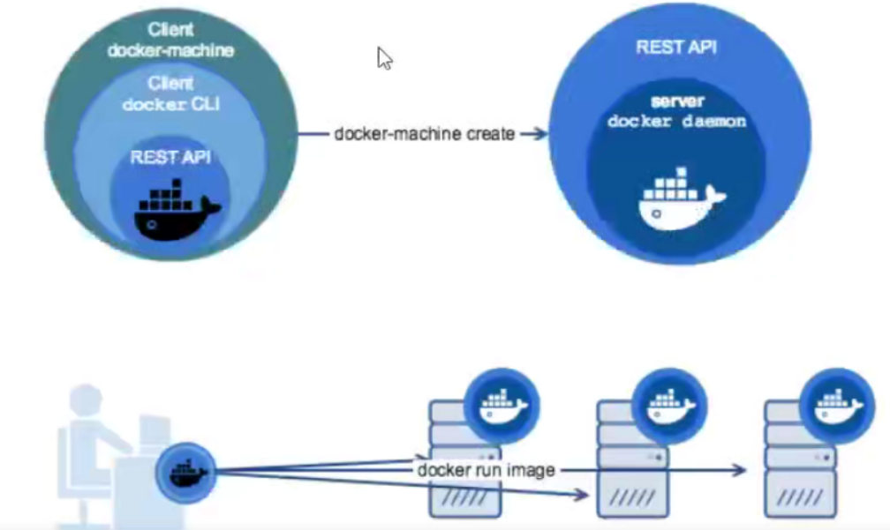

为了把容器化技术的优点发挥得更好，docker公司先后推出了三大技术：

- docker-machine

- docker-compose

- docker-swarm

使用"三剑客"可以帮助我们解决docker host维护，多容器编排部署，多个docker host集群的各个难题。

# 1、Docker machine(了解)

通过前面的章节学习，我们知道docker使用了linux的内核技术(namespace,cgroup等)，那么如果我想在windowsi或Mac系统上运行docker怎么办呢？

答案是借助虚拟机来实现，也就是说我在windows或Mac上运行，个linux虚拟机，再在虚拟机里运行docker。


docker-machine就是docker公司官方提出的，用于在各种平台上快速创建具有docker服务的虚拟机的技术.

参考：[https://docs.docker.com/machine/install-machine/#install-machine-directly](https://docs.docker.com/machine/install-machine/#install-machine-directly)



# 2、Docker compose

用容器运行一个服务，需要使用docker run命令。但如果我要运行多个服务呢？假设我要运行一个wb服务，还要运行一个db服务，那么是用一个容器运行，还是用多个容器运行呢？

一个容器运行多个服务会造成镜像的复杂度提高，docker倾向于一个容器运行一个应用。那么复杂的架构就会需要很多的容器，并且需要它们之间有关联（容器之间的依赖和连接）就更复杂了。这个复杂的问题需要解决，这就涉及到了容器编排的问题了。

docker-compose就是可以做容器编排的小工具，它可以在一个文件中定义多个容器，只用一行命令就可以让一切就绪并运行。

## 2.1 docker-.compose部署

- 安装：

```
[root@server1 ~]# yum install -y docker-compose
[root@server1 ~]# docker-compose -v                #查看版本号
docker-compose version 1.18.0, build 8dd22a9
```

## 2.2 使用docker-compose的三个步骤

- Docker Compose将所管理的容器分为三层

- 1.工程(project)

- 2.服务(service)

- 3.容器(contaienr)

Docker Compose运行的目录下的所有文件(docker-compose,yml,extends.文件或环境变量文件等)组成一个工程，若无特殊指定工程名即为当前目录名。

一个工程当中可包含多个服务，每个服务中定义了容器运行的镜像，参数，依赖。

一个服务当中可包括多个容器实例

- 使用Compose基本上分为三步：

1.Dockerfile定义应用的运行环境（镜像）

2.docker-compose.yml定义组成应用的各服务

3.docker-compose up构建并启动整个应用

## 2.3 docker-compose语法

### build

指定镜像构建时的dockerfile目录，格式一般为绝对路径目录或相对路径目录(dockerfile需要命名为Dockerfile)

```
build:/path/to/build/dir
    或者
build:./dir
```

### image

指定要启动容器的镜像

```
image:redis
image:ubuntu:14.04
image:tutum/influxdb
image:example-registry.com:4000/postgresql
image:a4bc65fd
```

如果镜像不存在，compose:尝试拉它

如果指定了构建，可以使用指定的选项构建它，并使用指定的tg进行标记.

### environment

设置镜像变量，它可以保存变量到镜像里面，也就是说启动的容器也会包含这些变量设置environment和Dockerfile中的ENv指令一样会把变量一直保存在镜像，容器中

格式

```
environment:
  RACK_ENV:development
  SHOW:'true'
 或
environment:
  - RACK_ENV=development
  - SHOW=true
```

### expose

这个标签与Dockerfile中的EXPOSE指令一样，用于指定暴露的端口，但只将端口暴露给连接的服务，而不暴露给主机，

```
expose:
  - "3000"
  - "8000"
```

### ports

映射端口，可以使用HOST:CONTAINER的方式指定端口，也可以指定容器端口（选择临时主机端口)，宿主机会随机映射端口

```
ports:
  - "3000"
  - "3000-3005"
  - "8000:8000"
  - "9090-9091:8080-8081"
  - "49100:22"
  - "127.0.0.1:8001:8001"
  - "127.0.0.1:5000-5010:5000-5010"
  - "6060:6060/udp"
```

### restart

指定Docker容器的重启策略

默认值为no,即在任何情况下都不会重新启动容器

当值为always时，容器退出时总是重新启动，（会随着docker服务启动而启动容器）；

当值为on-failure时，当出现on-failure报错（非正常退出，退出状态非0），才会重启容器

当值为unless-stopped时，在容器退出时总是重启容器，但是不考虑在Docker守护进程启动时就已经停止了的容器

```
restart:"no"
restart:always
restart:on-failure
restart:on-failure:3        #如果启动失败，最多重启3次
restart:unless-stopped
```

### volume

数据卷挂载，可以直接使用HOST:CONTAINER这样的格式或者使用HOST:CONTAINER:ro这样的格式，ro代表数据卷是只读的

```
volumes
#只是指定一个路径，Docker会自动在创建一个数据卷（这个路径是容器内部的）。
- /var/1ib/mysq1
#使用绝对路径挂载数据卷
- /opt/data:/var/lib/mysql
#以Compose配置文件为中心的相对路径作为数据卷挂载到容器。
- ./cache:/tmp/cache
#使用用户的相对路径(~/表示的目录是/home/<用户目录>/或者/root/)。
- ~/configs:/etc/configs/:ro
#已经存在的命名的数据卷。
datavolume:/var/lib/mvsal
```

### depends_on

此标签解决了容器的依赖、启动先后的问题

```
version:'3'
services:
  web:
     build:.
     depends_on:
        - db
        - redis
  redis:
    image:redis
  db:
    image:mysql
```

使用docker-compose up web启动，会先启动redis和db,再启动web

### links

链接到其它服务的中的容器，与link连接一样效果，会连接到其它服务中的容器

```
web:
  links:
    - db
     -db:database
```

# 3、Docker-compose 案例

## 3.1 WordPress应用

- docker-compose.yml

```
version: "3"
services:
  mysql:
    image: mysql:5.6
    restart: always
    volumes:
      - "./data/mysql:/var/lib/mysql"
    environment:
      MYSQL_PANDOM_PASSWORD: '123'
      MYSQL_DATABASE: wordpress
      MYSQL_USER: wordpress
      MYSQL_PASSWORD: wordpress
    expose:
      - 3306

  wordpresss:
    image: wordpress:latest
    restart: always
    depends_on:
      - mysql
    links:
      - mysql
    environment:
      WORDPRESS_DB_HOST: mysql:3306
      WORDPRESS_DB_USER: wordpress
      WORDPRESS_DB_PASSWORD: wordpress
      WORDPRESS_DB_NAME: wordpress
    volumes:
      - "./data/wordpress:/var/www/html"
    ports:
      - "8080:80"
```

- 启动，停止

```
docker-compose up -d    #执行上面yml文件
docker-compose stop     #停止服务
docker-compose down     #停止服务，并删除容器
-f             #指定使用的 yaml 文件位置 
ps             #显示所有容器信息
restart        #重新启动容器 
logs           #查看日志信息 
config -q      #验证 yaml 配置文件是否正确
stop           #停止容器
start          #启动容器
up -d          #启动容器项目
pause          #暂停容器
unpause        #复暂停
rm             #删除容器
```