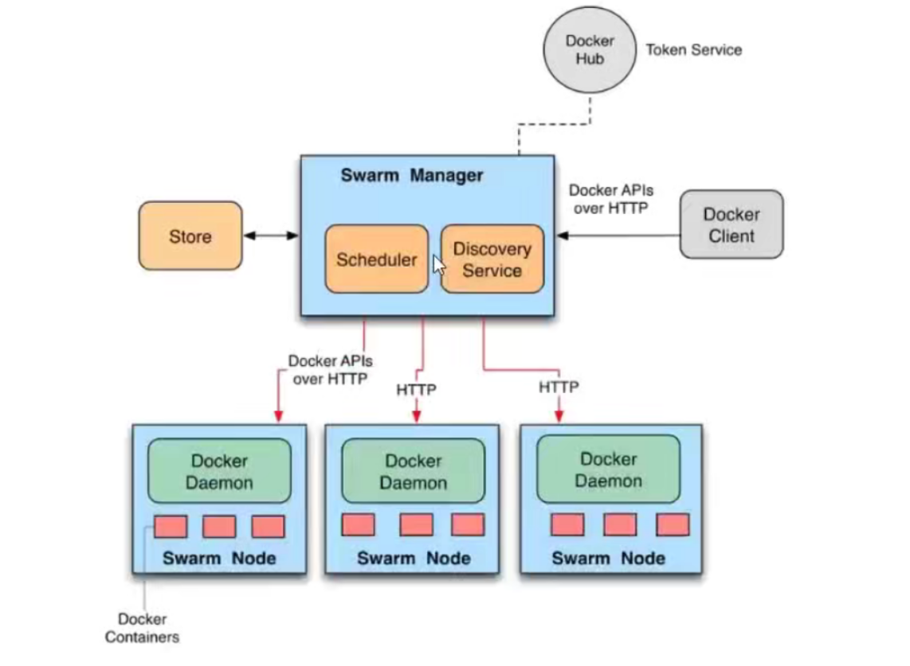
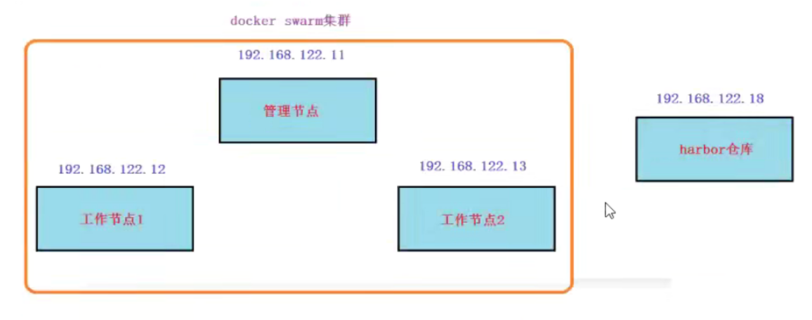

**Docker swarm**

# 1、docker swarm介绍

Docker Swarm是Docker官方提供的一款集群管理工具，其主要作用是把若干台Docker主机抽象为一个整体，并且通过一个入口统一管理这些Docker主机上的各种Docker?资源。Swarm和Kubernetesl比较类似，但是更加轻，具有的功能也较kubernetes更少一些。

- 是docker host:集群管理工具

- docker'官方提供的

- docker1.12版本以后

- 用来统一集群管理的，把整个集群资源做统一调度

- 比kubernetes要轻量化

- 实现scaling规模扩大或缩小

- 实现rolling update滚动更新或版本回退

- 实现service discovery服务发现

# 2、docker swarm概念架构

节点(node:就是一台docker host.上面运行了docker engine.节点分为两类：

- 管理节点manager node)负责管理集群中的节点并向工作节点分配任务

- 工作节点worker node)接收管理节点分配的任务，运行任务

**服务(services):**

**任务(task):**

**Docker Swarm Architecture -Exploded**



# **3、docker swarm 集群部署**

## **3.1 环境准备**



**1、所有节点主机名及绑定**

```
192.168.122.11    vm1.cluster.com
192.168.122.12    vm2.cluster.com
192.168.122.13    vm3.cluster.com
```

2、所有节点关闭防火墙和Selinux

```
systemctl stop firewalld
setenforce 0
```

3、所有节点时间同步

```
ntpdate cn.ntp.org.cn
```

4、所有节点都安装docker-ce 并启动服务

```
wget -O /etc/yum.repos.d/docker-ce.repo https://mirrors.aliyun.com/docker-ce/linux/centos/docker-ce.repo
yum install -y docker-ce
配置镜像加速：
vim /etc/docker/daemon.json
{
"registry-mirrors": ["https://y6hegoqi.mirror.aliyuncs.com"]
}
systemctl	damon-reload
systemctl        restart docker.service
```

5、编辑hosts文件

```
vim /etc/hosts
192.168.23.10 master
192.168.23.12 node1
192.168.23.18 node2
```

6、设置主机名

```
hostnamectl set-hostname master
```

## 3.2 manager-节点初始化swarm集群

> **# 如果是多网卡，需要使用--advertise-addr 参数而不是 --listen-addr**
> **--advertise-addrAddr       vertised address (format: "<ip|interface>[:port]")**


```
[root@master ~]# docker swarm init --listen-addr 192.168.23.10:2377  #192.168.23.10：2377 就是监听的本地ip和端口
Swarm initialized: current node (nfglms8jvww5p6lrdvzmcddkh) is now a manager.

To add a worker to this swarm, run the following command:
    docker swarm join --token SWMTKN-1-5z2bvctuocyj2vtwyk9tph7sdgbpa17rj9p5giqx8elcu346sf-66vhuxf2gfrihp1ubzsqgchtd 192.168.23.10:2377
To add a manager to this swarm, run 'docker swarm join-token manager' and follow the instructions.
#1、然后复制上诉提示中的指令在需要被加入的节点上执行：
    “docker swarm join --token SWMTKN-1-5z2bvctuocyj2vtwyk9tph7sdgbpa17rj9p5giqx8elcu346sf-66vhuxf2gfrihp1ubzsqgchtd 192.168.23.10:2377”
#2、To add a manager to this swarm, run 'docker swarm join-token manager' and follow the instructions.
    中的 “docker swarm join-token manager”  用于增加master节点，做高可用
[root@master ~]# docker node ls  #查看已经部署的节点
ID                            HOSTNAME   STATUS    AVAILABILITY   MANAGER STATUS   ENGINE VERSION
nfglms8jvww5p6lrdvzmcddkh *   master     Ready     Active         Leader           23.0.1
```

## 3.3 swarm集群中加入worker节点

分别在另外2个节点oin集群

```
[root@node1 ~]# docker swarm join --token SWMTKN-1-5z2bvctuocyj2vtwyk9tph7sdgbpa17rj9p5giqx8elcu346sf-66vhuxf2gfrihp1ubzsqgchtd 192.168.23.10:2377
This node joined a swarm as a worker.
[root@master ~]# docker node  ls            #在master上执行，节点数已经增加
ID                            HOSTNAME   STATUS    AVAILABILITY   MANAGER STATUS   ENGINE VERSION
nfglms8jvww5p6lrdvzmcddkh *   master     Ready     Active         Leader           23.0.1
48p4lfbd17m6zm31gld2wt59u     node1      Ready     Active                          23.0.1
ve0rwnqjx8mpy77ibx20oiva8     node2      Ready     Active                          23.0.1
```

# 4、docker swarm 集群基础引用

## 4.1 镜像准备

1、准备主页文件与dockerfile文件

```
[root@vm1 ~]mkdir /dockerfile/nginx -p
[root@vm1 ~]cd /dockerfile/nginx/
[root@vml nginx]#vim index.html
nginx V1
随意写些内容，模拟V1版本的主页内容
[root@vml nginx]#vim Dockerfile
FROM nginx:latest
MAINTAINER hackwu
ADD index.html /usr/share/nginx/html
RUN echo "daemon off;" >>/etc/nginx/nginx.conf       #让nginx在前台启动
EXPOSE 80
CMD /usr/sbin/nginx
```

2、 登录harbor仓库

```
[root@vm1 nginx]#docker login 192.168.122.18
Username:admin
Password:
WARNING!Your password will be stored unencrypted in /root/.docker/config.json.
Configure a credential helper to remove this warning.See
Login Succeeded
```

3、构建v1版本镜像，并push到harbort仓库

```
[root@vm1 nginx]#docker build -f Dockerfile -t 192.168.122.18/library/nginx:v1  ./  #-t 构建的同时，打上TAG标记
[root@vm1 nginx]#docker push 192.168.122.18/library/nginx:v1    #上传到harbor仓库
```

4、构建v2版本镜像，并push到harbort仓库,用于给后面做滚动更新

```
[root@vml nginx]#vim index.html
nginx V2            #改成v2 版本
[root@vm1 nginx]#docker build -f Dockerfile -t 192.168.122.18/library/nginx:v1  ./  #-t 构建的同时，打上TAG标记
[root@vm1 nginx]#docker push 192.168.122.18/library/nginx:v1    #上传到harbor仓库
```

## **4.2 服务发布**

在docker swarm中，对外暴露的是服务(service),而不是容器。

为了保持高可用架构，它准许同时启动多个容器共同支撑一个服务，如果一个容器挂了，它会自动使用另一个容器

在管理节点(manager node)上操作

1、使用docker service ls查看没有任何服务

```
[root@master nginx]# docker service ls
ID        NAME      MODE      REPLICAS   IMAGE     PORTS
```

2、发布服务

```
[root@vml ~]docker service create --replicas 2 --publish 80:80 --name nginx_service 192.168.122.18/library/nginx:v1
6q00dbum7f92wjnrjtnsab225
overall progress: 2 out of 2 tasks 
1/2: running   [==================================================>] 
2/2: running   [==================================================>] 
verify: Service converged
# --replicas 2  意思就是在包括master的几个几点中，选两个节点用于创建这个服务。有可能也会选中master，
# 在docker swamr 中，master 是可以干活的，但是在k8s，master(manager) 是不干活的，只负责管理
说明：
创建一个服务，名为nginx_service
replicas2指定2个副本
-publish80:80将服务内部的80端口发布到外部网络（在这里就是192.168.122.0/24网络）的80端口
使用的镜像为192.168.122.18/1 ibrary/nginx:v1
[root@master nginx]# docker service ls            #可以看到服务已经创建
ID             NAME            MODE         REPLICAS   IMAGE      PORTS
tokf88ftlk7u   nginx_service   replicated   2/2        nginx:v1   *:80->80/tcp
[root@master nginx]# docker service ps nginx_service     #查看这个服务运行情况，在node1 和master上跑了这个服务
ID             NAME              IMAGE      NODE      DESIRED STATE   CURRENT STATE                ERROR     PORTS
ha423a1cne2q   nginx_service.1   nginx:v1   master    Running         Running about a minute ago             
t3om0ux8kbyq   nginx_service.2   nginx:v1   node1     Running         Running about a minute ago
```

> **1、此时使用docker  ps 可以在master和node1节点上，看见已经运行了的容器。**
> **2、然后使用浏览器访问master和node1节点，就可以看到运行的页面的结果。**
> **3、但是你会发现，当你访问node2的节点时，也能访问到运行的也页面，  这就是docke 中的路由网格功能，详情请看下文。**


## 4.3 路由网格

使用集群外的一台节点做为客户端来访问我这里以192.168.122.1为例

```
#cur1192.168,122.11
#cur1192.168.122.12
#cur1192.168.122.13
```

访问三个节点都可以得到结果但我们在前面只看到容器只跑在192.168.122.11和192.168.122.12这2台上，并没有跑到192.168.122.13上，那么这是如何访问到的呢？

答案：route mesh

> **路由网格就是，只要这个集群中有某个，或者多个节点，搭建了某个服务。**
> **那么就可以通过任意一个节点，访问到这个服务。即使它没有运行。**
> **访问的策略是，负载均衡。**


## 4.4负载均衡

在上面两台跑了容器的节点上修改主页内容

在192.168.122.11上

```
#docker exec-1t容器名或容器ID
/bin/bash
容器交互>cd/usr/share/nginx/html
容器交互>
echo webl index.html
容器交互>
exit
```

在192.168.122.12上

```
docker exec -it
容器名或容器ID /bin/bash
容器交互>
cd /usr/share/nginx/html
容器交互>
echo web2 index.html
容器交互>
exit
```

再以集群外的一台节点做为客户端来访问，我这里以192.168.122.1为例

```
#cur1192.168.122.11
web1
```

## 4.5 扩展服务

使用scale指定副本数来扩展(manage node上操作)

```
[root@vm1 ~]docker service scale nginx_service=3        #nginx_service 是服务的名称
nginx_service scaled to 3
overall progress:3 out of 3 tasks
1/3:running    [=======================================>]
2/3:running    [=======================================>]
3/3:running    [=======================================>]
verify:Service converged
```

验证

```
[root@master ~]# docker service ps nginx_service             #可以看到服务已经增加了
ID             NAME              IMAGE      NODE      DESIRED STATE   CURRENT STATE            ERROR     PORTS
ha423a1cne2q   nginx_service.1   nginx:v1   master    Running         Running 30 minutes ago             
t3om0ux8kbyq   nginx_service.2   nginx:v1   node1     Running         Running 30 minutes ago             
vza4fuwrm27m   nginx_service.3   nginx:v1   node2     Running         Running 15 seconds ago
```

> **1、横向扩展 service，中的容器，可以超过物理服务器的个数。**
> **     比如： nginx_service 的物理服务器只有3个，刚才我们扩展成了，3个，正好，每台服务器运行一个容器。**
> **     但其实也可以使用nginx_service=9  意思就是这个服务集群，用9个容器来运行。**
> **       这样的话，无非就是每台服务器，多创几个容器而已，很简单。这样正好就是每台服务器运行三个容器。**


## 4.6 更新版本（滚动更新）

在更新的过程中，服务不会被停止，相当于就是不停机更新

```
[root@vm1 ~]docker service update --image 192.168.122.18/library/nginx:v2#将服务使用的镜像更新为nginx:v2 镜像，这个命令是一个容器一个容器的更新
nginx_service
nginx_service
overall progress: 3 out of 3 tasks 
1/3: running   [==================================================>] 
2/3: running   [==================================================>] 
3/3: running   [==================================================>] 
verify: Service converged 
说明：
update代表更新
# 以下这个命令可以实现并发更新
docker service update --replicas 3 --image 192.168.122.18/1ibrary/nginx:v2 --update-parallelism 1 --update-delay 30s nginx_service
# --update-parallelism 3，就是三个容器一起更新，然后再更新下一组
# --update-delay 30s   指定的每组更新的间隔时间为30 秒
```

## 4.7 删除服务

```
[root@vm1 ~]docker service rm nginx_service
```

## 4.8 本地存储卷

本地存储卷用于持久化数据

1、三台节点需要都先创建挂载的目录

```
mkdir /data/nginxdata
```

2、发布服务，使用创建的目录做源挂载到nginx容器里的家目录

```
[root@vm1 ~]docker service create --replicas 3 \
--mount "type=bind,source=/data/nginxdata,target=/usr/share/nginx/html" \
--publish 80:80 --name nginx_service 192.168.122.18/1ibrary/nginx:v1
image nginx:v1 could not be accessed on a registry to record
its digest. Each node will access nginx:v1 independently,
possibly leading to different nodes running different
versions of the image.

r0tot57pswgplckxtbca44xbo
overall progress: 3 out of 3 tasks 
1/3: running   [==================================================>] 
2/3: running   [==================================================>] 
3/3: running   [==================================================>] 
verify: Service converged
# --mount  数据持久化
#   type=bind  表示挂载的目录为本地
```

3,验证

```
[root@master ~]# docker service ps nginx_service 
ID             NAME              IMAGE      NODE      DESIRED STATE   CURRENT STATE           ERROR     PORTS
7h0wr16qrcr2   nginx_service.1   nginx:v1   node1     Running         Running 5 minutes ago             
kx76z7t7pyh4   nginx_service.2   nginx:v1   node2     Running         Running 5 minutes ago             
ji8lgnikeyv5   nginx_service.3   nginx:v1   master    Running         Running 5 minutes ago
[root@master ~]# curl 192.168.23.10        #这时候访问，会显示被禁止，是因为数据目录为空，根本没有index.html 文件
<html>
<head><title>403 Forbidden</title></head>
<body>
<center><h1>403 Forbidden</h1></center>
<hr><center>nginx/1.21.5</center>
</body>
</html>
# 所以要创建index.html 文件，每个节点都要创建
[root@master ~]# echo "master" > /data/nginxdata/index.html
```

## 4.9 网络存储卷

NFS 网络文件系统：[3.01 NFS使用总结](note://41134C7A54484316A35599FD7C258C40)

网络存储卷可以实现跨docker宿主机的数据共享，数据持久保存到网络存储卷中

在创建service时添加卷的挂载参数，网络存储卷可以帮助自动挂载（但需要集群节点都创建该网络存储卷)

这里以

1、在docker swarm集群中所有节点都确认安装nfs客户端软件

```
yum install nfs-utils rpcbind -y
```

2、在192.168,122,1上搭建nfs,共享目录给docker swarm集群中所有节点挂载

```
[root@daniel ~]mkdir /opt/dockervolume
[root@daniel ~]vim /etc/exports
/opt/dockervolume    *(rw,no_root_squash,sync)
[root@daniel ~] systemctl start rpcbind
[root@daniel ~] systemctl start nfs
[root@daniel ~] showmount -e   #此命令就可以看到exports中的配置了
```

3,在docker swarm集群中所有节点创建存储卷，并验证

```
[root@daniel ~] docker volume create --driver local --opt type=nfs --opt \
o=addr=192.168.122.1,rw --opt device=:/opt/dockervolume nginx_volume
[root@node2 ~]# docker volume ls
DRIVER    VOLUME NAME
local     nginx_volume
[root@node2 ~]# docker volume inspect nginx_volume 
[
    {
        "CreatedAt": "2023-02-19T18:59:44+08:00",
        "Driver": "local",
        "Labels": null,
        "Mountpoint": "/var/lib/docker/volumes/nginx_volume/_data",
        "Name": "nginx_volume",
        "Options": {
            "device": ":/opt/dockervolume",
            "o": "addr=192.168.23.10,rw",
            "type": "nfs"
        },
        "Scope": "local"
    }
]
```

4、重新创建服务，使用nfs网络存储卷

```
[root@master ~]# docker service rm nginx_service 
nginx_service
[root@master ~]# docker service  ls
ID        NAME      MODE      REPLICAS   IMAGE     PORTS
[root@manager ~]docker service create --replicas 3 --publish 80:80 \
--mount "type=volume,source=nginx_volume,target=/usr/share/nginx/html" \
--name nginx_service 192.168.122.18/library/nginx:v1
image nginx:v1 could not be accessed on a registry to record
its digest. Each node will access nginx:v1 independently,
possibly leading to different nodes running different
versions of the image.

ih3qxexkul6pt4t7zqjbv12lg
overall progress: 3 out of 3 tasks 
1/3: running   [==================================================>] 
2/3: running   [==================================================>] 
3/3: running   [==================================================>] 
verify: Service converged
# type=volume    指定为docker volueme
#source=nginx_volume 指定volume挂在卷
```

> 到此服务创建完成，使用浏览器访问即可。


# 5、服务互联与服务发现

如果一个nginx服务与一个mysql服务之间需要连接，在docker swarm如何实现呢？

- 方法1：	把sql服务也使用--publish参数发布到外网，但这样做的缺点是：mysqli这种服务发布到外网不安全

- 方法2：	将mysql服务等运行在内部网络，只需要nginx服务能够连接mysql就可以了，在docker swarm中可以使用overlay网络来实现(overlay就类似在openstack.里使用vxlan实现的自助网络)

但现在还有个问题，服务副本数发生变化时，容器内部的P发生变化时，我们希望仍然能够访问到这个服务，这就是

**通过服务发现，service的使用者都不需要知道service运行在哪里，IP是多少，有多少个副本，就能让service通信**

下面使用docker network ls查看到的ingress网络就是一个overlay类型的网络，但它不支持服务发现

```
[root@master ~]# docker network ls
NETWORK ID     NAME              DRIVER    SCOPE
8ee6b5dd5d31   bridge            bridge    local
5bba07dd40d3   docker_gwbridge   bridge    local
b184e9140098   host              host      local
rdqyca228l5k   ingress           overlay   swarm
ed05ab11d90e   none              null      local
```

我们需要目建一个overlay网络采实现服务发现，需要相互通信的service也必须属于同一个overlay网络

```
[root@master ~]# docker network create --driver overlay --subnet 192.168.100.0/24 self-network  #self-network 自定义的网络名称
rca4m83qytc7x4vi445yxyb0f
说明：
服务名为test
·busybox是一个集成了linux常用命令的软件，这里使用它可以比较方便的测试与nginx servicel的连通性
·没有指定副本默认1个副本
因为它并不是长时间运行的daemon守护进程，所以运行一下就会退出.sleep100000是指定一个长的运行时间，让它有足够的时间给我们测试
3,查出test服务在哪个节点运行的容器
  
    
[root@master ~]# docker network ls
NETWORK ID     NAME              DRIVER    SCOPE
8ee6b5dd5d31   bridge            bridge    local
5bba07dd40d3   docker_gwbridge   bridge    local
b184e9140098   host              host      local
rdqyca228l5k   ingress           overlay   swarm
ed05ab11d90e   none              null      local
rca4m83qytc7   self-network      overlay   swarm        #新增的网络
[root@master ~]# 
[root@master ~]# 
[root@master ~]# 
[root@master ~]# docker network inspect self-network     #查看这个网络的信息
[
    {
        "Name": "self-network",
        "Id": "rca4m83qytc7x4vi445yxyb0f",
        "Created": "2023-02-19T11:28:45.008742321Z",
        "Scope": "swarm",
        "Driver": "overlay",
        "EnableIPv6": false,
        "IPAM": {
            "Driver": "default",
            "Options": null,
            "Config": [
                {
                    "Subnet": "192.168.100.0/24",
                    "Gateway": "192.168.100.1"
                }
            ]
        },
        "Internal": false,
        "Attachable": false,
        "Ingress": false,
        "ConfigFrom": {
            "Network": ""
        },
        "ConfigOnly": false,
        "Containers": null,
        "Options": {
            "com.docker.network.driver.overlay.vxlanid_list": "4097"
        },
        "Labels": null
    }
]
```

**验证自动发现**

**1、发布nginx_service服务，指定在自建的overlay网络**

```
[root@vm1 ~]docker service create --replicas 3 --network self-network \
--publish 80:80 --name nginx_service 192.168.122.18/1ibrary/nginx:v1
```

2、发布一个busybox服务，也指定在自建的overlay网络

```
[root@vml ~]docker service create --replicas 1 --name test --network self-network busybox:latest  s1eep 100000
```

说明：

服务名为test

busybox是一个集成了linux常用命令的软件，这里使用它可以比较方便的测试与nginx_servicel的连通性

没有指定副本默认1个副本

因为它并不是长时间运行的daemon守护进程，所以运行一下就会退出.sleep100000是指定一个长的运行时间，让它有足够的时间给我们测试

3、查出test服务在哪个节点运行的容器

```
[root@vml ~]docker service ps test
```

4、去运行test服务的容器节点查找容器的名称

```
[root@vm1 ~]docker ps -a grep busybox
```

5,使用查找出来的容器名称，执行命令测试

```
[root@vm1 ~]docker exec test.1.oktddeejbg5wksmyqyqpd1mhw ping -c 2 nginx_service
```