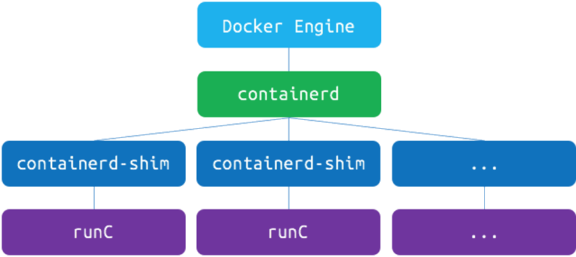
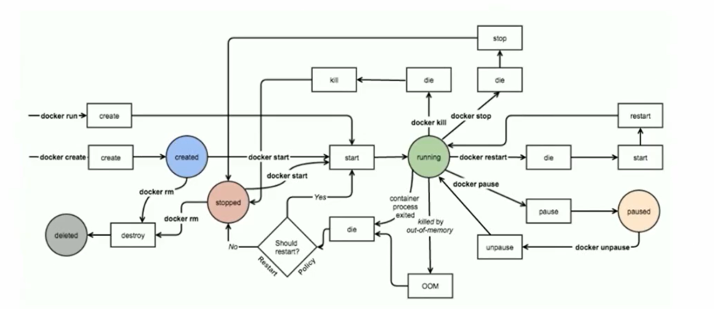

**九、补充**

# 1 、配置 Docker 远程访问

修改 /etc/docker/daemon.json 文件

```
"hosts": ["tcp://0.0.0.0:2375","unix://var/run/docker.sock"]
```

- example:

```
docker -H Ip:Port Command
```

# 2 、容器标准化结构

## 1）Open Container Initiative

- 由 Linux 基金会主导于 2015 年 6 月创立

- 旨在围绕容器格式和运行时定制一个开放的工业化标准

## 2）Contains two specifications

- the Runtime Specification ( runtime-spec )

- the Image Specification ( runtime-spec )

## 3）RUNC ？

是对于 OCI 标准的一个参考实现，是一个可以用于创建和运行容器的 CLI ( command-line

interface ) 工具。runC 直接与容器所依赖的 cgroup/linux kernel 等进行交互，负责为容器配置

cgroup/namespace 等启动容器所需的环境，创建启动容器的相关进程。

为了兼容 OCI 标准，Docker 也做了架构调整。将容器运行时相关的程序从 Docker daemon 剥离出

来，形成了 Containerd 。Containerd 向 Docker 提供运行容器的 API ，二者通过 grpc 进行交互。

Containerd 最后会通过 Runc 来实际运行容器

## 4）RUNC 架构图



# 3 、常见命令关联图



# 
