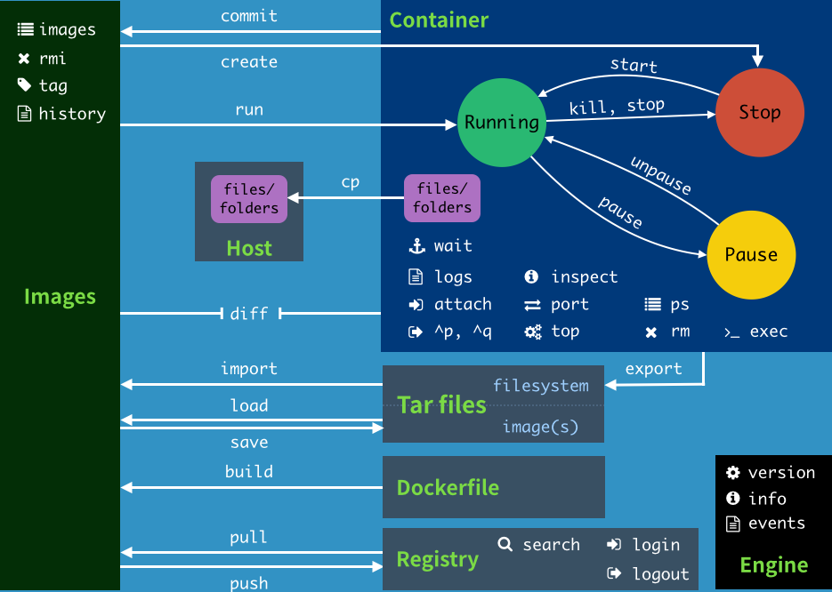
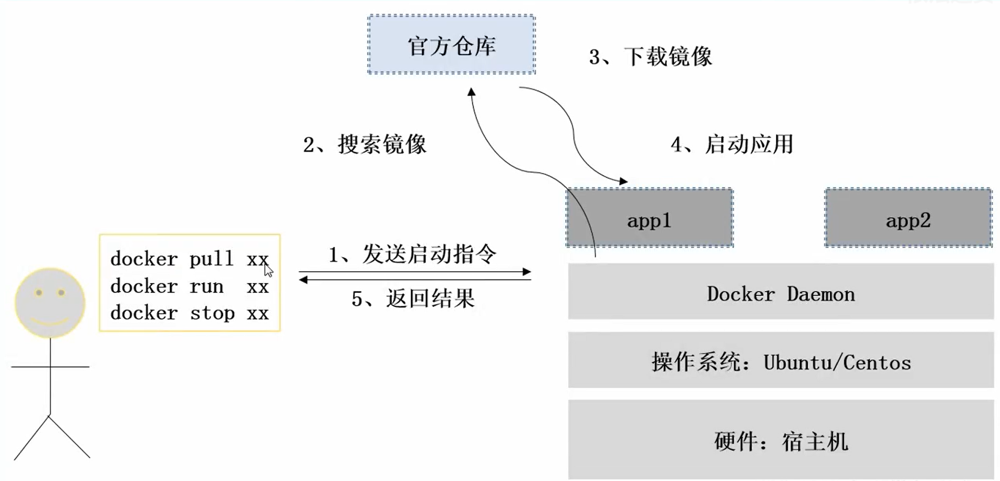

**一、Docker 简介**

# 1 、Docker 诞生

Docker 是 dotcloud 公司开源的一款产品 dotcloud 是 2010 年新成立的一家公司，主要基于 PAAS

( Platfrom as a Service ) 平台为开发者提供服务。2013 年 10 月 dotcloud 公司改名为 Docker 股份有限公司

# 2 、Docker 相关解释

-  Linux Container** 是一种内核虚拟化技术**，可以提供轻量级的虚拟化，以便隔离进程和资源，**是docker的底层实现技术**

-  Docker 是 **PAAS** 提供商 dotCloud 开源的一个基于 LXC 的高级容器引擎，源代码托管在Github 上, 基于 go 语言并遵从 Apache2.0      协议开源

-  Docker 设想是交付运行环境如同海运，OS 如同一个货轮，每一个在 OS 基础上的软件都如同一个集装箱，用户可以通过标准化手段自由组装运行环境，同时集装箱的内容可以由用户自定义，也可以由专业人员制造

# 3 、Docker 与传统虚拟化对比

# 4 、Docker 的构成

 Docker 仓库：[https://hub.docker.com](https://hub.docker.com)

 Docker 自身组件
	

# 5 、Docker 历经过程

## 1）Docker组件的工作方式

