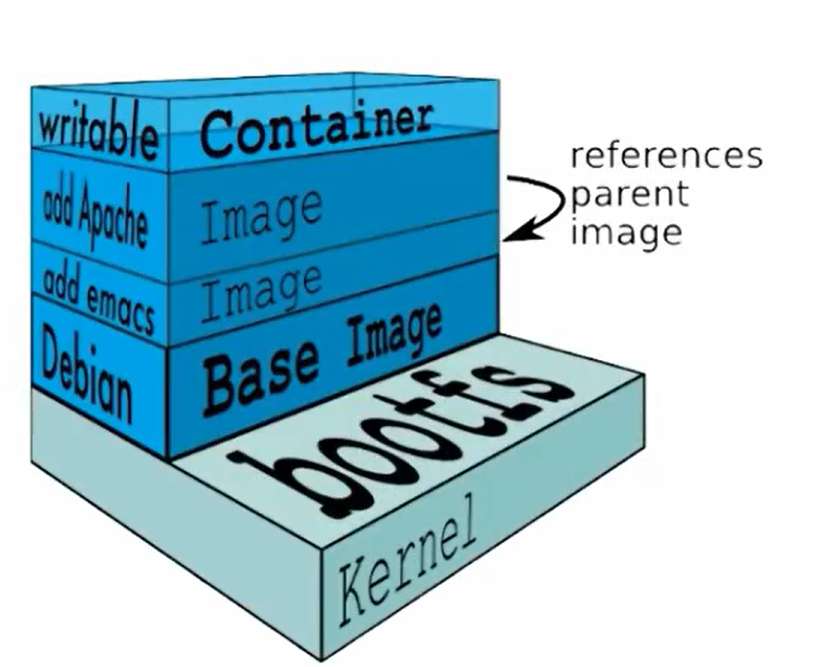

**四、Docker 镜像管理**

# 1 、镜像的特性

容器创建时需要指定镜像，每个镜像都由

**镜像的分层**

- **bootfs ：**用于系统引导的文件系统，包括 bootloader 和 kernel ，容器启动完成后会被卸载以节省内存资源

- **rootfs **：位于 bootfs 之上，表现为 Docker 容器的跟文件系统

- 传统模式中，系统启动时，内核挂载 rootfs 时会首先将其挂载为“只读”模式，完整性自检完成后将其挂载为读写模式

- **Docker 中，rootfs** 由内核挂载为“只读”模式，而后通过 UFS 技术挂载一个“**可写**”层

- **已有的分层只能读，不能修改**

- **上层镜像优先级大于底层镜像**



# 2 、容器转换为镜像

**条件：在容器内部，至少有一个工作在前台的守护进程**

```
docker commit CID xx.xx.xx
```

# 3 、Dockerfile

Dockfile 是一种被 Docker 程序解释的脚本，Dockerfile 由一条一条的指令组成，每条指令对应Linux 。 下面的一条命令。Docker 程序将这些 Dockerfile 指令翻译真正的 Linux 。 命令。Dockerfile 有自己书写格式和支持的命令，Docker 程序解决这些命令间的依赖关系，类似于 Makefile。 Docker 程序将读取 Dockerfile ，根据指令生成定制的 image

- dockerfile中也支持使用$引用变量的格式，就像是在shell脚本中一样使用。

```
ENV str="hello"
RUN echo $str
```

## 1）转换命令

```
docker build -t wangyang/jdk-tomcat ./  
```

## 2）Dockerfile 语法

### 1、FROM（指定基础 image）：

构建指令，必须指定且需要在 Dockerfile 其他指令的前面。后续的指令都依赖于该指令指定的 image。

FROM 指令指定的基础 image 可以是官方远程仓库中的，也可以位于本地仓库

- example：

```
FROM alpine        
FROM centos:7.2
FROM centos
```

### 2、MAINTAINER（用来指定镜像创建者信息）：

构建指令，用于将 image 的制作者相关的信息写入到 image 中。当我们对该 image 执行 docker inspect命令时，输出中有相应的字段记录该信息。

- example：

```
MAINTAINER wangyang "wangyang@itxdl.cn"
```

### 3、RUN（安装软件用）：

构建指令，RUN 可以运行任何被基础 image 支持的命令。如基础 image 选择了 Centos，那么软件管理部分只能使用 Centos 的包管理命令

- **RUN 指令并没有上下文关系。**

```
**RUN cd dir/**   
RUN pwd        #比如上一个RUN进入到了dir目录中,但是这里重新RUN的时候，还是在原来的位置，并没有在dir目录中
```

- example：

```
RUN cd /tmp && curl -L '
RUN ["/bin/bash", "-c", "echo hello"]
```

### 4、CMD（设置 container 启动时执行的操作）：

> **CMD ["echo","$str"]		****#这样的格式不能使用变量，如果要使用变量，需要使用一下格式：**
> **CMD echo $str**
> **  ****或者**
> **CMD ["/bin/sh","-c","echo $str"]	****#需要使用/bin/sh -c 这个指令执行相当于shell 用这样的方式，就可以使用变量了。**


设置指令，用于 container 启动时指定的操作。该操作可以是执行自定义脚本，也可以是执行系统命令。

该指令只能在文件中存在一次，如果有多个，则只执行最后一条

- example：

```
CMD echo “Hello, World!”
```

### 5、ENTRYPOINT（设置 container 启动时执行的操作）:

> **ENTRYPOINT ["echo","$str"]		****#这样的格式不能使用变量，如果要使用变量，需要使用一下格式：**
> **ENTRYPOINT echo $str**
> **  或者**
> **ENTRYPOINT ["/bin/sh","-c","echo $str"]	****#需要使用/bin/sh -c 这个指令执行相当于shell 用这样的方式，就可以使用变量了。**


设置指令，指定容器启动时执行的命令，可以多次设置，但是只有最后一个有效。

- example：**(entrpoint:入口点）**

```
ENTRYPOINT ls -l
```

#该指令的使用分为两种情况，一种是独自使用，另一种和 CMD 指令配合使用。当独自使用时，如果你还使用了 CMD 命令且 CMD 是一个完整的可执行的命令，那么 CMD 指令和 ENTRYPOINT 会互相覆盖只有最后一个 CMD 或者 ENTRYPOINT 有效，CMD 指令将不会被执行，只有 ENTRYPOINT 指令被执行

```
CMD echo “Hello, World!”
ENTRYPOINT ls -l
```

#另一种用法和 CMD 指令配合使用来指定 ENTRYPOINT 的默认参数，这时 CMD 指令不是一个完整

的可执行命令，仅仅是参数部分；ENTRYPOINT 指令只能使用 JSON 方式指定执行命令，而不能指定参数

```
FROM ubuntu
CMD ["-l"]
ENTRYPOINT ["/usr/bin/ls"]
```

### 6、USER（设置 container 容器的用户）：

设置指令，设置启动容器的用户，默认是 root 用户

- USER指令设置运行映像时要使用的用户名（或UID）以及可选的用户组（或GID），以及Dockerfile中USER后面所有RUN，CMD和ENTRYPOINT指令。

- 在构建和运行容器时，尽量减少使用root用户执行，很简单，权限过大，容易造成未知的错误。

- 所以使用USER 来指定一个用户，并用他去运行容器或构建镜像。

- 当需要将外部文件复制到镜像内部时，如果使用COPY  可以加上--chown=user:group  改变文件的属主，与属组。

- example：

```
USER daemon = ENTRYPOINT ["memcached", "-u", "daemon"]
USER 1000:1000    #也可使用ID号
COPY --chown=1000:1000   <src>  <dest>
```

### 7、EXPOSE（指定容器需要映射到宿主机器的端口）：

设置指令，该指令会将容器中的端口映射成宿主机器中的某个端口。当你需要访问容器的时候，可以不是用容器的 IP 地址而是使用宿主机器的 IP地址和映射后的端口。要完成整个操作需要两个步骤，首先在 Dockerfile 使用 EXPOSE 设置需要映射的容器端口，然后在运行容器的时候指定-p 选项加上 EXPOSE 设置的端口，这样 EXPOSE 设置的端口号会被随机映射成宿主机器中的一个端口号。也可以指定需要映射到宿主机器的那个端口，这时要确保宿主机器上的端口号没有被使用。EXPOSE 指令可以一次设置多个端口号，相应的运行容器的时候，可以配套的多次使用-p 选项。

example：

```
#映射一个端口
EXPOSE 22
EXPOSE 22/tcp
#相应的运行容器使用的命令
 docker run -p port1 image
#映射多个端口
EXPOSE port1 port2 port3
#相应的运行容器使用的命令
docker run -p port1 -p port2 -p port3 image
#还可以指定需要映射到宿主机器上的某个端口号
docker run -p host_port1:port1 -p host_port2:port2 -p host_port3:port3 image
```

### 8、ENV（用于设置环境变量）：构建指令，在 image 中设置一个环境变量

- example：

设置了后，后续的 RUN 命令都可以使用，container 启动后，可以通过 docker inspect 查看这个环

境变量，也可以通过在 docker run --env key=value 时设置或修改环境变量。假如你安装了 JAVA 程序，

需要设置 JAVA_HOME，那么可以在 Dockerfile 中这样写：

```
ENV JAVA_HOME=/path/to/java/dirent
```

### 9、ADD（从 src 复制文件到 container 的 dest 路径）

- example：

```
ADD <src> <dest>
    <src> 是相对被构建的源目录的相对路径，可以是文件或目录的路径，也可以是一个远程的文件 url;
    <dest> 是 container 中的绝对路径
```

### 10、COPY （从 src 复制文件到 container 的 dest 路径）

> 和ADD 类似，但是不能自动解压和远程下载


- --chown功能仅在用于构建Linux容器的Dockerfiles上受支持，而在Windows容器上不起作用

- COPY指令从 src 复制新文件或目录，并将它们添加到容器的文件系统中，路径为 dest 。

- 可以指定多个 src 资源，但是文件和目录的路径将被解释为相对于构建上下文的源。

- 每个 src 都可以包含通配符，并且匹配将使用Go的filepath.Match规则进行。

- example：

```
#COPY <src> <dest>
COPY hom* /mydir/ #当前上下文，以home开始的所有资源
COPY hom?.txt /mydir/ # ?匹配单个字符
COPY test.txt relativeDir/ # 目标路径如果设置为相对路径，则相对与 WORKDIR 开始
# 把 “test.txt” 添加到 <WORKDIR>/relativeDir/
COPY test.txt /absoluteDir/ #也可以使用绝对路径，复制到容器指定位置
#所有复制的新文件都是uid(0)/gid(0)的用户，可以使用--chown改变
COPY --chown=55:mygroup files* /somedir/
COPY --chown=bin files* /somedir/
COPY --chown=1 files* /somedir/
COPY --chown=10:11 files* /somedir/
```

### 10、VOLUME（指定挂载点）：

设置指令，使容器中的一个目录具有持久化存储数据的功能，该目录可以被容器本身使用，也可以共享给其他容器使用。我们知道容器使用的是 AUFS，这种文件系统不能持久化数据，当容器关闭后，所有的更改都会丢失。当容器中的应用有持久化数据的需求时可以Dockerfile 中使用该指令。

> **注意： VOLUME挂载之后，那么对挂载目录(文件)之后的所有操作都会失效。**
> **所以VOLUME 要在尽量靠后的时候使用。**


- examp：

```
FROM base
VOLUME ["/tmp/data"]
VOLUME /var/log  #可以直接写
VOLUME /var/log /var/db #可以挂载多个，空格分割多个
```

### 11、WORKDIR（切换目录）：

设置指令，可以多次切换(相当于 cd 命令)，对 RUN,CMD,ENTRYPOINT生效

example：

```
WORKDIR /p1 WORKDIR p2 RUN vim a.txt
```

### 12、ONBUILD（在子镜像中执行）：

ONBUILD 指定的命令在构建镜像时并不执行，而是在它的子镜像中执行

- example：

```
ONBUILD ADD . /app/src
ONBUILD RUN /usr/local/bin/python-build --dir /app/src
```

### 13、ARG

- ARG指令定义了一个变量，用户可以在构建时使用**--build-arg = **传递，docker build命令会将其传递

- 给构建器。

- **--build-arg **指定参数会覆盖Dockerfile 中指定的同名参数

- 如果用户指定了 未在Dockerfile中定义的构建参数 ，则构建会输出 警告 。

- ARG只在构建期有效，运行期无效

> 就是像是在给一个函数传递参数一样，这样通过不同的参数传递，就可以创建不同的镜像了。


```
ARG version=3.13.4
ARG key=value
```

# 4 、镜像的导出以及导入

```
导出：docker save -o xx.xx.xx xx.xx.xx.tar
导入：docker load -i xx.xx.xx.tar

```

# 5、DockerFile 案例

步骤：

1、创建一个文件夹（目录）

2、在文件夹（目录）中创建Dockerfile.文件（并编写）及其它文件

3、使用docker build命令构建镜像

4、使用构建的镜像启动容器

## docker build

```
docker build -t xxx -f dockerfile  ./    #./ 表示的是上下文环境，意思就是在构建镜像过程中使用到的所有资源均在当前目录下就可以找到了。
# 如果在构建竟像时使用到了某一个资源在在/root/目录下，那么使用的上下文环境的路径中一定要包含root目录，否则就会找不到该资源，比如：
    docker build -t xxx -f dockerfile /root/dockerfiles/  #这个上下文环境就包含了root目录，所以可以找到root目录下的资源。
```

## 5.1 构建httpd镜像

```
[root@server1 ~]# cat fd_httpd 
FROM  centos:7.9.2009
MAINTAINER hackwu
RUN yum install httpd httpd-devel -y&& echo "主页111" > /var/www/html/index.html
EXPOSE 80
CMD /usr/sbin/httpd -D FOREGROUND     #指定在前台运行
```

## 5.2 构建tomcat镜像

1,准备好tomcat需要的jdk,tomcat等软件包，还有配置好环境变量的startup.sh和shutdown.sh文件

```
[root@daniel dockerfile]#1s /dockerfile
apache-tomcat-9.0.14.tar.gz jdk-8u191-linux-x64.tar.gz shutdown.sh startup.sh
dockerfile_tomcat
在startup.sh和shutdown.sh文件最前面加上下面一段坏境变量配置
export JAVA_HOME=/usr/local/jdk1.8.0_191
export TOMCAT_HOME=/usr/local/tomcatI
export PATH=SJAVA_HOME/bin:STOMCAT_HOME/bin:SPATH
```

```
FROM centos
MAINTAINER daniel
WORKDIR /usr/local/
COPY jdk-8u191-linux-x64.tar.gz /usr/local/
COPY apache-tomcat-9.0.14.tar.gz /usr/local/
RUN tar xf jdk-8u191-linux-x64.tar.gz -C /usr/local/&&  \
    tar xf apache-tomcat-9.0.14.tar.gz -c /usr/local/&mv /usr/local/apache-tomcat-9.0.14/ /usr/local/tomcat
COPY startup.sh /usr/local/tomcat/bin/startup.sh
COPY shutdown.sh /usr/local/tomcat/bin/shutdown.sh
RUN chmod 755 /usr/local/tomcat/bin/startup.sh &chmod 755 /usr/local/tomcat/bin/shutdown.sh
EXPOSE 8080
CMD ["/usr/local/tomcat/bin/startup.sh"]
```

## 5.3 构建Tomcat 

- dockerfile_tomcat

```
FROM centos:7.6.1810
MAINTAINER daniel
RUN rm -rf /etc/yum.repos.d/*
ADD local.repo /etc/yum.repos.d/local.repo
RUN yum install mariadb-server mariadb-y
COPY mariadb.sh
RUN sh mariadb.sh
EXPOSE 3306
CMD mysqld_safe --default-file=/etc/my.cnf
```

- mariadb.sh

```
#!/bin/bash
mysql_install_db --datadir=/var/lib/mysql/--user=mysql
sleep 3
mysqld_safe --defaults-file=/etc/my.cnf
sleep 3
mysql -e "grant all privileges on *to root'@'%'identified by '123';
mysql -e "grant all privileges on *.to abc'@'%'identified by '123';
mysql -e "flush privileges;
```

# 7、multi-stage builds（多阶段构建）

> **1、多阶段构建，就是在一个Dockerfile文件中，创建多个From.**
> **      from xxx as xxxx		****#as xxx 为本阶段创建一个别名，便于下一阶段的引用。**
> **2、每一个From 就代表一个阶段，然后只有最后一个From 才是用于构建真正的应用镜像的。**
> **3、之前的所有的From 都是用于准备资源的，然后后面的资源会将创建的资源复制过去，剩余的此阶段附带的环境就不用再考虑了，由此实现减小镜像的大小。**
> **4、所以需要使用****COPY --from=xxx   <src> <dest> ****命令，将之前阶段准备的资源，复制到阶段。**
> **xxx****表示上一阶段的别名**
> **<src> **** 就是上一阶段中资源的路径**
> **<dest>  ****是本阶段中的路径**


## 7.1、使用

[https://docs.docker.com/develop/develop-images/multistage-build/](https://docs.docker.com/develop/develop-images/multistage-build/)

解决：如何让一个镜像变得更小; 多阶段构建的典型示例

```
### 我们如何打包一个Java镜像
FROM maven
WORKDIR /app
COPY . .
RUN mvn clean package
COPY /app/target/*.jar /app/app.jar
ENTRYPOINT java -jar app.jar
## 这样的镜像有多大？
## 我们最小做到多大？？
```

## 7.2 生成实例

```
#以下所有前提 保证Dockerfile和项目在同一个文件夹 
# 第一阶段：环境构建;
FROM maven:3.5.0-jdk-8-alpine AS builder
WORKDIR /app
ADD ./ /app
RUN mvn clean package -Dmaven.test.skip=true
# 第二阶段，最小运行时环境，只需要jre
FROM openjdk:8-jre-alpine
# 修改时区
RUN ln -sf /usr/share/zoneinfo/Asia/Shanghai /etc/localtime && echo
'Asia/Shanghai' >/etc/timezone
LABEL maintainer="534096094@qq.com"
# 从上一个阶段复制内容
COPY --from=builder /app/target/*.jar /app.jar
ENV JAVA_OPTS=""
ENV PARAMS=""
# 运行jar包
ENTRYPOINT [ "sh", "-c", "java -Djava.security.egd=file:/dev/./urandom
$JAVA_OPTS -jar /app.jar $PARAMS" ]
```

# 8、Images瘦身实践

- 选择最小的基础镜像

- 合并RUN环节的所有指令，少生成一些层

- RUN期间可能安装其他程序会生成临时缓存，要自行删除。如：

```
RUN apt-get update && apt-get install -y \
bzr \
cvs \
git \
mercurial \
subversion \
&& rm -rf /var/lib/apt/lists/*
```

- 使用 **.dockerignore** 文件，排除上下文中无需参与构建的资源

- 使用多阶段构建

- 合理使用构建缓存加速构建。**--no-cache**