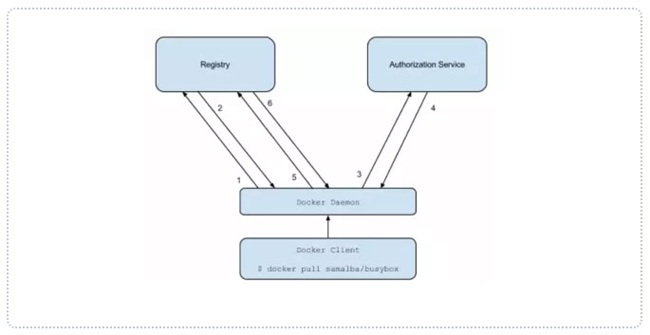
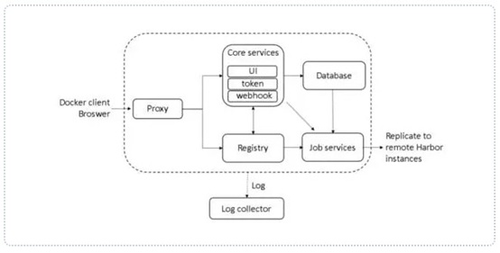
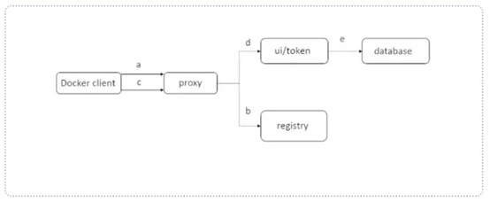

**五、镜像仓库构建**

# 1 、官方仓库构建方式

## 1）仓库服务器配置：

```
docker run -d -v /opt/registry:/var/lib/registry -p 5000:5000 --restart=always registry
vim /etc/docker/daemon.json
{
"insecure-registries": ["10.10.10.11:5000"]     
}
systemctl restart docker  #重启服务
[root@server1 ~]# docker tag  nginx:latest  192.168.23.34:5000/nginx:v1.0  #打上标签，上传时，会上传到标签对应的地址中
[root@server1 ~]# docker images  
REPOSITORY                 TAG       IMAGE ID       CREATED      SIZE
nginx                      latest    f2f70adc5d89   2 days ago   142MB
192.168.23.34:5000/nginx   v1.0      f2f70adc5d89   2 days ago   142MB
registry                   latest    946ebb70ae89   3 days ago   24.2MB
[root@server1 ~]# docker push  192.168.23.34:5000/nginx:v1.0  #上传镜像
The push refers to repository [192.168.23.34:5000/nginx]
24037b645d66: Pushed 
d00147ef6763: Pushed 
2793e885dc34: Pushed 
8b8ecda1d12d: Pushed 
30c00b5281a1: Pushed 
3a626bb08c24: Pushed 
v1.0: digest: sha256:1a763cbd30ef4dbc7f8e3fa2e6670fd726f4bddb0ef58868a243c0cb8b35cde1 size: 1570
[root@server1 ~]# curl  -XGET http://192.168.23.34:5000/v2/_catalog   #查看仓库中已经存在的镜像
{"repositories":["httpd","nginx"]}
```

## 2）客户机设置：

```
vim /etc/docker/daemon.json     #文件配置
{                                  
"insecure-registries": ["10.10.10.11:5000"]   #如果有多个内容，用“，”隔开
}
systemctl daemon-reload
systemclt restart   docker
docker pull 192.168.23.34:5000/nginx:v1.0 拉取镜像
```

# 2 、Harbor 构建

**Harbor - 企业级 Docker 私有仓库**

## 1)安装底层需求

Python 应该是 2.7 或更高版本

Docker 引擎应为 1.10 或更高版本

Docker Compose 需要为 1.6.0 或更高版本

```
yum install -y epel
wget -O /etc/yum.repos.d/docker-ce.repo https://mirrors.aliyun.com/docker-ce/linux/centos/docker-ce.repo
yum install -y docker-ce docker-compose
```

## 2)、 Harbor 安装： Harbor 官方地址： 

### 1 、解压软件包：

```
#[root@server1 ~]# wget https://github.com/vmware/harbor/releases/download/v1.2.0/harbor-offline-installer-v1.2.0.tgz
[root@server1 ~]# https://github.com/goharbor/harbor/releases/download/v2.5.4/harbor-offline-installer-v2.5.4.tgz
[root@server1 ~]# tar -zxvf harbor-offline-installer-v2.3.1.tgz 
[root@server1 ~]# [root@server1 ~]# mv harbor /usr/local
```

### 2 、配置 harbor.cfg

a 、必选参数

```
hostname ：          #目标的主机名或者完全限定域名
harbor_admin_password: 123456    #harbor的登录密码
ui_url_protocol ：   #http 或 https 。默认为 http
db_password ：        #用于 db_auth 的 MySQL 数据库的根密码。更改此密码进行任何生产用途
max_job_workers ：    #（默认值为 3 ）作业服务中的复制工作人员的最大数量。对于每个映像复制作业，
                      #工作人员将存储库的所有标签同步到远程目标。增加此数字允许系统中更多的并发复制作业。但是，由于每个工
                      #作人员都会消耗一定数量的网络 / CPU / IO 资源，请根据主机的硬件资源，仔细选择该属性的值
customize_crt ：      #（ on 或 off 。默认为 on ）当此属性打开时， prepare 脚本将为注册表的令牌的生成 / 验证创建私钥和根证书
ssl_cert ：           #SSL 证书的路径，仅当协议设置为 https 时才应用
ssl_cert_key ：       #SSL 密钥的路径，仅当协议设置为 https 时才应用
secretkey_path ：      #用于在复制策略中加密或解密远程注册表的密码的密钥路径
```

### 3 、创建 https 证书以及配置相关目录权限

```
openssl genrsa -des3 -out server.key 2048      #生成秘钥
openssl req -new -key server.key -out server.csr #生成证书
cp server.key server.key.org     #给秘钥做个备份
openssl rsa -in server.key.org -out server.key  #将秘钥退掉，这样证书没有秘钥也可以使用
openssl x509 -req -days 365 -in server.csr -signkey server.key -out server.crt
mkdir /data/cert -p
mv server.* /data/crt/
chmod -R 777 /data/cert
```

### 4 、运行脚本进行安装

**如果使用了域名，需要修改物理机的hosts文件**

```
[root@server1 crt]# cd /usr/local/harbor/
[root@server1 harbor]# ls
common.sh  harbor.v2.3.1.tar.gz  harbor.yml.tmpl  install.sh  LICENSE  prepare
# install是安装脚本，harbor.yml.tmpl 是配置模板; 
#./repare 可以从新加载harbor的配置文件包括harbor.yml
[root@server1 harbor]# cp harbor.yml.tmpl  harbor.yml
#将模板拷贝成harbor.yml 当执行安装脚本时，依照harbor.yml里的内容进行配置
[root@server1 harbor]# vim harbor.yml 
hostname: hab.hackwu.cn   #修改域名，如果没有域名，填写本地IP
http:
  # HTTP的端口，默认为80.如果启用了HTTPS，则此端口将重定向到HTTPS端口
   port: 80

# https related config
https:                            #如果不使用https，请将https的相关内容注释或者删除
  # HTTPS端口港口，默认为443
  port: 443
  # nginx的证书和关键文件的路径
  certificate: /data/crt         #如果产生了秘钥文件，记得修改此文件夹
  private_key: /data/crt

harbor_admin_password: 123456    #管理员的初始密码
[root@server1 harbor]# ./install.sh  #执行安装
```

### 5 、访问测试

[https://reg.yourdomain.com](https://reg.yourdomain.com) 的管理员门户（将 reg.yourdomain.com 更改为您的主机名 harbor.cfg ）。请注意，默

认管理员用户名 / 密码为 admin / Harbor12345

### 6 、上传镜像进行上传测试

#### a 、指定镜像仓库地址

```shell
vim /etc/hosts   #添加域名
vim /etc/docker/daemon.json
{
    "insecure-registries": ["hub.hackwu.cn"]  
    #"insecure-registries": ["192.168.23.10"] 
    #docker默认使用https协议，这里指定使用insecure（非安全的方式），意思是用http协议就行了。
}
systemctl daemon-reload
systemctl restart  docker  #重启docker进程
[root@server1 harbor]# docker images  
#这时候你可以看见多出很多镜像，这是安装harbor时，程序安装的；
```

#### b 、下载测试镜像

```
docker pull hello-world
```

#### c 、给镜像重新打标签

```
docker tag hello-world serverip/hello-world:latest
```

#### d 、登录进行上传

```
docker login hub.hackwu.cn 
#如果不写仓库的ip，默认的是官方的仓库地址
```

### 7 、其它 Docker 客户端下载测试

#### a 、指定镜像仓库地址

```
vim /etc/docker/daemon.json
{
"insecure-registries": ["serverip"]
}
```

### b 、下载测试镜像

```
docker pull serverip/hello-world:latest
```

## 3)、 Harbor 原理说明

### 1 、软件资源介绍

Harbor 是 VMware 公司开源的企业级 DockerRegistry 项目，项目地址为 [https://github.com/vmware/harbor](https://github.com/vmware/harbor) 。其目

标是帮助用户迅速搭建一个企业级的 Dockerregistry 服务。它以 Docker 公司开源的 registry 为基础，提供了管理 UI ，

基于角色的访问控制 (Role Based Access Control) ， AD/LDAP 集成、以及审计日志 (Auditlogging) 等企业用户需求的功

能，同时还原生支持中文。 Harbor 的每个组件都是以 Docker 容器的形式构建的，使用 Docker Compose 来对它进行部

署。用于部署 Harbor 的 Docker Compose 模板位于 /Deployer/docker-compose.yml ，由 5 个容器组成，这几个容器通过

Docker link 的形式连接在一起，在容器之间通过容器名字互相访问。对终端用户而言，只需要暴露 proxy （ 即

Nginx ）的服务端口

```
Proxy ：    #由 Nginx 服务器构成的反向代理。
Registry ： #由 Docker 官方的开源 registry 镜像构成的容器实例。
UI ：       #即架构中的 core services ， 构成此容器的代码是 Harbor 项目的主体。
MySQL ：    #由官方 MySQL 镜像构成的数据库容器。
Log ：      #运行着 rsyslogd 的容器，通过 log-driver 的形式收集其他容器的日志
```

### 2 、 Harbor 特性

- a 、**基于角色控制**：用户和仓库都是基于项目进行组织的， 而用户基于项目可以拥有不同的权限

- b 、**基于镜像的复制策略**：镜像可以在多个 Harbor 实例之间进行复制

- c 、支持 LDAP ： Harbor 的用户授权可以使用已经存在 LDAP 用户

- d 、镜像删除 & 垃圾回收： Image 可以被删除并且回收 Image 占用的空间，绝大部分的用户操作 API ， 方便用户对系统进行扩展

- e 、**用户 UI **：用户可以轻松的浏览、搜索镜像仓库以及对项目进行管理

- f 、**轻松的部署功能**： Harbor 提供了 online 、 offline 安装，除此之外还提供了 virtualappliance 安装

- g 、 Harbor 和 docker registry 关系： Harbor 实质上是对 docker registry 做了封装，扩展了自己的业务模块



### 3 、 Harbor 认证过程

- a 、 dockerdaemon 从 docker registry 拉取镜像。

- b 、如果 dockerregistry 需要进行授权时， registry 将会返回 401 Unauthorized 响应，同时在响应中包含了 dockerclient 

             如何进行认证  的信息。

- c 、 dockerclient 根据 registry 返回的信息，向 auth server 发送请求获取认证 token 。

- d 、 auth server 则根据自己的业务实现去验证提交的用户信息是否存符合业务要求。

- e 、用户数据仓库返回用户的相关信息。

- f 、 auth server 将会根据查询的用户信息，生成 token 令牌，以及当前用户所具有的相关权限信息 . 上述就是

            完整的授权过程 . 当用户完成上述过程以后便可以执行相关的 pull/push 操作。认证信息会每次都带在请求头中

#### Harbor 整体架构



### 4 、 Harbor 认证流程

- a 、首先，请求被代理容器监听拦截，并跳转到指定的认证服务器。

- b 、 如果认证服务器配置了权限认证，则会返回 401 。通知 dockerclient 在特定的请求中需要带上一个合法的

    token 。而认证的逻辑地址则指向架构图中的 core services 。

- c 、 当 docker client 接受到错误 code 。 client 就会发送认证请求 ( 带有用户名和密码 ) 到 coreservices 进行 basic

     auth 认证。

- d 、 当 C 的请求发送给 ngnix 以后， ngnix 会根据配置的认证地址将带有用户名和密码的请求发送到 core serivces 。

- e 、 coreservices 获取用户名和密码以后对用户信息进行认证 ( 自己的数据库或者介入 LDAP 都可以 ) 。成功以

     后，返回认证成功的信息

#### Harbor 认证流程



#### 
