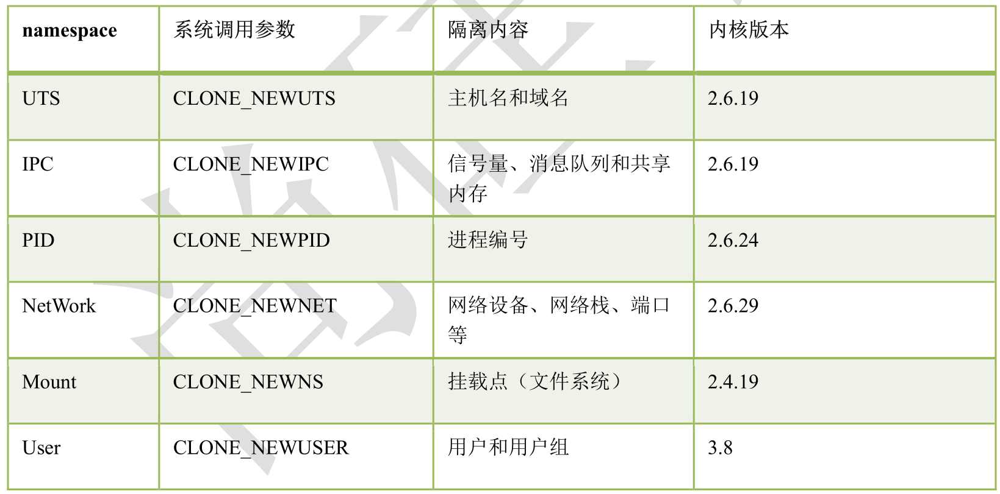
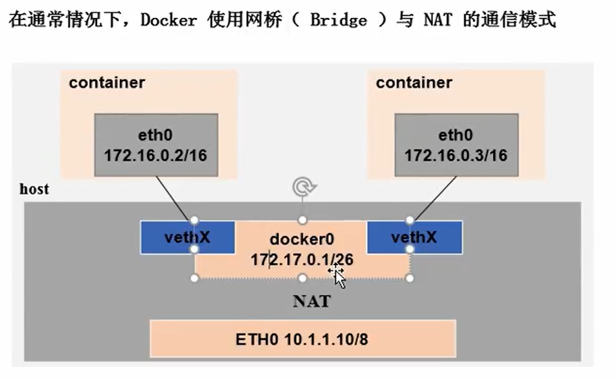

**六、Docker 中的网络**

# 1 、Linux 内核中的 Name Space



# 2 、Docker 网络通讯示意



# 3 、Docker 中的防火墙规则

## 1）容器访问外部网络

```
iptables -t nat -A POSTROUTING -s 172.17.0.0/16 -o docker0 -j MASQUERADE
```

## 2）外部网络访问容器

```
docker run -d -p 80:80 apache  
#下面是端口映射的原理
iptables -t nat -A PREROUTING -m addrtype --dst-type LOCAL -j DOCKER
iptables -t nat -A DOCKER ! -i docker0 -p tcp -m tcp --dport 80 -j DNAT --to-destination 172.17.0.2:80
```

# 4 、Docker 网络的修改

## 1）Docker 进程网络修改

```
-b, --bridge= “ ” 指定 Docker 使用的网桥设备，默认情况下 Docker 会自动创建和使用 docker0 网桥设备，通过此参数可以使用已经存在的设备
    --bip 指定 Docker0 的 IP 和掩码，使用标准的 CIDR 形式，如 10.10.10.10/24
    --dns 配置容器的 DNS ，在启动 Docker 进程是添加，所有容器全部生效
Docker 容器网络修改
    --dns 用于指定启动的容器的 DNS
    --network 用于指定容器的网络通讯方式，有以下四个值
         bridge ：Docker 默认方式，网桥模式 ,相当于虚拟机中的NAT模式
         none ：容器没有网络栈
         container ：使用其它容器的网络栈，Docker 容器会加入其它容器的 network namespace
         host ：表示容器使用 Host 的网络，没有自己独立的网络栈。容器可以完全访问 Host 的网络，不安全 。和虚拟机的ip一模一样。
docker run --name httpd --network=container:nginx  -d httpd_image   #让容器httpd的ip和容器nginx的ip一样。
docker network inspect bridge    #查看网络模式的信息
```

# 5 、端口的暴露方式

-p / P 选项的使用格式

> **-p :<ContainerPort> 将制定的容器端口映射至主机所有地址的一个动态端口-p <HostPort>:<ContainerPort> ：映射至指定的主机端口-p <IP>::<ContainerPort> ：映射至指定的主机的 IP 的动态端口-p <IP>:<HostPort>:<ContainerPort> ：映射至指定的主机 IP 的主机端口-P （大）：暴露所需要的所有端口**


```
```

# 6 、网络隔离

## 1）基础命令说明

**(**

```
docker network ls 查看当前可用的网络类型
docker network create -d 类型 网络空间名称
```

## 2）类型分为：

```
overlay network
bridge network
```

## 3）使用网络名字空间进行隔离代码记录

```shell
[root@server1 ~]# docker network create -d bridge  lamp     
7262877d8e153966430bb4f25fe1772f6ec3d613f9a0f1a00a685e17acf4331d
#创建了一个名为lamp的网络命名空间
[root@server1 ~]# docker network create -d bridge  lmmp
bbdc4f40a6fccf226870f6b8aef4c94e88fd1e2773a6b84552172cee803c3bf5
#创建了一个名为lmmp的网络命名空间
[root@server1 ~]# docker network  ls  #查看已有的网络命名空间
NETWORK ID     NAME            DRIVER    SCOPE
83f026ae48b1   bridge          bridge    local
53c72693f8f3   host            host      local
7262877d8e15   lamp            bridge    local    #增加了lamp
bbdc4f40a6fc   lmmp            bridge    local    #增加了mmp
6707a8bbc556   none            null      local
docker network create -d bridge --subnet "172.26.0.0/16" --gateway "172.26.0.1" my-bridge-network
docker run -d --network=my-bridge-network --name test1 hub.c.163.com/public/centos:6.7-tools
docker run -d --name test2 hub.c.163.com/public/centos:6.7-tools
```

## 4）使容器配置上独立 IP 进行通讯

### A 、配置真实网桥

```
[root@localhost network-scripts]# vi ifcfg-eth0
DEVICE=eth0
HWADDR=00:0C:29:06:A2:35
TYPE=Ethernet
UUID=34b706cc-aa46-4be3-91fc-d1f48c301f23
ONBOOT=yes
BRIDGE=br0
NM_CONTROLLED=yes
BOOTPROTO=static
[root@localhost network-scripts]# vi ifcfg-br0
// 改成这样
DEVICE=br0
TYPE=Bridge
ONBOOT=yes
BOOTPROTO=static
IPADDR=192.168.216.131
NETMASK=255.255.255.0
GATEWAY=192.168.216.2

DNS=8.8.8.8
```

### B 、使用工具分配地址

```shell
[root@localhost network-scripts]# yum install -y git
[root@localhost network-scripts]# git clone https://github.com/jpetazzo/pipework
[root@localhost network-scripts]# cp pipework/pipework /usr/local/bin/
[root@localhost network-scripts]# chmod a+x /usr/local/bin/pipework
[root@localhost network-scripts]# docker run --netwrok=none --name=f1 -p 80:80 centos-6-x86 bash
[root@localhost network-scripts]# pipework br0 fl 192.168.216.135/24
```

# 7、跨docker host网络通信（就是两台同网段的虚拟机内的容器进行通信）

不同的宿主机上的容器通过映射端口，然后通过两台宿主机的IP和映射的端口来通迅。但这样做是利用了宿主机的网络，在某些场景并不方便。

能不能建立跨宿主机之间的网络，让容器使用自己的IP就可以通迅呢？答案是肯定的，而且方案也有很多种：有dockerl原生的overlay、macvlan和第三方方案flannel、.weave、calico等，

这里我们重点介绍flannel参考：https://coreos.com/blog/introducing-rudder.html

## 7.1flannel介绍

flannel是kubernetes[kuba'netis]默认提供网络插件，由CoreOS团队设计flannel3实质上是一种“覆盖网络(overlay network)”,也就是将TCP数据包装在另一种网络包里面进行路由转发和通信，目前已经支持UDP、VXLAN、AWS VPC和GCE路由等数据转发方式。

默认的节点间数据通信方式是UDP转发，在Flannel的GitHub页面有如下的一张原理图。

## 7.2 实验过程

- **配置宿主机1**

第1步：在docker宿主机1上（主机名vm3)安装etcd,flannel,,docker

```
[root@vm3 ~]yum install etcd flannel docker-ce -y
```

第2步：在docker宿主机1上配置etcd服务并启动

```shell
[root@vm3 ~]vir /etc/etcd/etcd.conf
6 ETCD_LISTEN_CLIENT_URLS="
[root@vm3 ~]systemctl start etcd
[root@vm3 ~]systemctl enable etcd
```

第3步：在docker宿主机1上配置flanneld服务，创建网络，并启动服务

```
[root@vm3 ~]vim /etc/sysconfig/flanneld
4 FLANNEL_ETCD_ENDPOINTS="http://10.1.1.13:2379"    #注意：这里IP改为etcd服务IP
#创建一个虚拟网络（我这里创建172.18.0.0/16）
[root@vm3 ~] etcdctl mk //atomic.io/network/config '{"Network":"172.18.0.0/16"}'
{"Network":"172.18.0.0/16"}
[root@vm3 ~] systemctl start flanneld.service
[rootdvm3 ~]cat /run/flannel/subnet.env
FLANNEL NETWORK=172.18.0.0/16
FLANNEL SUBNET=172.18.68.1/24
FLANNEL MTU=1472
FLANNEL IPMASO=false
```

第4步：在docker宿主机1上关联docker0网络与flannel0网络，启动docker服务，并验证网络

```
[root@vm3 ~]systemctl start docker        #先启动docker才会产生/etc/docker/目录
[root@vm3 -]vim /etc/docker/daemon.json
{
    "bip":"172.18.86.1/24",
    "mtu":1472
}
说明：·bip    边界IP,和/run/f1anne1/subnet.env配置文件里的对应。
mtu网络最大传输单元，也和/run/f1anne1/subnet.env配置文件里的对应
这里必须要重肩docker服务；香则上面创建的f1anne1网络不能生效
[root@vm3 ~]systemctl restart docker
[root@vm3 ~]systemct1 enable docker
[root@vm3 ~]    ip a
3: docker0: <BROADCAST,MULTICAST,UP,LOWER_UP> mtu 1472 qdisc noqueue state UP group default 
    link/ether 02:42:dd:6d:69:05 brd ff:ff:ff:ff:ff:ff
    inet 172.18.68.1/24 brd 172.20.55.255 scope global docker0    
    #如上可看见172.18.68.1 ip已经生效
```

- **配置宿主机2**

第5步：在docker宿主机2上（主机名vm4)安装flannel,docker

```
[root@vm4 ~]yum install flannel docker-ce -y
```

第6步：在docker宿主机2上配置flanneld服务，并启动服务

```
[root@vm4 ~]vim /etc/sysconfig/flanneld
4 FLANNEL_ETCD_ENDPOINTS="
[root@vm4 ~]systemctl start flanneld
[root@vm4 ~]systemctl enable flanneld
验证分配的网络
[root@vm4 ~]cat /run/flannel/subnet.env
FLANNEL_NETWORK=172.18.0.0/16
FLANNEL_SUBNET=172.18.42.1/24
FLANNEL_MTU=1472
FLANNEL_IPMASQ=false
```

第7步：在docker宿主机2上启动docker服务，并验证网络

```
[root@vm4 ~]systemctl start docker    #先启动docker才会产生/etc/docker/目录
[root@vm4 ~]vim /etc/docker/daemon.json
{
    "bip":"172.18.42.1/24",
    "mtu":1472
}
[root@vm4 ~]systemctl restart docker
[root@vm3 ~]    ip a
3: docker0: <BROADCAST,MULTICAST,UP,LOWER_UP> mtu 1472 qdisc noqueue state UP group default 
    link/ether 02:42:dd:6d:69:05 brd ff:ff:ff:ff:ff:ff
    inet172.18.42.1/24 brd 172.18.42.255 scope global docker0    
    #如上可看见172.18.42.1/24 ip已经生效
```

## 7.3 测试

- 两台宿主机同时下拉镜像busybox(此镜像内，封装了各种centos底层操作命令)

```
docker pull busybox
docker run --name d1 -itd busybox /bin/sh
```

- 然后在容器内，相互ping 容器的ip,就可以发现竟然能ping通。

```
宿主机1
[root@vm3 ~]  docker run --name d1 -itd busybox /bin/sh
/ # ping 172.18.42.1    #ping宿主机2容器的Ip
PING 172.20.55.1 (172.20.55.1): 56 data bytes
64 bytes from 172.20.55.1: seq=0 ttl=61 time=1.933 ms
64 bytes from 172.20.55.1: seq=1 ttl=61 time=0.623 ms
宿主机2
[root@vm3 ~]  docker run --name d1 -itd busybox /bin/sh
/ # ping 172.18.68.1              #ping宿主机1容器的Ip
PING 172.20.55.1 (172.20.55.1): 56 data bytes
64 bytes from 172.20.55.1: seq=0 ttl=61 time=1.933 ms
64 bytes from 172.20.55.1: seq=1 ttl=61 time=0.623 ms
```