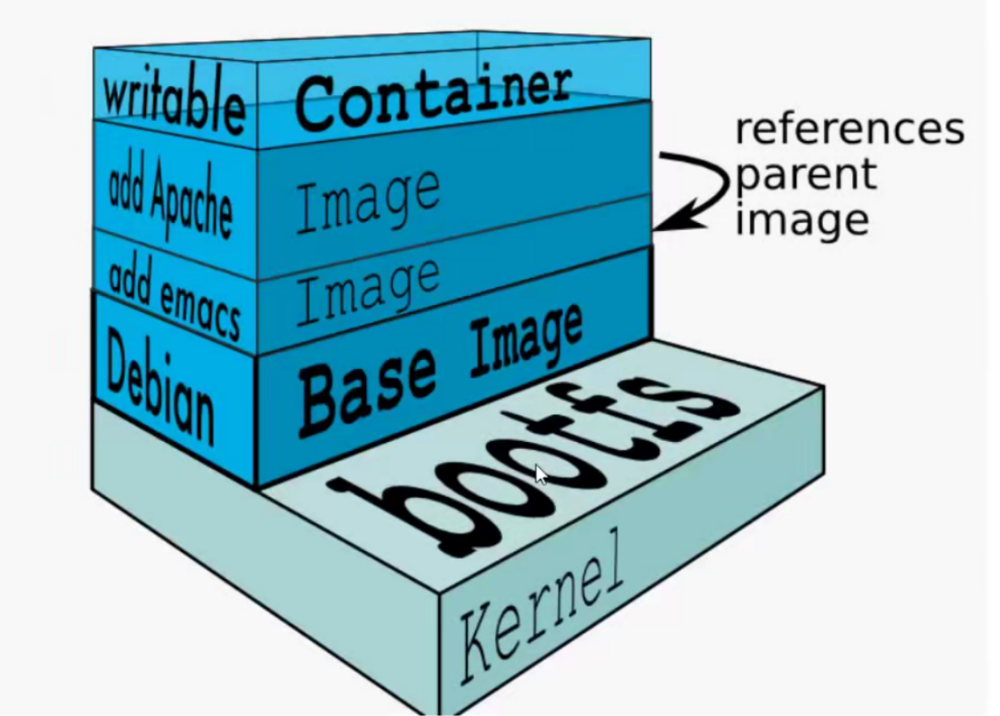
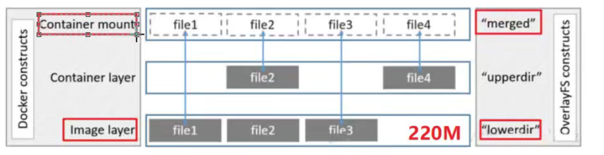
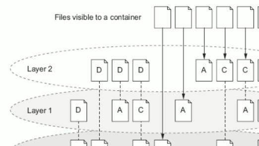
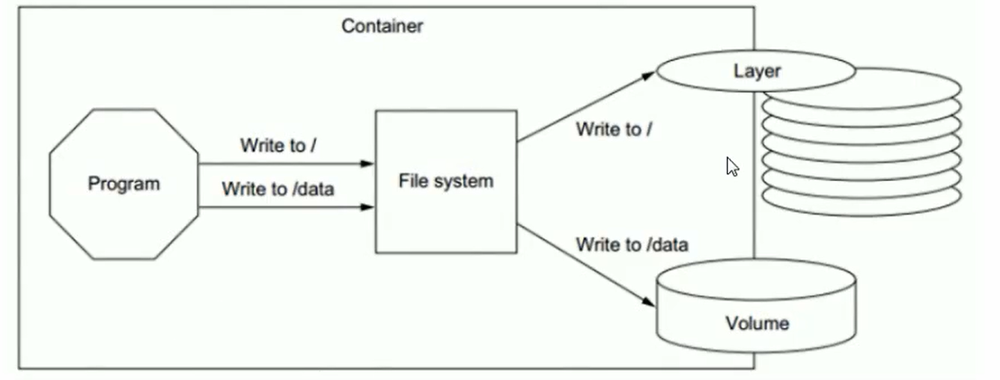
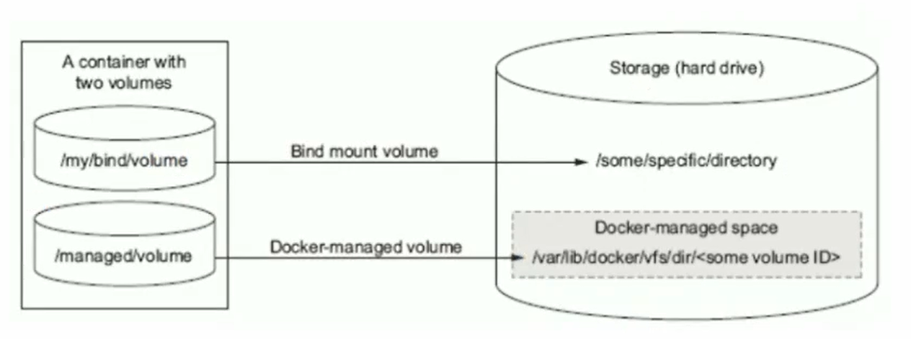
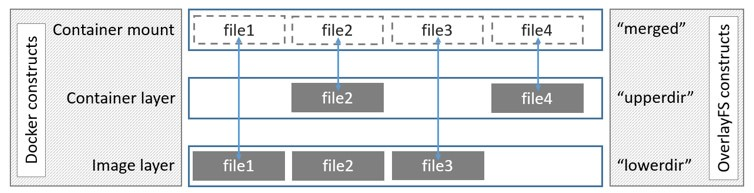

**七、数据存储**

# 1、写时复制与用时分配

通过上面的学习,我们知道了一个镜像可以跑多个容器,如果每个容器都去复制一份镜像内的文件系统,那么将会占用大量的存储空间。docker使用了写时复制

- 写时复制:

- 写时复制技术可以让多个容器共一个镜又件系统，所有效据都人镜像中读取

- 只有当要对文件进行写操作时，才从镜像里把要写的文件复制到自己的文件系统进行修改。所以无论有多少

- 个容器共享同一个镜像，所做的写操作都是对从镜像中复制到自己的文件系统中的复本上进行，并不会修改镜像的源文件

- 多个容器操作同一个文件，会在每个容器的文件系统里生成一个复本，每个容器修改的都是自己的复本，相互隔离，相互不影响

- 用时分配:

- 启动一个容器，并不会为这个容器预分配一些磁盘空间，而是当有新文件写入时，才按需分配新空间

# 2、联合文件系统

联合文件系统（UnionFS)就是把不同物理位置的目录合并mount到同一个目录中.

比如你可以将一个光盘与一个硬盘上的日录联合到一起 对只违的光盘文件进行修改修改的文件不存放回光盘进行覆盖,而是存放到硬盘目录。这样做达到了不影响光盘原数据,而修改的目的。

思考:把光盘看作是docker里的image,而硬盘目录看作是container,你再想想看?

docker就支持aufs和overlay两种联合文件系统。

## 2.1 aufs

Docker最开始采用AUFS作为文件系统，也得益于AUFS分层的概念，实现了多个Container可以共享同一个image。

aufs(Another UnionFS)，后来叫AIternative UnionFS，后来可能觉得不够霸气，叫成Advance UnionFS

Docker最开始采用AUFS作为文件系统，也得益于AUFS分层的概念，实现了多个Container可以共享同一个image



## 2.2 Overlay

Overlav是Linux内核3.18后支持的(当前3.10内核加载 口以使）也是—和Union FS.和AUFS的多层不

同的是Overlay只有两层:一个upper文件系统和一个lower文件系统，分别代表Docker的容器层和镜像层..

OverlayFS底层目录称为lowerdir 高层目录称为upperdir。合并统一视图称为merged。当需要修改一个文件时，使用cow将文件从只读的Lower复制到可写的Upper进行修改，结果也保存在Upper层。在Docker中，底下的只读层就是image，可写层就是Container

下图分层图，镜像层是lowdir，容器层是upperdir,统一的视图层是merged层.

> **镜像和容器存放的目录为/var/lib/docker/overlay2/**


视图层就是给用户提供了一个统一的视角，隐藏了多个层的复杂性，对用户来说只存在一个文件系统。



从上图中可以看到:

- 如果upperdir和lowerdir有同名文件时会用upperdir的文件

- 读文件的时候，文件不在upperdir则从lowerdir读

- 如果写的文件不在uppderdir在lowerdir,则从lowerdir里面copy到upperdir。

- 不管文件多大,copy完再写,删除或者重命名镜像层的文件都只是在容器层生成whiteout文件标志(标记为删除,并不是真的删除)

# 1 、数据卷特性

- Docker 镜像由多个只读层叠加而成，启动容器时，Docker 会加载只读镜像层并在镜像栈顶部添加一个读写层

- 如果运行中的容器修改了现有的一个已经存在的文件，那么该文件将会从读写层下面的的只读层复

制到读写层，该文件的只读版本仍然存在，只是已经被读写层中该文件的副本所隐藏，次即“

**（写时复制：写，就是修改，就是修改的时候会复制）**



# 2 、数据卷的意义

- Volume 可以在运行容器时即完成创建与绑定操作。当然，前提需要拥有对应的申明

- Volume 的初衷就是数据持久化



- 

# 3 、数据卷的类型

- Bind mount volume

- Docker-managed volume



# 4 、容器中使用数据卷的方法

- Docker-managed Volume

- docker run -it --name roc -v MOUNTDIR roc/lamp:v1.0

- docker inspect -f {{.Mounts}} roc

- Bind-mount Volume

- docker run -it --name roc -v HOSTDIR:VOLUMEDIR roc/lamp:v1.0

- Union Volume

- docker run -it --name roc --volumes-from ContainerName roc/lamp:v1.0

# 5 、存储驱动

Docker 存储驱动 ( storage driver ) 是 Docker 的核心组件，它是 Docker 实现分成镜像的基础

-  **device mapper ( DM ) ：**性能和稳定性存在问题，不推荐生产环境使用

- ** btrfs ：**社区实现了 btrfs driver ，稳定性和性能存在问题

-  **overlayfs ：**内核 3.18 overlayfs 进入主线，性能和稳定性优异，第一选择

**Docker overlayfs driver**



```
mount -t overlay overlay -olowerdir=./low,upperdir=./upper,workdir=./work ./merged
```

- 修改为 overlayfs 存储驱动

```
echo "overlay" > /etc/modules-load.d/overlay.conf
cat /proc/modules|grep overlay
reboot
vim /etc/systemd/system/docker.service
--storage-driver=overlay \


```

1、docker -v 的挂载方式有两种，一种是挂载数据卷，一种是挂载目录

- 一种是挂相对路径，  这种方式称为挂载卷。	可以键容器中指定的目录内容挂在到宿主机上。

```
#这个命令会在宿主机的/var/lib/docker/volumes/目录下创建一个html目录，里面的数据内容就和容器中的/usr/share/nginx/html目录下的数据内容一样
docker run --name mynginx -v html:/usr/share/nginx/html -p 8080:80 -d nginx:latest
```

- 一种是挂绝对路径，就是将宿主机中的某个目录挂在到容器中的某个目录上，这样容器中挂载点中原有的数据，就会默认被覆盖

```
#将宿主机中/var/www/html 这个目录挂载到容器中的/usr/share/nginx/html的目录下
docker run --name mynginx -v /var/www/html:/usr/share/nginx/html -p 8080:80 -d nginx:latest
```

2、 当容器启动时，发现容器内的时间不对。

- 解决方式有两种

- 第一种，在编辑dockerfile时，就设定好镜像的时间。

- 第二种，将宿主机中的时间挂载待容器内：

- **-v /etc/localtime:/etc/localtime:ro**