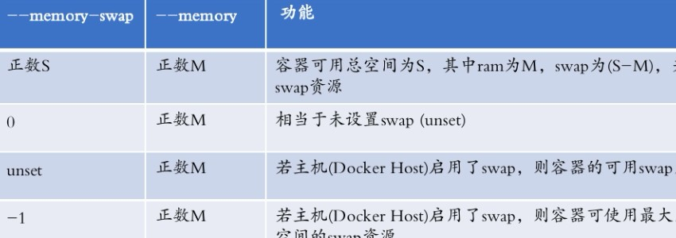

**资源限制**

# 1 、内存资源限制

## 1）相关说明

控制组（CGroups）是Linux内核的一个特性，主要用来对共享资源进行隔离、限制、审计等。只有能控制分配到容器的资源，才能避免多个容器同时运行时对宿主机系统的资源竞争。控制组可以提供对容器的

- 默认情况下，如果不对容器做任何限制，容器能够占用当前系统能给容器提供的所有资源

- Docker 限制可以从 Memory 、CPU 、Block I/O 三个方面

- OOME ：Out Of Memory Exception

- 一旦发生 OOME ，任何进程都有可能被杀死，包括 docker daemon 在内

- 为此，Docker 调整了 docker daemon 的 OOM 优先级，以免被内核关闭

具体来看，控制组提供：

- **资源限制（Resource limiting）：**可以将组设置为不超过设定的内存限制。比如：内存子系统可以为进程组设定一个内存使用上限，一旦进程组使用的内存达到限额再申请内存，就会出发Out of Memory警告。

- **优先级（Prioritization）**：通过优先级让一些组优先得到更多的CPU等资源。

- **资源审计（Accounting）**：用来统计系统实际上把多少资源用到适合的目的上，可以使用cpuacct子系统记录某个进程组使用的CPU时间。

- **隔离（isolation）：**为组隔离命名空间，这样一个组不会看到另一个组的进程、网络连接和文件系统。

- **控制（Control）**：挂起、恢复和重启动等操作。

安装Docker后，用户可以在/sys/fs/cgroup/memory/docker/目录下看到对Docker组应用的各种限制项，包括：

## 2）重点提示

- 为应用做内存压力测试，理解正常业务需求下使用的内存情况，然后才能进入生产环境使用

- 一定要限制容器的内存使用上限

- 尽量保证主机的资源充足，一旦通过监控发现资源不足，就进行扩容或者对容器进行迁移

- 如果可以（内存资源充足的情况），尽量不要使用 swap ，swap 的使用会导致内存计算复杂，对调度器非常不友好

# 2 、内存限制设置方式

在 在 docker 启动参数中，和内存限制有关的包括（参数的值一般是内存大小，也就是一个正数，后面

跟着内存单位 b 、k 、m 、g ，分别对应 bytes 、KB 、MB 、和 GB ）：

```
 -m --memory ：    容器能使用的最大内存大小，最小值为 4m
 --memory-swap ：    容器能够使用的 swap 大小
 --memory-swappiness ：默认情况下，主机可以把容器使用的匿名页（anonymous page） ）swap
                       出来，你可以设置一个 0-100 之间的值，代表允许 swap 出来的比例
 --memory-reservation ：设置一个内存使用的 soft limit, 设置值小于 –m 设置
 --kernel-memory ：    容器能够使用的 kernel memory 大小，最小值为 4m 。
 --oom-kill-disable ：是否运行 OOM 的时候杀死容器。只有设置了 -m ，才可以把这个选项
                        设置为 false ，否则容器会耗尽主机内存，而且导致主机应用被杀死
```

# 3 、参数示意图



# 4 、CPU 资源限制

## 1）相关说明

Docker 提供的 CPU 资源限制选项可以在多核系统上限制容器能利用哪些 vCPU 。而对容器最多能使用的 CPU 时间有两种限制方式：

-  一是有多个 CPU 密集型的容器竞争 CPU 时，设置各个容器能使用的 CPU 时间相对比例

-  二是以绝对的方式设置容器在每个调度周期内最多能使用的 CPU 时间

## 2）CPU 限制方式

```
--cpuset-cpus=""     允许使用的 CPU 集，值可以为 0-3,0,1
-c,--cpu-shares=0 CPU     共享权值（相对权重），默认值 1024
--cpuset-mems=""     允许在上执行的内存节点（MEMs ）
--cpu-period=0         即可设置调度周期，CFS 周期的有效范围是 1ms~1s ，对应的--cpu-period 的数值范围是 1000~1000000
--cpu-quota=0         设置在每个周期内容器能使用的 CPU 时间，容器的 CPU 配额必须不小于1ms ，即 --cpu-quota 的值必须 >= 1000 ，单位微秒
--cpus             能够限制容器可以使用的主机 CPU 个数，并且还可以指定如 1.5 之类的小 数
```

- Example

```
docker run -it --cpu-period=50000 --cpu-quota=25000 ubuntu:16.04 /bin/bash
docker run -it --cpu-period=10000 --cpu-quota=20000 ubuntu:16.04 /bin/bash
```

# 5 、限制性实验

```
docker run --name stress -it --rm -m 256m lorel/docker-stress-ng:latest stress -vm 2
docker stats stress

docker run --name stress -it --rm --cpus 2 lorel/docker-stress-ng:latest stress --cpu 8
docker stats stress
docker run --name stress -it --rm --cpuset-cpus 0 lorel/docker-stress-ng:latest stress --cpu 8
docker stats stress

```