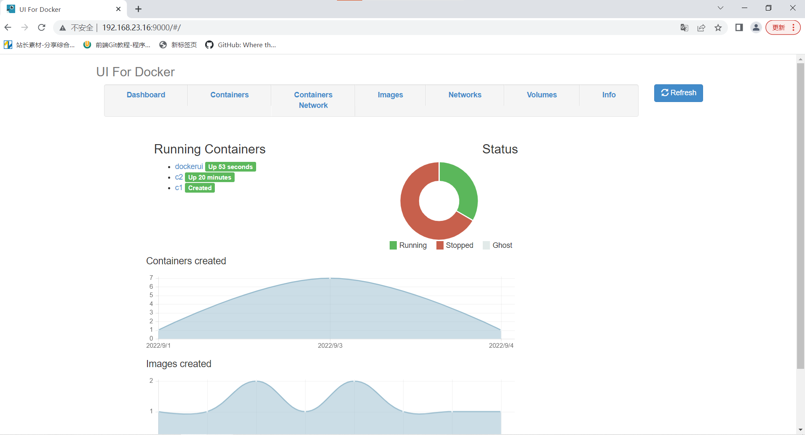
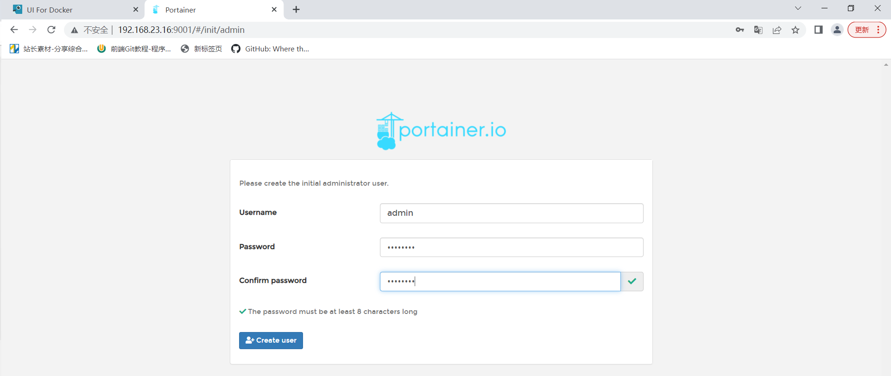

**docker的web管理平台**

我想初学者都被docker的复杂命令搞得晕头转向了，希望有一个图形化的管理平台能轻松管理容器。类似的开源web管理平台主要有：DockerUl,Portainer,Shipyard等。

# 1、DockerUl

1,拉取dockerui的镜像

```
docker pull uifd/ui-for-docker
```

2,运行容器

注意：需要将docker宿主机的/var/run/docker.sock与容器的var/run/docker.sock对应，才能管理

```
docker run -d --name dockerui -p 9000:9000 -v /var/run/docker.sock:/var/run/docker.sock  uifd/ui-for-docker
23112ee4132b974af2647762e155592da00ab30def797953cb03b1 bcade18434
```



# 2、portainer

1,拉取portainer镜像

```
docker pull portainer/portainer
```

2,运行容器

```
注意：需要将dockeri宿主机的/var/run/docker.sock与容器的/var/run/docker.sock对应，才能管理
docker run -d -p 9001:9000 --name=portainer -v /var/run/docker.sock:/var/run/docker.sock portainer/portainer
```

使用浏览器访问http:/宿主机1P:9001

