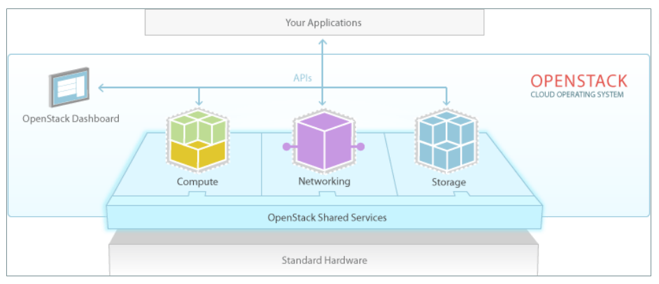
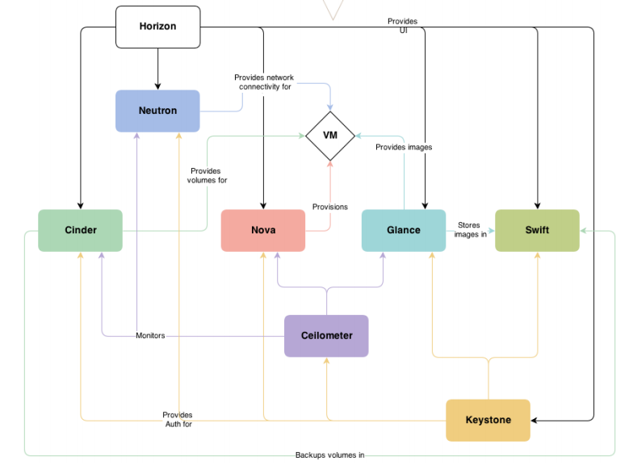

# 1、OpenStack是什么

OpenStack是由美国国家航空航天局(NASA)与Rackspace公司合作研发并发起的，以Apache许可证授权的自由软件和开放源代码的云计

算技术解决方案，其是一个项目也是一个软件，主要用于实现云项目，以云项目操作系统而存在。

作用： 用于部署公有云、私有云，并实现对云项目管理。

开发语言: Python

网址：[http://www.openstack.org](http://www.openstack.org)

总结：

- 是一款软件

- 是一款开源软件

- 是一个项目

- 是一款云操作系统

# 2、OpenStack核心组件

## 2.1 核心组件

1、计算 ：computer

2、网络： network

3、存储：Storage 

## 2.2 组件项目

为基础组件具体提供可行性操作的项目

- Compute 		计算服务

- Networking 		网络服务

- Object Storage 	对象存储服务

- Block Storage 		块存储服务

- Identity 			身份认证服务

- Image Service 	镜像服务

- Dashboard 		UI界面

- Metering 			测量

- Orchestration 		部署编排

- Database Service   数据库服务

## 2.3 OpenStack组件功能

**Compute   计算服务**

- 代号：Nova

- 用于为用户管理虚拟机实例，根据用户需求提供虚拟服务。负责虚拟机创建、开机、关机、重启等操作，还可以为虚拟机配置CPU、内存等规格。

**Networking 网络服务**

- 代号：Neutron

- 为云平台提供网络虚拟化，为用户提供网络接口。

**Object Storage 对象存储**

- 代号：Swift

- 用于为云平台提供对象存储服务，允许使用其进行文件存储及检索。例如，可为Glance提供镜像存储等。

**Block Storage 块存储服务**

- 代号：Cinder

- 用于为云平台提供块存储服务，管理块设备等，例如：创建卷、删除卷等。

**Identity 身份认证**

- 代号：Keystone

- 为OpenStack中其它服务提供身份验证、服务注册、服务令牌等功能。

**Image Service 镜像服务**

- 代号：Glance

- 为云平台虚拟机提供镜像服务，例如：上传镜像、删除镜像等。

**Dashboard UI页面**

- 代号：Horizon

- 用于为OpenStack提供Web管理门户，例如：启动云主机、创建

网络、设置访问控制等。

**Metering 测量服务**

- 代号：Ceilometer

- 用于收集OpenStack内部发生的资源使用进行统计，然后为计费和监控提供数据支撑。

**Orchestration 编排部署**

- 代号：Heat

- 为云平台提供软件运行环境自动化部署。

**Database Service 云数据库**

- 代号：Trove

- 用于为用户提供在OpenStack环境中提供可扩展和可靠的关系型数据库或非关系型数据库引擎服务。

