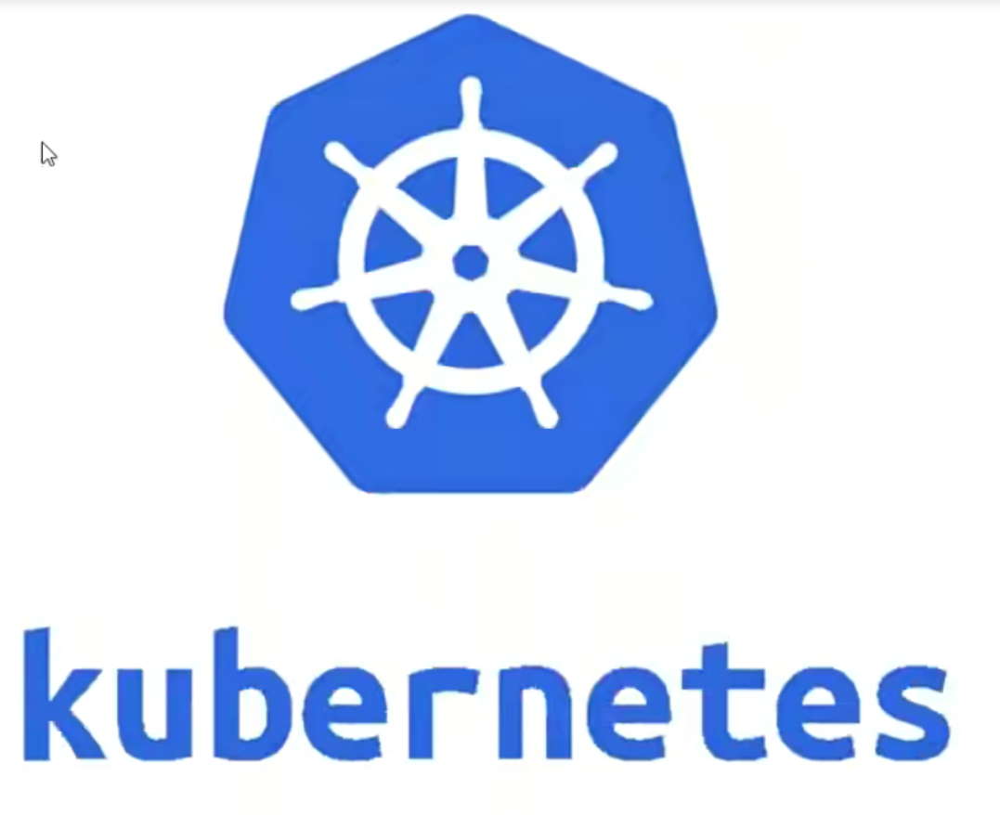
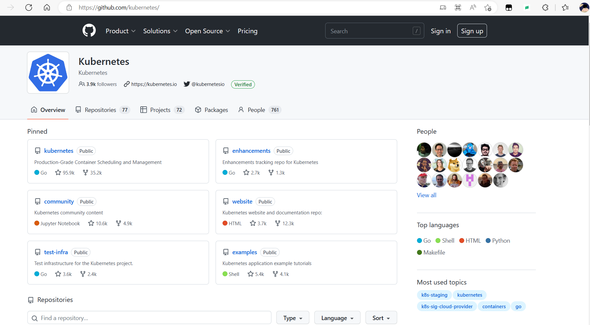
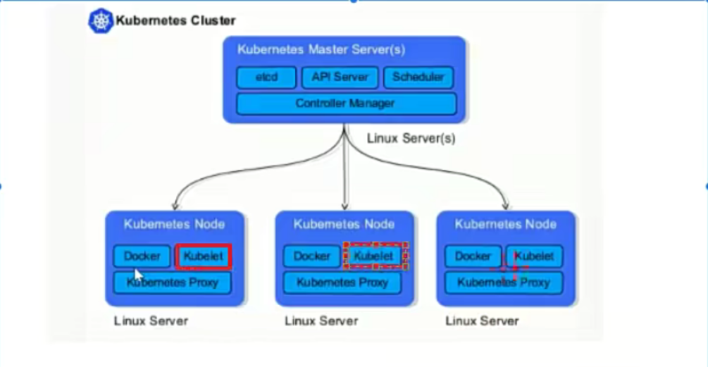
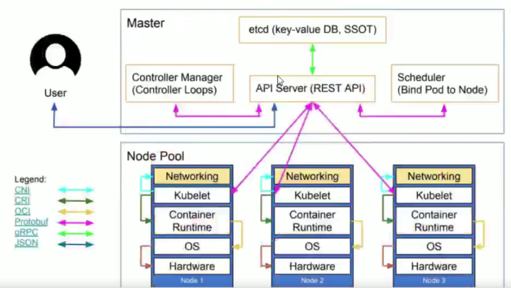

# 1、容器编排工具

- docker machine

- docker compose

- docker swarm

- docker service

- docker stack

- kubernetes

- mesos+marathon

# 2、PaaS平台

- OpenShitf

- Rancher

# 3、认识kubernetes

官方网址

[https://kubernetes.io/](https://kubernetes.io/)

[https://kubernetes.io/zh/](https://kubernetes.io/zh/)

中文社区

[http://docs.kubernetes.org.cn/](http://docs.kubernetes.org.cn/)

希腊语：舵手、飞行员

来自于谷歌Borg

使用golang语言开发

简称为k8s

现归属于CNCF云原生计算基金会

是一个开源软件基金会，致力于使云计算普遍性和持续性

官方：[http://www.cncf.io](http://www.cncf.io)

kubernetes版本

2014年9月第一个正式版本

2015年7月1.0版本正式发布

现在稳定版本为1.15

主要贡献者：Google,Redhat,,Microsoft,IBM,Intel

代码托管github:[https://github.com/kubernetes/](https://github.com/kubernetes/)

- 节点数支持

- 可以支持5000台以上

- pod管理支持

- 先可管理150000个以上

**用户**

- 2017年docker官方宣布原生支持kubernetes

- RedHat:公司PaaS平台OpenShifti核心是kubernetes

- Rancher平台核心是kubernetes

- 现国内大多数公司都可使用kubernetes进行传统IT服务转换，以实现高效管理等。

**功能：**

- 自动装箱

- 自我修复（自愈能力）

- 水平扩展

- 服务发现

- 滚动更新

- 版本回退

- 密钥和配置管理

- 存储编排

# 4、kubernetes 架构

kubernetes.是具有中心节点的架构，也就是说有master管理节点

节点角色

- Master Node manager

- Minion Node worker

简单叫法：

- master 节点

- node 节点

## 4.1 架构图

## 4.2 Master节点组件介绍

master节点是集群管理中心，它的组件可以在集群内任意节点运行，但是为了方便管理所以会在一台主机上运行Master所有组件，并且不在此主机上运行用户容器

Master组件包括：

- kube-scheduler

监视新创建没有分配到Node的Pod,为Pod选择个Node

- kube-apiserver

用于暴露kubernetes API,任何的资源请求/调用操作都是通过kube-apiserver提供的接口进行

- ETCD

是kubernetes提供默认的存储系统，保存所有集群数据，使用时需要为etcd数据提供备份计划

- kube-controller-manager

运行管理控制器，它们是集群中处理常规任务的后台线程

控制器包括：	

- 节点(Node)控制器

- 副本(Replication)控制器：负责维护系统中每个副本中的pod

- 端点(Endpoints)控制器：填充Endpoints对象（即连接service&pods)

## 4.3 Node节点组件介绍

node节点用于运行以及维护Pod,提供kubernetes运行时环境

Node组件包括：

- kubelet

- 负责维护容器的生命周期（创建pod,销毁pod),同时也负责Volume(CVI)和网络(CNI)的管理

- kube-proxy

- 通过在主机上维护网络规则并执行连接转发来实现service(Iptables/川pvs)

- 随时与AP通信，把Service或Pod改变提交给API(不存储在Master本地，需要保存至共享存储上)，保存至etcd(可做高可用集群)中，负责service:实现，从内部pod至service和从外部node到service访问。

- docker

- 容器运行时(Container Runtime)

- 负责镜像管理以及Pod和容器的真正运行

- 支特docker./Rkt/Pouch/Kata等多种运行时，但我们这里只使用docker

## 4.4 Add-ons介绍

Add-ons是附件不是插件，插件是程序本身的一部分，附件不是程序本身一部分.

有附件可以使用功能更丰富，没它并不影响实际使用，可以与主体程序很好结合起来使用

- ·coredns/kube-dns负责为整个集群提供DNS服务

- ·Ingress Controller为服务提供集群外部访问

- ·Heapster/.Metries-server提供集群资源监控（监控容器可以使用prometheus)

- ·Dashboard提供GUI

- ·Federation提供跨可用区的集群

- ·Fluentd-elasticsearch提供集群日志采集、存储与查询

**Kubernetes'high-level component architecture**

