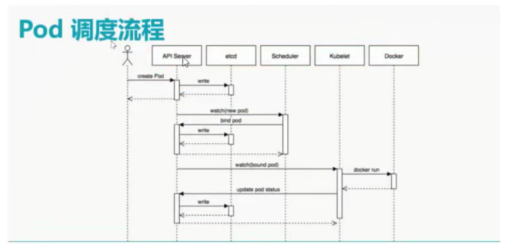

# 1、pod

pod(豌豆夹)是kubernetes调度的最小单元

pod中包含了运行的容器，有两种主要使用方式：

- 一个pod咆含-个容器

- 一个pod包含多个相联系（紧耦合）的容器

一个Pod内的容器共享一个名称空间(Net Namespace,UTS Namespace,IPC Namespace,另外3个依I旧相互隔离)及存储卷（存储卷属于Pod存储资源，多个容器可以共享）

**用户pod**

pod在集群内可以访问，不能在集群外直接访问，集群外访问pod需要借助于service

# 2、service

此服务不是真正的服务，此服务是ptablesi或ipvs中的规则

能够感知pod ip地址的变化（服务发现）

先创建pod,后创建service,创建service:其实就是在iptablesi或ipvs中添加一条规则

如果访问pod,直接访问service

# 3、Label

labe标签是一组绑定到K8s资源对象上的key/value键值对

labe可以附加到各种资源对象上，如Node,Pod,Service,Rc等

通过给指定的资源对象捆绑一个或多个不用的ab来实现多维度的资源分组管理功能，以便于灵活，方便

地进行资源分配，调度，配置，部署等管理工作。

是同一个资源对象上，key不能重复，必须唯一

比如：我们在创建pod时对pod添加一个app=nginx键值对，那么后期管理时可以通过app这个key找到对应的pod

# 4、Label Selector

标签选择器

在众多带有标签的pod中，找出指定标签的pod

是kubernetesi核心的分组机制，通过Label Selector客户端/用户能够识别一组有共同特征或属性的资源对象。

应用场景：

- kube-proxy是通过service.上的label selector来选择pod,自动建立每个Service到对应Pod的请求转发路由表，从而实现Service的智能负载均衡机制

- 通过对某些Node定义特定的Label,并且在Pod定义文件中使用Node Selectori这种标签调度第略，Kube-scheduleri进程可以实现Pod定向调度的特性（类似docker swarm里的placement)

# 5、Scheduler 

调度器

提供资源调度功能，负责对每个Nod节点资源监控及Pod运行资源适配

共2轮调度，一为预选，二为优选，最终哪个Nod节点运行容器取决于优选算法

# 5、Replication Controllers

- 控制器管理器

- 负责控制器监控，防止控制器出现问题，从而导致容器不可用情况的发生。

- 运行在Master-节点

- 为了防止被控制器管理器挂掉，可以考虑多Master-节点

# 6、常见的pod控制器

- ·Deployment声明式更新控制器，只能管理无状态应用，使用较多

- ·ReplicaSet副本集控制器，不直接使用.结合其它控制器一起使用。比如一个pod有2个或多个副本

- ·StatefulSet有状态副本集

- DaemonSet在所有Node(包括master)上都运行一个副本，比如可以用到类似filebeat!收集日志监控等场景

- Job运行作业任务，对于不需要一直处于运行状态的，我们称之为job,如果运行过程中出现中段，其将被再次启动，直至本次任务结束。如果拷贝一个文件这种job

- CronJob 周期执行任务作业任务

pod 分为

- 自主式pod(没有控制的)

- 带有控制器的pod

像httpd,nginx这种运行静态页面为无状态的pod

象php,tomcat,mysq等这种有连接的为有状态的pod

# 核心概念之间的关系与回顾

- pod

- 最小调度或管理单元

- service

- iptables或ipvs规则，与pod之间有关系，用户通过servicei访问pod

- label

- 为了给kubernetes资源对象打上标识，此为标签

- label selector

- 标签选择器，可以对资源对象进行分组

- replication controller

- 控制器，副本控制器，时刻保持印od数量到达用户的期望值

- replication controller manager

- master节点中运行副本控制器管理器，用于监视RC

- scheduler

- 接受aip-serveri访问，实现pod在某台kubernetes node上运行

- DNS

- 通过DNS解决集群内资源名称，达到访问资源目的