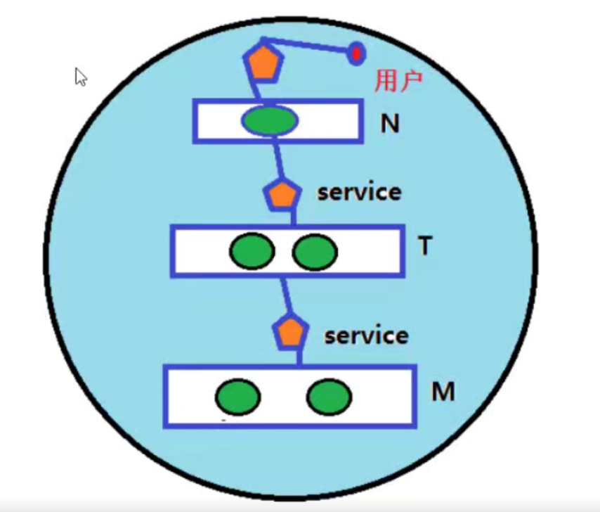
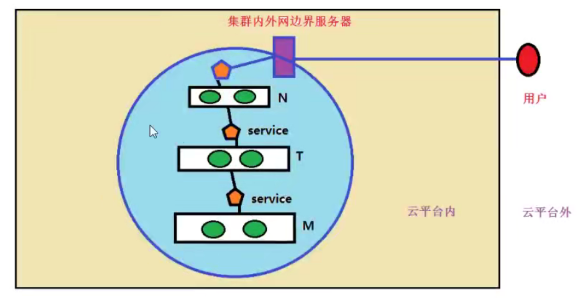

# 1、服务分层架构

- ·LAMP一台服务台安装单服务架构

- ·LNMP十台服务器安装分层服务架构

-  LNMP使用容器进行分层，叫微服务架构

# 2、微服务架构组件之间的关系

使用kubernetes集群运行NMP或NMT

- 可以把Kubernete:集群看做是一个机房(IDC)

- 人访问N前面的service

- N访问T前面的service

- T访问M前面的service

# 3、微服务架构图示

问题：集群中的用户怎么访问？

问题：云平台上运行kubernetes集群，云平台外面的用户如何访问？

