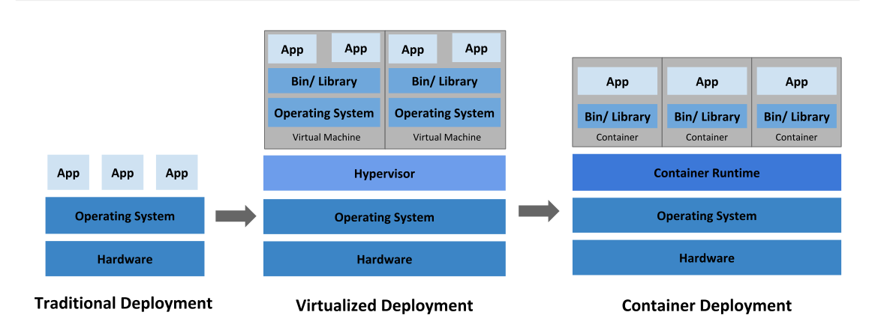
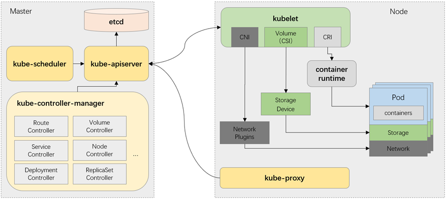
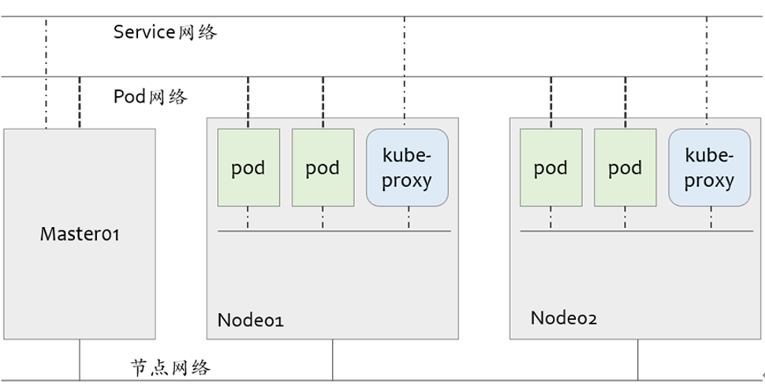

# 1、Kubernetes 是什么？

Kubernetes是一个可移植的、可扩展的开源平台，用于管理容器化的工作负载和服务，可促进声明式配

置和自动化。kubernetes拥有一个庞大且快速增长的生态系统。kubernetes的服务、支持和工具广泛可用。

kubernetes这个名字源于希腊于，意为舵手或飞行员。k8s这个缩写是因为k和s之间有八个字符的关

系。google在2014年开源了kubernetes项目。kubernetes建立在google在大规模运行生产工作负载方

面拥有十几年的经验的基础上，结合了社区中最好的想法和实践。

# 2、时光回溯

## 1）传统部署时代

早期，各个组织机构在物理服务器上运行应用程序。无法为服务器中的应用程序定义资源边界，这会导

致资源分配问题。例如，如果在物理服务器上运行多个应用程序，则可能会出现一个应用程序占用大部

分资源的情况，结果可能导致其他应用程序的性能下降。一种解决方案是在不同的物理服务器上运行每

个应用程序，但是由于资源利用不足而服务扩展，并且维护许多物理服务器的成本很高

## 2）虚拟化部署时代

作为解决方案，引入了虚拟化。虚拟化技术允许你在单个物理服务器的cpu上允许多个虚拟机。虚拟化

允许应用程序在虚拟机之间隔离，并提供一定程度的安全，因为一个应用程序的信息不能被另一应用程

序随意访问。

虚拟化技术能够更好地利用物理服务器上的资源，并且因为可轻松地添加或更新应用程序而可以实现更

好地可伸缩性，降低硬件成本等等。

每个VM是一台完整的计算机，在虚拟化硬件之上运行所有组件，包括自己的操作系统。

## 3）容器部署时代：

容器类似于VM，但是他们具有被放宽的隔离属性，可以在应用程序之间共享操作系统（OS）。因此，

容器被认为是轻量级的。容器与VM类似，具有自己的文件系统、cpu、内存、进程空间等。由于他们与

基础架构分离，因此可以跨云和os发行版本进行移植。

容器因具有许多优势而变得流行起来，下面列出的是容器的一些好处：

- 敏捷应用程序的创建和部署：与使用vm镜像相比，提高了容器镜像创建的简便性和效率。

- 持续开发、继承和部署：通过快速简单的回滚（由于镜像不可变性），支持可靠且频繁的容器镜像

构建和部署。

- 关注开发与运维的分离：在构建、发布时而不是在部署时创建应用程序容器镜像，从而将应用程序

与基础架构分离。

- 可观察性、测试和生产的环境一致性：在便携式计算机上与在云中相同的运行。

- 跨云和操作系统发行版本地可移植性：可在Ubuntu、RHEL、CoreOS、本地、Google Kubernets

Engine和其他任何地方运行

- 以应用程序为中心的管理：提高抽象级别，从在虚拟硬件上运行os到使用逻辑资源在os上运行应用

程序。

- 松散耦合、分布式、弹性、解放的微服务：应用程序被分解成较小的独立部分，并且可以动态部署

和管理-而不是在一台大型单机上整体运行。

- 资源隔离：可预测的应用程序性能。

- 资源利用：高效率和高密度。

# 3、为什么需要kubernetes？

容器时打包和运行应用程序的好方式。在生产环境中，你需要管理运行应用程序的容器，并确保不会停

机。例如，如果一个容器发生故障，则需要启动另一个容器。如果系统如理此问题，会不会更容易？

这就是kubernetes来解决这些问题的方法！Kubernetes为你提供了一个可弹性运行分布式系统的框

架。Kubernetes会满足你的扩展要求、故障转移、部署模式等。

kubernetes为你提供：

- 自动装箱

建构于容器之上，基于资源依赖及其他约束自动完成容器部署且不影响其可用性，并通过调度机制混合

关键性应用和非关键型应用的工作负载于同一节点以提升资源利用率

- 自我修复（自愈）

支持容器故障后自动重启、节点故障后重新调度容器，以及其他可用节点、健康状态检查失败后关闭容

器并重新创建等自我修复机制。

- 水平扩展

支持通过命令或UI手动水平扩展，以及基于cpu等资源负载率的自动水平扩展机制。

- 服务发现和负载均衡

Kubernets通过其附加组件KubeDNS（或CoreDNS）为系统内置了服务发现功能，它会为每个service

配置DNS名称，并允许集群内的客户端直接使用此名称发出请求，而Service则通过iptables或ipvs内建

了负载均衡机制。

- 自动发布和回滚

Kubernets支持灰度更新应用程序或其配置信息，它会监控更新过程中应用程序的健康状态，以确保它

不会在同一时刻杀掉所有实例，而此过程中一旦有故障发生，就会立即自动执行回滚操作

- 密钥和配置管理

kubernetsd的configmap实现了配置数据与Docker镜像解耦，需要时，仅对配置做出变更而无须重新构

建docker镜像，这为应用开发部署带来了很大的灵活性。此外，对于应用所依赖的一些敏感数据，如用

户名和密码、令牌、密钥等信息，Kubernetes专门提供了secret对象为其解耦，既便利了应用的快速开

发和交付，又提供一定程度上的安全保障。

- 存储编排

Kubernets支持pod对象按需自动挂载不同类型的存储系统，这包括节点本地存储、公有云服务商的云

存储，以及网络存储系统（例如，NFS/ISCSI/GlusterFS/Ceph/Cinder/Flocker等）。

# 4、Kubernets 组件

当你部署完Kubernets，你就拥有了一个完整的集群。

一个kubernetes集群由一组被称作节点的机器组成。这些节点上运行Kubernetes所管理的容器化应

用。集群具有至少一个工作节点。

工作节点托管作为应用负载的组件的Pod。控制平面管理集群中的工作节点和pod。为集群提供故障转

移和高可用性，这些控制平面一般跨多主机运行，集群跨多个节点运行。

**Mater：**

为用户和客户端暴露API、跟踪其他服务器的健康状态、以最优方式调度工作负载，以及编排其他组件之

间的通信任务，它是用户或客户端与集群之间的核心联络点，并负载Kubernetes系统的大多数集中式管

控逻辑。单个master节点即可完成其所有的功能，但出于冗余及负载均衡等目的，生产环境中通常需要

协同部署多个此类主机。

**Node：**

对象，以及调整网络规则以合理地路由和转发流量等。理论上讲，Node可以是任何形式的计算设备，不

过Master会统一将其抽象为Node对象进行管理。

Kubernetes将所有Node资源集结于一处形成一台更加强大的服务器，在用户将应用部署于其上时，

Master会使用调度算法将其自动指派至某个特定的Node运行。在Node加入集群或从集群中移除时，

Master也会按需重新编排影响到的Pod，于是用户无须关心其应用究竟运行何处。

## 1）控制平面组件

控制平面组件可以在集群中的任何节点上运行。然后，为了简单起见，设置脚本通常会在同一个计算机

上启动所有控制平面组件，并且不会在此计算机上运行用户容器。

### kube-apiserver

Api server负责输出restful风格的kubernetes API，它是发往集群的所有REST操作命令的接入点，并负

责接收、校验并响应所有的REST请求，结果状态被持久存储于etcd中。因此，api server是整个集群的

网关。

### etcd

kubernetes集群的所有状态信息都需要持久存储于存储系统etcd中，不过，etcd是由CoreOS基于Raft

协议开发的分布式键值存储，可用于服务发现、共享配置以及一致性保障（如数据库主节点选择、分布

式锁等）。因此，etcd是独立的服务组件，并不隶属于Kubernetes集群自身。

etcd不仅能够提供键值数据存储，而且还为其提供了监听机制，用于监听和推送变更。Kubernetes集群

系统中，etcd中的键值发生变化时会通知到api server。

### kube-controller-manager

kubernetes中，集群级别的大多数功能都是由几个被称为控制器的进程执行实现的，这几个进程被集成

于kube-controller-manager守护进程中。由控制器完成的功能主要包括生命周期功能和api业务逻辑。

### kube-scheduler

Kubernetes是用于部署和管理大规模容器应用的平台，根据集群规模的不同，其托管运行的容器很可能

会数以千计甚至更多。api server确认pod对象的创建请求之后，便需要由scheduler根据集群内各节点

的可用资源状态，以及要运行的容器的资源需求做出调度决策。

## 2）Node组件

### kubelet

kubelet是运行于工作节点上的守护进程，它从api server接收关于pod对象的配置信息并确保他们处于

期望的状态，kubelet会在api server上注册当前的工作节点，定期向master汇报节点资源使用情况。

### kubeproxy

每个工作节点都需要运行一个kube-proxy守护进程，它能够按需为service资源对象生成iptables或者

ipvs规则，从而捕获当前service的流量并将其转发至正确的后端pod对象。

### 容器运行时环境

每个node都要提供一个容器运行时环境，它负责下载镜像并运行容器。kubernetes支持多个容器运行

时环境。

# 5、kubernetes网络模型

kubernetes集群应该包含至少三个网络。

一个是各主机自身所属的网络，其地址配置于主机的网络接口，用于各主机之间的通信，例如master与

各node之间的通信。此地址配置于kubernetes集群构建之前，它并不能由kubernetes管理，管理员需

要于集群构建之前自行确定其地址配置及管理方式。

第二个是kubernetes集群上专用于pod资源对象的网络，它是一个虚拟网络，用于为各pod对象设定ip

地址等网络参数，其地址配置于pod中容器的网络接口之上。pod网络需要借助kubenet插件或CNI插件

实现，该插件可独立部署于kubernetes集群之外，亦可托管于kubernetes之上，它需要在构建

kubernetes集群时由管理员进行定义，而后在创建Pod对象时由其自动完成各网络参数的动态配置。

第三个是专用于service资源对象的网络，它也是一个虚拟网络，用于为kubernetes集群之中的service

配置ip地址，但此地址不配置于任何主机或容器的网络接口上，而是通过Node之上的kube-proxy配置

为iptables或ipvs规则，从而将发往此地址的所有流量调度至其后端的各pod对象之上。service网络在

kubernetes集群创建时予以指定，而service的地址则在用户创建service时予以动态配置

