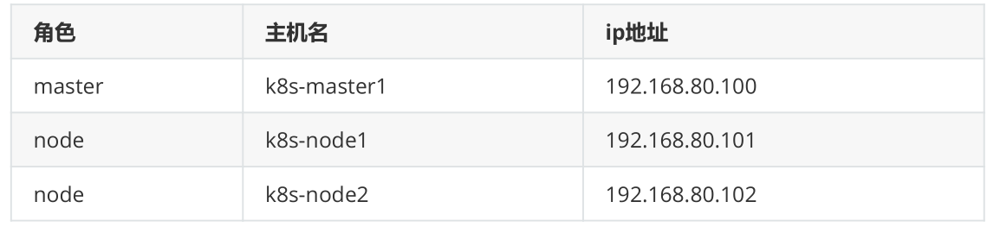
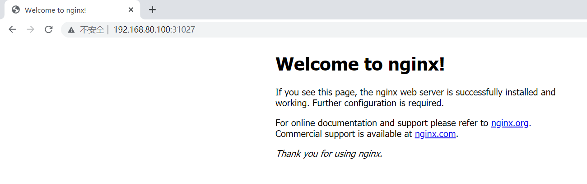
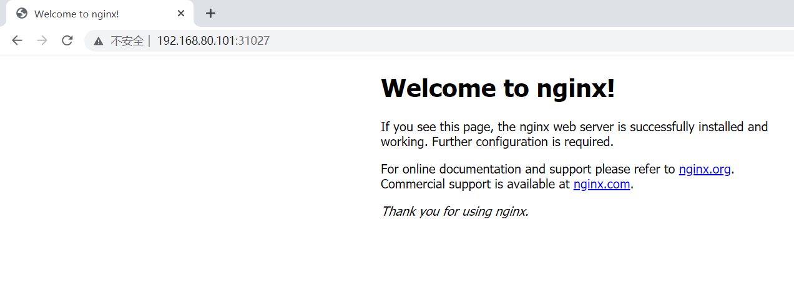
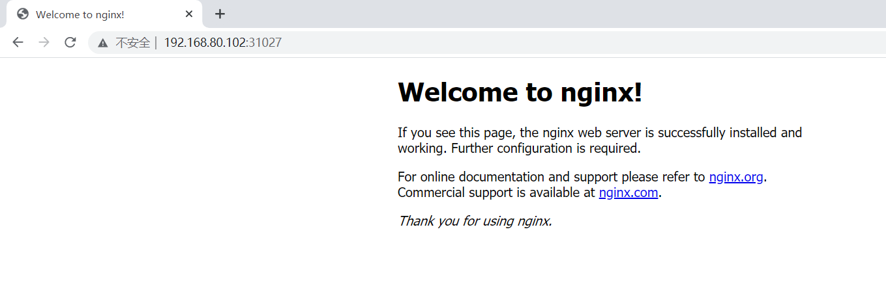

# 1、硬件



# 2、环境准备

- 在所有机器上关闭防火墙

```
systemctl stop firewalld
systemctl disable firewalld
```

- 在所有机器上关闭selinux

```
sed -i 's/enforcing/disabled/' /etc/selinux/config
setenforce 0
```

- 在所有机器上关闭swap

```
swapoff -a # 临时关闭
sed -ri 's/.*swap.*/#&/' /etc/fstab #永久关闭
```

- 修改主机名

```
[root@k8s-master1 ~]# hostname
k8s-master1
--------------------------------
[root@k8s-node1 ~]# hostname
k8s-node1
--------------------------------
[root@k8s-node2 ~]# hostname
k8s-node2
```

- 在所有机器上添加主机名于ip对应关系

```
[root@k8s-master1 ~]# cat /etc/hosts
127.0.0.1  localhost localhost.localdomain localhost4
localhost4.localdomain4
::1     localhost localhost.localdomain localhost6
localhost6.localdomain6
192.168.80.100 k8s-master1
192.168.80.101 k8s-node1
192.168.80.102 k8s-node2
```

- 在所有机器上将桥接的ipv4流量传递到iptables的链

```
cat > /etc/sysctl.d/k8s.conf << EOF
net.bridge.bridge-nf-call-ip6tables = 1
net.bridge.bridge-nf-call-iptables = 1
EOF
```

# 3、为所有节点安装docker

```
yum install wget.x86_64 -y
rm -rf /etc/yum.repos.d/*
wget -O /etc/yum.repos.d/centos7.repo http://mirrors.aliyun.com/repo/Centos-
7.repo
wget -O /etc/yum.repos.d/epel-7.repo http://mirrors.aliyun.com/repo/epel-
7.repo
wget -O /etc/yum.repos.d/docker-ce.repo https://mirrors.aliyun.com/docker-
ce/linux/centos/docker-ce.repo
yum install docker-ce -y
```

# 4、集群部署

配置镜像仓库，[https://developer.aliyun.com/mirror/kubernetes?spm=a2c6h.13651102.0.0.3e221b11tmy01T](https://developer.aliyun.com/mirror/kubernetes?spm=a2c6h.13651102.0.0.3e221b11tmy01T)

- 为所有节点修改仓库，安装kubeadm、kubelet、kubectl

```
cat <<EOF > /etc/yum.repos.d/kubernetes.repo
[kubernetes]
name=Kubernetes
baseurl=https://mirrors.aliyun.com/kubernetes/yum/repos/kubernetes-el7-
x86_64/
enabled=1
gpgcheck=1
repo_gpgcheck=1
gpgkey=https://mirrors.aliyun.com/kubernetes/yum/doc/yum-key.gpg
https://mirrors.aliyun.com/kubernetes/yum/doc/rpm-package-key.gpg
EOF
yum install -y kubelet kubeadm kubectl
systemctl enable kubelet && systemctl start kubelet
```

- 修改docker配置

```
[root@k8s-master1 ~]# cat > /etc/docker/daemon.json <<EOF
{
 "exec-opts": ["native.cgroupdriver=systemd"]
}
EOF
[root@k8s-master1 ~]# systemctl daemon-reload
[root@k8s-master1 ~]# systemctl restart docker.service
[root@k8s-master1 ~]# systemctl restart kubelet.service
```

- 部署master

```
[root@k8s-master1 ~]# kubeadm init \
--apiserver-advertise-address=192.168.80.100 \
--image-repository registry.aliyuncs.com/google_containers \
--kubernetes-version v1.22.2 \
--control-plane-endpoint k8s-master1 \
--service-cidr=172.16.0.0/16 \
--pod-network-cidr=10.244.0.0/16
.......
To start using your cluster, you need to run the following as a regular
user:
 mkdir -p $HOME/.kube
 sudo cp -i /etc/kubernetes/admin.conf $HOME/.kube/config
 sudo chown $(id -u):$(id -g) $HOME/.kube/config
Alternatively, if you are the root user, you can run:
 export KUBECONFIG=/etc/kubernetes/admin.conf
You should now deploy a pod network to the cluster.
Run "kubectl apply -f [podnetwork].yaml" with one of the options listed at:
https://kubernetes.io/docs/concepts/cluster-administration/addons/
You can now join any number of control-plane nodes by copying certificate
authorities
and service account keys on each node and then running the following as
root:
kubeadm join k8s-master1:6443 --token 0re1oq.he6o0ab4mqtjtg83 \
--discovery-token-ca-cert-hash
sha256:460d740c21fa040f7f12e22cdd018aec8c903d4880f42b0f7edeb78a80241b56 \
--control-plane
Then you can join any number of worker nodes by running the following on
each as root:
kubeadm join k8s-master1:6443 --token 0re1oq.he6o0ab4mqtjtg83 \
--discovery-token-ca-cert-hash
sha256:460d740c21fa040f7f12e22cdd018aec8c903d4880f42b0f7edeb78a80241b56
......
# 遇到镜像下载问题可以单独下载，比如，
[root@k8s-master1 ~]# docker pull
registry.aliyuncs.com/google_containers/coredns:1.8.4
[root@k8s-master1 ~]# docker tag
registry.aliyuncs.com/google_containers/coredns:1.8.4
registry.aliyuncs.com/google_containers/coredns:v1.8.4
```

- 按照指示执行

```
[root@k8s-master1 ~]# mkdir -p $HOME/.kube
[root@k8s-master1 ~]# sudo cp -i /etc/kubernetes/admin.conf
$HOME/.kube/config
[root@k8s-master1 ~]# sudo chown $(id -u):$(id -g) $HOME/.kube/config
[root@k8s-master1 ~]# export KUBECONFIG=/etc/kubernetes/admin.conf
```

- 查看节点状态为notready

```
[root@k8s-master1 ~]# kubectl get nodes
NAME     STATUS   ROLES         AGE   VERSION
k8s-master1  NotReady  control-plane,master  3m10s  v1.22.0
```

- 安装网络插件，官方文档：

```
[root@k8s-master1 ~]# wget
https://raw.githubusercontent.com/coreos/flannel/master/Documentation/kube-
flannel.yml
[root@k8s-master1 ~]# kubectl apply -f kube-flannel.yml
# 最好手动提前拉取所需镜像
[root@k8s-master1 ~]# docker pull quay.io/coreos/flannel:v0.14.0
```

- 添加node节点

```
# 为node拉去网络插件镜像
[root@k8s-node1 ~]# docker pull quay.io/coreos/flannel:v0.14.0
[root@k8s-node2 ~]# docker pull quay.io/coreos/flannel:v0.14.0
[root@k8s-node1 ~]# kubeadm join k8s-master1:6443 --token
0re1oq.he6o0ab4mqtjtg83 --discovery-token-ca-cert-hash
sha256:460d740c21fa040f7f12e22cdd018aec8c903d4880f42b0f7edeb78a80241b56
[root@k8s-node2 ~]# kubeadm join k8s-master1:6443 --token
0re1oq.he6o0ab4mqtjtg83 --discovery-token-ca-cert-hash
sha256:460d740c21fa040f7f12e22cdd018aec8c903d4880f42b0f7edeb78a80241b56
[root@k8s-master1 ~]# kubectl get nodes
NAME     STATUS  ROLES         AGE   VERSION
k8s-master1  Ready  control-plane,master  32m   v1.22.0
k8s-node1   Ready  <none>         4m34s  v1.22.0
k8s-node2   Ready  <none>         62s   v1.22.0
```

# 5、快速体验

- 创建nginx容器

```
[root@k8s-master1 ~]# kubectl create deployment nginx --image=nginx
deployment.apps/nginx created
```

- 暴露对外端口

```
[root@k8s-master1 ~]# kubectl expose deployment nginx --port=80 --
type=NodePort
service/nginx exposed
```

- 查看nginx是否运行成功

```
[root@k8s-master1 ~]# kubectl get pod,svc
NAME             READY  STATUS  RESTARTS  AGE
pod/nginx-6799fc88d8-qthk8  1/1   Running  0     71s
NAME         TYPE    CLUSTER-IP   EXTERNAL-IP  PORT(S)   
AGE
service/kubernetes  ClusterIP  172.16.0.1   <none>     443/TCP   
34m
service/nginx    NodePort   172.16.170.23  <none>     80:31027/TCP 
30s
```







- 扩容

```
[root@k8s-master1 ~]# kubectl get pods
NAME           READY  STATUS  RESTARTS  AGE
nginx-6799fc88d8-qthk8  1/1   Running  0     8m5s
[root@k8s-master1 ~]# kubectl scale deployment nginx --replicas=3
deployment.apps/nginx scaled
[root@k8s-master1 ~]# kubectl get pods
[root@k8s-master1 ~]# kubectl get pods
NAME           READY  STATUS  RESTARTS  AGE
nginx-6799fc88d8-46gmb  1/1   Running  0     64s
nginx-6799fc88d8-kn2dq  1/1   Running  0     64s
nginx-6799fc88d8-qthk8  1/1   Running  0     9m11s
```