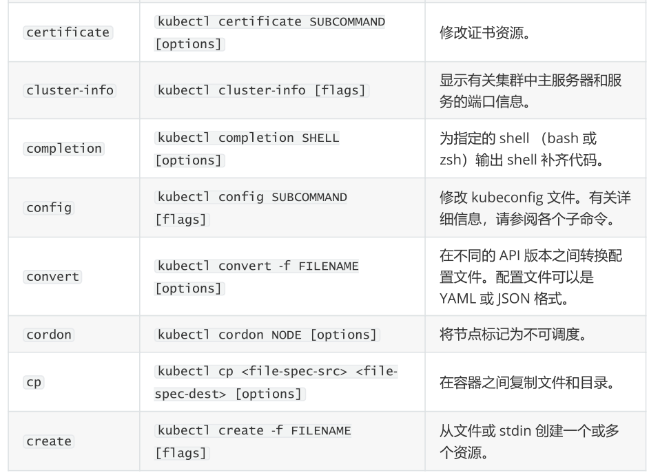
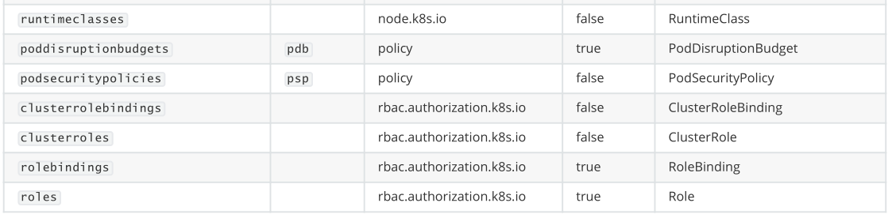

# 1、资源对象

kubernetes系统的 api server基于http/https接收并响应客户端的操作请求，它提供了一种基于资源的

RESTful风格的编程结构，将集群的各种组件都抽象成为标准的REST资源，如Node、Namespace和Pod

等，并支持通过标准的HTTP方法以JSON为数据序列化方案进行资源管理操作。

kubernetes系统将一切事物都抽象为API资源。

## 1）工作负载型资源

Pod是工作负载型资源中的基础资源，它负责运行容器，并为其解决环境性的依赖。但pod可能会因为

资源超限或节点故障等原因而终止，这些非正常终止的Pod资源需要被重建，不过这类工作将由工作负

载型的控制器来完成，他们通常也称之为pod控制器。

- ReplicaSet：用于确保每个pod副本在任意时刻均能满足目标数量，换言之，它用于保证每个容器

或容器组总是运行并且可访问。

- Deployment：它用于为pod和ReplicaSet提供声明式更新，是建构在ReplicaSet之上的更为高级的

控制器

- StatefulSet：用于管理有状态的持久化应用，如database服务程序；其与Deployment的不同之处

在于StatefulSet会为每一个Pod创建一个独有的持久性标识符，并会确保各pod之间的顺序

- DaemonSet：用于确保每个节点都运行了某pod的一个副本，新增的节点一样会被添加此类pod；

在节点被移除时，此类pod会被回收

- Job：用于管理运行完成后即可终止的应用，例如批处理作业任务

## 2）发现和负载均衡

Pod资源可能会因为任何意外故障而被重建，于是它需要固定的可被发现的方式。另外、Pod资源仅在

集群内可见，它的客户端也可能是集群内的其他pod资源，若要开放给外部网络中的用户访问，则需要

事先将其暴露到集群外部，并要为同一种工作负载的访问流量进行负载均衡。

## 3）配置与存储

Docker容器分层联合挂载的方式决定了不宜在容器内部存储需要持久化的数据，于是它通过引入挂载外

部存储卷的方式来解决此类问题，而kubernetes则为此涉及了volume资源，它支持众多类型的存储设

备或存储系统。

另外，基于镜像构建容器应用时，其配置信息与镜像制作时写入，从而为不同的环境定制变得困难，

Docker使用环境变量等作为解决方案，但这么一来就得于容器启动时将值传入，且无法在运行时修改。

configMap资源能够以环境变量或存储卷的方式接入到pod资源的容器中，并且可被多个同类的pod资源

共享引用，从而实现“一次修改，多处生效”。不过，这种方式不适于存储敏感数据，如私钥、密码等，

那就是另一个资源类型Secret的功能。

## 4）集群级资源

kubernetes还存在一些集群级别的资源，用于定义集群自身配置信息的对象，他们仅仅应该由集群管理

员进行操作。

- Namespace：资源对象名称的作用范围，绝大多数对象都隶属于某个名称空间，默认时隶属于

- defalut

- Node：Kubernetes集群的工作节点，其标识符在当前集群中必须是唯一的。

- Role：名称空间级别的由规则组成的权限集合

- ClusterRole、RoleBinding、ClusterRoleBinding......

## 5）元数据型资源

此类对象用于为集群内部的其他资源配置其行为或特性。

## 6）访问Kubernetes REST API

以编程的方式访问kubernetes REST API有助于僚机其管理机制

- 于本地8080端口上启动api server的一个代理网关

```
[root@k8s-master1 ~]# kubectl proxy --port=8080
Starting to serve on 127.0.0.1:8080
```

- 使用curl访问api资源

```
[root@k8s-master1 ~]# curl localhost:8080/api/v1/nodes/
{
 "kind": "NodeList",
 "apiVersion": "v1",
 "metadata": {
  "resourceVersion": "16661"
},
 "items": [
 {
```

# 2、对象资源格式

## 1）资源配置清单

### 什么是资源配置清单？

在k8s中，一般使用yaml格式的文件来创建符合我们预期期望的pod，这样的yaml文件我们一般称为资源清单

### 资源清单的格式

```
apiVersion: group/apiversion # 如果没有给定group名称，那么默认为croe，可以使用
kubectl api-versions 获取当前k8s版本上所有的apiVersion版本信息(每个版本可能不同)
kind:    #资源类别
metadata： #资源元数据
 name
 namespace #k8s自身的namespace
 lables
 annotations  #主要目的是方便用户阅读查找
spec:期望的状态（disired state）
status：当前状态，本字段有kubernetes自身维护，用户不能去定义
```

定义资源配置清单时，尽管apiVersion、kind和metadata有章可循，但spec字段对不同的资源来说是

千差万别，因此用户需要参考文旦来了解各种可用属性字段。

- 查询pod字段说明

```
[root@k8s-master1 ~]# kubectl explain pods.spec
KIND:   Pod
VERSION: v1
RESOURCE: spec <Object>
DESCRIPTION:
  Specification of the desired behavior of the pod. More info:
  https://git.k8s.io/community/contributors/devel/sig-architecture/api-
conventions.md#spec-and-status
  PodSpec is a description of a pod.
FIELDS:
 activeDeadlineSeconds <integer>
  Optional duration in seconds the pod may be active on the node relative
to
  StartTime before the system will actively try to mark it failed and
kill
  associated containers. Value must be a positive integer.
......
```

# 3、资源管理

## 1）资源管理介绍

在kubernetes中，所有的内容都抽象为资源，用户需要通过操作资源来管理kubernetes。


- 学习kubernetes的核心，就是学习如何对集群上的 Pod、Pod控制器、Service、存储 等各种资源进行操作

## 2）YAML语言介绍

YAML是一个类似 XML、JSON 的标记性语言。它强调以数据为中心，并不是以标识语言为重点。因而

YAML本身的定义比较简单，号称"一种人性化的数据格式语言"。

```
<eagle>
 <age>18</age>
 <address>Zhengjiang</address>
</eagle>
```

```
eagle:
age: 18
address: Zhengjiang
```

### YAML的语法比较简单，主要有下面几个：

- 大小写敏感

- 使用缩进表示层级关系

- 缩进不允许使用tab，只允许空格( 低版本限制 )

- 缩进的空格数不重要，只要相同层级的元素左对齐即可

- '#'表示注释

### YAML支持以下几种数据类型：

- 纯量：单个的、不可再分的值

- 对象：键值对的集合，又称为映射（mapping）/ 哈希（hash） / 字典（dictionary）

- 数组：一组按次序排列的值，又称为序列（sequence） / 列表（list）

```
# 纯量, 就是指的一个简单的值，字符串、布尔值、整数、浮点数、Null、时间、日期
# 1 布尔类型
c1: true (或者True)
# 2 整型
c2: 234
# 3 浮点型
c3: 3.14
# 4 null类型
c4: ~ # 使用~表示null
# 5 日期类型
c5: 2018-02-17  # 日期必须使用ISO 8601格式，即yyyy-MM-dd
# 6 时间类型
c6: 2018-02-17T15:02:31+08:00 # 时间使用ISO 8601格式，时间和日期之间使用T连接，最
后使用+代表时区
# 7 字符串类型
c7: eagle   # 简单写法，直接写值 , 如果字符串中间有特殊字符，必须使用双引号或者单引号
包裹
c8: line1
 line2   # 字符串过多的情况可以拆成多行，每一行会被转化成一个空格
```

```
# 对象
# 形式一(推荐):
eagle:
age: 15
address: Beijing
# 形式二(了解):
eagle: {age: 15,address: Beijing}
```

```
# 数组
# 形式一(推荐):
address:
- 顺义
- 昌平 
# 形式二(了解):
address: [顺义,昌平]
```

## 3）资源管理方式

- 命令式对象管理：直接使用命令去操作kubernetes资源

kubectl run nginx-pod --image=nginx:1.17.1 --port=80

- 命令式对象配置：通过命令配置和配置文件去操作kubernetes资源

kubectl create/patch -f nginx-pod.yaml

- 声明式对象配置：通过apply命令和配置文件去操作kubernetes资源

kubectl apply -f nginx-pod.yaml


### 命令式对象管理

- kubectl命令

kubectl是kubernetes集群的命令行工具，通过它能够对集群本身进行管理，并能够在集群上进行容器

化应用的安装部署。kubectl命令的语法如下：

```
kubectl [command] [type] [name] [flags] 
```

- comand：指定要对资源执行的操作，例如create、get、delete

- type：指定资源类型，比如deployment、pod、service

- name：指定资源的名称，名称大小写敏感

- flags：指定额外的可选参数

```
# 查看所有pod
kubectl get pod
# 查看某个pod
kubectl get pod pod_name
# 查看某个pod,以yaml格式展示结果
kubectl get pod pod_name -o yaml
```

- 资源类型

kubernetes中所有的内容都抽象为资源，可以通过下面的命令进行查看:

```
kubectl api-resources 
```

经常使用的资源有下面这些：


- 操作

kubernetes允许对资源进行多种操作，可以通过--help查看详细的操作命令

```
kubectl --help 
```

经常使用的操作有下面这些：


下面以一个namespace / pod的创建和删除简单演示下命令的使用：

```
# 创建一个namespace
[root@master ~]# kubectl create namespace dev
namespace/dev created
# 获取namespace
[root@master ~]# kubectl get ns
NAME       STATUS  AGE
default      Active  21h
dev        Active  21s
kube-node-lease  Active  21h
kube-public    Active  21h
kube-system    Active  21h
# 在此namespace下创建并运行一个nginx的Pod
[root@master ~]# kubectl run pod --image=nginx:latest -n dev
kubectl run --generator=deployment/apps.v1 is DEPRECATED and will be removed
in a future version. Use kubectl run --generator=run-pod/v1 or kubectl
create instead.
deployment.apps/pod created
# 查看新创建的pod
[root@master ~]# kubectl get pod -n dev
NAME READY  STATUS  RESTARTS  AGE
pod  1/1   Running  0     21s
# 删除指定的pod
[root@master ~]# kubectl delete pod pod-864f9875b9-pcw7x
pod "pod" deleted
# 删除指定的namespace
[root@master ~]# kubectl delete ns dev
namespace "dev" deleted
```

### 命令式对象配置

命令式对象配置就是使用命令配合配置文件一起来操作kubernetes资源。

#### 1） 创建一个nginxpod.yaml，内容如下：

```
apiVersion: v1
kind: Namespace
metadata:
name: dev
---
apiVersion: v1
kind: Pod
metadata:
name: nginxpod
namespace: dev
spec:
containers:
- name: nginx-containers
 image: nginx:latest
```

#### 2）执行create命令，创建资源：

```
[root@master ~]# kubectl create -f nginxpod.yaml
namespace/dev created
pod/nginxpod created
```

此时发现创建了两个资源对象，分别是namespace和pod

#### 3）执行get命令，查看资源：

```
[root@master ~]# kubectl get -f nginxpod.yaml
NAME      STATUS  AGE
namespace/dev  Active  18s
NAME      READY  STATUS  RESTARTS  AGE
pod/nginxpod   1/1   Running  0     17s
```

这样就显示了两个资源对象的信息

#### 4）执行delete命令，删除资源：

```
[root@master ~]# kubectl delete -f nginxpod.yaml
namespace "dev" deleted
pod "nginxpod" deleted
```

此时发现两个资源对象被删除了

### 声明式对象配置

声明式对象配置跟命令式对象配置很相似，但是它只有一个命令apply。

```
# 首先执行一次kubectl apply -f yaml文件，发现创建了资源
[root@master ~]# kubectl apply -f nginxpod.yaml
namespace/dev created
pod/nginxpod created
# 再次执行一次kubectl apply -f yaml文件，发现说资源没有变动
[root@master ~]# kubectl apply -f nginxpod.yaml
namespace/dev unchanged
pod/nginxpod unchanged
```

**扩展：kubectl可以在node节点上运行吗 ?**

kubectl的运行是需要进行配置的，它的配置文件是$HOME/.kube，如果想要在node节点运行此命令，

需要将master上的.kube文件复制到node节点上，即在master节点上执行下面操作：

```
scp  -r HOME/.kube  node1: HOME/ 
```

**使用推荐: 三种方式应该怎么用 ?**

- 创建/更新资源 使用声明式对象配置** kubectl apply -f XXX.yaml**

- 删除资源 使用命令式对象配置 **kubectl delete -f XXX.yaml**

- 查询资源 使用命令式对象管理** kubectl get(describe) **资源名称

# 4、实战入门

本章节将介绍如何在kubernetes集群中部署一个nginx服务，并且能够对其进行访问。

## 1）Namespace

Namespace是kubernetes系统中的一种非常重要资源，它的主要作用是用来实现多套环境的资源隔离

或者多租户的资源隔离。

默认情况下，kubernetes集群中的所有的Pod都是可以相互访问的。但是在实际中，可能不想让两个

Pod之间进行互相的访问，那此时就可以将两个Pod划分到不同的namespace下。kubernetes通过将集

群内部的资源分配到不同的Namespace中，可以形成逻辑上的"组"，以方便不同的组的资源进行隔离使

用和管理。

可以通过kubernetes的授权机制，将不同的namespace交给不同租户进行管理，这样就实现了多租户

的资源隔离。此时还能结合kubernetes的资源配额机制，限定不同租户能占用的资源，例如CPU使用

量、内存使用量等等，来实现租户可用资源的管理。


kubernetes在集群启动之后，会默认创建几个namespace

```
[root@master ~]# kubectl get namespace
NAME       STATUS  AGE
default      Active  45h   # 所有未指定Namespace的对象都会被分配在default
命名空间
kube-node-lease  Active  45h   # 集群节点之间的心跳维护，v1.13开始引入
kube-public    Active  45h   # 此命名空间下的资源可以被所有人访问（包括未认证
用户）
kube-system    Active  45h   # 所有由Kubernetes系统创建的资源都处于这个命名
空间
```

下面来看namespace资源的具体操作：

- 查看

```
# 1 查看所有的ns 命令：kubectl get ns 
[root@master ~]# kubectl get ns
NAME       STATUS  AGE
default      Active  45h
kube-node-lease  Active  45h
kube-public    Active  45h  
kube-system    Active  45h  
# 2 查看指定的ns  命令：kubectl get ns ns名称
[root@master ~]# kubectl get ns default
NAME   STATUS  AGE
default  Active  45h
# 3 指定输出格式 命令：kubectl get ns ns名称 -o 格式参数
# kubernetes支持的格式有很多，比较常见的是wide、json、yaml
[root@master ~]# kubectl get ns default -o yaml
apiVersion: v1
kind: Namespace
metadata:
creationTimestamp: "2021-05-08T04:44:16Z"
name: default
resourceVersion: "151"
selfLink: /api/v1/namespaces/default
uid: 7405f73a-e486-43d4-9db6-145f1409f090
spec:
finalizers:
 - kubernetes
status:
phase: Active
# 4 查看ns详情 命令：kubectl describe ns ns名称
[root@master ~]# kubectl describe ns default
Name:     default
Labels:    <none>
Annotations: <none>
Status:    Active  # Active 命名空间正在使用中 Terminating 正在删除命名空间
# ResourceQuota 针对namespace做的资源限制
# LimitRange针对namespace中的每个组件做的资源限制
No resource quota.
No LimitRange resource.
```

- 创建

```
# 创建namespace
[root@master ~]# kubectl create ns dev
namespace/dev created
```

- 删除

```
# 删除namespace
[root@master ~]# kubectl delete ns dev
namespace "dev" deleted
```

- 配置方式

首先准备一个yaml文件：ns-dev.yaml

```
apiVersion: v1
kind: Namespace
metadata:
name: dev
```

然后就可以执行对应的创建和删除命令了：

创建：kubectl create -f ns-dev.yaml

删除：kubectl delete -f ns-dev.yaml

## 2）Pod

Pod是kubernetes集群进行管理的最小单元，程序要运行必须部署在容器中，而容器必须存在于Pod中。

Pod可以认为是容器的封装，一个Pod中可以存在一个或者多个容器。


kubernetes在集群启动之后，集群中的各个组件也都是以Pod方式运行的。可以通过下面命令查看：

```
[root@master ~]# kubectl get pod -n kube-system
NAMESPACE   NAME               READY  STATUS  RESTARTS 
AGE
kube-system  coredns-6955765f44-68g6v     1/1   Running  0    
2d1h
kube-system  coredns-6955765f44-cs5r8     1/1   Running  0    
2d1h
kube-system  etcd-master            1/1   Running  0    
2d1h
kube-system  kube-apiserver-master       1/1   Running  0    
2d1h
kube-system  kube-controller-manager-master  1/1   Running  0    
2d1h
kube-system  kube-flannel-ds-amd64-47r25    1/1   Running  0    
2d1h
kube-system  kube-flannel-ds-amd64-ls5lh    1/1   Running  0    
2d1h
kube-system  kube-proxy-685tk         1/1   Running  0    
2d1h
kube-system  kube-proxy-87spt         1/1   Running  0    
2d1h
kube-system  kube-scheduler-master       1/1   Running  0    
2d1h
```

### 创建并运行

kubernetes一般不单独运行Pod的命令，都是通过Pod控制器来实现的

```
# 命令格式： kubectl create deploy (pod控制器名称) [参数]
# --image 指定Pod的镜像
# --port  指定端口
# --namespace 指定namespace
[root@master ~]# kubectl create deploy nginx --image=nginx --port=80 -n dev
deployment.apps/nginx created
```

查看pod信息

```
# 查看Pod基本信息
[root@master ~]# kubectl get pods -n dev
NAME           READY  STATUS  RESTARTS  AGE
nginx-7848d4b86f-nzhgd  1/1   Running  0     19s
# 查看Pod的详细信息
[root@master ~]# kubectl describe pod nginx-7848d4b86f-nzhgd -n dev
Name:     nginx-7848d4b86f-nzhgd
Namespace:  dev
Priority:   0
Node:     node1/192.168.175.101
Start Time:  Sat, 16 Oct 2021 10:12:44 +0800
Labels:    app=nginx
       pod-template-hash=7848d4b86f
Annotations: <none>
Status:    Running
IP:      10.244.1.4
IPs:
IP:      10.244.1.4
Controlled By: ReplicaSet/nginx-7848d4b86f
Containers:
nginx:
 Container ID: 
docker://da95f2daf18f7be66af5ea27b59c1a96d9f6c0a0703fc9e15b63e8e42d189b7e
 Image:     nginx
 Image ID:    docker-
pullable://nginx@sha256:644a70516a26004c97d0d85c7fe1d0c3a67ea8ab7ddf4aff193d
9f301670cf36
 Port:      80/TCP
 Host Port:    0/TCP
 State:     Running
  Started:   Sat, 16 Oct 2021 10:12:48 +0800
 Ready:     True
 Restart Count:  0
 Environment:  <none>
 Mounts:
  /var/run/secrets/kubernetes.io/serviceaccount from kube-api-access-
vl7wj (ro)
Conditions:
Type       Status
Initialized    True
Ready       True
ContainersReady  True
PodScheduled   True
Volumes:
kube-api-access-vl7wj:
 Type:          Projected (a volume that contains injected data
from multiple sources)
 TokenExpirationSeconds:  3607
 ConfigMapName:      kube-root-ca.crt
 ConfigMapOptional:    <nil>
 DownwardAPI:       true
QoS Class:          BestEffort
Node-Selectors:       <none>
Tolerations:         node.kubernetes.io/not-ready:NoExecute
op=Exists for 300s
              node.kubernetes.io/unreachable:NoExecute
op=Exists for 300s
Events:
Type  Reason   Age  From        Message
 ----   ------   ----  ----        -------
Normal Scheduled 44s  default-scheduler Successfully assigned
dev/nginx-7848d4b86f-nzhgd to node1
Normal Pulling  43s  kubelet      Pulling image "nginx"
Normal Pulled   40s  kubelet      Successfully pulled image
"nginx" in 3.093243838s
Normal Created  40s  kubelet      Created container nginx
Normal Started  40s  kubelet      Started container nginx
```

- 访问Pod

```
# 获取podIP
[root@master ~]# kubectl get pods -n dev -o wide
NAME           READY  STATUS  RESTARTS  AGE  IP     
NODE  NOMINATED NODE  READINESS GATES
nginx-7848d4b86f-nzhgd  1/1   Running  0     91s  10.244.1.4 
node1  <none>      <none>
#访问POD
[root@master ~]# curl 10.244.1.4
<!DOCTYPE html>
<html>
<head>
<title>Welcome to nginx!</title>
<style>
html { color-scheme: light dark; }
body { width: 35em; margin: 0 auto;
font-family: Tahoma, Verdana, Arial, sans-serif; }
</style>
</head>
<body>
<h1>Welcome to nginx!</h1>
<p>If you see this page, the nginx web server is successfully installed and
working. Further configuration is required.</p>
<p>For online documentation and support please refer to
<a href="http://nginx.org/">nginx.org</a>.<br/>
Commercial support is available at
<a href="http://nginx.com/">nginx.com</a>.</p>
<p><em>Thank you for using nginx.</em></p>
</body>
</html>
```

- 删除指定Pod

```
# 删除指定Pod
[root@master ~]# kubectl delete pod nginx-7848d4b86f-nzhgd -n dev
pod "nginx-7848d4b86f-nzhgd" deleted
# 此时，显示删除Pod成功，但是再查询，发现又新产生了一个
[root@master ~]# kubectl get pods -n dev
NAME           READY  STATUS  RESTARTS  AGE
nginx-7848d4b86f-xqb5s  1/1   Running  0     16s
# 这是因为当前Pod是由Pod控制器创建的，控制器会监控Pod状况，一旦发现Pod死亡，会立即重建
# 此时要想删除Pod，必须删除Pod控制器
# 先来查询一下当前namespace下的Pod控制器
[root@master ~]# kubectl get deploy -n dev
NAME  READY  UP-TO-DATE  AVAILABLE  AGE
nginx  1/1   1       1      4m13s
# 接下来，删除此PodPod控制器
[root@master ~]# kubectl delete deploy nginx -n dev
deployment.apps "nginx" deleted
# 稍等片刻，再查询Pod，发现Pod被删除了
[root@master ~]# kubectl get pods -n dev
No resources found in dev namespace.
```

- 配置操作

创建一个pod-nginx.yaml，内容如下：

```
apiVersion: v1
kind: Pod
metadata:
name: nginx
namespace: dev
spec:
containers:
- image: nginx:latest
 name: pod
 ports:
 - name: nginx-port
  containerPort: 80
  protocol: TCP
```

然后就可以执行对应的创建和删除命令了：

创建：kubectl create -f pod-nginx.yaml

删除：kubectl delete -f pod-nginx.yaml

## 3）Label

Label是kubernetes系统中的一个重要概念。它的作用就是在资源上添加标识，用来对它们进行区分和选择。

- Label的特点：

- 一个Label会以key/value键值对的形式附加到各种对象上，如Node、Pod、Service等等

- 一个资源对象可以定义任意数量的Label ，同一个Label也可以被添加到任意数量的资源对象上去

- Label通常在资源对象定义时确定，当然也可以在对象创建后动态添加或者删除

可以通过Label实现资源的多维度分组，以便灵活、方便地进行资源分配、调度、配置、部署等管理工作。

- 一些常用的Label 示例如下：

- 版本标签："version":"release", "version":"stable"......

- 环境标签："environment":"dev"，"environment":"test"，"environment":"pro"

- 架构标签："tier":"frontend"，"tier":"backend"

标签定义完毕之后，还要考虑到标签的选择，这就要使用到Label Selector，即：

- Label用于给某个资源对象定义标识

- Label Selector用于查询和筛选拥有某些标签的资源对象

当前有两种Label Selector：

- 基于等式的Label Selector

name = slave: 选择所有包含Label中key="name"且value="slave"的对象

env != production: 选择所有包括Label中的key="env"且value不等于"production"的对象

- 基于集合的Label Selector

name in (master, slave): 选择所有包含Label中的key="name"且value="master"或"slave"的对象

name not in (frontend): 选择所有包含Label中的key="name"且value不等于"frontend"的对象

标签的选择条件可以使用多个，此时将多个Label Selector进行组合，使用逗号","进行分隔即可。例如：

name=slave，env!=production

name not in (frontend)，env!=production

- 命令方式

```
# 为pod资源打标签
[root@master ~]# kubectl label pod nginx version=1.0 -n dev
pod/nginx-pod labeled
# 为pod资源更新标签
[root@master ~]# kubectl label pod nginx version=2.0 -n dev --overwrite
pod/nginx-pod labeled
# 查看标签
[root@master ~]# kubectl get pod nginx-pod -n dev --show-labels
NAME    READY  STATUS  RESTARTS  AGE  LABELS
nginx-pod  1/1   Running  0     10m  version=2.0
# 筛选标签
[root@master ~]# kubectl get pod -n dev -l version=2.0 --show-labels
NAME    READY  STATUS  RESTARTS  AGE  LABELS
nginx-pod  1/1   Running  0     17m  version=2.0
[root@master ~]# kubectl get pod -n dev -l version!=2.0 --show-labels
No resources found in dev namespace.
#删除标签
[root@master ~]# kubectl label pod nginx-pod version- -n dev
pod/nginx-pod labeled
```

- 配置方式

```
apiVersion: v1
kind: Pod
metadata:
name: nginx
namespace: dev
labels:
 version: "3.0"
 env: "test"
spec:
containers:
- image: nginx:latest
 name: pod
 ports:
 - name: nginx-port
  containerPort: 80
  protocol: TCP
```

然后就可以执行对应的更新命令了：kubectl apply -f pod-nginx.yaml

## 4）Deployment

在kubernetes中，Pod是最小的控制单元，但是kubernetes很少直接控制Pod，一般都是通过Pod控制

器来完成的。Pod控制器用于pod的管理，确保pod资源符合预期的状态，当pod的资源出现故障时，会

尝试进行重启或重建pod。

在kubernetes中Pod控制器的种类有很多，本章节只介绍一种：Deployment。


- 命令操作

```
# 命令格式: kubectl create deployment 名称 [参数]
# --image 指定pod的镜像
# --port  指定端口
# --replicas 指定创建pod数量
# --namespace 指定namespace
[root@master ~]# kubectl create deploy nginx --image=nginx:latest --port=80
--replicas=3 -n dev
deployment.apps/nginx created
# 查看创建的Pod
[root@master ~]# kubectl get pods -n dev
NAME           READY  STATUS  RESTARTS  AGE
nginx-5ff7956ff6-6k8cb  1/1   Running  0     19s
nginx-5ff7956ff6-jxfjt  1/1   Running  0     19s
nginx-5ff7956ff6-v6jqw  1/1   Running  0     19s
# 查看deployment的信息
[root@master ~]# kubectl get deploy -n dev
NAME  READY  UP-TO-DATE  AVAILABLE  AGE
nginx  3/3   3       3      2m42s
# UP-TO-DATE：成功升级的副本数量
# AVAILABLE：可用副本的数量
[root@master ~]# kubectl get deploy -n dev -o wide
NAME  READY UP-TO-DATE AVAILABLE  AGE   CONTAINERS  IMAGES     
 SELECTOR
nginx  3/3   3     3      2m51s  nginx    nginx:latest  
  run=nginx
# 查看deployment的详细信息
[root@master ~]# kubectl describe deploy nginx -n dev
Name:          nginx
Namespace:       dev
CreationTimestamp:   Wed, 08 May 2021 11:14:14 +0800
Labels:         run=nginx
Annotations:      deployment.kubernetes.io/revision: 1
Selector:        run=nginx
Replicas:        3 desired | 3 updated | 3 total | 3 available | 0
unavailable
StrategyType:      RollingUpdate
MinReadySeconds:     0
RollingUpdateStrategy:  25% max unavailable, 25% max surge
Pod Template:
Labels:  run=nginx
Containers:
 nginx:
 Image:    nginx:latest
 Port:     80/TCP
 Host Port:   0/TCP
 Environment: <none>
 Mounts:    <none>
Volumes:    <none>
Conditions:
Type      Status Reason
 ----      ------  ------
Available   True  MinimumReplicasAvailable
Progressing  True  NewReplicaSetAvailable
OldReplicaSets: <none>
NewReplicaSet:  nginx-5ff7956ff6 (3/3 replicas created)
Events:
Type  Reason       Age  From          Message
 ----   ------       ----  ----          -------
Normal ScalingReplicaSet 5m43s deployment-controller Scaled up
replicaset nginx-5ff7956ff6 to 3
# 删除
[root@master ~]# kubectl delete deploy nginx -n dev
deployment.apps "nginx" deleted
```

- 配置操作

创建一个deploy-nginx.yaml，内容如下：

```
apiVersion: apps/v1
kind: Deployment
metadata:
name: nginx
namespace: dev
spec:
replicas: 3
selector:
 matchLabels:
  run: nginx
template:
 metadata:
  labels:
   run: nginx
 spec:
  containers:
  - image: nginx:latest
   name: nginx
   ports:
       - containerPort: 80
    protocol: TCP
```

然后就可以执行对应的创建和删除命令了：

创建：kubectl create -f deploy-nginx.yaml

删除：kubectl delete -f deploy-nginx.yaml

## 5）Service

通过上节课的学习，已经能够利用Deployment来创建一组Pod来提供具有高可用性的服务。

虽然每个Pod都会分配一个单独的Pod IP，然而却存在如下两问题：

- Pod IP 会随着Pod的重建产生变化

- Pod IP 仅仅是集群内可见的虚拟IP，外部无法访问

这样对于访问这个服务带来了难度。因此，kubernetes设计了Service来解决这个问题。

Service可以看作是一组同类Pod对外的访问接口。借助Service，应用可以方便地实现服务发现和负载均衡。


- 操作一：创建集群内部可访问的Service

```
# 暴露Service
[root@master ~]# kubectl expose deploy nginx --name=svc-nginx1 --
type=ClusterIP --port=80 --target-port=80 -n dev
service/svc-nginx1 exposed
# 查看service
[root@master ~]# kubectl get svc svc-nginx1 -n dev -o wide
NAME     TYPE    CLUSTER-IP    EXTERNAL-IP  PORT(S)  AGE  
SELECTOR
svc-nginx1  ClusterIP  10.109.179.231  <none>     80/TCP  3m51s 
run=nginx
# 这里产生了一个CLUSTER-IP，这就是service的IP，在Service的生命周期中，这个地址是不会变
动的
# 可以通过这个IP访问当前service对应的POD
[root@master ~]# curl 10.109.179.231:80
<!DOCTYPE html>
<html>
<head>
<title>Welcome to nginx!</title>
</head>
<body>
<h1>Welcome to nginx!</h1>
.......
</body>
</html>
```

- 操作二：创建集群外部也可访问的Service

```
# 上面创建的Service的type类型为ClusterIP，这个ip地址只用集群内部可访问
# 如果需要创建外部也可以访问的Service，需要修改type为NodePort
[root@master ~]# kubectl expose deploy nginx --name=svc-nginx2 --
type=NodePort --port=80 --target-port=80 -n dev
service/svc-nginx2 exposed
# 此时查看，会发现出现了NodePort类型的Service，而且有一对Port（80:31928/TC）
[root@master ~]# kubectl get svc svc-nginx2 -n dev -o wide
NAME     TYPE    CLUSTER-IP    EXTERNAL-IP  PORT(S)    AGE
 SELECTOR
svc-nginx2  NodePort   10.100.94.0   <none>     80:31928/TCP  9s 
 run=nginx
# 接下来就可以通过集群外的主机访问 节点IP:31928访问服务了
# 例如在的电脑主机上通过浏览器访问下面的地址
http://192.168.5.4:31928/
```

- 删除Service

```
[root@master ~]# kubectl delete svc svc-nginx-1 -n dev
service "svc-nginx-1" deleted
```

- 配置方式

创建一个svc-nginx.yaml，内容如下：

```
apiVersion: v1
kind: Service
metadata:
name: svc-nginx
namespace: dev
spec:
clusterIP: 10.109.179.231 #固定svc的内网ip
ports:
- port: 80
 protocol: TCP
 targetPort: 80
selector:
 run: nginx
type: ClusterIP
```

然后就可以执行对应的创建和删除命令了：

创建：kubectl create -f svc-nginx.yaml

删除：kubectl delete -f svc-nginx.yaml

# 5、kubectl命令

kubectl是最常用的客户端工具之一，它提供了基于命令行访问kubernetes api的简洁方式，能够满足对

kubernetes的绝大部分的操作需求。例如，需要创建资源对象时，kubectl会将json格式的清单内容以

post方法提交至api server。

kubectl命令的基本语法为：

```
kubectl [command] [TYPE] [NAME] [flags] 
```

1. command：对资源执行相应操作的子命令，如get、create、delete、run等

1. TYPE：要操作的资源对象的类型，如pods、services等，类型名称区分大小写，但支持使用简写格式

1. NAME：对象名称，区分字符大小写；省略时，则表示指定TYPE的所有资源对象

1. flags：命令行选项，有一个常用的标志，-o 用于指定输出格式

## 1）操作

下表包含所有 kubectl 操作的简短描述和普通语法：





了解更多有关命令操作的信息，请参阅 kubectl 参考文档。

## 2）资源类型

下表列出所有受支持的资源类型及其缩写别名:

(以下输出可以通过 kubectl api-resources 获取，内容以 Kubernetes 1.19.1 版本为准。)





## 3）输出选项

有关如何格式化或排序某些命令的输出的信息，请使用以下部分。有关哪些命令支持各种输出选项的详

细信息，请参阅kubectl 参考文档。

#### 格式化输出

所有 kubectl 命令的默认输出格式都是人类可读的纯文本格式。要以特定格式向终端窗口输出详细信

息，可以将 -o 或 --output 参数添加到受支持的 kubectl 命令中。

- 语法

```
kubectl [command] [TYPE] [NAME] -o=<output_format> 
```

根据 kubectl 操作，支持以下输出格式：


## 4）基本使用

- **kubectl 创建对象**

```
$ kubectl create -f ./my-manifest.yaml #创建资源
$ kubectl create -f ./my1.yaml -f ./my2.yaml #使用多个文件创建资源
$ kubectl create -f ./dir #使用目录下的所有清单文件（yaml）来创建资源
$ kubectl create -f 
$ kubectl run nginx --image=nginx #启动一个nginx实例
$ kubectl explain pods #获取pod和svc的文档
```

- **kubectl 显示和查找资源**

```
以下命令查找资源时可能查不到的原因是需要指定namespace，通过 -n 指定即可，或者all
$ kubectl get pods --all-namespaces #列出所有namespace中的pod，也可以是services、
deployment等
$ kubectl get pods -o wide #列出pod并显示详细信息
$ kubectl get deployment my-dep #列出指定daployment
$ kubectl get pods --include-uninitialized #列出该namespace中的所有pod，包括未初始化的
使用详细输出来描述命令
$ kubectl describe nodes #查看node节点信息
$ kubectl describe pods #查看pod详细信息
$ kubectl get services --sort-by=.metadata.name --all-namespaces #l列出所有service并按名称排序

$ kubectl get pods --sort-by='.status.containerStatuses[0].restartCount' --all-namespaces  #根据重启次数排序列出pod

$ kubectl get pods --selector=app=cassandra rc -o    #获取所有具有app=cassandra的pod中的version标签
jsonpath='{.items[*].metadata.labels.version}'

$ kubectl get nodes -o jsonpath='{.items[*].status.addresses[?
(@.type=="ExternlIP")].address}' #获取所有节点的ExternalIP
```

- **kubectl编辑资源**

```
$ kubectl -n codeus edit svc/c #编辑codeus命名空间下名称为c的service
```

### **kubectl Scale 资源**

- 扩展pod下容器数量

```
$ kubectl scale --replicas=3 rs/foo #扩展名称为foo的资源到3个，是否使用rs取决于yaml中的编写
```

- 例如yaml中kind: Deployment ，则应通过下面方法扩展

```
$ kubectl scale --replicas=3 deployment/foo
```

- 或者直接通过创建资源的yaml文件扩展

```
$ kubectl scale --replicas=3 -f foo.yaml
```

- 根据判断条件扩展

例如条件是：如果mysql的数量是2，则扩展到3

```
$ kubectl scale --current-replicas=2 --replicas=3 deployment/mysql
```

- 同时扩展多个资源

```
$ kubectl scale --replicas=5 rc/foo rc/bar rc/baz
```

### kubectl 删除资源

```
$ kubectl delete deployment #删除指定deployment，此方法还可以删除service等
$ kubectl delete -f xxx.yaml #通过创建此pod的yaml文件删除pod
```

### kubectl 与运行中的pod交互

```
$ kubectl -n logs my-podname #查看pod日志， -f 持续查看
$ kubectl port-forward my-podname 5000:6000 #转发pod中的6000端口到本地的5000端口
$ kubectl exec my-podname -- ls / #在已存在的容器中执行命令
```

# 6、pod资源的基础管理操作

## 1）创建pod资源

```
[root@k8s-master1 ~]# cat pod1.yaml
apiVersion: v1
kind: Pod
metadata:
name: pod-example
spec:
containers:
 - name: nginx
 image: nginx:latest
[root@k8s-master1 ~]# kubectl create -f pod1.yaml
pod/pod-example created
```

## 2）查看pod状态

```
[root@k8s-master1 ~]# kubectl get -f pod1.yaml
NAME     READY  STATUS  RESTARTS  AGE
pod-example  1/1   Running  0     49s
```

## 3）陈述式和声明式区别

```
[root@k8s-master1 ~]# kubectl create -f pod1.yaml
Error from server (AlreadyExists): error when creating "pod1.yaml": pods
"pod-example" already exists
[root@k8s-master1 ~]# kubectl apply -f pod1.yaml
Warning: resource pods/pod-example is missing the kubectl.kubernetes.io/last-
applied-configuration annotation which is required by kubectl apply. kubectl
apply should only be used on resources created declaratively by either
kubectl create --save-config or kubectl apply. The missing annotation will be
patched automatically.
pod/pod-example configured
```