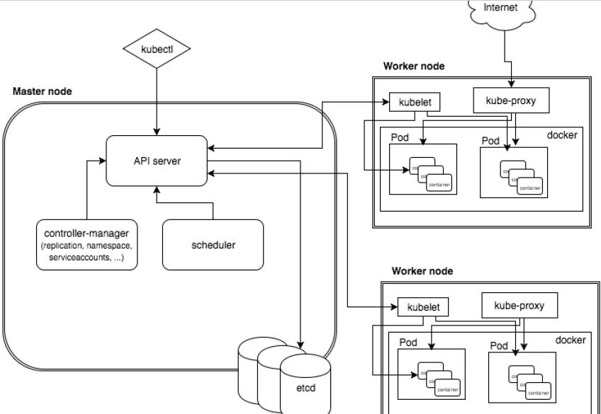
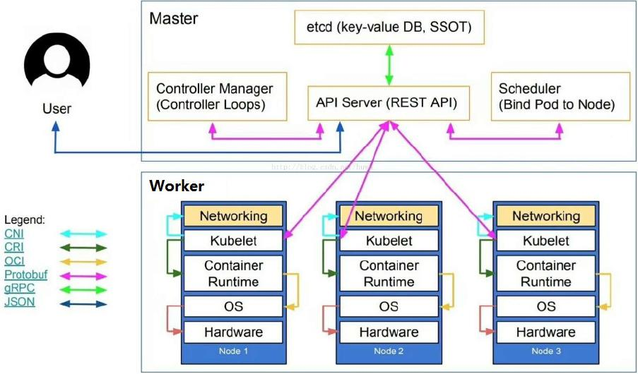

**kubernetes 概述**

# 1 、kubernetes 基本介绍

kubernetes，简称 K8s，是用 8 代替 8 个字符“ubernete”而成的缩写。是一个开源

的，用于管理云平台中多个主机上的容器化的应用，Kubernetes 的目标是让部署容器化的

应用简单并且高效（powerful）,Kubernetes 提供了应用部署，规划，更新，维护的一种

机制。

传统的应用部署方式是通过插件或脚本来安装应用。这样做的缺点是应用的运行、配

置、管理、所有生存周期将与当前操作系统绑定，这样做并不利于应用的升级更新/回滚等

操作，当然也可以通过创建虚拟机的方式来实现某些功能，但是虚拟机非常重，并不利于

可移植性。

新的方式是通过部署容器方式实现，每个容器之间互相隔离，每个容器有自己的文件

系统 ，容器之间进程不会相互影响，能区分计算资源。相对于虚拟机，容器能快速部署，

由于容器与底层设施、机器文件系统解耦的，所以它能在不同云、不同版本操作系统间进

行迁移。

容器占用资源少、部署快，每个应用可以被打包成一个容器镜像，每个应用与容器间

成一对一关系也使容器有更大优势，使用容器可以在 build 或 release 的阶段，为应用创

建容器镜像，因为每个应用不需要与其余的应用堆栈组合，也不依赖于生产环境基础结构，

这使得从研发到测试、生产能提供一致环境。类似地，容器比虚拟机轻量、更“透明”，

这更便于监控和管理。

Kubernetes 是 Google 开源的一个容器编排引擎，它支持自动化部署、大规模可伸缩、

应用容器化管理。在生产环境中部署一个应用程序时，通常要部署该应用的多个实例以便

对应用请求进行负载均衡。

在 Kubernetes 中，我们可以创建多个容器，每个容器里面运行一个应用实例，然后通

过内置的负载均衡策略，实现对这一组应用实例的管理、发现、访问，而这些细节都不需

要运维人员去进行复杂的手工配置和处理。

# 2 、kubernetes 功能和架构

## 2.1 概述

Kubernetes 是一个轻便的和可扩展的开源平台，用于管理容器化应用和服务。通过

Kubernetes 能够进行应用的自动化部署和扩缩容。在 Kubernetes 中，会将组成应用的容

器组合成一个逻辑单元以更易管理和发现。Kubernetes 积累了作为 Google 生产环境运行

工作负载 15 年的经验，并吸收了来自于社区的最佳想法和实践。

## 2.2 K 8s 功能: 

- （1  ）自动装箱

基于容器对应用运行环境的资源配置要求自动部署应用容器

- （2  ）自我修复( 自愈能力 )

当容器失败时，会对容器进行重启

当所部署的 Node 节点有问题时，会对容器进行重新部署和重新调度

当容器未通过监控检查时，会关闭此容器直到容器正常运行时，才会对外提供服务

- （3 ）水平扩展

通过简单的命令、用户 UI 界面或基于 CPU 等资源使用情况，对应用容器进行规模扩大

或规模剪裁

- （3 ）服务发现

用户不需使用额外的服务发现机制，就能够基于 Kubernetes 自身能力实现服务发现和

负载均衡

- （4）滚动更新

可以根据应用的变化，对应用容器运行的应用，进行一次性或批量式更新

- （5 ）版本回退

可以根据应用部署情况，对应用容器运行的应用，进行历史版本即时回退

- （6 ）密钥和配置管理

在不需要重新构建镜像的情况下，可以部署和更新密钥和应用配置，类似热部署。

- （7  ）存储编排

自动实现存储系统挂载及应用，特别对有状态应用实现数据持久化非常重要

存储系统可以来自于本地目录、网络存储(NFS、Gluster、Ceph 等)、公共云存储服务

- （8  ）批处理

提供一次性任务，定时任务；满足批量数据处理和分析的场景

## 2.3 应用部署架构分类

(1) 无中心节点架构

GlusterFS

(2) 有中心节点架构

HDFS

K8S

## 2.4 s k8s 集群架构

## 2.5 s k8s 集群架构节点角色功能

- Master Node

k8s 集群控制节点，对集群进行调度管理，接受集群外用户去集群操作请求；

Master Node 由 

**Controller MangerServer**

- **API server：**集群统一入口，以restful方式，交给etc存储

- **scheduler**: 节点调度，选择node节点应用部署

- **controller-manager** :处理集群中常规的后台任务，一个资源对应一个控制器

- **etcd :**存储系统，用于保存集群相关的数据

 

- Worker Node

集群工作节点，运行用户业务应用容器；

Worker Node 包含 kubelet、kube proxy 和 ContainerRuntime；

- **kubeelet**: master派到node节点的代表，管理本机的容器

- **kube-proxy:** 提供网络代理，负载均衡等操作；

