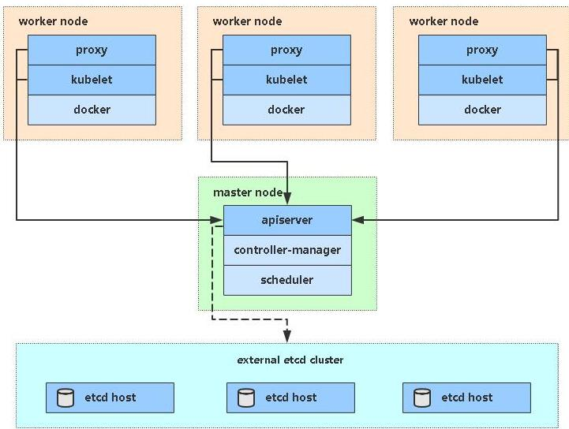

** kubernetes 集群搭建( kubead 方式)**

# 1、 前置知识点

目前生产部署 Kubernetes 集群主要有两种方式：

## （1）kubeadm

Kubeadm 是一个 K8s 部署工具，提供 kubeadm init 和 kubeadm join，用于快速部

署 Kubernetes 集群。

官方地址：[https://kubernetes.io/docs/reference/setup-tools/kubeadm/kubeadm/](https://kubernetes.io/docs/reference/setup-tools/kubeadm/kubeadm/)

## （2）二进制包

从 github 下载发行版的二进制包，手动部署每个组件，组成 Kubernetes 集群。

Kubeadm 降低部署门槛，但屏蔽了很多细节，遇到问题很难排查。如果想更容易可

控，推荐使用二进制包部署 Kubernetes 集群，虽然手动部署麻烦点，期间可以学习很

多工作原理，也利于后期维护。

# 2 、kubeadm 部署方式介绍

kubeadm 是官方社区推出的一个用于快速部署 kubernetes 集群的工具，这个工具能通

过两条指令完成一个 kubernetes 集群的部署：

第一、创建一个 Master 节点 

第二， 将 Node 节点加入到当前集群中 

# 3 、安装要求

在开始之前，部署 Kubernetes 集群机器需要满足以下几个条件：

- 一台或多台机器，操作系统 CentOS7.x-86_x64

- 硬件配置：2GB 或更多 RAM，2 个 CPU 或更多 CPU，硬盘 30GB 或更多

- 集群中所有机器之间网络互通

- 可以访问外网，需要拉取镜像

- 禁止 swap 分区

（1） 在所有节点上安装 Docker 和 kubeadm

（2）部署 Kubernetes Master

（3）部署容器网络插件

（4）部署 Kubernetes Node，将节点加入 Kubernetes 集群中

（5）部署 Dashboard Web 页面，可视化查看 Kubernetes 资源

# 5 、准备环境



- 角色			 IP

- k8s-master 	192.168.31.61

- k8s-node1 	192.168.31.62

- k8s-node2 	192.168.31.63

# 6 、系统初始化

## 6.1 关闭防火墙：

```
$ systemctl stop firewalld
$ systemctl disable firewalld
```

## 6.2 关闭 selinux：

```
$ sed -i 's/enforcing/disabled/' /etc/selinux/config # 永久
$ setenforce 0 # 临时
```

## 6.3 关闭 swap：

```
$ swapoff -a # 临时
$ vim /etc/fstab # 永久
```

## 6.4 主机名：

```
$ hostnamectl set-hostname <hostname>
```

## 6.5 在 master 添加 hosts：

```
$ cat >> /etc/hosts << EOF
192.168.31.61 k8s-master
192.168.31.62 k8s-node1
192.168.31.63 k8s-node2
EOF
```

## 6.6 将桥接的 IPv4 流量传递到 iptables 的链：

```
$ cat > /etc/sysctl.d/k8s.conf << EOF
net.bridge.bridge-nf-call-ip6tables = 1
net.bridge.bridge-nf-call-iptables = 1
EOF
$ sysctl --system         # 生效
```

## 6.7 时间同步：

```
$ yum install ntpdate -y
$ ntpdate time.windows.com
```

# 7 、所有节点安装 Docker/kubeadm/kubelet

Kubernetes 默认 CRI（容器运行时）为 Docker，因此先安装 Docker。

## （1）安装 Docker

```
$ wget 
$ yum -y install docker-ce-18.06.1.ce-3.el7
$ systemctl enable docker && systemctl start docker
$ docker --version
```

## （2）添加阿里云 YUM 软件源

### 设置仓库地址

```
cat > /etc/docker/daemon.json << EOF
{
"registry-mirrors": ["
}
EOF
$ systemctl restart  docker  #重启
$ docker info
....
Registry Mirrors:
  https://b9pmyelo.mirror.aliyuncs.com/    #镜像变为阿里云，设置成功
```

#### 添加 yum 源

```
$ cat > /etc/yum.repos.d/kubernetes.repo << EOF
[kubernetes]
name=Kubernetes
baseurl=
enabled=1
gpgcheck=0
repo_gpgcheck=0
gpgkey=
EOF
```

## （3）安装 kubeadm，kubelet 和 kubectl

```
$ yum install -y kubelet kubeadm kubectl
$ systemctl enable kubelet
```

# 8 、部署 Kubernetes Master

## （1）在 192.168.31.61（Master）执行

```
$ kubeadm init 
--apiserver-advertise-address=192.168.31.61          #当前master节点ip
--image-repository registry.aliyuncs.com/google_containers #指定镜像
--kubernetes-version v1.17.0     #指定版本
--service-cidr=10.96.0.0/12     
--pod-network-cidr=10.244.0.0/16
```

由于默认拉取镜像地址 k8s.gcr.io 国内无法访问，这里指定阿里云镜像仓库地址。

## （2）使用 kubectl 工具：

```
mkdir -p $HOME/.kube
sudo cp -i /etc/kubernetes/admin.conf $HOME/.kube/config
sudo chown $(id -u):$(id -g) $HOME/.kube/config
$ kubectl get nodes
```

# 9 、安装 Pod 网络插件（CNI） ）

```
$ kubectl apply –f
```

确保能够访问到 quay.io 这个 registery。如果 Pod 镜像下载失败，可以改这个镜像地址

# 10 、加入 Kubernetes Node

## （1）在 192.168.31.62/63（Node）执行

向集群添加新节点，执行在 kubeadm init 输出的 kubeadm join 命令：

```
$ kubeadm join 192.168.31.61:6443 --token esce21.q6hetwm8si29qxwn 
--discovery-token-ca-cert-hash
sha256:00603a05805807501d7181c3d60b478788408cfe6cedefedb1f97569708be9c5
```

# 11 、测试 kubernetes 集群

在 Kubernetes 集群中创建一个 pod，验证是否正常运行：

```
$ kubectl create deployment nginx --image=nginx
$ kubectl expose deployment nginx --port=80 --type=NodePort
$ kubectl get pod,svc
```

访问地址：[http://NodeIP:Port](http://NodeIP:Port)