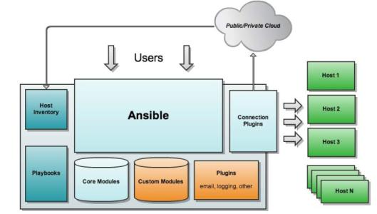

**Ansible自动化运维工具**

# 1、介绍

ansible是新出现的自动化运维工具，由python开发，集合了众多自动化运维工具的优点，实现了批量

系统部署、批量程序部署，批量运行命令等功能。ansible是基于模块工作的，本身没有批量部署的能

力，真正具有批量部署能力的是ansible运行的模块，ansible只是提供一个框架。

## 1）核心组件



- ansbile：核心程序

- modules：包括ansible自带的核心模块以及自定义模块

- plugins：完成模块功能的补充，包括连接插件，邮箱插件

- palybooks：剧本，定义ansbile多任务配置文件，由ansible自动执行

- inventory：定义ansbile管理的主机清单

- connection plugins：负责和被监控端实现通信

## 2）特点

- 不需要在被监控端上安装任何服务程序

- 无服务器端，使用时直接运行命令即可

- 基于模块工作，可以使用任意语言开发

- 使用yaml语言编写playbook

- 基于ssh工作

- 可实现多级指挥

- 具有幂等性，一种操作重复多次执行结果相同

# 2、安装部署ansible

## 1）安装ansible

```
[root@localhost ~]# yum install epel-release.noarch -y
[root@localhost ~]# yum install -y ansible
```

## 2)免密登录

```
# 生成密钥对
[root@server1 ~]# ssh-keygen -P "" -t rsa
# 将公钥发送给需要被管理端，需要输入对方的免密
[root@server1 .ssh]# ssh-copy-id -i /root/.ssh/id_rsa.pub root@server2
```

## 3)常用命令

```
ansible：临时命令执行工具，常用于执行临时命令
ansible-doc：常用于模块功能的查询
ansible-playbook：用于执行剧本
```

## 4)常见配置文件

```
/etc/ansible/ansible.cfg：主配置文件
/etc/ansible/hosts：主机清单文件
/etc/ansible/roles：角色目录
```

```
[defaults]
# some basic default values...
#inventory   = /etc/ansible/hosts                   
#定义主机清单文件
#library    = /usr/share/my_modules/                # 库
文件的存放位置
#module_utils  = /usr/share/my_module_utils/     
#remote_tmp   = ~/.ansible/tmp                      
 # 生成的临时py文件在远程主机的目录
#local_tmp   = ~/.ansible/tmp                      
 # 生成的临时py文件在本地主机的目录
#plugin_filters_cfg = /etc/ansible/plugin_filters.yml  #
#forks     = 5               # 默认的并发数
#poll_interval = 15              # 默认的线程池
#sudo_user   = root           # 默认的sudo用户
#ask_sudo_pass = True       
#ask_pass   = True
#transport   = smart
#remote_port  = 22         #远程端口默认22
#module_lang  = C
#module_set_locale = False
```

## 5)ansible参数说明

```
-a MODULE_ARGS：    指定模块的参数
-m MODULE_NAME：    指定模块
-C：                不要执行，预测以下可能会发生的事情，相当于检查
-e EXTRA_VARS：    指明变量名 ，extra:额外的；vars,变量，额外的变量
-f FORKS：        指定并发进程数，fork，岔路口，多条路，->并发数
-i INVENTORY：    指定主机清单文件，invetory:存货，清单；
--syntax-check：   检查执行命令是否存在语法错误，  syntax:语法，句法
```