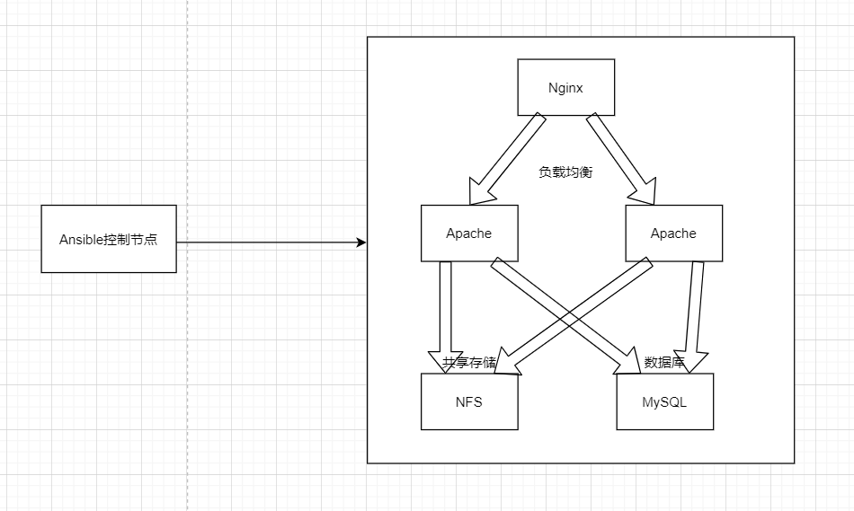
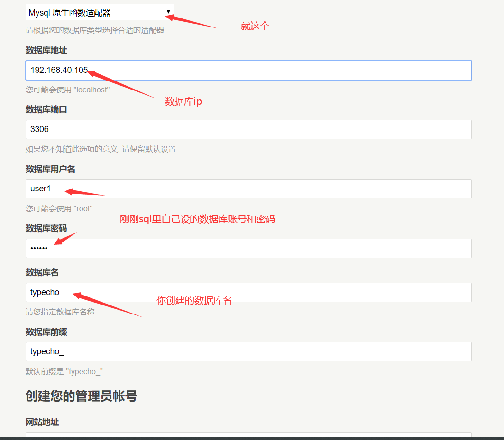

**Playbook**

# 1、简介

playbook是由一个或者多个play组成的列表，可以让这些列表按事先编排的机制执行；所谓task是调用

ansible的具体模块，在模块参数中可以使用变量。模块执行是幂等性的，意味着多次执行结果相同。使

用yaml语言编写playbook，后缀名一般为.yml

# 2、特点

yaml语言的参考博客[http://www.ruanyifeng.com/blog/2016/07/yaml.html](http://www.ruanyifeng.com/blog/2016/07/yaml.html)

- yaml的可读性好

- yaml和脚本语言的交互性好

- yaml使用实现语言的数据类型

- yaml有一个一致性的信息模型

- yaml易于实现

- yaml可以基于流来处理

**核心字段**

- hosts：执行的远程主机列表

- tasks：任务，由模块定义操作列表

- variables：内置变量或者自定义变量

- templates：模板，定义模板文件，模板文件一般是由jinja2语言编写的

- handlers：和nogity结合使用，为条件触发操作，满足条件则执行

- roles：角色

# 3、官方示例

在线检测工具：[http://www.yamllint.com/](http://www.yamllint.com/)

```
- name: update web servers    #项目描述
hosts: webservers 
remote_user: root    #指定远程用户
tasks:    
- name: ensure apache is at the latest version
  yum:
  name: httpd
  state: latest
- name: write the apache config file
 template:
  src: /srv/httpd.j2
  dest: /etc/httpd.conf
  
- name: update db servers  #项目描述
hosts: databases
remote_user: root  
tasks:
- name: ensure postgresql is at the latest version
 yum:
  name: postgresql
  state: latest
- name: ensure that postgresql is started
 service:
  name: postgresql
  state: started
```

## 1）案例，apache虚拟主机

### 准备配置文件

```
[root@server1 playbook]# cat /root/playbook/file/site2.conf
Listen 8080
Listen 9090
<Directory "/data/">
Require all granted
</Directory>
<VirtualHost *:8080>
DocumentRoot "/data/site1/"
</VirtualHost>
<VirtualHost *:9090>
DocumentRoot "/data/site2/"
</VirtualHost>
```

### 准备剧本文件

```
[root@server1 playbook]# cat apache-virtualhost-port.yaml
- name: Update web servers
hosts: node1
remote_user: root
tasks:
 - name: ensure apache is the latest version
   yum:
     name: httpd
     state: latest
 - name: copy site2.conf to apache web server
   copy:
     src: /root/playbook/file/site2.conf
     dest: /etc/httpd/conf.d/site2.conf
 - name: create directory1 for apache web server
   file:
     name: /data/site1/
     state: directory
 - name: create directory2 for apache web server
   file:
     name: /data/site2/
     state: directory
 - name: write index.html
   shell: echo "site1" > /data/site1/index.html && echo "site2" >
 /data/site2/index.html
 - name: start apache web server
   service:
     name: httpd
     state: restarted
 - name: test virtual hosts
   shell: curl 192.168.80.20:8080 && curl 192.168.80.20:9090
```

### 执行

```
[root@server1 playbook]# ansible-playbook apache-virtualhost-port.yaml --
syntax-check
[root@server1 playbook]# ansible-playbook apache-virtualhost-port.yaml
```

### 测试

```
[root@server1 playbook]# curl 192.168.80.20:8080
site1
[root@server1 playbook]# curl 192.168.80.20:9090
site2
```

## 2）案例，安装nginx并且修改配置文件

```
第一步，准备文件存放目录
 [root@eagle ~]# mkdir -p /root/ansible/{conf,bin}
 第二步，书写YAML文件
 [root@eagle bin]# cat nginx.yaml 
- hosts: server2
  remote_user: root
  vars:
  hello: Ansible
  tasks:
    - name: Install epel
      yum:
      name: epel-release.noarch
      state: latest
- name: Install nginx
  yum:
  name: nginx
  state: present
- name: Copy nginx configure file
  copy:
  src: /root/ansible/conf/site.conf
  dest: /etc/nginx/conf.d/site.conf
- name: Start nginx
  service:
  name: nginx
  state: restarted
- name: Create index.html
 shell: echo "nginx1" > /usr/share/nginx/html/index.html
第三步，书写conf文件
 [root@eagle bin]# cat site.conf 
server {
listen 8080;
server_name 192.168.80.50:8080;
location / {
index index.html;
 }
 }
第四步，检查语法错误，没有错误则继续执行
 [root@eagle bin]# ansible-playbook nginx.yaml --syntax-check
 [root@eagle bin]# ansible-playbook nginx.yaml
```

# 4、变量

- 变量的来源

- 远程主机的所有变量都可以使用 ansible -m setup nodes

- 自定义变量

- 优先级

- 通过命令行指定变量优先级最高

- /etc/ansible/hosts定义变量（针对单个主机定义，针对主机组进行定义）

- playbook中定义的变量

# 5、模板

- 文本文件，内部嵌套有模板语言的脚本

- jinja2是由python编写的，在使用模板文件时jinja2是很好的解决方案

- 功能：将模板文件中的变量转换成对应的本地主机的确定值

- 语法

- 字符串：使用单引号或者双引号代表字符串

- 数字

- 列表：使用中括号括起来表示的是列表[ ]

- 元组：使用小括号表示元组( )

- 字典：使用大括号表示字典{ }

- 算数运算：+ - * / .........

- 比较操作：== != > < .........

- 逻辑运算：and or not

## 1）变量

```
{{name}} 
```

## 2）控制语句

```

{{name}}

{{name2}}

```

## 3)宏

```


<p> {{user}} </p>



{{ macros.check_user(user) }}
```

## 4)模版继承

```
#base.html
<html>
<head>
 
<title>
 
 
</title>
 
</head>
  <body>
   
   
  </body>
</html>
```

## 5)子模版

```


{{ super() }}


Index


<h1>hello world</h1>

```

## 6)案例，生成hosts解析文件

使用模板替远程主机生成hosts解析文件

### 准备模板文件

```
[root@server1 ~]# cat hosts.j2
127.0.0.1  localhost localhost.localdomain localhost4
localhost4.localdomain4
::1     localhost localhost.localdomain localhost6
localhost6.localdomain6

{{hostvars[host].ansible_ens33.ipv4.address}}
{{hostvars[host].ansible_hostname}}

------------------------
常见变量
主机名: "{{ ansible_hostname }}"
操作系统版本: "{{ ansible_distribution }}" "{{ ansible_distribution_version
}}"
内核版本: "{{ ansible_kernel }}"
系统位数: "{{ ansible_userspace_bits }}"
网卡："{{ ansible_eth0["device"] }}"
IP地址: "{{ ansible_eth0["ipv4"]["address"] }}"
子网掩码: "{{ ansible_eth0["ipv4"]["netmask"] }}"
总内存: "{{ ansible_memory_mb["real"]["total"] }}"
内存空闲: "{{ ansible_memfree_mb }}"
```

### 编写剧本

```
[root@server1 ~]# cat hosts.yml
- name: Config hosts file
  hosts: servers
  remote_user: root
  tasks:
    - name: copy hosts.j2 to group servers
      template:
        src: hosts.j2
        dest: /etc/hosts
```

### 执行剧本

```
[root@server1 ~]# ansible-playbook hosts.yml
```

### 验证

```
[root@server2 ~]# cat /etc/hosts
127.0.0.1  localhost localhost.localdomain localhost4
localhost4.localdomain4
::1     localhost localhost.localdomain localhost6
localhost6.localdomain6
192.168.80.20 server2
192.168.80.30 server3
192.168.80.40 server4
```

## 7)案例，生成nginx配置文件

```
cat templnginx4.yaml
- hosts: test
remote_user: root
vars:
 nginx_vhosts:
   - web1:
   listen: 8080
   root: "/var/www/nginx/web1/"
   - web2:
   listen: 8080
   server_name: "web2.baidu.com"
   root: "/var/www/nginx/web2/"
   - web3:
   listen: 8080
   server_name: "web3.baidu.com"
   root: "/var/www/nginx/web3/"
tasks:
  - name: template config to
  template: src=./template/nginx.conf3.j2 dest=/data/nginx3.conf
cat template/nginx.conf3.j2

server {
listen {{ vhost.listen }}

server_name {{ vhost.server_name }}

root {{ vhost.root }}
}

输出结果：
cat nginx3.conf
server {
listen 8080
root /var/www/nginx/web1/
}
server {
listen 8080
server_name web2.baidu.com
root /var/www/nginx/web2/
}
server {
listen 8080
server_name web3.baidu.com
root /var/www/nginx/web3/
}
```

# 6、条件判断

```
- name: restart Nginx
 service: name=nginx state=restarted
 when: ansible_distribution_major_version == "6"
```

# 7、循环迭代

```
#基于字符串列表
tasks:
- name: create rsyncd file
  copy: src={{ item }} dest=/tmp/{{ item }}
  with_items:
    - a
    - b
    - c
    - d
*with_itmes 嵌套子变量*
#基于字典列表
- hosts: eagleslab
remote_user: root
tasks:
- name: add several users
 user: name={{ item.name }} state=present groups={{ item.groups }}
 with_items:
  - { name: 'testuser1' , groups: 'wheel'}
  - { name: 'testuser2' , groups: 'root' }
```

## 1）使用循环创建用户和组，完成：创建组，用循环创建用户

### 编写playbook

```
[root@server1 ~]# cat user_manage.yml
- name: Manage user
hosts: server2
remote_user: root
tasks:
 - name: ensure group eagles exists
 group:
  name: eagles
 - name: create users zhangsan and lisi
 user: name={{ item.name }} group={{ item.group }} state=present
 with_items:
   - { name: 'zhangsan', group: 'eagles' }
   - { name: 'lisi', group: 'eagles' }
```

### 执行

```
[root@server1 ~]# ansible-playbook user_manage.yml 
```

### 验证

```
[root@server2 ~]# id zhangsan
uid=1000(zhangsan) gid=1001(eagles) 组=1001(eagles)
[root@server2 ~]# id lisi
uid=1001(lisi) gid=1001(eagles) 组=1001(eagles)
```

## 2）案例，循环创建用户

```
循环创建用户，用户信息如下
名称、组、家目录、shell、描述信息
zhangsan xsb /home/xsb/zhangsan  /bin/bash  销售
lisi   xsb   /home/xsb/lisi   /bin/bash  销售
wangwu  jsb  /home/jsb/wangwu  /bin/sh  java工程师
maliu  jsb   /home/jsb/maliu   /bin/sh   linux工程师
zhaoqi  cwb  /home/cwu/zhaoqi   /bin/sh  会计
循环创建出以上用户并指定用户信息
```

# 8、角色

```
[root@eagle roles]# tree /etc/ansible/roles/
/etc/ansible/roles/
├── http
│ ├── defaults
│ ├── files
│ ├── handlers
│ ├── meta
│ ├── tasks
│ ├── template
│ └── vars
├── mysql
├── redis
└── site.yaml
目录结构
- tasks：此目录中至少有一个名为main.yaml文件，用于定义各种task，其他文件需要由
main.yaml文件进行调用
- handlers：此目录中至少有一个名为main.yaml文件，用于定义各种handler，其他文件需要被
main.yaml进行调用
- vars：此目录中至少有一个名为main.yaml文件，用于定义各种变量，其他文件需要被main.yaml
        进行调用
- templates：存储template模块调用的模板文件
- meta：此目录中至少有一个名为main.yaml文件，定义当前角色的设定及其依赖关系，其他的文件
        需要被main.yaml文件进行调用
- default：此目录中至少有一个main.yaml文件，用于设定默认的值
- files：此目录存放copy或者script等模块调用的文件
```

## 1）案例，使用角色安装httpd

### 第一步，准备相关目录

```
[root@eagle tasks]# tree -a /etc/ansible/roles/
/etc/ansible/roles/
├── http
│ ├── defaults
│ │ └── main.yaml
│ ├── files
│ ├── handlers
│ │ └── main.yaml
│ ├── meta
│ │ └── main.yaml
│ ├── tasks
│ │ └── main.yaml
│ ├── template
│ └── vars
├── mysql
├── redis
└── site.yaml
[root@server1 roles]# ansible-galaxy init apache
 - Role apache was created successfully
```

### 第二步，书写site.yaml文件

```
[root@eagle tasks]# cat /etc/ansible/roles/site.yaml 
- hosts: node2
 remote_user: root
 roles:
    - http
```

### 第三步，书写tasks里的main.yaml文件

```
[root@eagle tasks]# cat main.yaml 
- name: Install httpd
 yum:
name: httpd
state: present 
- name: Start httpd
 service:
name: httpd
state: restarted
- name: Write conf file
 shell: echo "httpd2" > /var/www/html/index.html
- name: Curl web
 shell: curl 192.168.80.60
```

### 第四步，验证语法并执行

```
[root@eagle roles]# ansible-playbook site.yaml --syntax-check
[root@eagle tasks]# ansible-playbook /etc/ansible/roles/site.yaml
```

### 第五步，验证结果

```
[root@eagle tasks]# curl 192.168.80.60
httpd2
```

## 2）案例，使用角色安装java+nginx+halo

角色参考案例：[https://www.wumingx.com/linux/ansible-roles.html](https://www.wumingx.com/linux/ansible-roles.html)

使用role的方式来安装halo，相对来说，结构会比较清晰明了。还是使用ansible去自动部署halo博客系

统。功能很简单，就是在一台机器上面自动部署java+halo+nginx服务

### 准备角色

```
[root@server1 roles]# ansible-galaxy init halo
- Role halo was created successfully
[root@server1 roles]# ansible-galaxy init java
- Role java was created successfully
[root@server1 roles]# ansible-galaxy init nginx
- Role nginx was created successfully
```

### 编写site.yaml，pre_tasks为运行play之前执行的任务，post_tasks为运行play之后执行的任务

```
[root@server1 roles]# cat site.yaml
---
 - hosts: server2
 remote_user: root
 strategy: free
 pre_tasks:
   - name: config nginx repo for centos 7
   yum_repository:
    name: nginx
    description: nginx
    baseurl: http://nginx.org/packages/centos/$releasever/$basearch/
    gpgcheck: no
   when: ansible_distribution_major_version == "7"
   - name: Disable SELinux
   selinux: state=disabled
 roles:
   - nginx
 post_tasks:
   - shell: echo 'Deplay halo finished.'
   register: ret
   - debug: var=ret.stdout
```

### 编写nginx角色

```
[root@server1 roles]# cat nginx/tasks/main.yml
---
# tasks file for nginx
 - name: make sure nginx state is installed
 yum: name=nginx state=installed
 - name: copy halo to nginx config file
 template: src=halo.conf dest="/etc/nginx/conf.d/halo.conf"
 - name: make sure nginx service is running
  service: name=nginx state=started
 - name: make sure port is open
 wait_for: port="{{ nginx_port }}"
# meta/main.yml为role的依赖关系，要先运行这里面的内容才会运行自己的nginx这个role。
[root@server1 roles]# cat nginx/meta/main.yml
dependencies:
 # List your role dependencies here, one per line. Be sure to remove the
'[]' above,
 # if you add dependencies to this list.
 - role: java
 - role: halo
[root@server1 roles]# cat nginx/templates/halo.conf
upstream halo {
server 127.0.0.1:8090;
}
server {
listen 80;
listen [::]:80;
server_name {{ halo_domain }};
client_max_body_size 1024m;
location / {
 proxy_pass http://halo;
 proxy_set_header HOST $host;
 proxy_set_header X-Forwarded-Proto $scheme;
 proxy_set_header X-Real-IP $remote_addr;
 proxy_set_header X-Forwarded-For $proxy_add_x_forwarded_for;
}
}
```

### 编写java角色，这个角色的任务就是安装java

```
root@server1 roles]# cat java/tasks/main.yml
---
# tasks file for java
 - name: install java
 yum: name=java-11-openjdk state=installed
```

### 编写halo角色

```
[root@server1 roles]# cat halo/tasks/main.yml
---
# tasks file for halo
 - name: get halo
 get_url: url=https://dl.halo.run/release/halo-1.4.11.jar dest={{
halopath }}
 - name: add halo service file
 template: src=halo.service dest=/etc/systemd/system/halo.service
 - name: touch ~/.halo directory
 file: path=~/.halo state=directory
 - name: copy halo config file
 template: src=application.yaml dest="~/.halo/application.yaml"
 - name: restart halo
 systemd:
  daemon_reload: yes
  name: halo
  state: started
  enabled: yes
 - name: wait to start halo
 wait_for: port={{ halo_port }}
[root@server1 roles]# cat halo/vars/main.yml
---
# vars file for halo
memory: 512m
halo_port: 8090
halopath: /root/halo.jar
halo_domain: 192.168.80.20
nginx_port: 80
# 下载service文件并编辑
[root@server1 roles]# wget https://dl.halo.run/config/halo.service -O
halo/templates/halo.service
[root@server1 roles]# cat halo/templates/halo.service
[Unit]
Description=Halo Service
Documentation=https://docs.halo.run
After=network-online.target
Wants=network-online.target
[Service]
Type=simple
User=root
ExecStart=/usr/bin/java -server -Xms256m -Xmx256m -jar /root/halo.jar
ExecStop=/bin/kill -s QUIT $MAINPID
Restart=always
StandOutput=syslog
StandError=inherit
[Install]
WantedBy=multi-user.target
[root@server1 roles]# wget https://dl.halo.run/config/application-
template.yaml -O halo/templates/application.yaml
```

### 运行site.taml

```
[root@server1 roles]# ansible-playbook site.yaml 
```

# 9、综合案例

环境准备：六台节点

一台管理节点

一台nginx作为负载均衡器

两台apache作为web服务器

一台作为mariadb数据库

一台作为网站存储（nfs）

1. 工作流程（主机清单文件、ssh通信、免密登录、生成py脚本、sleep0退出）

1. 更换远程主机的yum仓库（更换为国内的源速度更快）

1. 安装httpd、mariadb、nginx

1. 使用模板给httpd准备配置文件，使用ansible-galaxy安装负载均衡角色

1. 使用parted模块创建分区，使用lvg模块创建卷组，使用lvol模块创建逻辑卷，逻辑卷作为nfs存储使用

1. 使用shell模块为数据库添加指定库、用户等操作



### 1）在管理节点编写ansible主机清单文件，server1是管理结点，server2是负载均衡结点，server3和server4是apache web结点，server5是mariadb结点，server6是nfs结点

```
vim /etc/ansible/hosts
[all_ip]
192.168.80.10
192.168.80.20
192.168.80.30
192.168.80.40
192.168.80.50
192.168.80.60
[all_hostname]
server2
server3
server4
server5
server6
[nginx]
server2
[apache]
server3
server4
[mariadb]
server5
[nfs]
server6
```

### 2）为所有主机生成hosts解析文件

```
[root@server1 playbook]# cat ../template/hosts.j2 
127.0.0.1  localhost localhost.localdomain localhost4
localhost4.localdomain4
::1     localhost localhost.localdomain localhost6
localhost6.localdomain6

{{hostvars[host].ansible_ens33.ipv4.address}}
{{hostvars[host].ansible_hostname}}

[root@server1 playbook]# cat hosts.yml
- name: Config hosts file
hosts: all_ip
remote_user: root
tasks:
 - name: copy hosts.j2 to group servers
 template:
  src: ../template/hosts.j2
  dest: /etc/hosts
```

### 3）更换阿里yum源，使用file模块把所有受控节点的/etc/yum.repos.d/下的所有文件删除，使用copy模块把准备好的.repo文件copy到所有受控节点

```
[root@server1 playbook]# cat /etc/ansible/roles/ali_yum_repo/tasks/main.yml
---
# tasks file for /etc/ansible/roles/ali_yum_repo
- name: Find files in yum.repos.d/*
find:
 paths: /etc/yum.repos.d/
 patterns: '*'
register: files_to_delete
- name: Remove original yum.repos.d/*
file:
 path: "{{ item.path }}"
 state: absent
with_items: "{{ files_to_delete.files }}"
- name: Copy aliyun yum.repo to all nodes
copy:
 src: yum.repo
 dest: /etc/yum.repos.d/
 
[root@server1 playbook]# cat yum_repo_role_use.yml
- name: Update all nodes yum.repo file
hosts: all_hostname
roles:
- ali_yum_repo
[root@server1 playbook]# ls /etc/ansible/roles/ali_yum_repo/files/yum.repo
/etc/ansible/roles/ali_yum_repo/files/yum.repo
```

### 4）编写yml安装nginx、httpd、mariadb并打开防火墙，设置防火墙放行服务

```
[root@server1 playbook]# ansible-galaxy init /etc/ansible/roles/apache
- Role /etc/ansible/roles/apache was created successfully
[root@server1 playbook]# ansible-galaxy init /etc/ansible/roles/nginx
- Role /etc/ansible/roles/nginx was created successfully
[root@server1 playbook]# ansible-galaxy init /etc/ansible/roles/mariadb
- Role /etc/ansible/roles/mariadb was created successfully
[root@server1 playbook]# ansible-galaxy init /etc/ansible/roles/nfs
- Role /etc/ansible/roles/nfs was created successfully
[root@server1 ~]# cat /etc/ansible/roles/nginx/tasks/main.yml
---
# tasks file for /etc/ansible/roles/nginx
- name: Yum install epel
yum:
 name: epel-release.noarch
 state: present
- name: Yum install nginx
yum:
 name: nginx
 state: present
- name: Start nginx
service:
 name: nginx
 state: restarted
 enabled: yes
 
[root@server1 playbook]# cat nginx_install.yml
- name: Install nginx
hosts: server2
roles:
- nginx
[root@server1 playbook]# cat /etc/ansible/roles/apache/tasks/main.yml
---
# tasks file for /etc/ansible/roles/apache
- name: Install lapm environment
yum:
 name: httpd,php-fpm,php-mysql,mod_php
 state: present
- name: Start httpd
service:
 name: httpd
 state: restarted
- name: Start php-fpm
service:
 name: php-fpm
 state: restarted
[root@server1 playbook]# cat lamp_install.yml
- name: Prepare lamp
hosts: server3,server4
roles:
- apache
 
[root@server1 playbook]# cat /etc/ansible/roles/mariadb/tasks/main.yml
---
# tasks file for /etc/ansible/roles/mariadb
- name: Yum install mariadb
yum:
 name: mariadb-server
 state: present
- name: Start mariadb
service:
 name: mariadb
 state: restarted
 
[root@server1 playbook]# cat mariadb_install.yml
- name: Install mariadb
hosts: server5
roles:
- mariadb
```

### 5）准备负载均衡角色

```
[root@server1 playbook]# cat roles/nginx_lb/templates/lb.conf.j2
upstream websers{
server server3;
server server4;
}
server{
listen 8080;
server_name 192.168.80.20:8080;
location / {
proxy_pass http://websers;
}
}
[root@server1 playbook]# cat roles/nginx_lb/tasks/main.yml
---
# tasks file for /etc/ansible/roles/nginx_lb
- name: Configure ngin LB conf file
template:
 src: lb.conf.j2
 dest: /etc/nginx/conf.d/lb.conf
- name: Restart nginx
 service:
 name: nginx
 state: restarted
[root@server1 playbook]# cat nginx_lb.yml
- name: Configure nginx lb server
hosts: server2
roles:
 - nginx_lb
```

```
[root@node1 balancer]# cat tasks/main.yml
---
# This playbook installs HAProxy and HTTPd and configures it.
- name: Install haproxy
yum:
 name: "{{ item }}"
 state: present
with_items:
 - haproxy
when: inventory_hostname in groups['nginx']
- name: Configure the haproxy cnf file
template:
 src: templates/haproxy.cfg.j2
 dest: /etc/haproxy/haproxy.cfg
 owner: root
 group: root
 mode: 0644
notify: restart haproxy
when: inventory_hostname in groups['nginx']
- name: Start the haproxy service
service:
 name: haproxy
 state: started
 enabled: yes
when: inventory_hostname in groups['nginx']
- name: Install firewalld
yum:
 name: firewalld
 state: present
when: inventory_hostname in groups['nginx']
- name: Start and enable firewalld
service:
 name: firewalld
 state: started
 enabled: yes
when: inventory_hostname in groups['nginx']
- name: Enable http in firewall
firewalld:
 service: http
 permanent: true
 state: enabled
 immediate: true
when: inventory_hostname in groups['nginx']
- name: Install Apache
yum:
 name: httpd
 state: present
when: inventory_hostname in groups['apache']
- name: Install firewalld
yum:
 name: firewalld
 state: present
when: inventory_hostname in groups['apache']
- name: Copy the index_ver.html.j2
template:
 src: templates/index_ver.html.j2
 dest: /var/www/html/index.html
 owner: root
 group: root
 mode: 0644
notify: restart httpd
when: inventory_hostname in groups['apache']
- name: Start and enable firewalld
service:
 name: firewalld
 state: started
 enabled: yes
when: inventory_hostname in groups['apache']
- name: Enable http in firewall
firewalld:
 service: http
 permanent: true
 state: enabled
 immediate: true
when: inventory_hostname in groups['apache']
- name: Start and enable httpd
service:
 name: httpd
 state: started
 enabled: yes
when: inventory_hostname in groups['apache']
[root@node1 balancer]# cat templates/haproxy.cfg.j2
global
 log     127.0.0.1 local2
 chroot   /var/lib/haproxy
 pidfile   /var/run/haproxy.pid
 maxconn   4000
 user    root
 group    root
 daemon
  # turn on stats unix socket
 stats socket /var/lib/haproxy/stats level admin
 defaults
 mode          http
 log           global
 option         httplog
 option         dontlognull
 option http-server-close
 option forwardfor    except 127.0.0.0/8
 option         redispatch
 retries         3
 timeout http-request  10s
 timeout queue      1m
 timeout connect     10s
 timeout client     1m
 timeout server     1m
 timeout http-keep-alive 10s
 timeout check      10s
 maxconn         3000
frontend main
 bind  {{ ansible_default_ipv4.address }}:80
 default_backend app
backend app
 balance roundrobin
 server 192.168.40.103 192.168.40.103 check port 80
 server 192.168.40.104 192.168.40.104 check port 80
#这里server后跟的ip改为你自己apache服务器的ip
```

### 6）使用parted模块创建分区，使用lvg模块创建卷组，使用lvol模块创建逻辑卷，把逻辑卷挂载到本地文件夹，逻辑卷作为nfs存储使用。在nfs服务器下载nfs-utils和rpcbind软件并启用服务，打开防火墙nfs和mountd服务以便后续挂载，使用mount模块把apache服务根目录挂载到nfs服务器

```
[root@server1 playbook]# cat roles/lvm_create/tasks/main.yml
# tasks file for /etc/ansible/roles/lvm_create
- name: Create partion
parted:
 device: /dev/sdb
 number: 1
 flags: [ lvm ]
 state: present
 part_start: 1MiB
 part_end: 2GiB
- name: Create vg
lvg:
 vg: vg-nfs
 pvs: /dev/sdb1
- name: Create lvm 1G
lvol:
 vg: vg-nfs
 lv: lv-nfs
 size: 1G
- name: Format lv-nfs
filesystem:
 fstype: ext4
 dev: /dev/vg-nfs/lv-nfs
- name: Mkdir nfs dir
file:
 path: /nfs
 state: directory
- name: Mount lvm
mount:
 path: /nfs
 src: /dev/vg-nfs/lv-nfs
 fstype: ext4
 state: mounted
 opts: noatime
 
[root@server1 playbook]# cat lv_create.yml
- name: Create lvm for nfs
hosts: server6
roles:
 - lvm_create
 - name: create vg
hosts: nfs
tasks:
 - name: create partition
  parted:
   device: /dev/sdb
   number: 1
   flags: [ lvm ]
   state: present
   part_start: 1MiB
   part_end: 2GiB
 - name: create nfs vg
  lvg:
   vg: nfs
   pvs: /dev/sdb1
 - name: create lv
  block:
   - name: create lvm 1500m
    lvol:
     vg: nfs
     lv: data
     size: 1900m
  rescue:
   - name: file msg
    debug:
     msg: create lv failed
   - name: create lvm 800m
    lvol:
     vg: nfs
     lv: data
     size: 800m
  always:
      - name: format lvm
    filesystem:
     fstype: ext4
     dev: /dev/nfs/data
  when: "'nfs' in ansible_lvm.vgs"
 - name: nfs not exists
  debug:
   msg: vg does not exist
  when: "'nfs' not in ansible_lvm.vgs"
- name: install nfs pkg and mount nfs lvs
hosts: nfs
tasks:
 - name: install package
  yum:
   name: nfs-utils,rpcbind
   state: latest
 - name: config file
  shell: mkdir /nfs | chmod -Rf 777 /nfs | echo "/nfs
192.168.40.0/24(rw,sync,no_root_squash)" > /etc/exports
 - name: start services
  service:
   name: "{{ item }}"
   state: restarted
  loop:
   - rpcbind
   - nfs-server
 - name: open nfs,mountd
  firewalld:
   zone: public
   service: "{{ item }}"
   permanent: yes
   immediate: yes
   state: enabled
  loop:
   - nfs
   - mountd
 - name: mount lv
  mount:
   src: localhost:/dev/nfs/data
   path: /nfs
   fstype: nfs
   state: mounted
- name: mount apache
hosts: apache
tasks:
 - name: mount apache
  mount:
   src: 192.168.40.106:/nfs
   path: /var/www/html
   fstype: nfs
```

### 7）然后将上面的所有任务全部汇总到一个任务中去（提醒，如果汇总的话需要注意将有些文件或者模板的路径写成绝对路径）

```
[root@server1 playbook]# cat all.yml
- name: Update hosts file
hosts: all_ip
remote_user: root
tasks:
 - name: copy hosts.j2 to group servers
 template:
  src: ../template/hosts.j2
  dest: /etc/hosts
- name: Update yum.repo file
hosts: all_hostname
remote_user: root
tasks:
 - include_tasks: /etc/ansible/roles/ali_yum_repo/tasks/main.yml
- name: Install nginx
hosts: server2
remote_user: root
tasks:
 - include_tasks: /etc/ansible/roles/nginx/tasks/main.yml
- name: Install apache
hosts: apache
remote_user: root
tasks:
 - include_tasks: /etc/ansible/roles/apache/tasks/main.yml
- name: Install mariadb
hosts: server5
remote_user: root
tasks:
 - include_tasks: /etc/ansible/roles/mariadb/tasks/main.yml
- name: Configure nginx lb server
hosts: server2
remote_user: root
tasks:
 - include_tasks: /etc/ansible/roles/nginx_lb/tasks/main.yml
- name: Create lvm for nfs
hosts: server6
remote_user: root
tasks:
 - include_tasks: /etc/ansible/roles/lvm_create/tasks/main.yml
```

### 8）在nfs服务器nfs目录下下载typecho软件包并解压

```
wget http://typecho.org/downloads/1.1-17.10.30-release.tar.gz
tar -zxvf 1.1-17.10.30-release.tar.gz
mv build/* .
```

### 9）使用shell模块为数据库添加指定库、用户等操作

```
create database typecho;
grant all privileges on typecho.* to user1@"%" identified by '123456';
flush privileges;
```

### 10）最后网址访问即可

