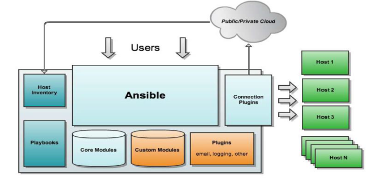
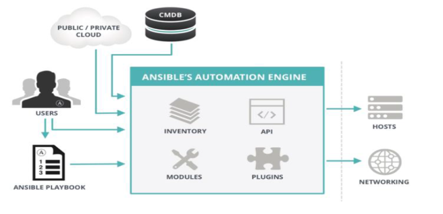

### **Ansible架构**



### **Ansible工作原理**



### **Ansible主要组成部分**

```
ANSIBLE PLAYBOOKS：任务剧本（任务集），编排定义Ansible任务集的配置文件，
                   由Ansible顺序依次执行，通常是JSON格式的YML文件
INVENTORY：Ansible管理主机的清单  /etc/anaible/hosts
MODULES：  Ansible执行命令的功能模块，多数为内置核心模块，也可自定义
PLUGINS：  模块功能的补充，如连接类型插件、循环插件、变量插件、过滤插件等，该功能不常用
API：      供第三方程序调用的应用程序编程接口 
ANSIBLE：  组合INVENTORY、API、MODULES、PLUGINS的绿框，可以理解为是ansible命令工具，其为核心执行工具
```

```
Ansible命令执行来源：
    1> USER，普通用户，即SYSTEM ADMINISTRATOR
    2> CMDB（配置管理数据库） API 调用
    3> PUBLIC/PRIVATE CLOUD API调用  (公有私有云的API接口调用)
    4> USER-> Ansible Playbook -> Ansibile

利用ansible实现管理的方式：
    1> Ad-Hoc 即ansible单条命令，主要用于临时命令使用场景
    2> Ansible-playbook 主要用于长期规划好的，大型项目的场景，需要有前期的规划过程
```

```
Ansible-playbook（剧本）执行过程
    将已有编排好的任务集写入Ansible-Playbook
    通过ansible-playbook命令分拆任务集至逐条ansible命令，按预定规则逐条执行

Ansible主要操作对象
   HOSTS主机
   NETWORKING网络设备

注意事项:
   执行ansible的主机一般称为主控端，中控，master或堡垒机
   主控端Python版本需要2.6或以上
   被控端Python版本小于2.4需要安装python-simplejson
   被控端如开启SELinux需要安装libselinux-python
   windows不能做为主控端
   ansible不是服务,不会一直启动,只是需要的时候启动
```