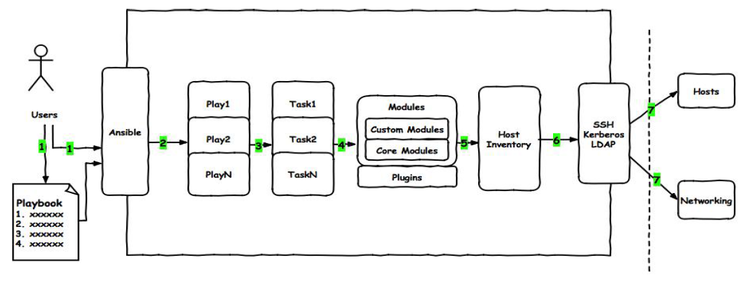
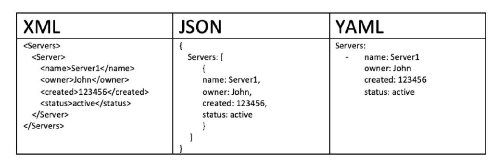

### playbook

### playbook图解



### YAML介绍

### YAML语法简介

```
> 在单一档案中，可用连续三个连字号(——)区分多个档案。
  另外，还有选择性的连续三个点号( ... )用来表示档案结尾
> 次行开始正常写Playbook的内容，一般建议写明该Playbook的功能
> 使用#号注释代码
> 缩进必须是统一的，不能空格和tab混用
> 缩进的级别也必须是一致的，同样的缩进代表同样的级别，程序判别配置的级别是通过缩进结合换行来实现的
> YAML文件内容是区别大小写的，k/v的值均需大小写敏感
> 多个k/v可同行写也可换行写，同行使用:分隔
> v可是个字符串，也可是另一个列表[]
> 一个完整的代码块功能需最少元素需包括 name 和 task
> 一个name只能包括一个task
> YAML文件扩展名通常为yml或yaml
```

### YAML语法简介

```
List：列表，其所有元素均使用“-”打头
      列表代表同一类型的元素
示例：
# A list of tasty fruits
- Apple
- Orange
- Strawberry
- Mango
Dictionary：字典，通常由多个key与value构成 键值对
示例：
---
# An employee record
name: Example Developer
job: Developer
skill: Elite
也可以将key:value放置于{}中进行表示，用,分隔多个key:value
示例：
---
# An employee record
{name: Example Developer, job: Developer, skill: Elite}  有空格
```

### YAML语法

```
YAML的语法和其他高阶语言类似，并且可以简单表达清单、散列表、标量等数据结构。
其结构（Structure）通过空格来展示，序列（Sequence）里的项用"-"来代表，Map里的键值对用":"分隔
示例
    name: John Smith
    age: 41
    gender: Male
    spouse:
      name: Jane Smith
      age: 37
      gender: Female
    children:
      - name: Jimmy Smith
        age: 17
        gender: Male
      - name: Jenny Smith
        age 13
        gender: Female
```

#### 范例一：

```
[root@server1 ~]# vim file.yml 

---
 - hosts : all
   remote_user : root

   tasks :
     - name : create new file
       file : name=/root/newfile.txt state=touch
     - name : create new user
       user : name=user2 system=yes shell=/sbin/nologin
     - name : install package
       yum : name=httpd
     - name : copy index.html
       copy : src=/var/www/html/index.html dest=/var/www/html/index.html
     - name : start service
       service : name=httpd state=started enabled=yes
```

### 三种常见的数据交换格式



### Playbook核心元素

```
Hosts          执行的远程主机列表(应用在哪些主机上)
Tasks          任务集
Variables      内置变量或自定义变量在playbook中调用
Templates模板  可替换模板文件中的变量并实现一些简单逻辑的文件
Handlers和notify结合使用，由特定条件触发的操作，满足条件方才执行，否则不执行
tags标签       指定某条任务执行，用于选择运行playbook中的部分代码。
                ansible具有幂等性，因此会自动跳过没有变化的部分，
                即便如此，有些代码为测试其确实没有发生变化的时间依然会非常地长。
                此时，如果确信其没有变化，就可以通过tags跳过此些代码片断
                ansible-playbook -t tagsname useradd.yml
```

### playbook基础组件

```
Hosts：
    > playbook中的每一个play的目的都是为了让特定主机以某个指定的用户身份执行任务。
      hosts用于指定要执行指定任务的主机，须事先定义在主机清单中
    > 可以是如下形式：
        one.example.com
        one.example.com:two.example.com
        192.168.1.50
        192.168.1.*
    > Websrvs:dbsrvs       或者，两个组的并集
    > Websrvs:&dbsrvs      与，两个组的交集
    > webservers:!phoenix  在websrvs组，但不在dbsrvs组
    示例: - hosts: websrvs：dbsrvs
remote_user: 
    可用于Host和task中。
    也可以通过指定其通过sudo的方式在远程主机上执行任务，其可用于play全局或某任务；
    此外，甚至可以在sudo时使用sudo_user指定sudo时切换的用户
    - hosts: websrvs
        remote_user: root   (可省略,默认为root)  以root身份连接
      tasks:    指定任务
    - name: test connection
        ping:
        remote_user: magedu
        sudo: yes           默认sudo为root
        sudo_user:wang      sudo为wang
    
task列表和action
    任务列表task:由多个动作,多个任务组合起来的,每个任务都调用的模块,一个模块一个模块执行
    1> play的主体部分是task list，task list中的各任务按次序逐个在hosts中指定的所有主机上执行，
       即在所有主机上完成第一个任务后，再开始第二个任务
    2> task的目的是使用指定的参数执行模块，而在模块参数中可以使用变量。
       模块执行是幂等的，这意味着多次执行是安全的，因为其结果均一致
    3> 每个task都应该有其name，用于playbook的执行结果输出，建议其内容能清晰地描述任务执行步骤。
       如果未提供name，则action的结果将用于输出
```

```
tasks：任务列表
两种格式：
    (1) action: module arguments
    (2) module: arguments 建议使用  模块: 参数
    注意：shell和command模块后面跟命令，而非key=value
某任务的状态在运行后为changed时，可通过"notify"通知给相应的handlers
任务可以通过"tags"打标签，可在ansible-playbook命令上使用-t指定进行调用
示例：
tasks:
  - name: disable selinux   描述
    command: /sbin/setenforce 0   模块名: 模块对应的参数
```

```
如果命令或脚本的退出码不为零，可以使用如下方式替代
tasks:
  - name: run this command and ignore the result
    shell: /usr/bin/somecommand || /bin/true  
    转错为正  如果命令失败则执行 true
或者使用ignore_errors来忽略错误信息
tasks:
  - name: run this command and ignore the result
    shell: /usr/bin/somecommand
    ignore_errors: True  忽略错误
```

```
如果命令或脚本的退出码不为零，可以使用如下方式替代
tasks:
  - name: run this command and ignore the result
    shell: /usr/bin/somecommand || /bin/true  
    转错为正  如果命令失败则执行 true
或者使用ignore_errors来忽略错误信息
tasks:
  - name: run this command and ignore the result
    shell: /usr/bin/somecommand
    ignore_errors: True  忽略错误
```

### 运行playbook

```
运行playbook的方式
    ansible-playbook <filename.yml> ... [options]
常见选项
    --check -C       只检测可能会发生的改变，但不真正执行操作 
                     (只检查语法,如果执行过程中出现问题,-C无法检测出来)
                     (执行playbook生成的文件不存在,后面的程序如果依赖这些文件,也会导致检测失败)
    --list-hosts     列出运行任务的主机
    --list-tags      列出tag  (列出标签)
    --list-tasks     列出task (列出任务)
    --limit 主机列表 只针对主机列表中的主机执行
    -v -vv -vvv      显示过程
示例
    ansible-playbook hello.yml --check 只检测
    ansible-playbook hello.yml --list-hosts  显示运行任务的主机
    ansible-playbook hello.yml --limit websrvs  限制主机
```

### Playbook VS ShellScripts

```
SHELL脚本
#!/bin/bash
# 安装Apache
yum install --quiet -y httpd
# 复制配置文件
cp /tmp/httpd.conf /etc/httpd/conf/httpd.conf
cp/tmp/vhosts.conf /etc/httpd/conf.d/
# 启动Apache，并设置开机启动
service httpd start
chkconfig httpd on
```

```
Playbook定义
---
- hosts: all
  remote_user: root
  
  tasks:
    - name: "安装Apache"
      yum: name=httpd       yum模块:安装httpd
    - name: "复制配置文件"
      copy: src=/tmp/httpd.conf dest=/etc/httpd/conf/  copy模块: 拷贝文件
    - name: "复制配置文件"
      copy: src=/tmp/vhosts.conf dest=/etc/httpd/conf.d/  
    - name: "启动Apache，并设置开机启动"
      service: name=httpd state=started enabled=yes   service模块: 启动服务
```

### 示例:Playbook 创建用户

```
示例：sysuser.yml
---
- hosts: all
  remote_user: root
  tasks:
    - name: create mysql user
      user: name=mysql system=yes uid=36
    - name: create a group
      group: name=httpd system=yes
```

### Playbook示例  安装httpd服务

```
示例：httpd.yml
- hosts: websrvs
  remote_user: root
  tasks:
    - name: Install httpd
      yum: name=httpd state=present
    - name: Install configure file
      copy: src=files/httpd.conf dest=/etc/httpd/conf/
    - name: start service
      service: name=httpd state=started enabled=yes
```