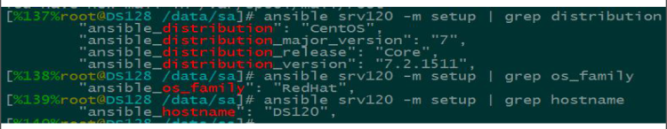

### 模板templates

```
文本文件，嵌套有脚本（使用模板编程语言编写） 借助模板生成真正的文件
Jinja2语言，使用字面量，有下面形式
    字符串：使用单引号或双引号
    数字：整数，浮点数
    列表：[item1, item2, ...]
    元组：(item1, item2, ...)
    字典：{key1:value1, key2:value2, ...}
    布尔型：true/false
算术运算：+, -, *, /, //, %, **
比较操作：==, !=, >, >=, <, <=
逻辑运算：and，or，not
流表达式：For，If，When
```

### Jinja2相关

```
字面量
    1> 表达式最简单的形式就是字面量。字面量表示诸如字符串和数值的 Python对象。如“Hello World”
    双引号或单引号中间的一切都是字符串。
    2> 无论何时你需要在模板中使用一个字符串（比如函数调用、过滤器或只是包含或继承一个模板的参数），如4242.23
    3> 数值可以为整数和浮点数。如果有小数点，则为浮点数，否则为整数。在Python 里， 42 和 42.0 是不一样的
```

### Jinja2:算术运算

```
算术运算
Jinja 允许你用计算值。这在模板中很少用到，但为了完整性允许其存在
支持下面的运算符
    +：把两个对象加到一起。
       通常对象是素质，但是如果两者是字符串或列表，你可以用这 种方式来衔接它们。
       无论如何这不是首选的连接字符串的方式！连接字符串见 ~ 运算符。 {{ 1 + 1 }} 等于 2
    -：用第一个数减去第二个数。 {{ 3 - 2 }} 等于 1
    /：对两个数做除法。返回值会是一个浮点数。 {{ 1 / 2 }} 等于 {{ 0.5 }}
    //：对两个数做除法，返回整数商。 {{ 20 // 7 }} 等于 2
    %：计算整数除法的余数。 {{ 11 % 7 }} 等于 4
    *：用右边的数乘左边的操作数。 {{ 2 * 2 }} 会返回 4 。
       也可以用于重 复一个字符串多次。{{ ‘=’ * 80 }} 会打印 80 个等号的横条
    **：取左操作数的右操作数次幂。 {{ 2**3 }} 会返回 8
```

### Jinja2 

### when条件判断

### template 的使用

```
template功能：根据模块文件动态生成对应的配置文件
   > template文件必须存放于templates目录下，且命名为 .j2 结尾
   > yaml/yml 文件需和templates目录平级，目录结构如下：
    ./
     ├── temnginx.yml
     └── templates
        └── nginx.conf.j2
```

### template示例

```
示例：利用template 同步nginx配置文件
准备templates/nginx.conf.j2文件
vim temnginx.yml
- hosts: websrvs
  remote_user: root
  
  tasks:
    - name: template config to remote hosts
      template: src=nginx.conf.j2  dest=/etc/nginx/nginx.conf
ansible-playbook temnginx.yml
```

### Playbook中template变更替换

```
修改文件nginx.conf.j2 下面行为
worker_processes {{ ansible_processor_vcpus }};
cat temnginx2.yml
- hosts: websrvs
  remote_user: root
  tasks:
    - name: template config to remote hosts
      template: src=nginx.conf.j2 dest=/etc/nginx/nginx.conf
ansible-playbook temnginx2.yml
```

### Playbook中template算术运算

```
算法运算：
示例：
    vim nginx.conf.j2
    worker_processes {{ ansible_processor_vcpus**2 }};
    worker_processes {{ ansible_processor_vcpus+2 }};
```

### when  实现条件判断

```
条件测试:如果需要根据变量、facts或此前任务的执行结果来做为某task执行与否的前提时要用到条件测试,
通过when语句实现，在task中使用，jinja2的语法格式
when语句
    在task后添加when子句即可使用条件测试；when语句支持Jinja2表达式语法
示例：
tasks:
  - name: "shutdown RedHat flavored systems"
    command: /sbin/shutdown -h now
    when: ansible_os_family == "RedHat"  当系统属于红帽系列,执行command模块 
 
when语句中还可以使用Jinja2的大多"filter"，
例如要忽略此前某语句的错误并基于其结果(failed或者success)运行后面指定的语句，
可使用类似如下形式：
tasks:
  - command: /bin/false
    register: result
    ignore_errors: True
  - command: /bin/something
    when: result|failed
  - command: /bin/something_else
    when: result|success
  - command: /bin/still/something_else
    when: result|skipped
此外，when语句中还可以使用facts或playbook中定义的变量
```

### 示例：when条件判断

```
- hosts: websrvs
  remote_user: root
  tasks:
    - name: add group nginx
      tags: user
      user: name=nginx state=present
    - name: add user nginx
      user: name=nginx state=present group=nginx
    - name: Install Nginx
      yum: name=nginx state=present
    - name: restart Nginx
      service: name=nginx state=restarted
      when: ansible_distribution_major_version == "6"
```

### 示例：when条件判断

```
示例：
tasks:
  - name: install conf file to centos7
    template: src=nginx.conf.c7.j2 dest=/etc/nginx/nginx.conf
    when: ansible_distribution_major_version == "7"
  - name: install conf file to centos6
    template: src=nginx.conf.c6.j2 dest=/etc/nginx/nginx.conf
    when: ansible_distribution_major_version == "6"
```

### Playbook中when条件判断

```
---
- hosts: srv120
  remote_user: root
  tasks:
    - name:
      template: src=nginx.conf.j2 dest=/etc/nginx/nginx.conf
      when: ansible_distribution_major_version == "7"
```



# 迭代：with_items

### 示例

```
示例： 创建用户
- name: add several users
  user: name={{ item }} state=present groups=wheel   #{{ item }} 系统自定义变量
  with_items:       # 定义{{ item }} 的值和个数
    - testuser1
    - testuser2
上面语句的功能等同于下面的语句：
- name: add user testuser1
  user: name=testuser1 state=present groups=wheel
- name: add user testuser2
  user: name=testuser2 state=present groups=wheel
  
with_items中可以使用元素还可为hashes
示例：
- name: add several users
  user: name={{ item.name }} state=present groups={{ item.groups }}
  with_items:
    - { name: 'testuser1', groups: 'wheel' }
    - { name: 'testuser2', groups: 'root' }
ansible的循环机制还有更多的高级功能，具体请参见官方文档
http://docs.ansible.com/playbooks_loops.html
```

### 示例：迭代

```
示例：将多个文件进行copy到被控端
---
- hosts: testsrv
  remote_user: root
  tasks
  - name: Create rsyncd config
    copy: src={{ item }} dest=/etc/{{ item }}
    with_items:
      - rsyncd.secrets
      - rsyncd.conf
```

### 示例：迭代

```
- hosts: websrvs
  remote_user: root
  tasks:
    - name: copy file
      copy: src={{ item }} dest=/tmp/{{ item }}
      with_items:
        - file1
        - file2
        - file3
- name: yum install httpd
  yum: name={{ item }} state=present
  with_items:
    - apr
    - apr-util
    - httpd
```

### 示例：迭代

```
- hosts：websrvs
  remote_user: root
  tasks
    - name: install some packages
      yum: name={{ item }} state=present
      with_items:
        - nginx
        - memcached
        - php-fpm
```

### 示例：迭代嵌套子变量

```
- hosts：websrvs
  remote_user: root
  
  tasks:
    - name: add some groups
      group: name={{ item }} state=present
      with_items:
        - group1
        - group2
        - group3
    - name: add some users
      user: name={{ item.name }} group={{ item.group }} state=present
      with_items:
        - { name: 'user1', group: 'group1' }
        - { name: 'user2', group: 'group2' }
        - { name: 'user3', group: 'group3' }
```

### with_itmes 嵌套子变量

```
with_itmes 嵌套子变量
示例
---
- hosts: testweb
  remote_user: root
  tasks:
    - name: add several users
      user: name={{ item.name }} state=present groups={{ item.groups }}
      with_items:
        - { name: 'testuser1' , groups: 'wheel'}
        - { name: 'testuser2' , groups: 'root'}
```

### Playbook字典 with_items

```
- name: 使用ufw模块来管理哪些端口需要开启
  ufw:
  rule: “{{ item.rule }}”
  port: “{{ item.port }}”
  proto: “{{ item.proto }}”
  with_items:
    - { rule: 'allow', port: 22, proto: 'tcp' }
    - { rule: 'allow', port: 80, proto: 'tcp' }
    - { rule: 'allow', port: 123, proto: 'udp' }
- name: 配置网络进出方向的默认规则
  ufw:
  direction: "{{ item.direction }}"
  policy: "{{ item.policy }}"
  state: enabled
  with_items:
    - { direction: outgoing, policy: allow }
    - { direction: incoming, policy: deny }
```

### Playbook中template for if  when循环

```

server {                    #重复执行server代码
listen {{ vhost.listen | default('80 default_server') }};

server_name {{ vhost.server_name }};


root {{ vhost.root }};


```

### 示例1

```
// temnginx.yml
---
- hosts: testweb
  remote_user: root
  vars:      # 调用变量
    nginx_vhosts:
      - listen: 8080  #列表 键值对
//templates/nginx.conf.j2
  
server {
  listen {{ vhost.listen }}
}

生成的结果
server {
  listen 8080
}
```

### 示例2

```
// temnginx.yml
---
- hosts: mageduweb
  remote_user: root
  vars:
    nginx_vhosts:
      - web1
      - web2
      - web3
  tasks:
    - name: template config
      template: src=nginx.conf.j2    dest=/etc/nginx/nginx.conf
// templates/nginx.conf.j2

server {
    listen {{ vhost }}
}

生成的结果：
server {
    listen web1
}
server {
    listen web2
}
server {
    listen web3
}
```

### 示例3

```
[root@server1 ~]# vim test.yml 

---
- hosts: all
  remote_user: root
  vars:
    ports:
        - web1:
          port: 81
          name : web1.com
          rootdir: data/web1
        - web2:
          port: 82
          name: web2.com
          rootdir: data/web2
        - web3:
          port: 83
          name: web3.com
          rootdir: data/web3

  tasks:
        - name: copy test
          template: src=test.j2 dest=data/test
#test.j2
[root@server1 ~]# vim templates/test.j2 


  server{
        listen {{ p.port }}
        servername={{ p.name }}
        rootdir={{ p.rootdir }}

  }

```