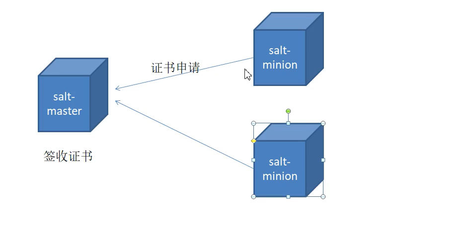
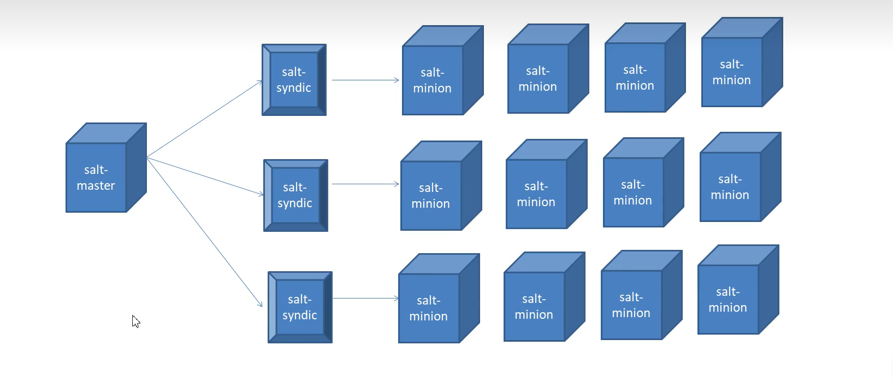

**saltstack自动化运维工具**

# 1、概述

1. saltstack角色

- salt-master:管理端软件

- salt-minion:被管理端软件

- salt-syndic:salt代理

1. 支持分布式部署

1. 采用证书的方式进行认证，安全

1. 结合zeroMQ消息队列、python:模块进行设计

1. 提供salt-api

**证书认证**



**分布式部署**



# 2、安装（针对CentOS 7.6）

## 2.1 添加saltstack源

```
 curl -fsSL https://repo.saltproject.io/py3/redhat/7/x86_64/latest.repo | sudo tee /etc/yum.repos.d/salt.repo        #添加源
 rpm --import https://repo.saltproject.io/py3/redhat/7/x86_64/latest/SALTSTACK-GPG-KEY.pub    #导入数字签名秘钥
```

> **如果以上链接失效，直接换成以下文件的内容也可以！**


- salt.repo :  

- SALTSTACK-GPG-KEY.pub : 

```
cat salt.repo > /etc/yum.repos.d/salt.repo        #添加源
 sudo rpm --import SALTSTACK-GPG-KEY.pub    #导入数字签名秘钥
```

## 2.2 安装SaltStack

- master

```
yum -y install salt-master salt-minion
```

- minion

```
yum -y install salt-minion
```

## 2.3 配置SaltStack

- 设置主机名

```
hostnamectl set-hostname  master            #master上设置
hostnamectl set-hostname  minion-01         #minion上设置
hostnamectl set-hostname  minion-02
```

- 修改master和minion的hosts文件,讲master和minion的主机名称添加进去

```
192.168.23.12     master
192.168.23.13     minion-01
192.168.23.14     minion-02  
```

- master 

```
vim /etc/salt/master
....
interface:  192.168.23.12  #第16行，master的本机IP，不要写主机名，会出错
#对salt-master绑定本机地址
```

- minion

```
vim /etc/salt/minion
....
master:  192.168.23.12  #第16行，远程master的IP地址，不要写主机名，会出错
#标注号master的地址，以便于发起证书申请
```

# 2.4 启动SaltStack

- master

```
systemctl restart salt-master
systemctl enable salt-master
```

- minion

```
systemctl restart salt-minion
systemctl enable salt-minion
```

- 列出master上的密钥及认证

```shell
[root@node-01 ~]# salt-key -L
Accepted Keys:
Denied Keys:
Unaccepted Keys:
master
minion-01            #已经申请证书的minion，但是还没哟接收
minion-02
Rejected Keys:
```

- 同意证书申请

```
[root@node-01 ~]# salt-key -a minion-01        #同意minion的证书申请
The following keys are going to be accepted:
Unaccepted Keys:
minion-01
Proceed? [n/Y] y
Key for minion minion-01 accepted.
[root@node-01 ~]# salt-key -a minion-02
The following keys are going to be accepted:
Unaccepted Keys:
minion-02
Proceed? [n/Y] y
Key for minion minion-02 accepted.
#[root@node-01 ~]# salt-key -A   #-A 表示接受所有
```

- 验证

```
[root@node-01 ~]# salt '*' test.ping
minion-01:
    True
minion-02:
    True
[root@node-01 ~]# 
```