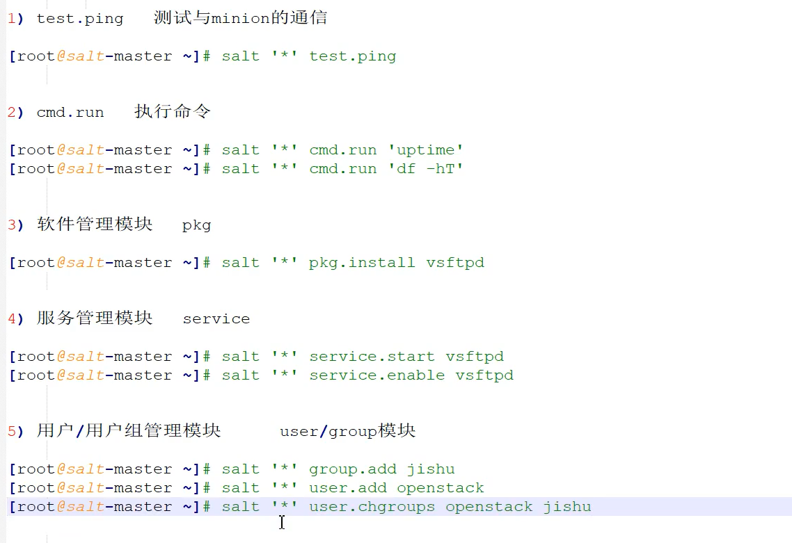
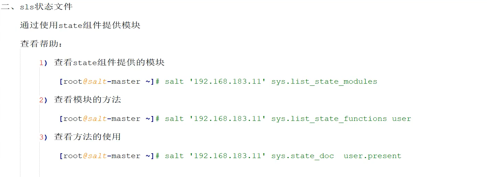
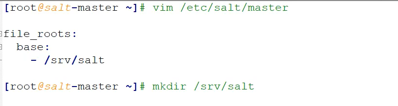

# salt-key 的使用方式

```
salt-key -L   #显示所有证书
salt-key -A   #接收所有证书
salt-key -a   [hostname]   #接收某个host的证书
salt-key -D    #删除所有证书
salt-key -d [hostname]  #删除某个host的证书，删除之后，想要在添加有时候可能需要重启minion才可以
```

# saltstack的管控方式

1. 调用saltstack提供的模块

1. 写sls状态

# 调用saltstack提供的模块

```
Usage: salt [options] '<target>' <function> [arguments]
```


# 常见模块模块应用




# sls状态文件







# jinja模板


