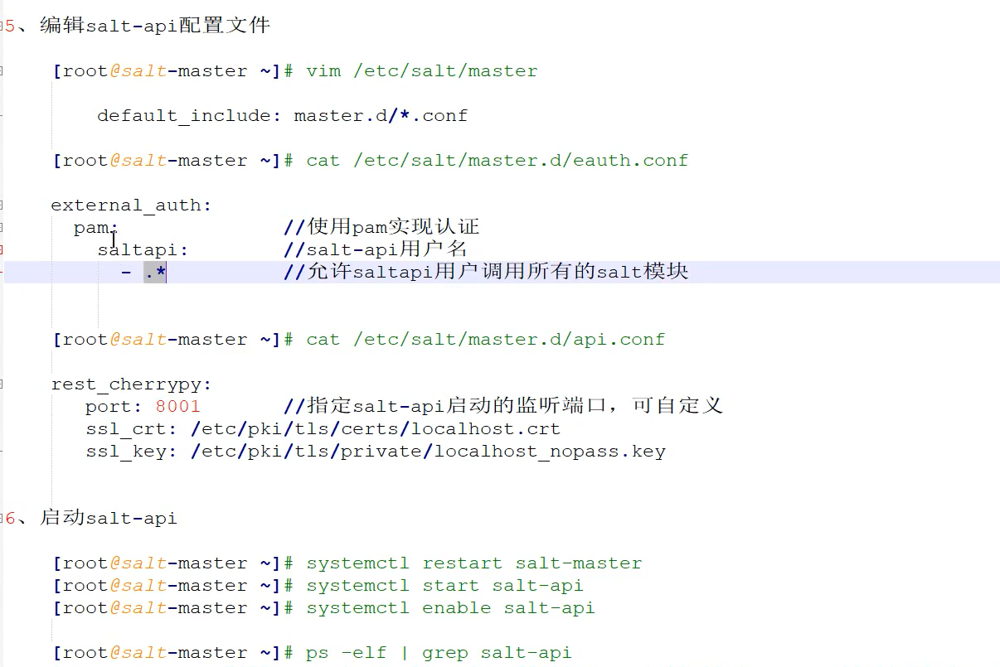

# py


- 修改


# 改进


## Salt-Api

```python
# -*- coding: utf-8 -*-
import six
import requests
try:
    import urllib.parse as urlparse
except ImportError:
    import urlparse
requests.packages.urllib3.disable_warnings()
class SaltConnectionError(Exception):
    pass
class AuthenticationError(Exception):
    pass
class Request(object):
    def __init__(self, api, method, header=None, **kwargs):
        self.api = api
        self.method = method
        self.header = header
        self.param = kwargs
        self.data = self._request()
    def _request(self):
        try:
            if self.param:
                if self.method == 'POST':
                    req = requests.request(self.method, self.api, json=self.param, headers=self.header, verify=False)
                else:
                    req = requests.request(self.method, self.api, params=self.param, headers=self.header, verify=False)
                req.close()
                return self._parse_http_response(req)
            req = requests.request(self.method, self.api, headers=self.header, verify=False)
            req.close()
            return self._parse_http_response(req)
        except requests.exceptions.ConnectionError as err:
            raise SaltConnectionError(err)
    @staticmethod
    def _parse_http_response(request):
        if request.status_code is 200:
            return request.json()
        elif request.status_code == 400:
            raise requests.exceptions.RequestException('【SaltAPI】- 失败 - 参数错误')
        elif request.status_code == 401:
            raise AuthenticationError('【SaltAPI】- 认证失败 - 请检查认证信息')
        elif request.status_code == 406:
            raise requests.exceptions.InvalidHeader('SaltAPI】- 失败 - Content-Type 不可用')
        elif request.status_code == 500:
            content = request.json()
            raise requests.exceptions.RequestException(content.get('return'))
        return None
class SaltHelper(object):
    def __init__(self, url, username, password):
        self.url = url
        self.username = username
        self.password = password
        self.eauth = "pam"
        self.headers = {'X-Auth-Token': self.authenticate(),
                        'Accept': 'application/json',
                        'Content-Type': 'application/json',
                        'X-Requested-With': 'XMLHttpRequest'}
    # 用于解决Token超时问题
    def __getattribute__(self, item):
        if item == 'headers':
            # 超时则重新获取Token
            if datetime.datetime.now() > self.expires_time:
                self.headers = {'X-Auth-Token': self.authenticate(),
                                'Accept': 'application/json',
                                'Content-Type': 'application/json',
                                'X-Requested-With': 'XMLHttpRequest'}
                # 设置超时时间为诶10个小时
                self.expires_time = datetime.datetime.now() + datetime.timedelta(hours=10)
        return object.__getattribute__(self, item)
    def authenticate(self):
        """
        Certification salt.
        :return: A string token.
        """
        url = self._construct_url('/login')
        try:
            result = Request(url, 'POST', username=self.username, password=self.password, eauth=self.eauth).data
            if result and result.get('return'):
                return result['return'][0]['token']
        except (SaltConnectionError, ConnectionRefusedError):
            raise SaltConnectionError('【SaltAPI】- 失败 - 无法连接到Salt API，请确认是否在运行？')
        except AuthenticationError as err:
            raise AuthenticationError(err)
        except Exception as err:
            raise SaltConnectionError(err)
    def all_keys(self):
        """
        Get all the master keys.
        :return: A dictionary with the result of the execution.
        """
        url = self._construct_url('/keys')
        result = Request(url, 'GET', self.headers).data
        if result and result.get('return'):
            return result.get('return')
        return None
    def accept_key(self, minion_id):
        """
        Certification of salt minion.
        :param string minion_id: salt minion id
        :return: A Boolean value of success or failure.
        """
        url = self._construct_url('/')
        param = {'client': 'wheel', 'fun': 'key.accept', 'match': minion_id}
        result = Request(url, 'POST', self.headers, **param).data
        if result and result.get('return'):
            return result['return'][0].get('data').get('success')
        return None
    def del_key(self, minion_id):
        """
        Delete of salt minion.
        :param string minion_id: salt minion id
        :return: A Boolean value of success or failure.
        """
        url = self._construct_url('/')
        param = {'client': 'wheel', 'fun': 'key.delete', 'match': minion_id}
        result = Request(url, 'POST', self.headers, **param).data
        if result:
            return result['return'][0].get('data').get('success')
        return None
    def reject_key(self, minion_id):
        """
        Reject of salt minion.
        :param string minion_id: salt minion id
        :return: A Boolean value of success or failure.
        """
        url = self._construct_url('/')
        param = {'client': 'wheel', 'fun': 'key.reject', 'match': minion_id}
        result = Request(url, 'POST', self.headers, **param).data
        if result:
            return result['return'][0].get('data').get('success')
        return None
    def minions(self, minion_id=None):
        """
        Getting lists of minions or getting minion details.
        :param string minion_id: salt minion id
        :return: A list with execution results.
        """
        url = self._construct_url('/minions')
        result = Request(url, 'GET', self.headers, mid=minion_id).data
        if result and result.get('return'):
            return result.get('return')
        return None
    def ping(self, tgt):
        return self.cmd(tgt, 'test.ping')
    def run_job(self, param, path='/'):
        """
        Prep the job directory and publish a command to any targeted minions.
        """
        url = self._construct_url(path)
        try:
            result = Request(url, 'POST', self.headers, **param).data
            # print "test.salt_response:",result
        except Exception as err:
            raise SaltConnectionError(err)
        if result and result.get('return'):
            content = result['return']
            if isinstance(content, list) and len(content) > 1:
                return content
            try:
                return content[0]
            except IndexError:
                return {}
        return {}
    def cmd(self,
            tgt,
            fun,
            arg=(),
            timeout=None,
            tgt_type='glob',
            ret='',
            kwarg=None,
            **kwargs):
        """
        Synchronously execute a command on targeted minions
        The cmd method will execute and wait for the timeout period for all
        minions to reply, then it will return all minion data at once.
        .. code-block:: python
            # >>> conn = SaltHelper(url='https://localhost:8001', username='saltapi', password='123456', eauth='pam')
            # >>> conn.cmd('*', 'cmd.run', ['whoami'])
            {'controller': 'root'}
        With extra keyword arguments for the command function to be run:
        .. code-block:: python
            conn.cmd('*', 'test.arg', ['arg1', 'arg2'], kwarg={'foo': 'bar'})
        Calling multiple functions in a single release passes a list of commands.
        .. code-block:: python
            conn.cmd('*', ['test.ping', 'cmd.run'], [[], ['ls ./']])
            conn.cmd('*', ['test.arg', 'cmd.run'], [['arg1', 'arg2'], ['ls ./']], kwarg={'foo': 'bar'})
        :param string or list tgt:  Which minions to target for the execution. Default is shell
            glob. Modified by the ``tgt_type`` option.
        :param string or list fun: The module and function to call on the specified minions of
            the form ``module.function``. For example ``test.ping`` or
            ``grains.items``.
            Compound commands
                Multiple functions may be called in a single publish by
                passing a list of commands. This can dramatically lower
                overhead and speed up the application communicating with Salt.
                This requires that the ``arg`` param is a list of lists. The
                ``fun`` list and the ``arg`` list must correlate by index
                meaning a function that does not take arguments must still have
                a corresponding empty list at the expected index.
        :param list or list-of-lists arg: A list of arguments to pass to the remote function. If the
            function takes no arguments ``arg`` may be omitted except when
            executing a compound command.
        :param int timeout: Seconds to wait after the last minion returns but
            before all minions return.
        :param string tgt_type: The type of ``tgt``. Allowed values:
            * ``glob`` - Bash glob completion - Default
            * ``pcre`` - Perl style regular expression
            * ``list`` - Python list of hosts
            * ``grain`` - Match based on a grain comparison
            * ``grain_pcre`` - Grain comparison with a regex
            * ``pillar`` - Pillar data comparison
            * ``pillar_pcre`` - Pillar data comparison with a regex
            * ``compound`` - Pass a compound match string
            * ``ipcidr`` - Match based on Subnet (CIDR notation) or IPv4 address.
            .. versionchanged:: 2017.7.0
                Renamed from ``expr_form`` to ``tgt_type``
        :param string ret: The returner to use. The value passed can be single
            returner, or a comma delimited list of returners to call in order
            on the minions.
        :param dict kwarg: A dictionary with keyword arguments for the function.
        :param kwargs: Optional keyword arguments.
            Authentication credentials may be passed when using
            :conf_master:`external_auth`.
            For example: ``local.cmd('*', 'test.ping', username='saltdev',
            password='saltdev', eauth='pam')``.
            Or: ``local.cmd('*', 'test.ping',
            token='5871821ea51754fdcea8153c1c745433')``
        :return: A dictionary with the result of the execution.
        """
        arg = self._condition_input(arg, kwarg)
        param = {
            'client': 'local',
            'tgt': tgt,
            'fun': fun,
            'arg': arg,
            'timeout': self._get_timeout(timeout),
            'tgt_type': tgt_type,
            'ret': ret
        }
        param.update(**kwargs)
        return self.run_job(param)
    def cmd_async(self,
                  tgt,
                  fun,
                  arg=(),
                  timeout=None,
                  tgt_type='glob',
                  ret='',
                  kwarg=None,
                  **kwargs):
        """
        Asynchronously send a command to connected minions
        The function signature is the same as :py:meth:`cmd` with the
        following exceptions.
        :returns: A job ID or 0 on failure.
        .. code-block:: python
            # >>> conn = SaltHelper(url='https://localhost:8001', username='saltapi', password='123456', eauth='pam')
            # >>> conn.cmd_async('*', 'test.sleep', [300])
            '20131219215921857715'
        """
        arg = self._condition_input(arg, kwarg)
        param = {
            'client': 'local_async',
            'tgt': tgt,
            'fun': fun,
            'arg': arg,
            'timeout': self._get_timeout(timeout),
            'tgt_type': tgt_type,
            'ret': ret
        }
        param.update(**kwargs)
        return self.run_job(param)
    def cmd_batch(
            self,
            tgt,
            fun,
            arg=(),
            timeout=None,
            tgt_type='glob',
            ret='',
            kwarg=None,
            batch='10%',
            **kwargs):
        """
        Iteratively execute a command on subsets of minions at a time
        The function signature is the same as :py:meth:`cmd` with the
        following exceptions.
        :param str batch: The batch identifier of systems to execute on
        :returns: A generator of minion returns
        .. code-block:: python
            # >>> conn = SaltHelper(url='https://localhost:8001', username='saltapi', password='123456', eauth='pam')
            # >>> returns = conn.cmd_batch('*', 'state.highstate', batch='10%')
            # >>> for ret in returns:
            # ...     print(ret)
            {'jerry': {...}}
            {'dave': {...}}
            {'stewart': {...}}
        """
        arg = self._condition_input(arg, kwarg)
        param = {
            'client': 'local_batch',
            'tgt': tgt,
            'fun': fun,
            'arg': arg,
            'timeout': self._get_timeout(timeout),
            'tgt_type': tgt_type,
            'ret': ret,
            'batch': batch
        }
        param.update(**kwargs)
        pub_data = self.run_job(param)
        if isinstance(pub_data, list):
            for item in pub_data:
                yield item
        else:
            yield pub_data
    def runner(self, fun, tgt=None, tgt_type='glob', arg=(), **kwargs):
        """
        Run a single command synchronously using the runner client.
        :return: A dictionary with the result of the execution.
        """
        param = {
            'client': 'runner',
            'fun': fun,
            'tgt_type': tgt_type,
            'arg': arg
        }
        param.update(**kwargs)
        if tgt:
            param['tgt'] = tgt
        return self.run_job(param)
    def runner_async(self, fun, tgt=None, tgt_type='glob', arg=None, **kwargs):
        """
        Use the runner client to run individual commands asynchronously
        :return: A job ID or 0 on failure.
        """
        param = {
            'client': 'runner_async',
            'fun': fun,
            'tgt_type': tgt_type,
            'arg': arg
        }
        param.update(**kwargs)
        if tgt:
            param['tgt'] = tgt
        pub_data = self.run_job(param)
        try:
            return pub_data['jid']
        except KeyError:
            return 0
    def wheel(self, fun, arg=(), kwarg=None, **kwargs):
        """
        Use the wheel client to run a single command
        :return: A dictionary with the result of the execution.
        """
        param = {
            'client': 'wheel',
            'fun': fun,
            'arg': arg,
            'kwarg': kwarg
        }
        param.update(**kwargs)
        return self.run_job(param)
    def jobs(self, jid=None, timeout=None):
        """
        Gets the salt job execution record
        :param string jid: The job id of the query.
        :param int timeout: Seconds to wait after the last minion returns but
            before all minions return.
        :return: A dictionary with the result of the execution.
        """
        url = self._construct_url('/jobs')
        result = Request(url, 'GET', self.headers, jid=jid, timeout=timeout).data
        try:
            if result and result.get('info') and len(result.get('info')) > 0:
                return result['info'][0]['Result']
            return None
        except KeyError:
            return None
    def stats(self):
        """
        Return a dump of statistics collected from the CherryPy server.
        """
        url = self._construct_url('/stats')
        result = Request(url, 'GET', self.headers).data
        if result:
            return result
        return None
    @staticmethod
    def _get_timeout(timeout):
        """
        Return the timeout to use.
        """
        if isinstance(timeout, six.string_types):
            try:
                return int(timeout)
            except ValueError:
                return timeout
        return timeout
    def _condition_input(self, args, kwargs):
        """
        Return a single arg structure for the publisher to safely use
        """
        ret = []
        for arg in args:
            if isinstance(arg, int) and self._is_jid(str(arg)):
                ret.append(str(arg))
            else:
                ret.append(arg)
        if isinstance(kwargs, dict) and kwargs:
            kw_ = {"__kwarg__": True}
            for key, val in kwargs.items():
                kw_[key] = val
            return ret + [kw_]
        return ret
    @staticmethod
    def _is_jid(jid):
        """
        Returns True if the passed in value is a job id
        """
        if not isinstance(jid, six.string_types):
            return False
        if len(jid) != 20 and (len(jid) <= 21 or jid[20] != '_'):
            return False
        try:
            int(jid[:20])
            return True
        except ValueError:
            return False
    def _construct_url(self, path):
        """
        Construct the url to salt-api for the given path.
        :param string path: the path to the salt-api resource.
        :return: Construct the full salt API url.
        """
        relative_path = path.lstrip('/')
        return urlparse.urljoin(self.url, relative_path)
```