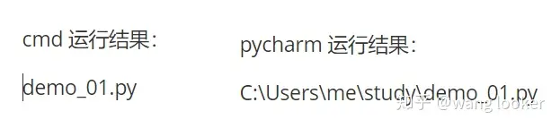

原文地址：[python路径操作新标准：pathlib 模块 - 知乎 (zhihu.com)](https://zhuanlan.zhihu.com/p/139783331)

# **1 路径获取**

- 获取当前工作目录

```text
>>> import pathlib
>>> pathlib.Path.cwd()
C:\Users\me\study
# WindowsPath('C:\Users\me\study')
```

虽然在这里打印出来的很像一个字符串，但实际上得到的是一个 

> 注意工作目录是在哪个目录下运行你的程序，不是项目目录。


如果你只想得到字符串表示，不想要 WindowsPath 对象，可以用 str() 转化：

```text
>>> str(pathlib.Path.cwd())
C:\Users\me\study
```

- 获取用户 home 目录。

下面的例子因为基本都是使用 pathlib 下面的 Path 类，所以可以换一种导入方式。

```text
from pathlib import Path
>>> Path.home()
c:\Users\me
```

- 获取当前文件路径

```text
>>> Path(__file__)
demo_01.py
```

在 pycharm 中右击运行和在 cmd 运行的结果会不同。pycharm 会显示全路径，cmd 运行只会显示工作目录下的相对路径。如果想统一，可以添加后缀 



- 获取任意字符串路径

```text
>>> Path('subdir/demo_02.py')
subdir\demo_02.py
>>> Path('c:d:y/rad.txt')
c:d:y\rad.txt
```

- 获取绝对路径

只需要在任意路径对象后添加方法 

```text
>>> file = Path('archive/demo.txt')
>>> file
archive\demo.txt
>>> file.resolve()
C:\Users\me\study\archive\demo.txt
```

- 获取文件属性

文件属性比如文件大小，创建时间，修改时间等等。

```text
file = Path('archive/demo.txt')
print(file.stat())
print(file.stat().st_size)
print(file.stat().st_atime)
print(file.stat().st_ctime)
print(file.stat().st_mtime)
```

找出最后修改的文件的例子：

```text
>>> path = Path.cwd()
>>> max(
        [(f.stat().st_mtime, f) 
         for f in path.iterdir() 
         if f.is_file()]
    )
1589171135.860173 C:\Users\me\study\demo_03.py
```

# **2 路径组成部分**

获取路径的组成部分非常方便：

- .name 文件名，包含后缀名，如果是目录则获取目录名。

- .stem 文件名，不包含后缀。

- .suffix 后缀，比如 .txt .png

- .parent 父级目录，相当于 cd ..

- .anchor 锚，目录前面的部分 C:\  

```text
>>> file = Path('archive/demo.txt')
>>> file.name
demo.txt
>>> file.stem
demo
>>> file.suffix
.txt
>>> file.parent
C:\Users\me\study\archive
>>> file.anchor
'C:\'
```

- 获取上一级目录

```text
>>> file = Path('archive/demo.txt')
>>> file.parent
archive
```

获取上 2 级 和 3 级目录会有点问题。因为传入的是一个相对路径，上 3 级已经无法往上了，所以还是会停留在工作目录。所以你需要确保你的路径有这么多层级。

```text
>>> file.parent.parent
.
>>> file.parent.parent.parent
.
```

- 获取所有的上级目录：

```text
>>> file.parents
<WindowsPath.parents>
>>> list(file.parents)
[WindowsPath('archive'), WindowsPath('.')]
```

- 父级目录的另一种表示方法：

```text
>>> file.parents[0]
archive
```

如果路径是在当前工作目录下的子目录，最好转化成绝对路径再获取上层目录：

```text
>>> file.resolve().parents[4]
C:\Users
# 不能使用负数
```

在 os 模块中获取上 3 级目录简直令人奔溃，需要重复使用 dirname 函数，使用 pathlib 的 parent 可以极大简单化操作：

```text
>>> import os
>>> os.path.dirname(file)
```

- 相对其他某个路径的结果：

```text
>>> file.relative_to('archive')
dmeo.txt
```

# **3 子路径扫描**

- dir_path.iterdir() 可以扫描某个目录下的所有路径（文件和子目录)， 打印的会是处理过的绝对路径。

```text
>>> cwd = Path.cwd()
>>> [path for path in cwd.iterdir() if cwd.is_dir()]
[
    WindowsPath('C:/Users/me/study/archive'), 
    WindowsPath('C:/Users/me/study/demo_01.py'), 
    WindowsPath('C:/Users/me/study/new_archive')
]
```

- 使用 iterdir() 可以统计目录下的不同文件类型：

```text
>>> path = Path.cwd()
>>> files = [f.suffix for f in path.iterdir() if f.is_file()]
>>> collections.Counter(files)
Counter({'.py': 3, '.txt': 1})
```

- 查找目录下的指定文件 glob 。

使用模式匹配（正则表达式）匹配指定的路径。正则表达式不熟练的可以查看 

```text
>>> cwd = Path.cwd()
>>> list(cwd.glob('*.txt'))
[]
>>> list(cwd.rglob('*.txt'))
[WindowsPath('C:/Users/me/study/archive/demo.txt')]
```

- 检查路径是否符合规则 match

```text
>>> file = Path('/archive/demo.txt')
>>> file.match('*.txt')
True
```

# **4 路径拼接**

pathlib 支持用 

```text
>>> Path.home() / 'dir' / 'file.txt'
C:\Users\me\dir\file.txt
```

如果用不惯 

```text
>>> Path.home().joinpath('dir', 'file.txt')
C:\Users\me\dir\file.txt
```

# **5 路径测试（判断）**

- **是否为文件**

```text
>>> Path("archive/demo.txt").is_file()
True
>>> Path("archive/demo.txt").parent.is_file()
False
```

- **是否为文件夹 (目录)**

```text
>>> Path("archive/demo.txt").is_dir()
False
>>> Path("archive/demo.txt").parent.is_dir()
True
```

- **是否存在**

```text
>>> Path("archive/demo.txt").exists
True
>>> Path("archive/dem.txt").exists
False
```

# **6 文件操作**

- **创建文件 touch**

```text
>>> file = Path('hello.txt')
>>> file.touch(exist_ok=True)
None
>>> file.touch(exist_ok=False)
FileExistsError: [Errno 17] File exists: 'hello.txt'
```

exist_ok 表示当文件已经存在时，程序的反应。如果为 True，文件存在时，不进行任何操作。如果为 False, 则会报 

- **创建目录 path.mkdir**

用 os 创建目录分为 2 个函数 ： 

```text
>>> os.mkdir('dir/subdir/3dir')
FileNotFoundError: [WinError 3] 系统找不到指定的路径。: 'dir/subdir/3dir'
>>> os.makedirs('dir/subdir/3dir')
None
```

使用 pathlib 只需要用 path.mkdir() 函数就可以。它提供了 parents 参数，设置为 True 可以创建多级目录；不设置则只能创建 一层：

```text
>>> path = Path('/dir/subdir/3dir')
>>> path.mkdir()
FileNotFoundError: [WinError 3] 系统找不到指定的路径。: 'dir/subdir/3dir'
>>> path.mkdir(parents=True)
None
```

- **删除目录 path.rmdir()**

删除目录非常危险，并且没有提示，一定要谨慎操作。一次只删除一级目录，且当前目录必须为空。

```text
>>> path = Path('dir/subdir/3dir')
>>> path.rmdir()
None
```

- **删除文件 path.unlink, 危险操作。**

```shell
>>> path = Path('archive/demo.txt')
>>> path.unlink()
```

- **打开文件**

使用 open() 函数打开文件时，如果需要传入文件路径。可以用字符串作为参数传入：

```text
with open('archive/demo.txt') as f:
    print(f.read())
```

也可以传入 Path 对象：

```text
file_path = Path('archive/demo.txt')
with open(file_path) as f:
    print(f.read())
```

如果经常使用 pathlib，可以在获取到 Path 路径以后直接调用 path.open() 方法。至于到底用哪一个，其实不必太在意，因为 path.open() 也是调用内置函数 open()。

```text
file = Path('archive/demo.txt')
with file.open() as f:
    print(f.read())
```

不过 pathlib 对读取和写入进行了简单的封装，不再需要重复去打开文件和管理文件的关闭了。

- .read_text() 读取文本

- .read_bytes() 读取 bytes

- .write_text() 写入文本

- .write_bytes() 写入 tytes

```shell
>>> file_path = Path('archive/demo.txt')
>>> file_path.read_text()   # 读取文本
'text in the demo.txt'
>>> file_path.read_bytes()  # 读取 bytes
b'text in the demo.txt'
>>> file.write_text('new words')  # 写入文本
9
>>> file.write_bytes(b'new words') # 写入 bytes
9
```

> 注意file.write 操作使用的是 w 模式，如果之前已经有文件内容，将会被覆盖。


- **移动文件**

```python
txt_path = Path('archive/demo.txt')
res = txt_path.replace('new_demo.txt')
print(res)
```

这个操作会把 archive 目录下的 demo.txt 文件移动到当前工作目录，并重命名为 new_demo.txt。

移动操作支持的功能很受限。比如当前工作目录如果已经有一个 new_demo.txt 的文件，则里面的内容都会被覆盖。还有，如果需要移动到其他目录下，则该目录必须要存在，否则会报错：

```python
# new_archive 目录必须存在，否则会报错
txt_path = Path('archive/demo.txt')
res = txt_path.replace('new_archive/new_demo.txt')
print(res)
```

为了避免出现同名文件里的内容被覆盖，通常需要进行额外处理。比如判断同名文件不能存在，但是父级目录必须存在；或者判断父级目录不存在时，创建该目录。

```python
dest = Path('new_demo.txt')
if (not dest.exists()) and dest.parent.exists():
 txt_path.replace(dest)
```

- **重命名文件**

```python
txt_path = Path('archive/demo.txt')
txt_path.rename('archive/demo_test.txt')    #需要输入完整的路径
```

- **重命名整个路径**

```python
txt_path = Path('archive/demo.txt')
txt_path.replace('archive/test/demo.txt')    #将改变整个路径
```

- **创建一个同级目录下的，新的文件路径（不对实际路径上的内容发送变更）**

```python
txt_path = Path('archive/demo_01')
txt_path.with_name('demo_02')  
>> archive/demo_01    #返回了这样的一个路径
```

- **修改后缀名**

```python
txt_path = Path('archive/demo.txt')
new_file = txt_path.with_suffix('.json')
txt_path.replace(new_file)
```

> 注意不管是移动文件还是删除文件，都不会给任何提示。所以在进行此类操作的时候要特别小心。对文件进行操作最好还是用 shutil 模块。


## 7、获取到文件列表

```python
file_list=Path("/root/").iterdir()
for file in file_list:
    print(file)
```