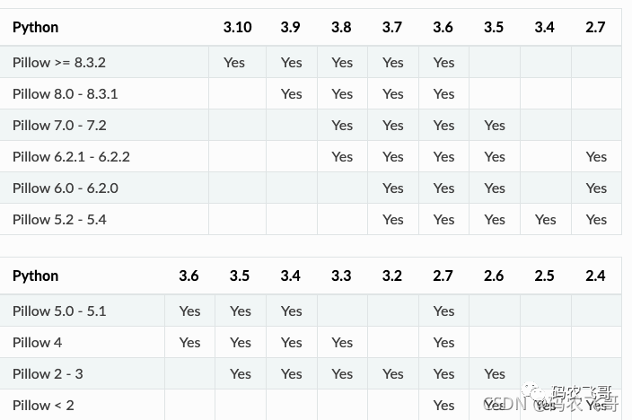
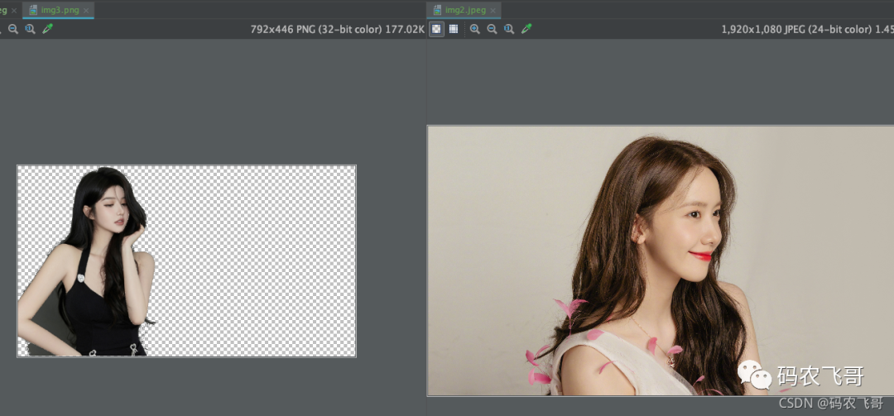
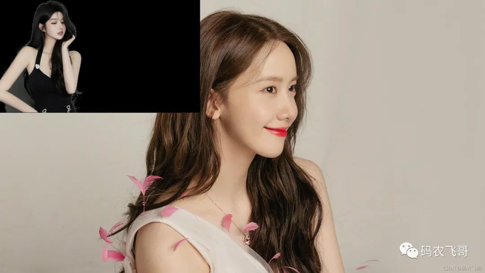
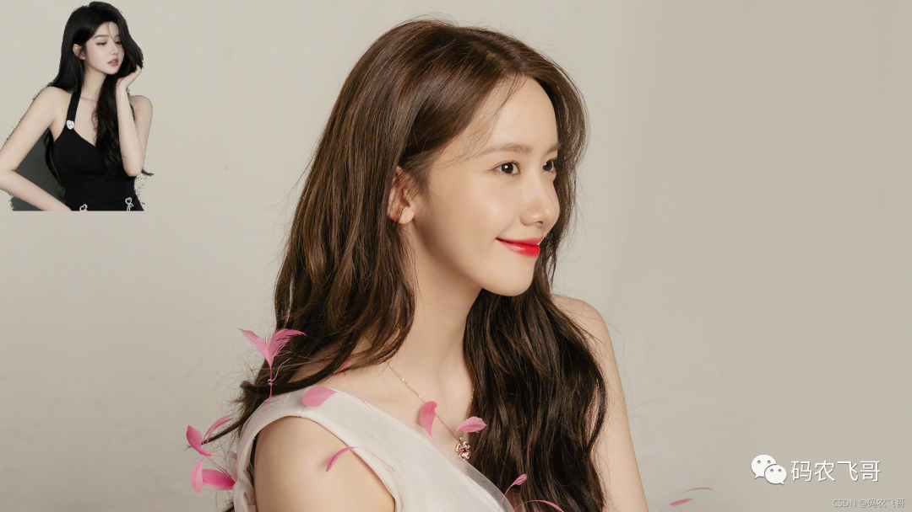

# **1、前言**

PIL库 Python Imaging Library，已经是Python平台事实上的[图像处理](https://cloud.tencent.com/product/tiia?from=10680)标准库了。PIL功能非常强大，但API却非常简单易用。但是PIL库仅仅支持到Python 2.7。为了兼容Python 3.x开源社区提供了兼容版本Pillow，通过Pillow大家就可以愉快的在Python 3.x上使用PIL库了。

# **2、安装Pillow 以及版本兼容**

通过pip命令安装Pillow还是非常方便的，一行命令就可以 安装最新版本的命令

```python
pip install  Pillow
```

安装指定版面的命令

```javascript
pip install Pillow==8.3.0
```

如果你不知道有哪些版本可以通过



# **3、常用模块介绍**

PIL库有很多模块，这里重点介绍一些常用的模块。首先，总体来看下各个模块的作用。

| 模块名 | 主要作用 | 
| -- | -- |
| Image | Image模块提供了一个具有相同名称的类用于表示PIL的image对象，它有许多工厂类，包括从文件中加载image以及创建新的image | 
| ImageColor | ImageColor 模块包含了CSS3中的颜色说明符到RGB元组的颜色表和转换器，这个模块在PIL.Image.new()和ImageDraw模块以及其他模块使用 | 
| ImageFont | ImageFont 用于设置字体，它主要用在PIL.ImageDraw.ImageDraw.text() 方法中。 | 
| ImageDraw | ImageDraw 模块为Image模块提供了简单的2D图形，利用该模块可以创建新图形，修饰现有图形，然后生成新的图形以供使用 | 


下面就详细介绍下各个模块的

## **3.1 Image**

Image是PIL库的核心模块，大部分图片的操作都离不开它，利用它可以从文件中加载image，以及创建新的image。以及将Images保存为图片。

1. **加载图片文件**

```
PIL.Image.open(fp, mode='r', formats=None)    #其中 fp是图片文件名称，mode 表示图片路径的读取模式，默认是'r'模块。返回Image对象
with Image.open('img1.jpeg') as img:        #这里Image使用完成之后需要手动关闭。比较推荐下面的with ... as ... 的写法
```

**下面列举的img都是前面通过open获取到的Image对象。**

1. **获取图片的宽，高。通过img.size 可以获取图片的宽，高。**

```javascript
    width, height = img.size
```

1. **展示和修改图片:show( )**

```javascript
img.show()                #正常展示图片
img.rotate(45).show()    #图片旋转，通过rotate方法对图片进行旋转，下面就是将图片旋转45度展示出来。
img.thumbnail((width/2, height/2))     #通过thumbnail方法可以实现对图片的缩放。高度和宽度都缩小一半
```

1. **保存图片**

```javascript
img.save(self, fp, format=None, **params)    #该方法可以将Image对象保存为一个图片文件。其中:fp为图片保存的路径。**params是可变参数，
                                            一般是传入图片的后缀名。
img.save('thumbnail.jpeg')
```

1. **创建新Image**

```javascript
PIL.Image.new(mode, size, color=0)
#该方法有三个参数:
    -mode用于指定生成的图片是RGB还是RGBA。
        -这里RGBA各个字母表示的意思是：r 表示red, g 表示green, b表示blue,a 表示alpha 透明度。
        -一般而言只需要指定RGB即可。如果需要创建一个透明底的图片则需要传入RGBA。
    -size 用于指定图片的宽高，传入的是一个元组。
    -color 用于指定图片的颜色，如果前面mode传入的是RGB的话，则该参数需要传入含有三个元素的元组。比如：(255, 0, 0)，
        如果前面mode传入的是RGBA的话，则该参数需要传入含有四个元素的元素，比如：(255,0,0,204)。
newImg = Image.new('RGB', (500, 500), (255, 0, 0))  #创建一个宽高各为500的，背景色是红色的图片。    
newImg.save('newImg.png')
                                                                   
```

1. **复制图片，通过copy()方法，可以copy一个图片。**

```javascript
  # 复制图片
    copyImg = img.copy()
    newImg.save(op.join(base_path, 'copyImg.png'))
```

1. **粘贴图片：通过 paste方法可以将一个图片粘贴到另一个图片之上。**

```
```

## 3.2 lmageColor

该模块主要是从CSS3中的颜色说明符中获取到RGB值。这里说一个方法：getrgb 方法就是获取RGB值。

```javascript
# 获取颜色的RBGA值
rgb_tup = ImageColor.getrgb("#ff0000cc")
print(rgb_tup)
#运行结果是(255, 0, 0, 204)
```

## **3.3 ImageFont**

ImageFont 用于设置字体，它主要用在PIL.ImageDraw.ImageDraw.text() 方法中。首先，这里介绍其最常用的方法

```
PIL.ImageFont.truetype (font = None , size = 10 , index = 0 , encoding = '' , layout_engine = None )
    #从文件或类文件对象加载 TrueType 或 OpenType 字体，并创建字体对象。该函数从给定的文件或类文件对象加载一个字体对象，
    #并为给定大小的字体创建一个字体对象。Pillow 使用 FreeType 打开字体文件。如果您在 Windows 上同时打开多种字体，
    #请注意 Windows 将可以在 C 中同时打开的文件数限制为 512。如果接近该限制，OSError可能会抛出an ，报告 FreeType“无法打开资源”。
    #此功能需要 _imagingft 服务。参数 font – 包含 TrueType 字体的文件名或类似文件的对象。如果在此文件名中找不到该文件，
    #加载程序也可能会在其他目录中进行搜索，例如fonts/ Windows 或 上的目录/Library/Fonts/， 
    #/System/Library/Fonts/以及~/Library/Fonts/macOS上的目录。
-size:    #请求的大小，以磅为单位。
-index:    #要加载的字体（默认是第一个可用的字体）。
-encoding: #要使用的字体编码（默认为 Unicode）。可
            #能的编码包括（有关更多信息，请参阅 FreeType 文档）：这指定要使用的字符集。它不会改变后续操作中提供的任何文本的编码。
-layout_engine:   #要使用的布局引擎（如果可用）：ImageFont.LAYOUT_BASIC或ImageFont.LAYOUT_RAQM. 返回值 一个字体对象。
img_font = ImageFont.truetype('simsun.ttf', size=20)    #这里代码的意思是创建一个字体大小为20的宋体的字体。
```

## **3.4 ImageDraw**

终于说到ImageDraw模块了，这个模块也是一个非常重要的模块，它主要是可以给图片添加文字以及划线等。

#### 3.4.1 Draw()方法

给指定的Image对象创建一个draw对象。

```
ImageDraw.Draw()
#参数：
-img: 需要被绘画的image对象
-mode: 用于颜色值的可选模式，对于RGB图像，此参数可以是RGB或者RGBA（将绘图混合到图像中）。
      对于所有其他模式，此参数必须与图像模式相同，如果省略，模式默认是图像的模式。
```

#### 3.4.2 text()方法

在给定的位置上添加文本 

```
ImageDraw.text()
参数：
-xy：    文本的锚点坐标。
-text:    要绘制的字符串。如果它包含任何换行符，则文本将传递给 multiline_text()。
-fill:    用于文本的颜色。
-font:     一个ImageFont实例。
-anchor:    文本锚对齐方式。确定锚点与文本的相对位置。默认对齐方式是左上角。有关有效值，请参阅文本锚点。对于非 TrueType 字体，将忽略此参数。此参数存在于 Pillow 的早期版本中，但仅在 8.0.0 版中实现。
-spacing:    如果文本传递到multiline_text()，则为 行之间的像素数。
-align:    如果文本被传递到 multiline_text()， "left"，"center"或"right"。确定线条的相对对齐方式。使用anchor参数指定对齐到xy。
-direction:    文本的方向。它可以是"rtl"（从右到左）、"ltr"（从左到右）或"ttb"（从上到下）。需要 libraqm。
-features:    要在文本布局期间使用的 OpenType 字体功能列表。这通常用于打开默认情况下未启用的可选字体功能，例如"dlig"或"ss01"，但也可用于关闭默认字体功能，例如"-liga"禁用连字或"-kern" 禁用字距调整。要获取所有支持的功能，请参阅OpenType 文档。需要 libraqm。
-language:    文本的语言。不同的语言可能使用不同的字形形状或连字。此参数告诉字体文本使用的语言，并根据需要应用正确的替换（如果可用）。它应该是BCP 47 语言代码。需要 libraqm。
-stroke_width:  文本笔划的宽度。
-stroke_fill:    用于文本笔划的颜色。如果没有给出，将默认为fill参数。
-embedded_color:  是否使用字体嵌入颜色字形（COLR、CBDT、SBIX）。8.0.0 版中的新功能。
```

-  给图片上添加文字

```javascript
# 给图片上添加文字
with Image.open(op.join(base_path, 'img4.jpeg')) as im:
    font = ImageFont.truetype(op.join(base_path, 'simsun.ttf'), size=80)
    rgb_tup = ImageColor.getrgb("#ff0000cc")
    draw = ImageDraw.Draw(im)
    text = "玛莎拉蒂"
    draw.text((650, 550), text, fill=rgb_tup, font=font)
    im.save(op.join(base_path, '玛莎拉蒂.png'), 'png')
```

运行结果是：


# **再来点干货吧！**

前面都是基础性的介绍，不够干，不够过瘾。下面作者就再来点干货，希望读者朋友们满意。

## **合并美女照片**

现在有这两张美女照片分别是：img2.jpeg和img3.png。我想把img3.png粘贴到img2.jpeg上。该如何操作呢? 其中img3.png还是透明底的。



1. 直接上paste方法

```javascript
# 将两张图贴起来
img2 = Image.open('img2.jpeg')
img3 = Image.open('img3.png')
img2.paste(img3)
img2.save('beautiful_paste.jpeg')
```

复制

运行结果是：



img3.png 图片粘贴到img2上之后背景色变成了黑色，这显然没有达到我们期望的结果。这该如何处理呢？问题不大，只需要小小的修改一下代码.

1. 小小修改一下，将背景改成透明底

```javascript
# 透明底
img2 = Image.open('img2.jpeg').convert('RGBA')
img3 = Image.open('img3.png').convert('RGBA')
# 获取r,g,b,a的值
r, g, b, a = img3.split()
# 传入透明值
img2.paste(img3, box=(0, 0), mask=a)
img2.save('beautiful_paste2.png')
```

复制

运行结果是：



这下就变成了透明底了。两位美女都可以尽情欣赏了。