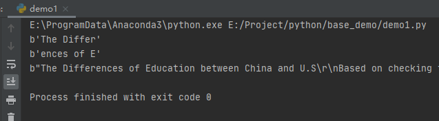
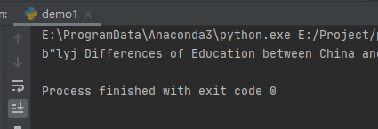

# 前言

内存映射通常可以提高I/O的性能，因为使用内存映射时，不需要对每个访问都建立一个单独的系统调用，也不需要在缓冲区之间复制数据，内核和用户都能很方便的直接访问内存。

本篇，将详细介绍Python内存映射库：mmap。

# mmap（读文件）

使用mmap()函数可以创建一个内存映射文件。该函数的第1个参数是一个文件描述符，可以通过file对象的fileno()函数获取；第2个参数是要映射的文件部分大小（单位字节），如果该值为0，映射整个文件，如果该参数大于文件大小，则扩展该文件。

示例如下：

```
import mmap

with open('英文文档.txt','r') as f:
    with mmap.mmap(f.fileno(),0,access=mmap.ACCESS_READ) as m:
        print(m.read(10))
        print(m.read(10))
        print(m[:-10])
```

运行之后，效果如下：



这里读写会根据文件指针进行移动，比如开始读10个字符，那么第2次读就会接着11个字符开始在读，不会返回起点，而通过切片或者seek()函数可以将指针重置。

至于access参数，表示以什么方式访问，这里以读的方式。

> 需要特别注意的是，windows不支持创建长度为0的映射。


# write（写文件）

写文件比较简单，这里我们直接看一段代码：

```
import mmap

word = b'The'

with open('英文文档.txt', 'r+') as f:
    with mmap.mmap(f.fileno(), 0, access=mmap.ACCESS_WRITE) as m:
        loc = m.find(word)
        m[loc:loc + len(word)] = b'lyj'
        print(m.read())
```

运行之后，首字母The，就被我们替换成"lyj"了，效果如下：



> 当然，这里除了切片写入之外，也可以使用write()等文件操作方法进行操作，与文件操作一样。需要注意的是假如access等于ACCESS_COPY，那么不会把修改的内容写入磁盘上的文件。
