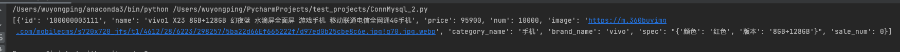

# ConnectMysql

```python
# coding=utf-8
import pymysql
class ConnectMysql:
    def __init__(self, db_host, db_name, db_user, db_pass, db_port, charset='utf8'):
        self.db_host = db_host
        self.db_name = db_name
        self.db_user = db_user
        self.db_pass = db_pass
        self.db_port = db_port
        self.charset = charset
    # 创建数据库连接
    def __get_connect(self, return_dict=True):
        self.conn = pymysql.connect(host=self.db_host, user=self.db_user, passwd=self.db_pass, db=self.db_name,
                                    port=int(self.db_port), charset=self.charset)
        return self.conn.cursor(pymysql.cursors.DictCursor) if return_dict else self.conn.cursor()
    def exec_query(self, sql, args=None, return_dict=False):
        """
        :param args:
           IF args is not None, cursor.executemany("select * from my_table where id= %s", args)
        :param return_dict:
            return item of result is a dict.
         """
        cur = self.__get_connect(return_dict)
        try:
            cur.execute(sql, args)
            return cur.fetchall()
        except Exception:
            self.conn.rollback()
            self.conn.close()
            raise
    def exec_no_query(self, sql, value_list=None):
        """
        :param value_list:
           If value_list is not None,the item of value_list must be a tuple or list.
           cursor.executemany("INSERT INTO my_table (column) VALUES (%s,%s...%s)", values_list)
        """
        cur = self.__get_connect(False)
        try:
            if value_list:
                cur.executemany(sql, value_list)
            else:
                cur.execute(sql)
            self.conn.commit()
        except Exception:
            self.conn.rollback()
            self.conn.close()
            raise
if __name__ == '__main__':
    connect = ConnectMysql('127.0.0.1', 'lucene', 'root', '123456', '3306')
    # value_list = (('100000003111', 'vivo1 X23 8GB+128GB 幻夜蓝 水滴屏全面屏 游戏手机 移动联通电信全网通4G手机', 95900,
    #                10000,
    #                'https://m.360buyimg.com/mobilecms/s720x720_jfs/t1/4612/28/6223/298257/5ba22d66Ef665222f/d97ed0b25cbe8c6e.jpg!q70.jpg.webp',
    #                '手机', 'vivo', "{'颜色': '红色', '版本': '8GB+128GB'}", 0),)
    # sql_cmd = "INSERT INTO lucene.tb_sku  VALUES (%s,%s,%s,%s,%s,%s,%s,%s,%s);"
    # connect.exec_no_query(sql_cmd, value_list)
    sql_cmd = "SELECT * FROM lucene.tb_sku WHERE id = %s;"
    res = connect.exec_query(sql_cmd, 100000003111, return_dict=True)
    print(res)
```

