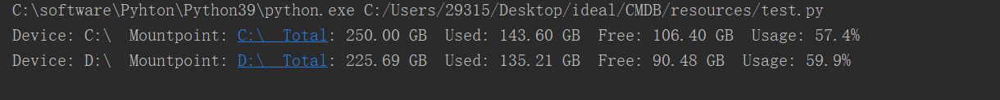
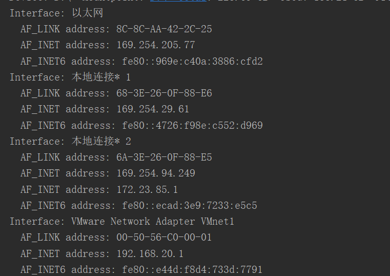

# 1、获取到每个磁盘的使用情况

```
import psutil
# 获取所有磁盘分区
partitions = psutil.disk_partitions()
for partition in partitions:
    partition_info = psutil.disk_usage(partition.mountpoint)
    # 打印磁盘名称、总容量、已使用容量、可用容量和使用率
    print(f"Device: {partition.device} "
          f" Mountpoint: {partition.mountpoint}  "
          f"Total: {partition_info.total/1024/1024/1024:.2f} GB "
          f" Used: {partition_info.used/1024/1024/1024:.2f} GB "
          f" Free: {partition_info.free/1024/1024/1024:.2f} GB "
          f" Usage: {partition_info.percent}%")
```

- 运行



# 2、获取到每个网卡的地址

```
import psutil
# 获取所有网络接口
net_io_counters = psutil.net_if_addrs()
for interface_name, interface_addresses in net_io_counters.items():
    # 打印网络接口名称和地址信息
    print(f"Interface: {interface_name}")
    for address in interface_addresses:
        print(f"  {address.family.name} address: {address.address}")
```

该代码首先使用 

其中，

注意：在Linux系统中，获取网络接口地址需要对其所在的网卡有读取权限，因此在运行此代码时需要以管理员或具有相应权限的用户身份运行。

- 运行

