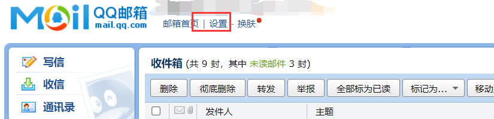
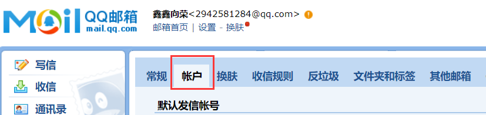
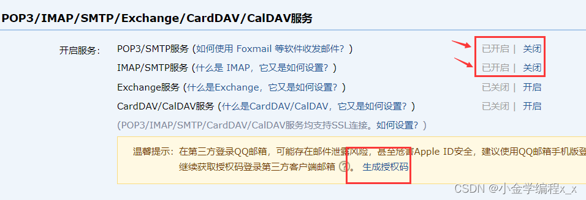

**Python自动发送邮件(直接套用即可)**

获取[smtp](https://so.csdn.net/so/search?q=smtp&spm=1001.2101.3001.7020)授权码:

## 1.1进入设置



## 1.2进入账户



## 1.3 开启smtp服务并且获取授权码(可以生成多个授权码，授权码就是后面代码的key)



# 2、发送纯文本邮件

```python
# _*_ coding : utf-8 _*_
# @Time : 2022/6/30 17:45
# @Author : HackWu
# @File : test01
# @Project : python发送邮件
#无需安装第三方库
import smtplib
import ssl
from email.message import EmailMessage
def send_email(email_info):
    key=email_info.get("key")      #换成你的QQ邮箱SMTP的授权码(QQ邮箱设置里)
    EMAIL_ADDRESS=email_info.get("sender")     #换成你的邮箱地址
    EMAIL_PASSWORD=key          #邮件秘钥
    smtp=smtplib.SMTP('smtp.qq.com',25)         #邮件协议
    context=ssl.create_default_context()
    sender=email_info.get("sender")            #发件邮箱
    receiver=email_info.get("receiver")
    #收件邮箱
    subject=email_info.get("subject")             #邮件主题
    body=email_info.get("body")       #邮件正文
    msg=EmailMessage()
    msg['subject']=subject       #邮件主题
    msg['From']=sender           #发件地址
    msg['To']=receiver           #目标地址
    msg.set_content(body)        #邮件内容
    with smtplib.SMTP_SSL("smtp.qq.com",465,context=context) as smtp:
        smtp.login(EMAIL_ADDRESS,EMAIL_PASSWORD)
        smtp.send_message(msg)
#############
#更改以下信息即可
if __name__ == '__main__':
    subject="给hackwu的邮件";
    email_body="天天开心！！！"
    email_info={
        "sender":"hackwu@qq.com",             #发件方的邮件地址
        "key":"npavwdttamtodcig",             #发件方的SMTP服务授权码
        "receiver":"hackwu@qq.com",       #收件方的邮件地址
        "subject":subject,                    #主题内容
        "body":email_body                     #邮件正文内容
    }
    send_email(email_info)
    print("发送成功")
```

# 3、发送图片附件

```python
key='************'
import smtplib
EMAIL_ADDRESS='********@qq.com'
EMAIL_PASSWORD=key
smtp=smtplib.SMTP('smtp.qq.com',25)
import ssl
context=ssl.create_default_context()
sender=EMAIL_ADDRESS
receiver=EMAIL_ADDRESS
from email.message import EmailMessage
subject="python email subject"
body="Hello,this is an email sent by python!"
msg=EmailMessage()
msg['subject']=subject
msg['From']=sender
msg['To']=receiver
msg.set_content(body)
file_name='./1.png'
with open(file_name,'rb') as f:
    file_data=f.read()
msg.add_attachment(file_data,maintype='image',subtype='png',filename=file_name)   #按要求修改，此次是附带图片
with smtplib.SMTP_SSL("smtp.qq.com",465,context=context) as smtp:
    smtp.login(EMAIL_ADDRESS,EMAIL_PASSWORD)
    smtp.send_message(msg)
```

# 4、发送html内容

```python
key='n************a'
import smtplib
EMAIL_ADDRESS='***********@qq.com'
EMAIL_PASSWORD=key
smtp=smtplib.SMTP('smtp.qq.com',25)
import ssl
context=ssl.create_default_context()
sender=EMAIL_ADDRESS
receiver=EMAIL_ADDRESS
from email.message import EmailMessage
subject="python email subject"
body="Hello,this is an email sent by python!"
msg=EmailMessage()
msg['subject']=subject
msg['From']=sender
msg['To']=receiver
msg.set_content(body)
msg.add_alternative(
"""\
<!DOCTYPE html>
<html>
    <body>
        <h1 style="color:Orange;">This 我is an email sent by Python</h1>
    </body>
</html>
""",subtype='html'
)

#msg.add_attachment(file_data,maintype='image',subtype='png',filename=file_name)

with smtplib.SMTP_SSL("smtp.qq.com",465,context=context) as smtp:
    smtp.login(EMAIL_ADDRESS,EMAIL_PASSWORD)
    smtp.send_message(msg)
```

# 5、发送给多人

```python
key='*************'
import smtplib
EMAIL_ADDRESS='********@qq.com'
EMAIL_PASSWORD=key
smtp=smtplib.SMTP('smtp.qq.com',25)
import ssl
context=ssl.create_default_context()
sender=EMAIL_ADDRESS
receiver=EMAIL_ADDRESS
from email.message import EmailMessage

subject="python email subject"
body="Hello,this is an email sent by python!"
msg=EmailMessage()
msg['subject']=subject
msg['From']=sender
msg['To']=[receiver,*****@qq.com,****@qq.com]         #多个用户
msg.set_content(body)
with smtplib.SMTP_SSL("smtp.qq.com",465,context=context) as smtp:
    smtp.login(EMAIL_ADDRESS,EMAIL_PASSWORD)
    smtp.send_message(msg)
```