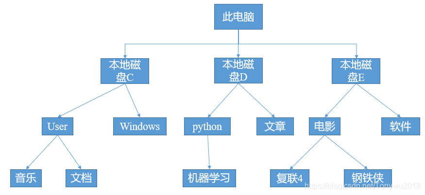
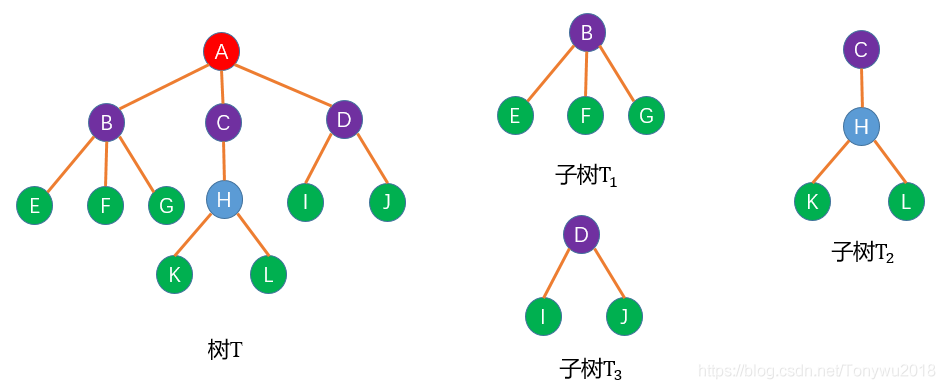
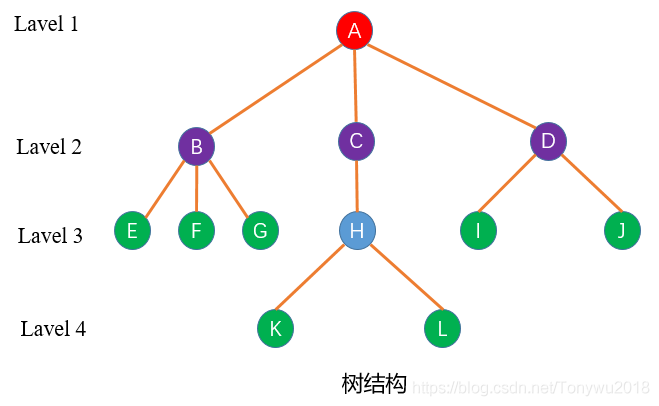
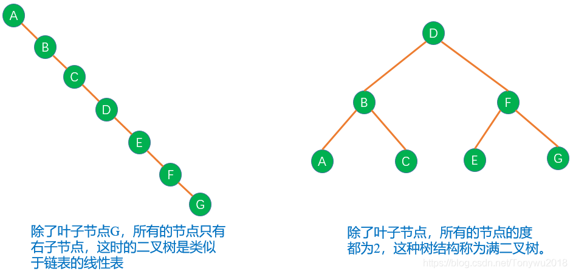
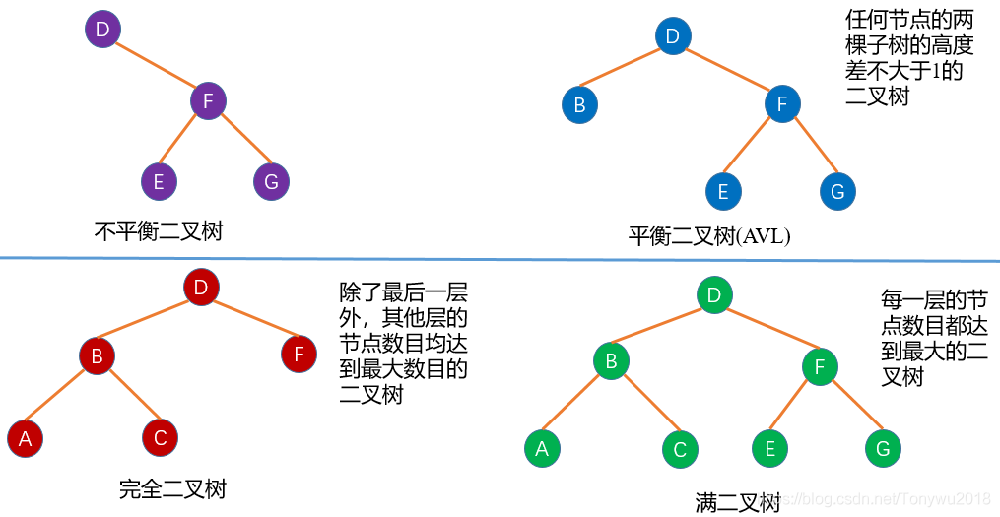

树结构是一种层次结构，也是非线性结构，它描述的是数据间“一对多”的关系，而树中的数据处理也是基于数据间父节点/子节点关系的。

还有奴隶社会的等级制度；一个家族的家谱；某个公司的等级制度等等都是属于树结构。为什么树结构能够在数据结构中得到广泛的应用，因为

# **1、树结构**

## 1.1 树的定义

树(Tree)：个节点构成的有限集合。当n = 0时，称为空树。对于任一棵非空树(n>0)，它具备以下性质：

树中有一个称为"根(Root)"的特殊节点，用r表示；其余节点可分为m(m>0)个互不相交的有限集T1，T2，...,Tm其中每个集合本身又是一棵树，称为原来树的子树(SubTree)。如下图：

## 1.2 树结构的术语

树结构中有很多概念术语，在深入讨论树结构之前，我们先来介绍下跟树结构有关的术语。为了方便理解记忆，结合具体的一棵树结构来进行介绍，树结构如下：

**节点：		**

**根节点：		**

**节点的度**

**树的度：		**

**子节点(孩子节点)：  **

**父节点(双亲节点)：  **

**兄弟节点**

**叶子节点：     **

**内部节点：     **

**边/分支：       **

**后代(子孙)：  **

**祖先：	      **

**路径：           **

**路径长度：    **

**节点的层次：**

**深度(高度)：  **

**森林：          **

以上就是树结构的一些术语。

## 1.3 树的分类

树结构可以分为两大类：有序树和无序树。树中任意节点间没有顺序关系，那么称其为无序树，也称自由树。相对的，树中的任意节点有顺序关系，称其为有序树。在有序树中，子节点被视为按照从左到右的顺序排列，最左边的子节点称为第一个子节点，最右边的子节点称为最后一个子节点。我们研究的最多的树结构就是有序树。而有序树中最具代表性的树结构就是二叉树。

二叉树就是度不超过2的有序树结构。 二叉树中的每个节点最多只能有两个分支，分别称为左子树和右子树。

根据二叉树的定义，会有如下两种极端的二叉树：

根据二叉树的形状，有以下几种常见的二叉树：

**平衡二叉树：	**

**完全二叉树**

。对于节点数目为k的完全二叉树，其深度为：

**满二叉树**

几种二叉树的结构图如下：

关于二叉树还有一个性质：二叉树中叶子节点数为n0(因为叶子节点的度为0，所以下标为0)，度为2的节点数为 n2，那么有n0=n2+1：。

解析：关于上面等式关系的求解我们可以这样考虑。假设二叉树的总节点数为，因为二叉树的节点度只有0、1、2三种情况，假设节点度为0、1、2的节点数分别为：n0、n1和n2。那么有n=n0+n1+n2。二叉树中节点度为1的节点有1条边连接到其子节点、节点度为2的节点有2条边连接到其子节点，假设二叉树有E条边，那么E=n1+2n2。而我们知道，在二叉树中节点总数和边的数目有这样的关系：n=E+1=n1+2n2+1。联立两个等式，容易得出n0=n2+1。