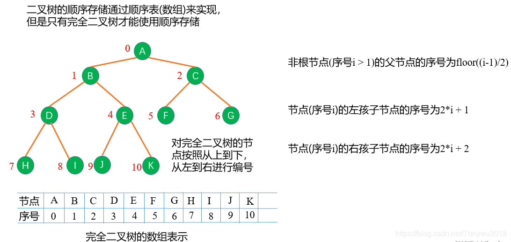
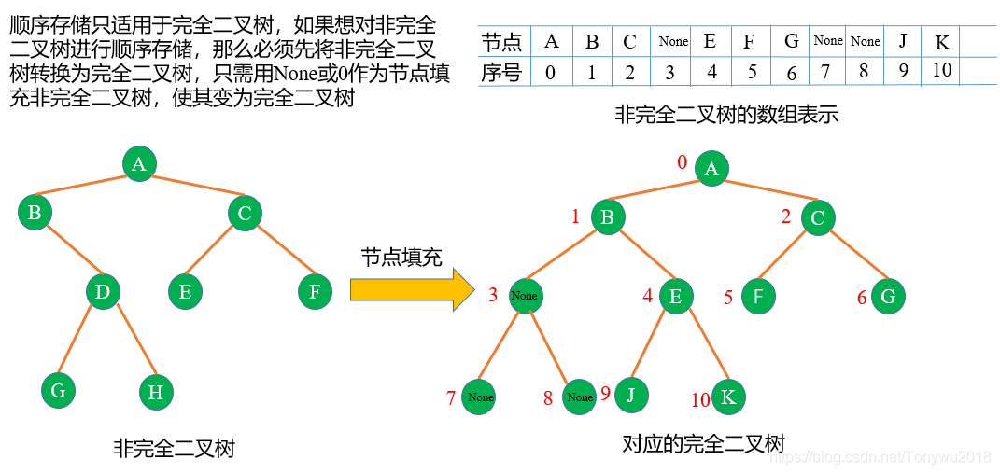
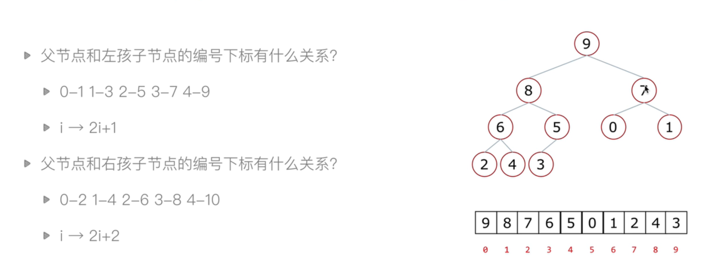
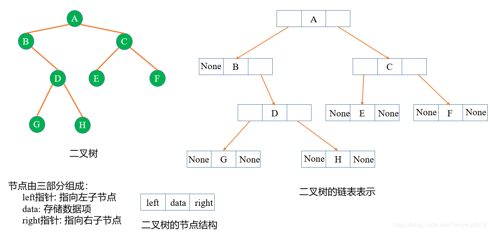
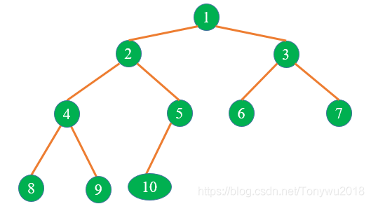
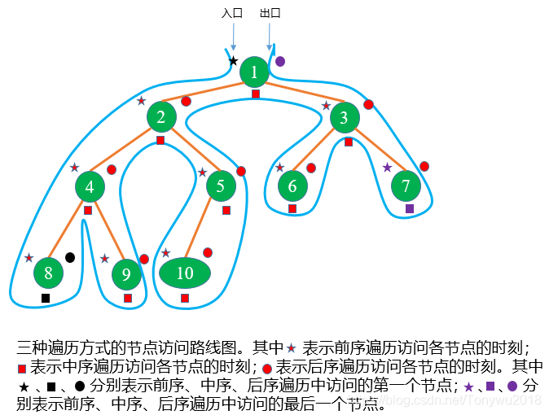
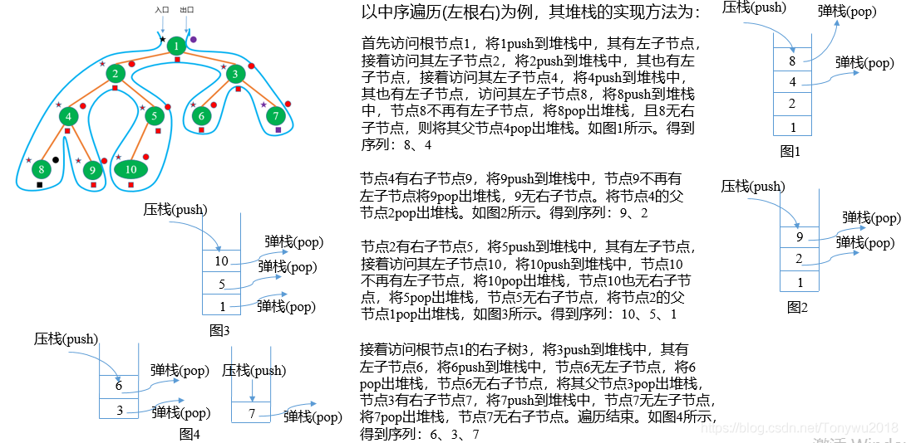
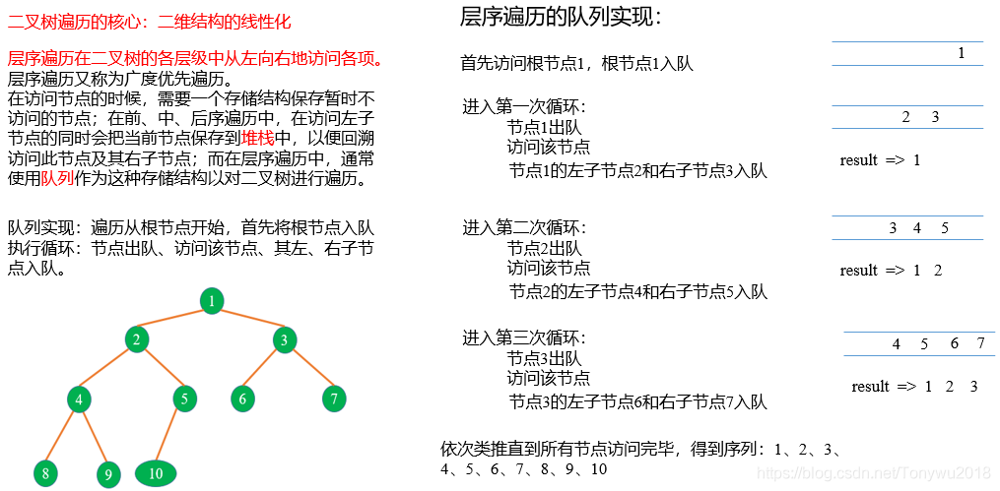
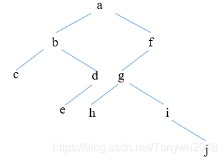

# 1、二叉树的顺序存储结构

二叉树的顺序存储是用数组来实现的，但是



那么对于一般二叉树结构的存储能用二叉树实现吗？不可以。因为在非完全二叉树中，一些层位于其他层之上，但是没有被节点填满。数组中的节点的相对计算，是基于能够将其索引乘以或除以2的假设，当一个以自上而下的方式排列的层级没有被填满的时候，无法做到这一点。如果非得用数组实现非完全二叉树的存储有没有其他办法呢？有。对于一般二叉树结构，需现将其转换为完全二叉树再进行顺序存储，如下图：



上述的方式存储非完全二叉树会造成空间的浪费，所以二叉树一般不采用顺序存储方式，因为并不是所有的二叉树都是完全二叉树。二叉树的数组实现比较少见，主要用于实现堆，在下文将详细进行说明。



# 2、 二叉树的链式存储结构

二叉树的存储可以也使用链表实现，这也是常用的实现方式，每个节点包含三个域：Left、Data和Right，分别用来指向左子节点，存储数据项以及指向右孩子节点。一棵二叉树对应的链表存储如下：



二叉树节点结构的代码实现如下：

```
class TreeNode():   #定义树节点
    def __init__(self,data,left=None,right=None):
        self.data=data          #data为树节点存储的数据，left为左子树，right为右子树
        self.left=left
        self.right=right
```

# 3、 二叉树的插入

在上面的二叉树的链式存储中，我们定义了树节点。但是只有树节点是不够的，我们需要往节点里面添加元素，以构成一棵完整的二叉树，以便进行后续的遍历，删除、查找等操作。在数组和链表中，插入操作时时间复杂度是线性的，而在树结构中，插入操作是时间复杂度是对数级的。二叉树的构建，以及向树节点中添加元素的代码实现如下：

```python
class BinTree():    #定义二叉树
    def __init__(self):
        self.root=None
        self.ls=[]
    def add(self,data):                     #定义add方法，向树结构中添加元素
        node=TreeNode(data)                 #实例化节点为node,并添加跟节点，并将根节点的地址添加到self.ls中
        if self.root==None:
            self.root=node
            self.ls.append(self.root)
        else:
            rootNode=self.ls[0]             #将第一个元素设为根节点
            if rootNode.left==None:         #若根节点的左子树为None,添加左节点，并将其地址添加到self.sl中
                rootNode.left=node          
                self.ls.append(rootNode.left)
            elif rootNode.right==None:      #若根节点的右子树为None，添加右节点，并将其地址添加到self.ls中
                rootNode.right=node
                self.ls.append(rootNode.right)
                self.ls.pop(0)                 #弹出self.ls的第一个元素，因为刚才已经被使用过了。
                
                
```

如果想向树中添加数据data = [1,2,3,4,5,6,7,8,9,10]，那么可使用如下代码：

```
 #如果想向树中添加数据data = [1,2,3,4,5,6,7,8,9,10]，那么可使用如下代码：
    tree=BinTree()      #实例化一个数对象 
    for i in range(1,11):
        tree.add(i)
```

通过以上的程序，就形成了如下的树结构：


实际上，上面的程序完成的是完全二叉树的构建。向二叉树节点中添加数据之后，我们就可以对二叉树进行遍历以获取树中的数据元素了。

# 4、 二叉树的遍历

遍历是二叉树中最重要的操作之一，因为树的层次结构的特点，使得二叉树的遍历有着较高的效率。常见的二叉输的遍历有四种，分别是：前序遍历、中序遍历、后序遍历以及层序遍历。其中前序遍历、中序遍历和后序遍历又称为深度优先遍历，它会优先访问离根节点最远的节点；层序遍历又称为广度优先遍历，它会优先访问离根节点最近的节点。有关以上四种遍历方式，下面进行具体的说明。

## 4.1 前序遍历(根左右)

二叉树的前序遍历的步骤如下：

访问树的根节点----> 访问当前节点的左子树---->若当前节点无左子树，访问当前节点的右子树。



以上图为例，对其进行前序遍历的步骤为：

1. 先访问根节点，得到1

1. 访问根节点1的左子节点2，发现左子节点2还有左子节点4，继续向下访问，直到最后一个左子节点8，发现8为叶子节点。继续访问其父节点4的右子节点9，发现右子节点9为叶子节点。得到序列2、4、8、9.

1. 根据“根左右”的顺序，访问左子节点2的右子节点5，其有左子节点10，但是10为叶子节点，得到序列：5、10。至此二叉树的左子树遍历完毕，得到以下序列：1、2、4、8、9、5、10。

1. 以类似的方式访问根节点1的右子节点3，访问左子节点6，其为叶子节点，继续访问其兄弟节点的右子节点7。至此，二叉树的右子树遍历完毕，得到以下序列：3、6、7。至此整棵二叉树的遍历完毕。

得到的结果为：1、2、4、8、9、5、10、3、6、7。

实现前序遍历通常有两种方式：递归实现遍历和利用堆栈实现遍历。

利用递归的方法实现二叉树的前序遍历的代码如下：

```python
def preOrderTraversal(self,root):       #前序遍历(根左右)： 递归实现
        if root==None:                      #若根节点为None，直接返回
            return      
        print(root.data)
        self.preOrderTraversal(root.left)
        self.preOrderTraversal(root.right)
```

除了递归的方式之外，遍历还可以通过堆栈的方式实现，其代码实现如下：

```python
    def preOrderStack(self,root):       #前序遍历(根左右)，使用堆栈实现 ，其实这就相当于是递归的原理
        if root==None:
            return 
        stack=[]            #堆栈，用于暂时保存上一次运行的状态，类似于递归的原理
        result=[]           #存储已经处理完成的结果
        node=root           #获取到跟节点
        while node or stack:    #当node不为空，且stack堆栈中还有未完全处理好的程序或者数据时，运行
            while node:     #先处理node
                result.append(node.data)
                stack.append(node)      #还没有完全处理完成，但是先暂存在堆栈中，后续会再次处理
                node=node.left          #更新node的值，为node的左节点，然后继续处理。
            node=stack.pop()            #运行此操作时，证明此路径上的所有左节点，均被处理过了。但是还有右节点未被处理，所以再取出来.pop() 默认取出最后一个元素。
            node=node.right
        print(result)
```

可以看到，程序运行结果和我们事先分析的结果一致。

## 4.2 中序遍历(左根右)

二叉树的中序遍历的步骤如下：

访问当前节点的左子树----> 访问根节点---->访问当前节点的右子树。


同样的，以上图为例，对其进行中序遍历的步骤为：

1. 按照“左根右”的顺序，先访问左子节点2，但是2还有左子节点4,4有左子节点8，而8为叶子结点，所以第1个访问的元素为8，接着访问节点8的父节点4，然后访问4的右子节点9.得到序列8、4、9。至此以4为根节点的左子树遍完毕。

1. 访问节点4的父节点2，访问其右子节点5，但是节点5有左子节点10，10为叶子节点，得到的序列为：2、10、5。至此，以2为根节点的左子树的遍历完毕，得到序列：8、4、9、2、10、5。

1. 访问整棵树的根节点1，访问其右子节点3，但其有左子节点6,6为叶子节点。所以最先访问的是6，接着访问其父节点3，再访问3的右子节点7，7为叶子节点，至此以1为根节点的右子树遍历完毕。得到序列1、6、3、7。至此整棵二叉树的遍历完毕。

得到的结果为：8、4、9、2、10、5、1、6、3、7

实现中序遍历同样有两种方式：递归实现遍历和利用堆栈实现遍历。

利用递归的方法实现二叉树的中序遍历的代码如下：

```
    def inOrderTraversal(self,root): #中序遍历(左跟右)，递归实现
        if root==None:
            return
        self.inOrderTraversal(root.left)
        print(root.data)
        self.inOrderTraversal(root.right)
```

可以看到，中序遍历的递归实现和前序遍历的递归实现基本相同，只不过是把代码的顺序进行了一下调换，按照“左根右”的顺序，先对左子树调用递归函数，再打印当前节点的数据项，最后对右子树调用递归函数。

中序遍历的堆栈实现的代码如下：

```python
    def inOrderStack(self,root):    #中序遍历(左根右)，堆栈实现
        if root==None: return
        stack=[]
        result=[] 
        node=root
        while node or stack:
            while node: 
                stack.append(node)
                node=node.left
            node=stack.pop()
            result.append(node.data)
            node=node.right
        print(result)
```

最后得到的结果和我们事先分析得到的结果一致。

## 4.3 后序遍历(左右根)

二叉树的后序遍历步骤如下：

访问当前节点的左子树---->访问当前节点的右子树---->访问根节点

同样的，以上图为例，对其进行后序遍历的步骤：

1. 按照“左右根”的顺序，首先访问节点8，接着访问节点9，因为节点8和节点9都为叶子节点，所以接下来访问节点4。至此以2为根节点的左子树遍历完毕，接着遍历以2为根节点的右子树，首先访问节点10，接着访问节点5，最后访问节点2。至此，以1为根节点的左子树的遍历完毕，得到的序列为：8、9、4、10、5。

1. 遍历以1为根节点的右子树，首先访问节点6，接着访问节点7，因为节点6和节点7都是叶子节点，所以接下来访问节点3。最后访问整棵树的根节点1。至此，整棵树的遍历完毕。

得到的结果为：8、9、4、10、5、2、6、7、3、1

实现后序遍历同样有两种方式：递归实现遍历和利用堆栈实现遍历。

利用递归的方法实现二叉树的后序遍历的代码如下：

```
def postOrderTraversal(self,root):    #后续遍历(左右根)，递归实现
        if root==None:return
        self.postOrderTraversal(root.left)
        self.postOrderTraversal(root.right)
        print(root.data)
```

可以看到，后序遍历的递归实现也是把代码的顺序进行了一下调换，按照“左右根”的顺序，先对左子树调用递归函数，再对右子树调用递归函数，最后打印当前节点的数据项。

后序遍历的堆栈实现要比前序遍历和中序遍历的堆栈实现复杂，其代码实现如下：

```python
 def postOrderStack(self,root):  # 后序遍历(左右根): 堆栈实现。后续遍历的访问顺序(左右跟)，可以看看成将先序遍历的顺序(根左右) 改为(根右左)的逆序(左根右)
        if root==None:return
        stack=[]
        seq=[]                  #用于保存根右左的遍历顺序，后面再将结果反过来，就是成后序遍历的顺序了。
        result=[]
        node=root
        while node or stack:
            while node:
                seq.append(node.data)
                stack.append(node)
                node=node.right
            node=stack.pop()
            node=node.left
        while seq:          #将结果反过来。
            result.append(seq.pop())
        print(result)               
```

最后得到的结果和我们事先分析得到的结果一致。

## 4.4 前中后三种遍历方式的小结

从上面的分析可以看出，前序遍历、中序遍历和后序遍历中经过节点的路线是一样的，只是访问的顺序不同。



以中序遍历为例，其堆栈实现方法的说明如下：



## 4.5 层序遍历(广度优先遍历)

有关层序遍历的相关内容我做了张PPT，如下：



层序遍历比较容易理解，就是对二叉树一层层的从左到右进行访问。层序遍历的代码实现如下：

```python
    def levelOrder(self,root):  #层序遍历：在树的各个层级从左到右访问各项
        if root==None:return
        queue=[]                #创建队列
        result=[]               
        node=root
        queue.append(node)      #根节点入队
        while queue:
            node=queue.pop(0)
            result.append(node.data)
            if node.left != None:
                queue.append(node.left)
            if node.right != None:
                queue.append(node.right)
        print(result)
```

## 4.6 遍历二叉树的应用

### 4.6.1 输出二叉树的叶子节点

输出二叉树的叶子节点只需在前序遍历的程序上稍作修改即可完成，如下：

```python
 def printLeafNode(self,root):       #打印二叉树的叶子节点
        if root==None:                      #若根节点为None，直接返回
            return 
        if root.left ==None and root.right == None:
            print(root.data)
        self.printLeafNode(root.left)
        self.printLeafNode(root.right)
```

可以看到，只是对前序遍历的递归实现程序中的print语句增加了if条件判断。得到二叉树的叶子节点为：8、9、10、7、6

## 4.6.2 求二叉树的高度

只需把后序遍历的程序做修改即可，程序如下:

```
    def heightOfBT(self,root):
        if root==None:
            return 0
        HL=self.heightOfBT(root.left)
        HR=self.heightOfBT(root.right)
        if HL > HR:
            return HL+1
        else:
            return HR+1
```

## 4.6.3 由两种遍历序列确定二叉树

如果知道了两种二叉树遍历得到的序列，我们就可以唯一确定这棵二叉树

注：两个序列中必须得有中序遍历得到的序列，即：已知中序遍历序列和前序遍历序列，可唯一确定一棵二叉树；已知中序遍历序列和后序遍历序列，也可唯一确定一棵二叉树；已知前序遍历序列和后序遍历序列不能确定唯一的二叉树。

前序遍历序列和中序遍历序列求二叉树：

分析：

1、由前序遍历根左右的顺序可知，前序遍历序列的第一个元素为根节点

2、在中序遍历序列中找到根节点，由中序遍历左根右的顺序，位于根节点左边的为左子树，位于根节点右边的为右子树

3、对左右子树按照同样的方式进行分解直到二叉树构建完成。

示例：前序序列：a b c d e f g h i j

中序序列：c b e d a h g i j f

由前序序列得到a为根节点，在中序序列找到根节点a，确定左子树为：cbed，右子树为：hgijf

对左子树cbed进行分解，首先在前序序列中找到左子树，进而得到左子树的根节点为b，在中序序列找到根节点b，确定左子树为：c，右子树为：ed

对右子树ed进行分解，首先在前序序列中找到右子树，进而得到右子树的根节点d，在中序序列中找到根节点b，确定左子树为e，无右子树

至此，根节点和左子树构建完毕，同样的方式构建右子树，得到下面的树结构：



# 5、所有的完整代码

```python
#!/bin/python3
import queue
import sys
from collections import namedtuple
from io import StringIO
import math
class TreeNode():   #定义树节点
    def __init__(self,data,left=None,right=None):
        self.data=data          #data为树节点存储的数据，left为左子树，right为右子树
        self.left=left
        self.right=right
class BinTree():    #定义二叉树
    def __init__(self):
        self.root=None
        self.ls=[]
    def add(self,data):                     #定义add方法，向树结构中添加元素
        node=TreeNode(data)                 #实例化节点为node,并添加跟节点，并将根节点的地址添加到self.ls中
        if self.root==None:
            self.root=node
            self.ls.append(self.root)
        else:
            rootNode=self.ls[0]             #将第一个元素设为根节点
            if rootNode.left==None:         #若根节点的左子树为None,添加左节点，并将其地址添加到self.sl中
                rootNode.left=node          
                self.ls.append(rootNode.left)
            elif rootNode.right==None:      #若根节点的右子树为None，添加右节点，并将其地址添加到self.ls中
                rootNode.right=node
                self.ls.append(rootNode.right)
                self.ls.pop(0)                 #弹出self.ls的第一个元素，因为刚才已经被使用过了。
    def preOrderTraversal(self,root):       #前序遍历(根左右)： 递归实现
        if root==None:                      #若根节点为None，直接返回
            return      
        # root.handle()                  #打印数据
        print(root.data)
        self.preOrderTraversal(root.left)
        self.preOrderTraversal(root.right)
    def preOrderStack(self,root):       #前序遍历(根左右)，使用堆栈实现 ，其实这就相当于是递归的原理
        if root==None:
            return 
        stack=[]            #堆栈，用于暂时保存上一次运行的状态，类似于递归的原理
        result=[]           #存储已经处理完成的结果
        node=root           #获取到跟节点
        while node or stack:    #当node不为空，且stack堆栈中还有未完全处理好的程序或者数据时，运行
            while node:     #先处理node
                result.append(node.data)
                stack.append(node)      #还没有完全处理完成，但是先暂存在堆栈中，后续会再次处理
                node=node.left          #更新node的值，为node的左节点，然后继续处理。
            node=stack.pop()            #运行此操作时，证明此路径上的所有左节点，均被处理过了。但是还有右节点未被处理，所以再取出来.pop() 默认取出最后一个元素。
            node=node.right
        print(result)
                
    def inOrderTraversal(self,root): #中序遍历(左跟右)，递归实现
        if root==None:
            return
        self.inOrderTraversal(root.left)
        print(root.data)
        self.inOrderTraversal(root.right)
    def inOrderStack(self,root):    #中序遍历(左根右)，堆栈实现
        if root==None: return
        stack=[]
        result=[] 
        node=root
        while node or stack:
            while node: 
                stack.append(node)
                node=node.left
            node=stack.pop()
            result.append(node.data)
            node=node.right
        print(result)
        
 
    def postOrderTraversal(self,root):    #后续遍历(左右根)，递归实现
        if root==None:return
        self.postOrderTraversal(root.left)
        self.postOrderTraversal(root.right)
        print(root.data)
    
    def postOrderStack(self,root):  # 后序遍历(左右根): 堆栈实现。后续遍历的访问顺序(左右跟)，可以看看成将先序遍历的顺序(根左右) 改为(根右左)的逆序(左根右)
        if root==None:return
        stack=[]
        seq=[]                  #用于保存根右左的遍历顺序，后面再将结果反过来，就是成后序遍历的顺序了。
        result=[]
        node=root
        while node or stack:
            while node:
                seq.append(node.data)
                stack.append(node)
                node=node.right
            node=stack.pop()
            node=node.left
        while seq:          #将结果反过来。
            result.append(seq.pop())
        print(result)               
    def levelOrder(self,root):  #层序遍历：在树的各个层级从左到右访问各项
        if root==None:return
        queue=[]                #创建队列
        result=[]               
        node=root
        queue.append(node)      #根节点入队
        while queue:
            node=queue.pop(0)
            result.append(node.data)
            if node.left != None:
                queue.append(node.left)
            if node.right != None:
                queue.append(node.right)
        print(result)
    def printLeafNode(self,root):       #打印二叉树的叶子节点
        if root==None:                      #若根节点为None，直接返回
            return 
        if root.left ==None and root.right == None:
            print(root.data)
        self.printLeafNode(root.left)
        self.printLeafNode(root.right)
    def heightOfBT(self,root):
        if root==None:
            return 0
        HL=self.heightOfBT(root.left)
        HR=self.heightOfBT(root.right)
        if HL > HR:
            return HL+1
        else:
            return HR+1
class Queue(object):
    def __init__(self):
        self.queue = []
    def enqueue(self, b):
        self.queue.insert(0, b)
    def dequeue(self):
        return self.queue.pop()
    def isEmpty(self):
        return self.queue == []
def getheight(node):
    if not node:
        return 0
    else:
        return max(getheight(node.left), getheight(node.right)) + 1
def add_padding(str, pad_length_value):
    str = str.strip()
    return str.center(pad_length_value, ' ')
# sotre node , space and slashes in list first, then print out
def pretty_print(tree):
    output = StringIO()
    pretty_output = StringIO()
    current_level = Queue()
    next_level = Queue()
    current_level.enqueue(tree)
    depth = 0
    # get the depth of current tree
    # get the tree node data and store in list
    if tree:
        while not current_level.isEmpty():
            current_node = current_level.dequeue()
            output.write('%s ' % current_node.data if current_node else 'N ')
            next_level.enqueue(
                current_node.left if current_node else current_node)
            next_level.enqueue(
                current_node.right if current_node else current_node)
            if current_level.isEmpty():
                if sum([i is not None for i in next_level.queue]
                       ):  # if next level has node
                    current_level, next_level = next_level, current_level
                    depth = depth + 1
                output.write('\n')
    # print('the tree print level by level is :')
    # print(output.getvalue())
    # print("current tree's depth is %i" % (depth+1))
    # add space to each node
    output.seek(0)
    pad_length = 3
    keys = []
    spaces = int(math.pow(2, depth))
    while spaces > 0:
        skip_start = spaces * pad_length
        skip_mid = (2 * spaces - 1) * pad_length
        key_start_spacing = ' ' * skip_start
        key_mid_spacing = ' ' * skip_mid
        keys = output.readline().split(' ')  # read one level to parse
        padded_keys = (add_padding(key, pad_length) for key in keys)
        padded_str = key_mid_spacing.join(padded_keys)
        complete_str = ''.join([key_start_spacing, padded_str])
        pretty_output.write(complete_str)
        # add space and slashes to middle layer
        slashes_depth = spaces
        # print('current slashes depth im_resize:')
        # print(spaces)
        # print("current levle's list is:")
        # print(keys)
        spaces = spaces // 2
        if spaces > 0:
            pretty_output.write('\n')  # print '\n' each level
            cnt = 0
            while cnt < slashes_depth:
                inter_symbol_spacing = ' ' * (pad_length + 2 * cnt)
                symbol = ''.join(['/', inter_symbol_spacing, '\\'])
                symbol_start_spacing = ' ' * (skip_start-cnt-1)
                symbol_mid_spacing = ' ' * (skip_mid-2*(cnt+1))
                pretty_output.write(''.join([symbol_start_spacing, symbol]))
                for i in keys[1:-1]:
                    pretty_output.write(''.join([symbol_mid_spacing, symbol]))
                pretty_output.write('\n')
                cnt = cnt + 1
    print(pretty_output.getvalue())
if __name__ == '__main__':
    #如果想向树中添加数据data = [1,2,3,4,5,6,7,8,9,10]，那么可使用如下代码：
    tree=BinTree()      #实例化一个数对象 
    for i in range(1,11):
        tree.add(i)
    #pretty_print(tree.root)        #打印二叉树图形。
    # tree.preOrderTraversal(tree.root)
    #tree.preOrderStack(tree.root)
    #tree.inOrderTraversal(tree.root)
    #tree.inOrderStack(tree.root)
    #tree.postOrderTraversal(tree.root)
    #tree.postOrderStack(tree.root)
    #tree.levelOrder(tree.root)
    #tree.printLeafNode(tree.root)
    print(tree.heightOfBT(tree.root))
   
     
```